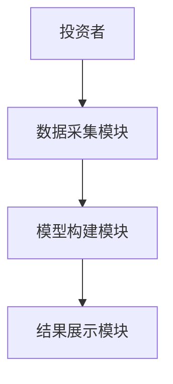

                 


# 格雷厄姆的债券投资原则

> **关键词**：债券投资，价值投资，风险管理，投资策略，数学模型  
> **摘要**：本文深入探讨了格雷厄姆的债券投资原则，从基本概念到数学模型，再到系统架构和项目实战，全面解析债券投资的核心要素、风险管理和投资策略，结合实际案例，为读者提供系统化的债券投资方法。

---

## 第一部分：背景介绍

### 第1章：债券投资的基本概念与背景

#### 1.1 债券的基本定义与分类

##### 1.1.1 债券的定义与基本要素
债券是一种债务工具，发行人承诺在特定时间内支付利息并偿还本金。其基本要素包括面值、票面利率、期限和到期日。

- 面值（Par Value）：债券的本金，即到期时发行人偿还的金额。
- 票面利率（Coupon Rate）：债券的年利息率，通常以面值的百分比表示。
- 期限（Maturity）：债券的存续时间，从发行到到期的年数。
- 到期日（Maturity Date）：债券本金偿还的日期。

##### 1.1.2 债券的主要分类与特点
债券可以根据多种标准分类：

1. **按发行人分类**：
   - **政府债券**：由政府发行，信用风险最低。
   - **企业债券**：由企业发行，信用风险较高。
2. **按期限分类**：
   - **短期债券**：期限在1年以内。
   - **中期债券**：期限在1至7年之间。
   - **长期债券**：期限在7年以上。
3. **按计息方式分类**：
   - **零息债券**：无利息支付，到期时按面值偿还。
   - **息票债券**：定期支付利息。

##### 1.1.3 债券市场的基本结构与功能
债券市场是发行人和投资者进行债券交易的场所，主要功能包括：
- 为发行人提供融资。
- 为投资者提供投资工具。
- 确定债券的市场利率和价格。

---

### 第2章：格雷厄姆投资理念的背景

#### 1.2.1 格雷厄姆与价值投资的起源
本杰明·格雷厄姆是价值投资的鼻祖，他的投资理念强调安全边际和长期稳定回报。他将债券投资视为一种保守且可靠的投资方式。

#### 1.2.2 债券投资在格雷厄姆投资体系中的地位
格雷厄姆认为，债券是实现财富保值的重要工具，尤其适合风险厌恶型投资者。他特别关注债券的信用评级和利率风险。

#### 1.2.3 格雷厄姆债券投资原则的核心思想
格雷厄姆主张：
- 选择信用评级高的债券，以降低违约风险。
- 关注债券的收益率与市场利率的关系，避免过度波动。
- 在市场波动时，利用债券的低估机会进行投资。

---

## 第二部分：核心概念

### 第2章：格雷厄姆债券投资的核心概念

#### 2.1 债券定价的基本原理

##### 2.1.1 债券收益率的计算公式
债券的收益率是投资者的回报率，计算公式为：
$$
\text{收益率} = \frac{\text{利息} + (\text{面值} - \text{购买价格})}{\text{购买价格}} \times 100\%
$$

##### 2.1.2 债券价格与收益率的关系
债券价格与市场利率呈反向关系。当市场利率上升，债券价格下降；反之，市场利率下降，债券价格上升。

##### 2.1.3 利率风险与债券价格波动
利率风险是债券投资的主要风险之一，可以通过选择期限较短的债券来降低。

#### 2.2 债券评级与信用风险

##### 2.2.1 债券评级的基本概念
债券评级是对债券信用质量的评估，通常由评级机构（如穆迪、标普）给出，分为AAA（最高）到D（最低）。

##### 2.2.2 主要债券评级机构及其标准
- **穆迪**：使用Aaa、Aa1、Aa2、Aa3等评级。
- **标普**：使用AAA、AA+、AA、A+等评级。

##### 2.2.3 信用风险对债券投资的影响
信用风险高的债券收益率较高，但违约风险也更大。

#### 2.3 债券投资的核心要素

##### 2.3.1 债券的期限与流动性
- 长期债券流动性较低，但收益率较高。
- 短期债券流动性较高，但收益率较低。

##### 2.3.2 利息支付方式与税务影响
- 息票债券的利息通常可抵税。
- 零息债券无利息支付，但价格波动较大。

##### 2.3.3 债券组合的风险与收益平衡
通过组合不同期限和评级的债券，可以分散风险，平衡收益。

---

## 第三部分：数学模型与算法

### 第3章：格雷厄姆债券投资策略的数学模型与算法

#### 3.1 债券投资的数学模型

##### 3.1.1 债券收益率的计算公式
$$
\text{到期收益率} = \frac{\text{年利息} + (\text{面值} - \text{购买价格})}{\text{购买价格}} \times 100\%
$$

##### 3.1.2 债券价格波动的数学模型
债券价格波动可以用 Vasicek 模型或 Hull-White 模型进行模拟。

#### 3.2 债券评级的算法原理

##### 3.2.1 信用评分模型的构建
使用逻辑回归或决策树算法对债券进行信用评分。

##### 3.2.2 债券评级的决策树算法
- 数据预处理：标准化和特征选择。
- 模型训练：使用训练数据构建决策树。
- 预测与评估：使用测试数据评估模型性能。

##### 3.2.3 评级算法的优缺点分析
- 优点：自动化、高效率。
- 缺点：可能忽视某些重要因素。

---

## 第四部分：系统架构与实现

### 第4章：债券投资的系统架构与实现

#### 4.1 系统架构设计

##### 4.1.1 系统功能模块划分
- 数据采集模块：收集债券数据。
- 模型构建模块：训练债券评级模型。
- 结果展示模块：输出投资建议。

##### 4.1.2 系统数据流图


#### 4.2 系统实现细节

##### 4.2.1 数据采集与处理
使用 Python 的 `pandas` 库进行数据清洗和预处理。

##### 4.2.2 模型构建与训练
使用 `scikit-learn` 库中的决策树算法进行模型训练。

##### 4.2.3 系统接口设计
设计 RESTful API 接口，供投资者查询债券评级和投资建议。

---

## 第五部分：项目实战

### 第5章：项目实战与案例分析

#### 5.1 项目环境与工具安装

##### 5.1.1 Python 环境安装
安装 Python 和必要的库（如 `pandas`, `scikit-learn`）。

#### 5.2 核心代码实现

##### 5.2.1 债券评级模型实现
```python
from sklearn.tree import DecisionTreeClassifier
from sklearn.preprocessing import StandardScaler
from sklearn.pipeline import Pipeline

# 数据预处理
scaler = StandardScaler()
model = DecisionTreeClassifier()
pipeline = Pipeline([
    ('scaler', scaler),
    ('model', model)
])
```

##### 5.2.2 模型训练与预测
```python
# 训练模型
pipeline.fit(X_train, y_train)

# 预测评级
y_pred = pipeline.predict(X_test)
```

#### 5.3 实际案例分析

##### 5.3.1 数据分析与解读
分析某公司债券的历史数据，计算其到期收益率和信用评级。

##### 5.3.2 投资建议
根据模型预测结果，给出债券投资建议，如适合的投资期限和风险承受能力。

---

## 第六部分：最佳实践与小结

### 第6章：最佳实践与总结

#### 6.1 投资策略的优化
- 定期重新评估债券组合。
- 关注经济指标对债券市场的影响。

#### 6.2 风险管理的注意事项
- 分散投资以降低风险。
- 保持对市场变化的敏感性。

#### 6.3 拓展阅读
建议阅读格雷厄姆的《证券分析》和《聪明的投资者》。

---

## 作者

作者：AI天才研究院/AI Genius Institute & 禅与计算机程序设计艺术 /Zen And The Art of Computer Programming

---

通过以上结构，文章从理论到实践，全面解析了格雷厄姆的债券投资原则，结合数学模型和系统实现，为读者提供了深入的学习和实践指南。

