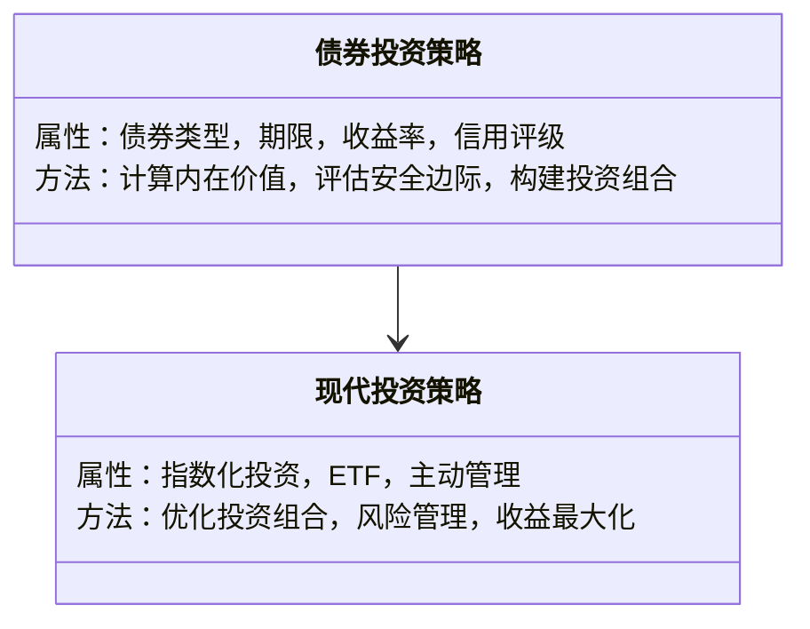

                 


# 格雷厄姆的债券投资策略及其现代应用

---

## 关键词  
债券投资，格雷厄姆，防御性投资，安全边际，现代投资策略，风险管理

---

## 摘要  
本文深入分析了格雷厄姆的债券投资策略，探讨其核心思想、实施方法及其在现代金融环境中的应用。文章从债券投资的基本概念入手，详细介绍了格雷厄姆的防御性投资策略，包括安全边际和投资组合构建。随后，结合现代金融市场的特点，分析了债券投资策略的演变，提出了指数化投资、量化分析和风险管理等现代应用方法。通过实际案例分析和系统架构设计，本文为投资者提供了实用的债券投资策略参考。

---

## 正文

### 第一部分：引言

#### 第1章：债券投资的概述与重要性

##### 1.1 债券投资的基本概念  
债券是一种债务工具，发行人通过发行债券筹集资金，承诺在特定时间内支付利息和本金。债券投资是资产配置的重要组成部分，具有稳定收益和较低风险的特点。  

##### 1.2 格雷厄姆与债券投资的关联  
本·格雷厄姆是价值投资的鼻祖，其防御性投资策略为债券投资奠定了理论基础。格雷厄姆强调安全性和稳定性，主张通过安全边际和分散化来降低风险。  

##### 1.3 本章小结  
债券投资是长期资产配置的重要工具，格雷厄姆的策略为现代债券投资提供了宝贵的借鉴。

---

### 第二部分：债券投资的基础知识

#### 第2章：债券的基本概念与分类

##### 2.1 债券的基本要素  
- **面值（Par Value）**：债券的面值，即债券到期时需要偿还的本金。  
- **期限（Maturity）**：债券的存续时间，分为短期、中期和长期。  
- **票面利率（Coupon Rate）**：债券每年支付的利息与面值的比率。  
- **到期收益率（YTM）**：债券当前市价下的预期收益率。  

##### 2.2 债券的分类  
- **按发行主体**：政府债券、企业债券、金融债券。  
- **按期限**：短期债券（1年以内）、中期债券（1-10年）、长期债券（10年以上）。  
- **按计息方式**：零息债券、息票债券、浮动利率债券。  

##### 2.3 债券市场的参与者  
- **投资者**：个人、机构、政府。  
- **发行者**：政府、企业、金融机构。  
- **中介机构**：券商、银行、交易所。  

##### 2.4 本章小结  
债券的基本概念和分类为后续策略分析奠定了基础。

---

### 第三部分：格雷厄姆的债券投资策略

#### 第3章：格雷厄姆的防御性投资策略

##### 3.1 格雷厄姆的投资哲学  
- **安全第一**：优先考虑本金的安全性，避免重大损失。  
- **长期投资**：通过长期持有获得稳定的收益。  
- **价值投资**：寻找市场价格低于内在价值的投资标的。  

##### 3.2 格雷厄姆的债券投资策略  
- **选择标准**：高信用评级、长期期限、合理收益率。  
- **安全边际**：在购买债券时，确保市场价格低于内在价值，以降低风险。  
- **投资组合**：通过分散投资降低风险，优化收益。  

##### 3.3 格雷厄姆策略的优缺点分析  
- **优点**：安全性高、收益稳定。  
- **缺点**：流动性差、收益受限。  
- **现代挑战**：低利率环境下的收益压力。  

##### 3.4 本章小结  
格雷厄姆的防御性投资策略强调安全性和稳定性，是债券投资的重要参考。

---

### 第四部分：现代债券投资策略

#### 第4章：现代债券投资策略的演变

##### 4.1 从格雷厄姆策略到现代投资策略  
- **格雷厄姆策略的局限性**：流动性差、收益受限。  
- **现代投资组合理论的兴起**：通过分散化降低风险，提高收益。  
- **量化分析与主动投资**：利用大数据和算法优化投资组合。  

##### 4.2 现代债券投资策略的核心要素  
- **债券指数化投资**：通过跟踪债券指数构建投资组合。  
- **债券ETF与被动投资**：利用交易所交易基金（ETF）实现便捷投资。  
- **债券主动管理**：通过精选个券和动态调整优化收益。  

##### 4.3 本章小结  
现代债券投资策略结合了量化分析和被动投资，适应了复杂多变的市场环境。

---

## 系统分析与架构设计方案

### 系统功能设计（领域模型）  


### 系统架构设计  


### 系统交互设计  
```mermaid
sequenceDiagram
    participant 用户
    participant 系统
    用户 -> 系统：选择债券投资策略
    系统 -> 用户：显示债券类型和收益率
    用户 -> 系统：确认投资组合
    系统 -> 用户：显示优化后的投资组合
```

---

## 项目实战

#### 环境安装  
- Python 3.8及以上版本  
- 必要的库：pandas, numpy, matplotlib  

#### 核心实现代码  
```python
import pandas as pd
import numpy as np

def calculate_yield(price, coupon, face_value, years):
    # 计算到期收益率
    return (coupon * face_value + (face_value - price)) / (face_value - price)

def build_portfolio(bonds, weights):
    # 构建债券组合
    portfolio = pd.DataFrame()
    portfolio['债券'] = bonds
    portfolio['权重'] = weights
    portfolio['预期收益'] = portfolio['债券'].apply(lambda x: calculate_yield(x['价格'], x['票面利率'], x['面值'], x['期限'])) * x['权重']
    return portfolio

# 示例数据
bonds = [
    {'名称': '债券1', '价格': 95, '票面利率': 0.05, '面值': 100, '期限': 10},
    {'名称': '债券2', '价格': 98, '票面利率': 0.06, '面值': 100, '期限': 15}
]
weights = [0.5, 0.5]

portfolio = build_portfolio(bonds, weights)
print(portfolio)
```

---

## 总结与注意事项

- **总结**：格雷厄姆的债券投资策略强调安全性和稳定性，而现代投资策略则更加注重多样性和效率。  
- **注意事项**：投资者应根据自身风险承受能力和市场环境选择合适的策略，定期调整投资组合以适应市场变化。  
- **拓展阅读**：建议进一步学习债券定价模型和风险管理工具，以提升投资效果。

---

## 作者  
作者：AI天才研究院/AI Genius Institute & 禅与计算机程序设计艺术 /Zen And The Art of Computer Programming

