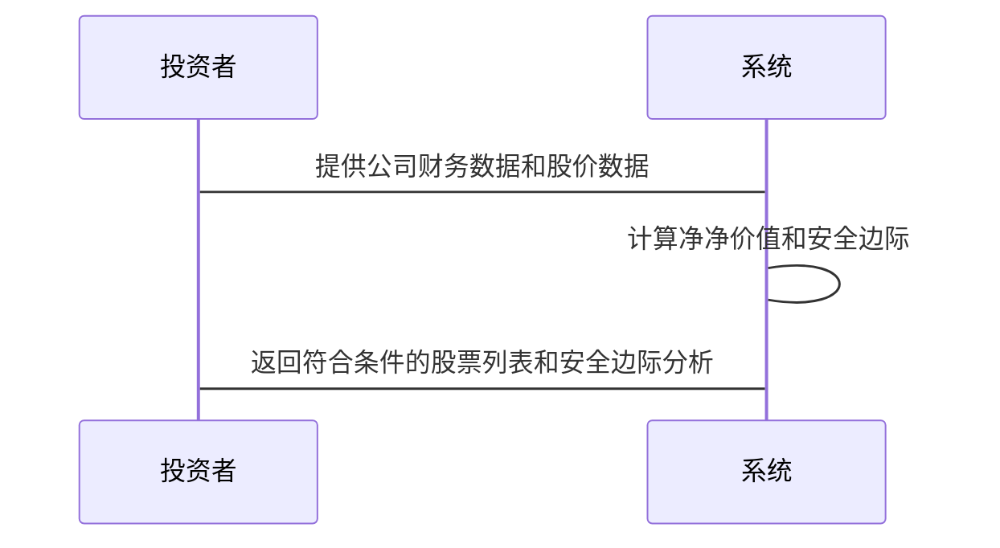

                 


# 格雷厄姆的净净策略在不同市场环境中的应用

**关键词**：格雷厄姆，净净策略，价值投资，安全边际，市场环境

**摘要**：  
格雷厄姆的净净策略是价值投资中的经典方法，强调以低于公司净资产的价格买入股票，从而确保投资的安全边际。本文将详细探讨净净策略的核心概念、数学模型、算法原理及其在不同市场环境中的应用。通过实际案例分析和系统设计，本文旨在帮助读者理解如何在实际投资中运用净净策略，并结合现代技术手段优化投资决策。

---

## 第一部分：净净策略的背景与基础

### 第1章：格雷厄姆投资理念概述

#### 1.1 格雷厄姆投资理论的核心思想
- **价值投资的起源与发展**  
  价值投资由本杰明·格雷厄姆和戴维德·多德提出，强调以低于公司内在价值的价格买入股票。格雷厄姆的理论奠定了现代价值投资的基础。
- **净净策略的定义**  
  净净策略（Net-Net Method）是指以低于公司净资产（即“净净价值”）的价格买入股票。净净价值的计算公式为：  
  $$ \text{净净价值} = \text{净资产} - \text{债务} $$
- **安全边际的重要性**  
  格雷厄姆认为，投资的安全边际是内在价值与市场价格之间的差额。通过购买低于净净价值的股票，投资者可以确保一定的安全空间，降低投资风险。

#### 1.2 净净策略的核心概念
- **净资产与市场价值的对比**  
  净资产是公司所有资产的公允价值减去负债，而市场价值是股票在市场上的交易价格。净净策略关注的是市场价值是否低于净资产。
- **安全边际的量化**  
  安全边际 = 内在价值 - 市场价格  
  通过安全边际，投资者可以评估投资的潜在收益和风险。

### 第2章：净净策略的核心概念

#### 2.1 净资产与市场价值的对比
- **净资产的计算方法**  
  净资产 = 资产 - 负债  
  资产包括现金、存货、应收账款等，负债包括应付账款、短期和长期债务。
- **市场价值的波动性分析**  
  市场价值受市场情绪、宏观经济环境和公司业绩的影响，波动较大。
- **净净策略的核心公式推导**  
  $$ \text{净净价值} = \text{净资产} - \text{债务} $$  
  投资者应寻找市场价格低于净净价值的股票。

#### 2.2 安全边际的理论基础
- **安全边际的定义与作用**  
  安全边际是内在价值与市场价格之间的差额，用于缓冲市场波动带来的风险。
- **安全边际与投资风险的关系**  
  安全边际越大，投资风险越低，潜在收益越高。
- **安全边际的量化方法**  
  通过比较市场价格与净净价值，计算安全边际的数值。

### 第3章：净净策略在价值投资中的地位

#### 3.1 价值投资的基本原理
- **价值投资的三大原则**  
  1. 避免过度依赖市场情绪。  
  2. 确保投资的安全边际。  
  3. 长期持有优质资产。
- **净净策略与价值投资的结合**  
  净净策略是价值投资的重要工具，通过分析公司基本面，寻找被市场低估的投资标的。
- **净净策略在投资决策中的应用**  
  净净策略帮助投资者识别具有安全边际的股票，降低投资风险。

#### 3.2 净净策略与市场周期的关系
- **市场周期的定义与分类**  
  市场周期分为牛市、熊市和震荡市，不同周期中投资策略需相应调整。
- **净净策略在牛市中的应用**  
  牛市中，市场情绪高涨，投资者应谨慎选择，避免高价买入。
- **净净策略在熊市中的应用**  
  熊市中，市场价值可能低于净资产，是买入优质股票的好机会。

---

## 第二部分：净净策略的核心概念与联系

### 第4章：净净策略的核心概念原理

#### 4.1 净资产与市场价值的对比分析
- **净资产的构成要素**  
  净资产包括流动资产、非流动资产、流动负债和非流动负债。
- **市场价值的影响因素**  
  市场价值受宏观经济、行业趋势和公司业绩的影响。
- **净净策略的数学模型**  
  $$ \text{净净价值} = \text{净资产} - \text{债务} $$

#### 4.2 安全边际的计算方法
- **安全边际的计算公式**  
  $$ \text{安全边际} = \text{市场价格} - \text{内在价值} $$
- **安全边际与投资决策的关系**  
  安全边际越大，投资风险越小。

### 第5章：净净策略的核心概念对比与联系

#### 5.1 净资产与市场价值的对比表格
| 指标 | 定义 | 重要性 |
|------|------|--------|
| 净资产 | 资产 - 负债 | 决定股票的最低价值 |
| 市场价值 | 股票的交易价格 | 受市场情绪影响较大 |

#### 5.2 安全边际与净净价值的实体关系图


---

## 第三部分：净净策略的算法原理与数学模型

### 第6章：净净策略的算法原理

#### 6.1 净净策略的计算流程
1. 计算公司净资产：资产 - 负债。
2. 计算净净价值：净资产 - 债务。
3. 比较市场价格与净净价值。
4. 如果市场价格低于净净价值，计算安全边际。
5. 安全边际 = 市场价格 - 净净价值。

#### 6.2 净净策略的Python实现
```python
def calculate_net_net_value/assets/assets.txt at main
import pandas as pd
import numpy as np

# 加载财务数据
financial_data = pd.read_csv('assets/assets.txt')

# 计算净资产
net_assets = financial_data['资产'] - financial_data['负债']

# 计算净净价值
net_net_value = net_assets - financial_data['债务']

# 比较市场价格与净净价值
market_price = financial_data['股价']
safety_margin = market_price - net_net_value

# 筛选安全边际为正的股票
undervalued_stocks = financial_data[safety_margin > 0]

print("符合净净策略的股票：", undervalued_stocks['股票名称'])
```

### 第7章：净净策略的数学模型

#### 7.1 净净策略的数学公式
$$ \text{净净价值} = \text{净资产} - \text{债务} $$  
$$ \text{安全边际} = \text{市场价格} - \text{净净价值} $$

#### 7.2 净净策略的优化模型
$$ \text{优化后的净净价值} = \text{净资产} \times (1 - \text{折旧率}) - \text{债务} $$

---

## 第四部分：净净策略的系统分析与架构设计

### 第8章：净净策略的系统分析

#### 8.1 系统功能设计
- **数据采集**：获取公司财务数据和股价数据。
- **净净价值计算**：计算净资产和净净价值。
- **安全边际分析**：比较市场价格与净净价值，计算安全边际。
- **投资决策**：筛选出符合条件的股票，生成投资组合。

#### 8.2 系统架构设计


### 第9章：净净策略的接口设计

#### 9.1 系统接口设计
- **输入接口**：接收公司财务数据和股价数据。
- **输出接口**：输出符合条件的股票列表和安全边际分析结果。

#### 9.2 系统交互流程


---

## 第五部分：净净策略的实战案例与应用

### 第10章：净净策略的实战案例

#### 10.1 案例分析
- **公司选择**：以XYZ公司为例，计算其净净价值和安全边际。
- **数据收集**：获取XYZ公司的财务数据和股价数据。
- **策略实现**：应用净净策略，筛选出符合条件的股票。
- **结果分析**：分析XYZ公司的投资价值，得出投资建议。

#### 10.2 代码实现
```python
import pandas as pd
import numpy as np

# 加载数据
data = pd.read_csv('data.csv')

# 计算净净价值
data['净净价值'] = data['资产'] - data['负债'] - data['债务']

# 计算安全边际
data['安全边际'] = data['股价'] - data['净净价值']

# 筛选符合条件的股票
filtered_stocks = data[data['安全边际'] > 0]

print(filtered_stocks)
```

---

## 第六部分：总结与展望

### 第11章：总结与展望

#### 11.1 核心要点总结
- 净净策略通过分析公司净资产，寻找被市场低估的股票。
- 安全边际是投资的重要指标，确保投资的安全性。
- 不同市场环境下，需灵活调整投资策略。

#### 11.2 未来展望
- 结合人工智能和大数据分析，优化净净策略的应用。
- 探讨净净策略在新兴市场中的应用潜力。

---

**作者：AI天才研究院/AI Genius Institute & 禅与计算机程序设计艺术 /Zen And The Art of Computer Programming**

