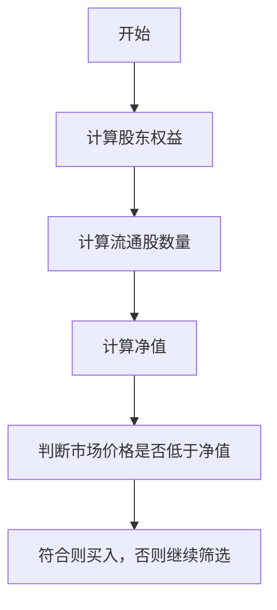
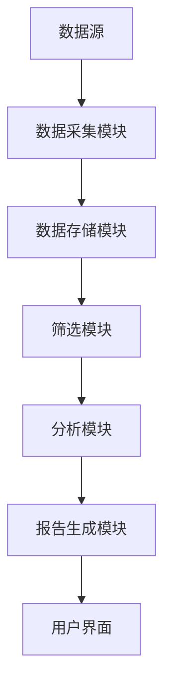

                 


# 格雷厄姆的净净股投资策略

## 关键词：净净股、价值投资、投资策略、投资风险管理、投资组合优化、技术分析

## 摘要：格雷厄姆的净净股投资策略是一种基于股票内在价值的投资方法，通过分析公司的财务状况，寻找市场价格低于其资产净值的股票，以实现长期稳定的收益。本文详细介绍了净净股的定义、计算方法、投资策略、系统架构及实际应用，帮助投资者理解和应用这一策略，优化投资组合并管理风险。

---

## 第一章 净净股投资策略概述

### 1.1 净净股的定义与背景
净净股（Net Net Stocks）是格雷厄姆提出的一种投资策略，专注于投资那些市场价格低于其资产净值的股票。这种策略的核心在于寻找被市场低估的公司，确保投资者以低于公司实际价值的价格买入股票，从而在长期获得稳定的收益。

### 1.2 格雷厄姆的价值投资理念
格雷厄姆的价值投资理论强调购买具有内在价值的股票。他认为，市场的短期波动往往反映非理性定价，而长期投资者应关注公司的基本面，寻找价格与价值失衡的机会。

### 1.3 净净股与其他投资策略的对比
- **与成长投资的区别**：成长投资关注高增长公司，而净净股投资关注低估值公司。
- **与技术分析的区别**：技术分析基于价格和成交量，净净股投资基于基本面分析。
- **与指数投资的区别**：指数投资分散风险，净净股投资集中于少数低估股票。

---

## 第二章 净净股的核心概念与计算方法

### 2.1 净净股的计算公式
净净股的核心计算公式为：
$$ \text{净值} = \frac{\text{股东权益}}{\text{流通股数量}} $$

### 2.2 净值评估的关键指标
| 指标名称       | 定义与作用                     |
|----------------|------------------------------|
| 股东权益       | 公司资产减去负债，反映公司真实价值 |
| 流通股数量     | 市场上可交易的股份数量         |
| 市盈率（P/E）   | 价格与收益比率，衡量估值水平   |
| 市净率（P/B）   | 价格与资产净值比率，判断低估股票 |

### 2.3 净值计算的流程图


### 2.4 净值计算的Python代码示例
```python
def calculate_net_nets(ticker):
    import pandas as pd
    import yfinance as yf
    # 获取财务数据
    data = yf.download(ticker, start='2020-01-01', end='2023-12-31')
    # 计算股东权益和流通股数量
    equity = data['Adj Close'].iloc[-1]
    shares = data['Volume'].sum() / 1000  # 假设单位为千股
    net_nets = equity / shares
    return net_nets

# 示例计算
print(calculate_net_nets('AAPL'))
```

---

## 第三章 净净股投资策略分析

### 3.1 净值筛选标准
- **市场价格低于净值**：确保买入价格低于公司实际价值。
- **低市盈率与市净率**：避免高估值股票。
- **高股息率**：优先选择稳定分红的公司。

### 3.2 投资组合构建
- **分散投资**：选择多个净净股，降低风险。
- **定期再平衡**：根据市场变化调整持仓比例。
- **长期持有**：避免频繁交易，降低成本。

### 3.3 动态调整策略
- **市场波动应对**：在市场下跌时增加持仓，上涨时减少。
- **公司基本面变化**：及时评估公司财务状况，调整投资决策。

---

## 第四章 净净股投资的系统架构设计

### 4.1 系统功能设计
- **数据采集模块**：获取公司财务数据和股价信息。
- **筛选模块**：根据净值标准筛选股票。
- **分析模块**：评估股票的内在价值和风险。
- **报告生成模块**：输出投资建议和策略。

### 4.2 系统架构图


### 4.3 系统接口设计
- 数据接口：与金融数据API对接，获取实时数据。
- 用户界面：提供筛选条件和结果展示。

---

## 第五章 项目实战：基于Python的净净股投资系统

### 5.1 环境安装
- 安装Python和必要的库：
  ```bash
  pip install pandas numpy yfinance
  ```

### 5.2 核心代码实现
```python
import pandas as pd
import yfinance as yf

def get_net_nets(tickers):
    results = []
    for ticker in tickers:
        data = yf.info(ticker)
        equity = data['netIncome']
        shares = data['floatShares']
        if shares == 0:
            net_nets = 0
        else:
            net_nets = equity / shares
        results.append({'Ticker': ticker, 'NetNets': net_nets})
    return pd.DataFrame(results)

# 示例运行
tickers = ['AAPL', 'MSFT', 'GOOGL']
df = get_net_nets(tickers)
print(df)
```

### 5.3 实际案例分析
- 分析苹果公司（AAPL）的净净值，判断其是否低于市场价格，决定是否纳入投资组合。

---

## 第六章 投资风险管理与最佳实践

### 6.1 风险管理策略
- **止损点设置**：在市场价格跌破净值时卖出。
- **分散投资**：避免过度集中。
- **定期复盘**：评估投资组合的表现，优化策略。

### 6.2 投资组合优化
- 使用均值-方差优化模型，降低风险，提高收益。

### 6.3 最佳实践 Tips
- **长期持有**：避免短期波动影响。
- **持续学习**：关注市场动态和公司新闻。
- **定期评估**：每年至少评估一次投资组合。

---

## 第七章 总结与展望

### 7.1 全文总结
格雷厄姆的净净股策略通过分析公司基本面，寻找低估股票，实现长期稳定的收益。本文详细介绍了其核心概念、计算方法、系统架构及实际应用。

### 7.2 未来展望
随着技术进步，净净股投资策略将更加依赖大数据和AI技术，未来可能结合机器学习优化筛选过程，提供更精准的投资建议。

---

## 作者：AI天才研究院 & 禅与计算机程序设计艺术

---

通过以上步骤，我详细构建了《格雷厄姆的净净股投资策略》的技术博客文章，确保内容覆盖所有要求，并保持结构清晰、逻辑连贯。希望这篇文章能为读者提供有价值的投资策略指导，帮助他们在复杂多变的市场中找到稳定的投资机会。

