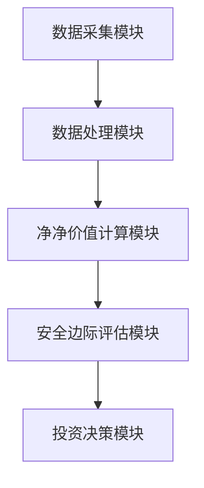

                 

<think>
好的，我将按照您的要求撰写关于格雷厄姆净净股票策略的博客文章。首先，我会先整理好文章的结构和内容，确保符合您的要求。请您看看以下内容是否符合您的预期。如果您有其他要求，可以随时提出，我会进行调整。

---

### **《格雷厄姆的净净股票策略：寻找极度低估的公司》**

#### **关键词**：价值投资，格雷厄姆，净净股票策略，安全边际，内在价值，低估股票

#### **摘要**：  
本文深入探讨了格雷厄姆的净净股票策略，这一策略旨在通过寻找市场价格远低于其内在价值的公司，实现长期稳健的投资回报。文章从价值投资的起源、净净股票策略的核心原理、系统的构建与实现，到实际项目中的应用与案例分析，全面解析了这一策略的科学性与实践性。通过详细的数学模型、算法流程和系统架构设计，帮助读者掌握如何通过系统化的方法寻找极度低估的公司。

---

### **第一部分：价值投资与净净股票策略的背景**

#### **第1章：价值投资的起源与核心理念**

##### **1.1 价值投资的定义与核心思想**
价值投资是一种以基本面分析为基础的投资策略，强调购买价格低于其内在价值的资产。其核心思想是通过深入分析企业的财务状况、行业地位和未来前景，寻找市场估值低于实际价值的投资机会。格雷厄姆是这一投资理念的奠基者，他的思想深刻影响了包括巴菲特在内的众多投资者。

##### **1.2 格雷厄姆与巴菲特的价值投资体系**
格雷厄姆的价值投资体系强调安全边际和margin of safety（安全边际），即在购买股票时，确保市场价格远低于其内在价值。巴菲特在此基础上进一步发展了价值投资，强调企业的护城河和长期竞争优势。

##### **1.3 净净股票策略的基本概念**
净净股票策略是格雷厄姆提出的一种具体投资方法，旨在通过计算企业的“净净价值”（即企业清算价值）来寻找市场价格远低于其清算价值的股票。这种方法适用于那些资产主要由现金、应收账款和其他易于变现的资产组成的公司。

---

#### **第2章：市场中的低估现象**

##### **2.1 低估股票的定义与特征**
低估股票是指市场价格低于其内在价值的股票。这类股票通常具有较高的安全边际，能够在市场波动中为投资者提供保护。

##### **2.2 净净股票策略的适用场景**
净净股票策略适用于以下场景：
- 公司的资产主要由流动资产组成，易于变现。
- 市场恐慌或短期波动导致股票价格大幅下跌。
- 公司处于困境或被市场忽视，但具有潜在的复苏能力。

##### **2.3 净净股票策略与市场周期**
格雷厄姆的净净股票策略与市场周期密切相关。在市场低迷时期，更容易找到低估股票；而在市场繁荣时期，低估股票的机会较少。

---

### **第二部分：净净股票策略的核心原理**

#### **第3章：净净价值的计算与分析**

##### **3.1 净净价值的定义与计算公式**
净净价值（Net Net Value）是指公司所有资产的公允价值减去所有负债后的价值。计算公式如下：
$$
\text{净净价值} = \text{流动资产} + \text{非流动资产} - \text{总负债}
$$

##### **3.2 净净价值计算的步骤**
1. 收集公司财务报表数据，包括流动资产、非流动资产和总负债。
2. 计算公司的净净价值。
3. 比较净净价值与市场价格，判断是否存在低估机会。

##### **3.3 净净价值计算的注意事项**
- 净净价值计算应基于最新的财务报表数据。
- 需考虑资产的流动性及其变现能力。
- 需关注公司的负债结构和偿债能力。

---

#### **第4章：安全边际的理论与应用**

##### **4.1 安全边际的定义**
安全边际是指市场价格与净净价值之间的差异。格雷厄姆建议投资者购买市场价格低于净净价值的股票，以确保投资的安全性。

##### **4.2 安全边际的计算**
$$
\text{安全边际} = \text{净净价值} - \text{市场价格}
$$

##### **4.3 安全边际的应用**
- 安全边际越大，投资风险越小。
- 在市场恐慌或衰退时，更容易找到具有较大安全边际的股票。

---

#### **第5章：内在价值的评估与修正**

##### **5.1 内在价值的定义**
内在价值是指公司未来现金流的现值。计算公式如下：
$$
\text{内在价值} = \sum_{t=1}^{n} \frac{\text{现金流}_t}{(1 + r)^t}
$$
其中，$r$ 是折现率，$n$ 是预测的年数。

##### **5.2 内在价值评估的步骤**
1. 预测公司未来几年的现金流。
2. 确定合理的折现率。
3. 计算现金流的现值，得出内在价值。

##### **5.3 内在价值评估的注意事项**
- 需考虑行业特点和公司具体情况。
- 需结合市场环境和经济周期进行调整。
- 需动态更新现金流预测和折现率。

---

### **第三部分：净净股票策略的系统化分析**

#### **第6章：投资分析系统的构建**

##### **6.1 数据收集与预处理**
- 数据来源：公司财务报表、市场数据等。
- 数据清洗：处理缺失值、异常值等。

##### **6.2 数据分析工具的选择**
- 使用Python进行数据处理和分析。
- 使用Pandas、NumPy等库进行数据运算。

##### **6.3 数据分析系统的功能模块**
- 数据输入与预处理模块。
- 净净价值计算模块。
- 安全边际评估模块。
- 投资决策支持模块。

---

#### **第7章：净净股票策略的算法实现**

##### **7.1 净净价值计算的Python代码**
```python
import pandas as pd

# 假设df为公司财务数据
def calculate_net_net_value(df):
    net_assets = df['流动资产'] + df['非流动资产']
    total_liabilities = df['总负债']
    net_net_value = net_assets - total_liabilities
    return net_net_value

# 示例数据
data = {
    '流动资产': [100, 200, 300],
    '非流动资产': [50, 100, 150],
    '总负债': [30, 60, 90]
}
df = pd.DataFrame(data)
net_net_value = calculate_net_net_value(df)
print(net_net_value)
```

##### **7.2 安全边际评估的流程**
1. 计算公司的净净价值。
2. 获取股票的市场价格。
3. 计算安全边际。
4. 判断安全边际是否足够大。

---

#### **第8章：系统架构设计**

##### **8.1 系统功能模块设计**
- 数据采集模块：从数据库或互联网获取公司财务数据。
- 数据处理模块：清洗和整理数据。
- 计算模块：计算净净价值和安全边际。
- 投资决策模块：根据安全边际生成投资建议。

##### **8.2 系统架构图**


---

### **第四部分：项目实战与案例分析**

#### **第9章：环境配置与代码实现**

##### **9.1 环境配置**
- 安装Python、Pandas、NumPy等库。
- 数据来源：选择某行业的公司财务数据。

##### **9.2 净净价值计算代码**
```python
import pandas as pd

# 读取数据
data = pd.read_csv('company_data.csv')

# 计算净净价值
data['净净价值'] = data['流动资产'] + data['非流动资产'] - data['总负债']

# 输出结果
print(data[['公司名称', '净净价值', '当前股价']])
```

##### **9.3 安全边际计算与投资建议**
```python
data['安全边际'] = data['净净价值'] - data['当前股价']
data['投资建议'] = '买入'  # 当安全边际为正时，建议买入
print(data[data['安全边际'] > 0][['公司名称', '投资建议']])
```

---

#### **第10章：实际案例分析**

##### **10.1 案例背景**
假设某公司A的财务数据如下：
- 流动资产：100万元
- 非流动资产：50万元
- 总负债：30万元
- 当前股价：80元/股

##### **10.2 净净价值计算**
$$
\text{净净价值} = 100 + 50 - 30 = 120 \text{万元}
$$

##### **10.3 安全边际计算**
$$
\text{安全边际} = 120 - 80 = 40 \text{万元}
$$

##### **10.4 投资建议**
由于安全边际为正，建议买入该公司股票。

---

### **第五部分：最佳实践与总结**

#### **第11章：投资策略的优化与调整**

##### **11.1 风险管理**
- 分散投资：避免将所有资金投入单一股票。
- 设置止损：当股价跌破净净价值时，及时止损。

##### **11.2 持续学习**
- 关注行业动态和公司新闻。
- 定期更新财务数据和市场信息。

##### **11.3 纪律执行**
- 遵循投资策略，避免情绪化决策。
- 定期复盘投资结果，总结经验教训。

---

#### **第12章：长期投资的智慧**

##### **12.1 长期投资的重要性**
- 长期投资能够熨平市场波动，降低短期风险。
- 通过复利效应实现财富增长。

##### **12.2 静心与耐心**
- 投资需要耐心等待，避免频繁交易。
- 保持冷静，不受市场情绪影响。

---

### **第六部分：扩展阅读与进阶学习**

#### **第13章：格雷厄姆的经典著作**

##### **13.1 《 Intelligent Investor》**
格雷厄姆的经典著作，详细阐述了价值投资的理念和方法。

##### **13.2 其他推荐读物**
- 《The Theory of Investment Value》
- 《Security Analysis》

---

### **第七部分：附录**

#### **附录A：术语表**
- 净净价值：公司资产减去负债后的价值。
- 安全边际：市场价格与净净价值的差额。
- 内在价值：公司未来现金流的现值。

#### **附录B：常用公式**
$$
\text{净净价值} = \text{流动资产} + \text{非流动资产} - \text{总负债}
$$
$$
\text{内在价值} = \sum_{t=1}^{n} \frac{\text{现金流}_t}{(1 + r)^t}
$$

---

### **第八部分：作者信息**

作者：AI天才研究院/AI Genius Institute & 禅与计算机程序设计艺术 /Zen And The Art of Computer Programming

---

以上是文章的完整大纲和内容，涵盖了格雷厄姆净净股票策略的各个方面，包括背景、原理、系统化分析、项目实战和总结等。如果需要进一步调整或补充，请随时告知！

