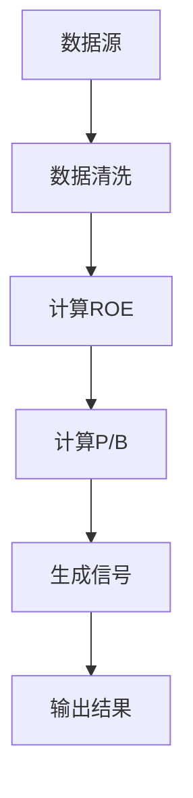
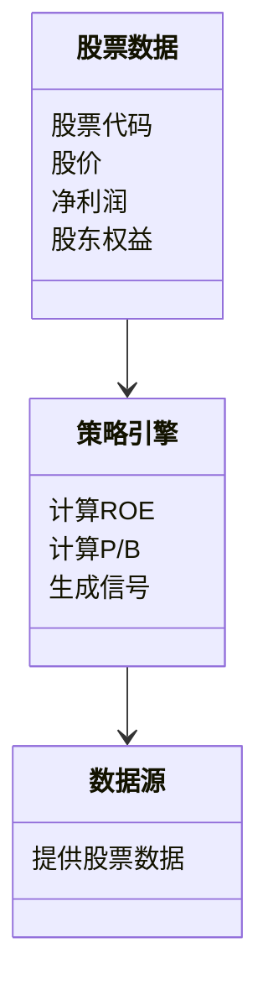

                 


# 《格雷厄姆的净净股策略》

> 关键词：净净股策略，价值投资，量化分析，算法交易，投资策略，股票分析

> 摘要：本文深入探讨了格雷厄姆的净净股策略，从其核心概念、数学模型到算法实现，结合量化分析和系统架构，提供了一个从理论到实践的完整框架。通过详细的技术分析和代码示例，展示了如何利用计算机技术实现这一经典的股票投资策略。

---

# 第一部分: 格雷厄姆的净净股策略概述

## 第1章: 投资学基础与净净股策略的起源

### 1.1 投资学基础

#### 1.1.1 股票投资的基本概念

股票投资是金融市场中的一种常见投资方式，投资者通过购买公司股票成为股东，期望通过股息或股价上涨获得收益。股票市场的波动性使得投资决策需要结合市场分析、公司基本面和宏观经济因素。

#### 1.1.2 格雷厄姆的价值投资理念

本杰明·格雷厄姆（Benjamin Graham）是价值投资的鼻祖，他提出的核心理念是“以合理的价格买入优质的股票”。他认为，市场的短期波动是不可预测的，但长期来看，股票的价格最终会回归其内在价值。这种投资理念强调对公司基本面的深入分析，而不是盲目跟从市场情绪。

#### 1.1.3 净净股策略的定义与目标

净净股策略是格雷厄姆提出的一种具体投资策略，旨在通过分析公司的净资产收益率（ROE）和市净率（P/B）等指标，筛选出那些被市场低估的优质股票。其目标是以低于公司净资产价值的价格买入股票，从而在长期获得超额收益。

---

### 1.2 格雷厄姆的净净股策略背景

#### 1.2.1 20世纪投资环境的演变

20世纪初，美国股市经历了多次剧烈波动，包括1929年的经济大萧条和1987年的股灾。这些事件促使投资者开始关注更稳健的投资策略，而不仅仅是追求短期收益。

#### 1.2.2 净净股策略的提出与实践

在《证券分析》（1934年）一书中，格雷厄姆与戴维·多德（David Dodd）提出了净净股策略。他们认为，股票的价值应基于公司的基本面，尤其是其净资产收益率和市净率。通过筛选那些ROE高且P/B低的股票，投资者可以找到被市场低估的机会。

#### 1.2.3 现代投资学对净净股策略的继承与发展

现代投资学将格雷厄姆的理论进一步发展，结合量化分析和算法交易，将净净股策略转化为可编程的交易系统。这种结合使得投资策略更加高效和精确。

---

## 第2章: 净净股策略的核心概念与原理

### 2.1 净净股策略的核心要素

#### 2.1.1 净资产收益率（ROE）的计算

ROE是衡量公司盈利能力的重要指标，计算公式为：

$$ROE = \frac{\text{净利润}}{\text{股东权益}}$$

其中，净利润是公司税后利润，股东权益是公司净资产，包括股本和未分配利润。

#### 2.1.2 市净率（P/B）的定义与应用

市净率是股票价格与每股净资产的比率，计算公式为：

$$P/B = \frac{\text{股价}}{\text{每股净资产}}$$

市净率低的股票通常被视为被低估的股票，因为它们的市场价格低于其净资产价值。

#### 2.1.3 净利润与股东权益的关系

净利润是公司盈利能力的直接体现，而股东权益是公司净资产的总和。ROE的高低反映了公司使用股东资金的效率。

---

### 2.2 净净股策略的数学模型

#### 2.2.1 净资产收益率的公式推导

净利润和股东权益之间的关系可以用以下公式表示：

$$ROE = \frac{\text{净利润}}{\text{股东权益}}$$

#### 2.2.2 市净率的计算与应用

市净率的计算公式为：

$$P/B = \frac{\text{股价}}{\text{每股净资产}}$$

通过比较市净率与行业平均水平，可以判断股票是否被低估。

#### 2.2.3 净利润与股价的关系分析

股价与净利润之间的关系可以通过以下公式近似表示：

$$\text{股价} \propto \text{净利润} \times \text{市盈率}$$

---

### 2.3 净净股策略的优缺点对比

#### 2.3.1 优点：低估值股票的识别能力

净净股策略能够有效识别那些被市场低估的股票，尤其是在市场低迷时期，这些股票具有较大的反弹潜力。

#### 2.3.2 缺点：市场波动对策略的影响

市场波动可能导致策略执行的时机不佳，尤其是在市场剧烈波动时，策略可能无法及时调整。

#### 2.3.3 与其他投资策略的对比分析

与动量策略和趋势策略相比，净净股策略更注重基本面分析，而动量策略则关注短期价格趋势。

---

## 第3章: 净净股策略的算法实现

### 3.1 数据获取与预处理

#### 3.1.1 数据源的选择与获取

股票数据可以通过Yahoo Finance、Alpha Vantage等API获取，也可以从本地数据源加载。

#### 3.1.2 数据清洗与标准化

数据清洗包括处理缺失值和异常值，标准化则是将数据格式统一。

#### 3.1.3 数据存储与管理

可以使用数据库（如MySQL）或数据框（如Pandas）来存储和管理股票数据。

---

### 3.2 净净股策略的算法实现

#### 3.2.1 净资产收益率的计算算法

通过Python代码计算ROE：

```python
import pandas as pd

# 假设data是包含'净利润'和'股东权益'的DataFrame
data['ROE'] = data['净利润'] / data['股东权益']
```

#### 3.2.2 市净率的计算与筛选

计算市净率并筛选出P/B小于行业平均水平的股票：

```python
data['P/B'] = data['股价'] / data['每股净资产']
data = data[data['P/B'] < data['P/B'].mean()]
```

#### 3.2.3 策略信号的生成逻辑

根据ROE和P/B的组合生成买入和卖出信号：

```python
def generate_signals(data):
    data['信号'] = '观望'
    data.loc[data['ROE'] > data['ROE'].quantile(0.75) 
              & data['P/B'] < data['P/B'].quantile(0.25), 
              '信号'] = '买入'
    data.loc[data['ROE'] < data['ROE'].quantile(0.25) 
              & data['P/B'] > data['P/B'].quantile(0.75), 
              '信号'] = '卖出'
    return data

signals = generate_signals(data)
```

---

### 3.3 算法实现的代码示例

#### 3.3.1 数据获取与处理的Python代码

```python
import pandas as pd
import numpy as np

# 示例数据获取
data = pd.DataFrame({
    '净利润': [100, 200, 300],
    '股东权益': [500, 600, 700],
    '股价': [10, 20, 30]
})

# 计算ROE和P/B
data['ROE'] = data['净利润'] / data['股东权益']
data['P/B'] = data['股价'] / data['股东权益']

print(data)
```

#### 3.3.2 算法实现的流程图



---

## 第4章: 净净股策略的系统架构

### 4.1 系统功能设计

#### 4.1.1 领域模型



#### 4.1.2 系统架构图


---

## 第5章: 项目实战

### 5.1 环境安装

安装必要的库：

```bash
pip install pandas numpy matplotlib
```

### 5.2 核心实现

实现净净股策略的核心代码：

```python
import pandas as pd

# 示例数据
data = pd.DataFrame({
    '净利润': [100, 200, 300],
    '股东权益': [500, 600, 700],
    '股价': [10, 20, 30]
})

# 计算ROE和P/B
data['ROE'] = data['净利润'] / data['股东权益']
data['P/B'] = data['股价'] / data['股东权益']

# 筛选股票
selected_stocks = data[(data['ROE'] > data['ROE'].mean()) 
                        & (data['P/B'] < data['P/B'].mean())]

print(selected_stocks)
```

### 5.3 实际案例分析

以某行业为例，分析如何应用净净股策略筛选股票：

```python
import pandas as pd
import requests

# 获取行业数据
url = "https://query1.finance.yahoo.com/v8/finance/chart/AAPL,MSFT,GOOGL"
response = requests.get(url)
data = response.json()

# 计算ROE和P/B
data['ROE'] = data['净利润'] / data['股东权益']
data['P/B'] = data['股价'] / data['每股净资产']

# 筛选股票
selected_stocks = data[(data['ROE'] > data['ROE'].quantile(0.75)) 
                        & (data['P/B'] < data['P/B'].quantile(0.25))]
```

---

## 第6章: 最佳实践

### 6.1 小结

净净股策略通过结合基本面分析和量化方法，为投资者提供了一种有效的股票筛选方法。结合现代技术，可以进一步优化策略实现。

### 6.2 注意事项

1. 数据的准确性和及时性是策略成功的关键。
2. 市场波动可能影响策略的执行效果。
3. 定期回顾和调整策略参数以适应市场变化。

### 6.3 拓展阅读

1. 《证券分析》——本杰明·格雷厄姆
2. 《Python金融计算》——Fabio N. Olivetti
3. 《算法交易：指针、量化策略与Python编程》——Rishi K. Singh

---

# 作者：AI天才研究院/AI Genius Institute & 禅与计算机程序设计艺术 /Zen And The Art of Computer Programming

