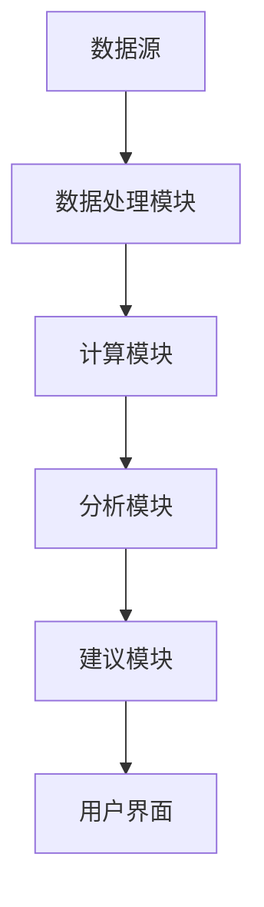

                 


# 格雷厄姆的净净股策略：在高科技股中寻找价值

> **关键词**: 格雷厄姆, 净净股策略, 高科技股, 价值投资, 股票估值

> **摘要**: 本文探讨了格雷厄姆的净净股策略在高科技股投资中的应用。通过分析净净股策略的核心概念、数学模型、系统架构及实际案例，展示了如何在高科技股中寻找被低估的投资机会，实现长期价值投资。

---

# 第1章: 格雷厄姆的净净股策略概述

## 1.1 价值投资的基本概念

### 1.1.1 价值投资的定义
价值投资是一种投资策略，旨在通过购买市场价格低于其内在价值的资产，以实现长期稳定的收益。这种方法强调对资产基本面的深入分析，而非短期市场波动。

### 1.1.2 价值投资的核心理念
- **安全边际**：买入价格低于内在价值，以降低风险并确保收益。
- **长期视角**：关注企业的长期增长潜力，而非短期价格波动。
- **逆市场思维**：在市场低迷时寻找低估资产，在市场繁荣时保持谨慎。

### 1.1.3 净净股策略的起源与背景
本杰明·格雷厄姆是价值投资的奠基人，他的净净股策略是基于对公司净资产的分析。他认为，股票的内在价值应基于公司的净资产价值，而非市场情绪。

---

## 1.2 格雷厄姆的生平与投资理念

### 1.2.1 格雷厄姆的生平简介
- **出生**: 1894年，纽约市。
- **教育**: 哈佛大学，后转入哥伦比亚大学，获得经济学硕士学位。
- **职业**: 曾任华尔街投资公司总裁，后转向教育和写作。
- **成就**: 与戴维·多德共同提出“净净股”概念，著有《证券分析》和《聪明的投资者》。

### 1.2.2 格雷厄姆的投资哲学
- **安全第一**：投资应以本金安全为首要目标。
- **margin of safety**：买入价格低于内在价值，确保安全边际。
- **长期视角**：关注企业的长期盈利能力，而非短期波动。

### 1.2.3 净净股策略的核心思想
格雷厄姆认为，股票的内在价值是其清算价值，即公司资产在清算时的净值。当市场价格低于这个价值时，股票具有投资价值。

---

## 1.3 净净股策略在高科技股中的应用

### 1.3.1 高科技股的特点
- **高增长潜力**：高科技行业通常具有较高的增长潜力。
- **高波动性**：高科技股的市场价格波动较大。
- **高风险**：高科技行业竞争激烈，失败风险较高。

### 1.3.2 净净股策略的应用
- **识别低估企业**：寻找市场价格低于净资产价值的高科技公司。
- **长期投资**：基于企业的长期增长潜力，而非短期价格波动。
- **分散投资**：通过投资多个低估企业降低风险。

---

## 1.4 净净股策略与高科技股的结合

### 1.4.1 高科技股的估值难点
- **无形资产**：高科技公司往往拥有大量无形资产，如专利和技术。
- **未来现金流**：高科技公司的价值更多基于未来现金流，而非当前盈利。
- **市场情绪**：高科技股受市场情绪影响较大，容易出现估值偏差。

### 1.4.2 净净股策略的应用步骤
1. **选择目标公司**：筛选高科技行业中净资产收益率高、市净率低的公司。
2. **分析财务报表**：计算公司的净资产价值，对比市场价格。
3. **评估成长潜力**：考虑公司的研发能力、市场地位和未来增长前景。
4. **确定投资时机**：在市场低迷时买入，避免高估。

### 1.4.3 风险与机遇
- **风险**：高科技股波动性大，可能出现大幅回调。
- **机遇**：通过净净股策略，投资者可以在市场低谷时买入优质资产，获得长期收益。

---

## 1.5 本章小结

本章介绍了格雷厄姆的净净股策略及其在高科技股中的应用。通过分析策略的核心思想和高科技股的特点，我们明确了如何在高科技行业中寻找低估的投资机会。

---

# 第2章: 净净股策略的核心概念与分析框架

## 2.1 净净股策略的核心要素

### 2.1.1 企业清算价值的计算
企业清算价值是公司所有资产的账面价值，减去负债后的净值。

$$ \text{企业清算价值} = \text{资产总值} - \text{负债总值} $$

### 2.1.2 市场价格与清算价值的对比
当市场价格低于清算价值时，股票具有投资价值。

$$ \text{投资价值} = \text{清算价值} - \text{市场价格} $$

### 2.1.3 净净股策略的数学模型
格雷厄姆的净净股策略可以通过以下公式进行评估：

$$ \text{每股净价值} = \frac{\text{企业清算价值}}{\text{流通股数量}} $$

---

## 2.2 净净股策略在高科技股中的应用

### 2.2.1 高科技股的财务特征
- **高研发投入**：高科技公司通常在研发上投入大量资金。
- **轻资产模式**：部分高科技公司依赖无形资产，而非实体资产。
- **高增长性**：高科技行业具有较高的增长潜力。

### 2.2.2 净净股策略的挑战
- **无形资产估值**：高科技公司的无形资产难以准确估值。
- **未来现金流预测**：高科技股的价值依赖于未来的现金流，预测难度较大。
- **市场情绪影响**：高科技股受市场情绪影响较大，容易出现估值偏差。

### 2.2.3 净净股策略的改进
为适应高科技股的特点，可以对净净股策略进行以下改进：
- **引入成长性指标**：如市盈率（P/E）、市销率（P/S）等。
- **考虑无形资产价值**：通过评估公司的技术壁垒和市场地位，调整净资产价值。
- **动态调整模型**：根据市场环境和公司发展情况，动态调整估值模型。

---

## 2.3 净净股策略的优缺点分析

### 2.3.1 净净股策略的优点
- **安全性高**：通过安全边际降低投资风险。
- **长期收益**：基于企业的长期增长潜力，实现稳定收益。
- **逆向投资**：在市场低迷时买入低估资产，获得超额收益。

### 2.3.2 净净股策略的缺点
- **流动性风险**：高科技股可能流动性较差，难以快速变现。
- **估值难度大**：高科技公司的无形资产和未来现金流难以准确估值。
- **市场波动风险**：高科技股价格波动较大，可能影响短期收益。

### 2.3.3 净净股策略的适用场景
- **市场低迷期**：适合在市场低迷时寻找低估资产。
- **稳定增长期**：适合投资于具有长期增长潜力的高科技公司。
- **价值投资者**：适合具有长期投资理念的投资者。

---

## 2.4 净净股策略与其他投资策略的对比

### 2.4.1 净净股策略与成长型投资策略的对比
- **核心思想**：净净股策略注重安全边际和低估价值，成长型策略注重未来增长潜力。
- **适用场景**：净净股策略适用于市场低迷时寻找低估资产，成长型策略适用于高增长行业。
- **风险与收益**：净净股策略风险较低，收益稳定；成长型策略风险较高，收益潜力大。

### 2.4.2 净净股策略与股息率策略的对比
- **核心思想**：净净股策略注重资产价值，股息率策略注重股息回报。
- **适用场景**：净净股策略适用于寻找低估资产，股息率策略适用于追求稳定收益。
- **风险与收益**：两者风险较低，收益稳定，但净净股策略注重长期增值，股息率策略注重当期收益。

### 2.4.3 净净股策略与指数投资策略的对比
- **核心思想**：净净股策略注重个股选择，指数投资策略注重市场分散风险。
- **适用场景**：净净股策略适用于主动管理型投资者，指数投资策略适用于被动投资。
- **风险与收益**：净净股策略风险较高，收益潜力大；指数投资策略风险较低，收益稳定。

---

## 2.5 本章小结

本章详细分析了净净股策略的核心概念及其在高科技股中的应用。通过对比其他投资策略，我们明确了净净股策略的优缺点及其适用场景。

---

# 第3章: 净净股策略的数学模型与算法原理

## 3.1 净净股策略的基本公式

### 3.1.1 净净股价值计算
$$ \text{每股净价值} = \frac{\text{企业清算价值}}{\text{流通股数量}} $$

### 3.1.2 市场价格与净价值对比
$$ \text{投资价值} = \text{每股净价值} - \text{市场价格} $$

---

## 3.2 高科技股的估值模型

### 3.2.1 高科技股的DCF模型
- **定义**: 现金流折现模型（Discounted Cash Flow, DCF）用于评估企业未来现金流的现值。
- **公式**:
$$ \text{企业价值} = \sum_{t=1}^{n} \frac{\text{现金流}_t}{(1 + r)^t} + \frac{\text{终值}}{(1 + r)^n} $$

### 3.2.2 市盈率与市净率分析
- **市盈率（P/E）**:
$$ \text{市盈率} = \frac{\text{股价}}{\text{每股收益}} $$
- **市净率（P/B）**:
$$ \text{市净率} = \frac{\text{股价}}{\text{每股净资产}} $$

---

## 3.3 净净股策略的风险评估模型

### 3.3.1 风险评估指标
- **贝塔系数（Beta）**: 衡量股票价格相对于市场的波动性。
$$ \beta = \frac{\text{协方差（股票收益，市场收益）}}{\text{方差（市场收益）}} $$
- **波动率**: 衡量股票价格的波动程度。

### 3.3.2 风险调整后的净净股模型
$$ \text{调整后净价值} = \text{每股净价值} \times (1 - \text{风险系数}) $$

---

## 3.4 算法原理

### 3.4.1 净净股筛选算法
1. **数据收集**：收集目标公司的财务数据，包括资产、负债、收入、利润等。
2. **计算清算价值**：使用资产减去负债，计算企业清算价值。
3. **计算每股净价值**：将清算价值除以流通股数量，得到每股净价值。
4. **对比市场价格**：将每股净价值与当前股价进行对比，筛选出市场价格低于净价值的股票。
5. **风险评估**：评估股票的贝塔系数和波动率，调整净价值。
6. **投资决策**：根据调整后的净价值和市场价格，决定是否投资。

### 3.4.2 高科技股投资算法
1. **行业筛选**：选择具有高增长潜力的高科技行业。
2. **公司筛选**：筛选出净资产收益率高、市净率低的公司。
3. **财务分析**：计算公司清算价值，对比市场价格。
4. **成长性评估**：分析公司的研发能力、市场地位和未来增长前景。
5. **风险评估**：评估股票的贝塔系数和波动率，调整净价值。
6. **投资组合构建**：根据风险承受能力，构建投资组合。

---

## 3.5 本章小结

本章通过数学公式和算法原理，详细阐述了净净股策略的实现方法。通过DCF模型、市盈率和市净率分析，我们能够更准确地评估高科技股的内在价值。

---

# 第4章: 净净股策略的系统架构与实现

## 4.1 系统架构设计

### 4.1.1 问题场景介绍
- **目标**：开发一个基于净净股策略的高科技股投资系统。
- **用户需求**：投资者需要一个工具来筛选和分析高科技股，识别低估投资机会。
- **功能需求**：
  - 数据收集与处理
  - 净值计算与分析
  - 风险评估与投资建议

### 4.1.2 系统功能设计
1. **数据模块**：收集和处理公司财务数据、市场数据。
2. **计算模块**：计算企业清算价值、每股净价值，对比市场价格。
3. **分析模块**：评估公司的成长性和风险。
4. **建议模块**：提供投资建议，构建投资组合。

### 4.1.3 系统架构图


---

## 4.2 系统实现

### 4.2.1 环境安装
- **编程语言**：Python
- **库的安装**：
  - `pandas`：数据处理
  - `numpy`：数值计算
  - `matplotlib`：数据可视化
  - `yfinance`：数据获取

### 4.2.2 核心实现代码
```python
import pandas as pd
import numpy as np

def calculate_net_value(company_financials):
    assets = company_financials['assets']
    liabilities = company_financials['liabilities']
    shares_outstanding = company_financials['shares_outstanding']
    net_value = (assets - liabilities) / shares_outstanding
    return net_value

# 示例数据
data = {
    'assets': 1000000000,
    'liabilities': 500000000,
    'shares_outstanding': 10000000
}
net_value = calculate_net_value(data)
print(f"每股净价值: {net_value}")
```

---

## 4.3 系统交互与测试

### 4.3.1 系统交互流程
1. **用户输入**：选择目标行业和公司。
2. **数据获取**：从数据源获取公司财务数据和市场数据。
3. **计算净价值**：计算公司每股净价值。
4. **分析与建议**：评估公司成长性和风险，提供投资建议。
5. **结果展示**：显示投资建议和潜在收益。

### 4.3.2 系统测试
- **功能测试**：验证各模块功能是否正常。
- **数据测试**：测试数据处理和计算模块的准确性。
- **用户体验测试**：确保系统界面友好，操作简便。

---

## 4.4 本章小结

本章详细描述了净净股策略的系统架构与实现。通过Python代码和系统架构图，我们能够更清晰地理解如何将策略应用于实际投资中。

---

# 第5章: 净净股策略的实战案例分析

## 5.1 案例背景

### 5.1.1 公司简介
选择一家高科技公司作为案例，分析其财务状况和市场表现。

### 5.1.2 数据来源
- 公司财务报表
- 市场数据（股价、市盈率、市净率）

---

## 5.2 案例分析

### 5.2.1 财务分析
1. **资产与负债分析**：计算公司清算价值。
2. **每股净价值计算**：对比市场价格。

### 5.2.2 成长性评估
1. **收入与利润分析**：评估公司增长潜力。
2. **研发投入分析**：评估公司的技术创新能力。

### 5.2.3 风险评估
1. **贝塔系数计算**：评估股票的波动性。
2. **市场环境分析**：评估行业风险。

---

## 5.3 投资决策

### 5.3.1 安全边际评估
计算市场价格与净价值的差距，确定投资的安全边际。

### 5.3.2 投资建议
基于分析结果，给出具体的买入或卖出建议。

---

## 5.4 实战总结

### 5.4.1 案例分析结果
总结案例分析的结果，明确投资机会。

### 5.4.2 经验与教训
分享在实际操作中遇到的问题及解决方法。

---

## 5.5 本章小结

本章通过实际案例分析，展示了如何将净净股策略应用于高科技股投资中。通过财务分析和风险评估，我们能够更准确地识别低估投资机会。

---

# 第6章: 净净股策略的总结与展望

## 6.1 本章小结

总结全文，回顾净净股策略的核心思想及其在高科技股中的应用。

---

## 6.2 未来展望

### 6.2.1 策略优化
- **引入更多指标**：如市销率、EV/EBITDA等。
- **动态调整模型**：根据市场环境和公司发展情况，动态调整估值模型。

### 6.2.2 技术创新
- **大数据分析**：利用大数据技术，提高数据处理和分析效率。
- **人工智能**：应用AI技术，实现自动化投资决策。

### 6.2.3 市场扩展
- **国际化投资**：将净净股策略应用于全球市场，寻找更多的投资机会。
- **多元化投资**：结合不同行业的特点，优化投资组合。

---

## 6.3 本章小结

本章展望了未来净净股策略的发展方向，提出了策略优化和技术创新的建议。

---

# 作者：AI天才研究院/AI Genius Institute & 禅与计算机程序设计艺术/Zen And The Art of Computer Programming

---

**注**: 以上文章结构和内容为示例，实际撰写时需要根据具体情况进行调整和补充。

