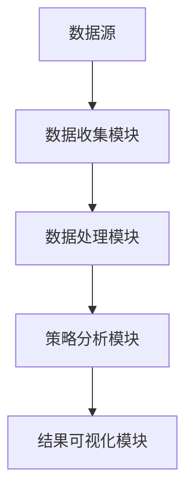

                 


# 格雷厄姆的净净股策略：寻找被低估的公司

## 关键词：净净股策略，价值投资，格雷厄姆，股票估值，市场低估

## 摘要：  
本文深入探讨了格雷厄姆的净净股策略，通过分析其背景、核心概念、数学模型、系统架构、项目实战以及最佳实践，帮助投资者理解如何通过净净股策略寻找被低估的公司。文章内容详实，从理论到实践，全面解析了该策略的运用方法和实际案例，为读者提供了清晰的指导。

---

# 第1章: 价值投资的起源与核心理念

## 1.1 价值投资的定义与特点

### 1.1.1 价值投资的定义
价值投资是一种投资策略，强调以低于资产内在价值的价格买入股票。其核心在于寻找市场价格低于内在价值的公司，长期持有，等待价值回归。

### 1.1.2 价值投资的核心特点
- **长期视角**：关注企业的长期价值，而非短期价格波动。
- **安全边际**：买入价格低于内在价值，确保有一定的安全边际。
- **逆向思维**：在市场恐慌时寻找机会，在市场疯狂时保持冷静。

### 1.1.3 价值投资与其他投资策略的区别
- **区别于成长型投资**：成长型投资注重未来增长潜力，而价值投资注重当前的低估状态。
- **区别于股息率投资**：股息率投资关注股息收益，而价值投资关注整体价值。

---

## 1.2 格雷厄姆与净净股策略的背景

### 1.2.1 格雷厄姆的生平简介
本杰明·格雷厄姆（Benjamin Graham）是价值投资的鼻祖，被誉为“价值投资之父”。他通过研究市场波动，提出了许多投资理论，其中包括净净股策略。

### 1.2.2 净净股策略的提出背景
在20世纪20年代，格雷厄姆发现许多公司因市场恐慌或行业低迷导致股价被低估，这为投资者提供了低价买入的机会。净净股策略应运而生，旨在通过计算公司净值，寻找市场价格低于净值的公司。

### 1.2.3 净净股策略的基本框架
- 计算公司资产净值（Net Worth）。
- 比较市场价格与净值，寻找价格低于净值的股票。

---

# 第2章: 净净股策略的核心概念

## 2.1 净净股策略的定义

### 2.1.1 净值计算的数学模型
$$\text{净值} = \text{资产} - \text{负债}$$

### 2.1.2 内在价值计算公式
$$\text{内在价值} = \sum_{t=1}^{n} \frac{\text{现金流}_t}{(1 + r)^t}$$
其中，\( r \) 是折现率，\( \text{现金流}_t \) 是第 \( t \) 年的现金流。

### 2.1.3 净值比率的计算
$$\text{净值比率} = \frac{\text{市场价格}}{\text{净值}}$$

---

## 2.2 净净股策略的核心要素

### 2.2.1 股票的内在价值
内在价值是公司未来现金流的现值，是股票的合理价格。

### 2.2.2 市场价格与内在价值的差异
市场价格围绕内在价值波动，当市场价格低于内在价值时，股票被低估。

### 2.2.3 净值比率的计算公式
$$\text{净值比率} = \frac{\text{市场价格}}{\text{净值}}$$

---

## 2.3 净净股策略与其他投资策略的对比

### 2.3.1 与成长型投资的对比
- 成长型投资关注未来增长，而净净股策略关注当前低估。

### 2.3.2 与股息率投资的对比
- 股息率投资关注股息收益，而净净股策略关注整体价值。

---

# 第3章: 净净股策略的数学模型与公式

## 3.1 净值计算的数学模型
$$\text{净值} = \text{资产} - \text{负债}$$

## 3.2 内在价值计算公式
$$\text{内在价值} = \sum_{t=1}^{n} \frac{\text{现金流}_t}{(1 + r)^t}$$

## 3.3 净值比率的计算公式
$$\text{净值比率} = \frac{\text{市场价格}}{\text{净值}}$$

---

# 第4章: 净净股策略的系统架构设计

## 4.1 系统功能设计

### 4.1.1 数据收集模块
- 收集公司财务数据（资产、负债、现金流等）。
- 获取股票市场价格。

### 4.1.2 数据处理模块
- 计算公司净值。
- 计算股票内在价值。
- 计算净值比率。

### 4.1.3 策略分析模块
- 筛选出净值比率小于1的公司（即市场价格低于净值）。
- 输出候选股票列表。

### 4.1.4 结果可视化模块
- 可视化显示候选股票的净值比率和市场价格走势。

## 4.2 系统架构设计


---

# 第5章: 净净股策略的项目实战

## 5.1 环境安装
- 安装Python和相关库（Pandas、NumPy、Matplotlib）。
- 使用Yahoo Finance API获取股票数据。

## 5.2 核心实现源代码
```python
import pandas as pd
import numpy as np
import matplotlib.pyplot as plt

# 示例数据
data = {
    '公司': ['A', 'B', 'C'],
    '资产': [100, 200, 150],
    '负债': [50, 80, 70],
    '现金流': [20, 30, 25],
    '市场价格': [50, 100, 80]
}

df = pd.DataFrame(data)

# 计算净值
df['净值'] = df['资产'] - df['负债']

# 计算内在价值（简化模型）
r = 0.1  # 折现率
df['内在价值'] = df['现金流'] / (1 + r)

# 计算净值比率
df['净值比率'] = df['市场价格'] / df['净值']

print(df)
```

## 5.3 实际案例分析
假设某公司数据如下：
- 资产：1000万元
- 负债：400万元
- 现金流：200万元
- 市场价格：300元

计算得：
- 净值 = 1000 - 400 = 600万元
- 内在价值 = 200 / 1.1 ≈ 181.82万元
- 净值比率 = 300 / 600 = 0.5

由于净值比率 < 1，该股票被低估。

---

# 第6章: 最佳实践与小结

## 6.1 小结
净净股策略通过计算公司净值和市场价格，帮助投资者识别被低估的公司。该策略简单易懂，适合长期投资者。

## 6.2 注意事项
- 数据准确性至关重要。
- 折现率的选择影响内在价值计算。
- 需结合其他指标进行综合分析。

## 6.3 拓展阅读
- 格雷厄姆的《 Intelligent Investor》
- 价值投资相关书籍和论文。

---

作者：AI天才研究院/AI Genius Institute & 禅与计算机程序设计艺术 /Zen And The Art of Computer Programming

