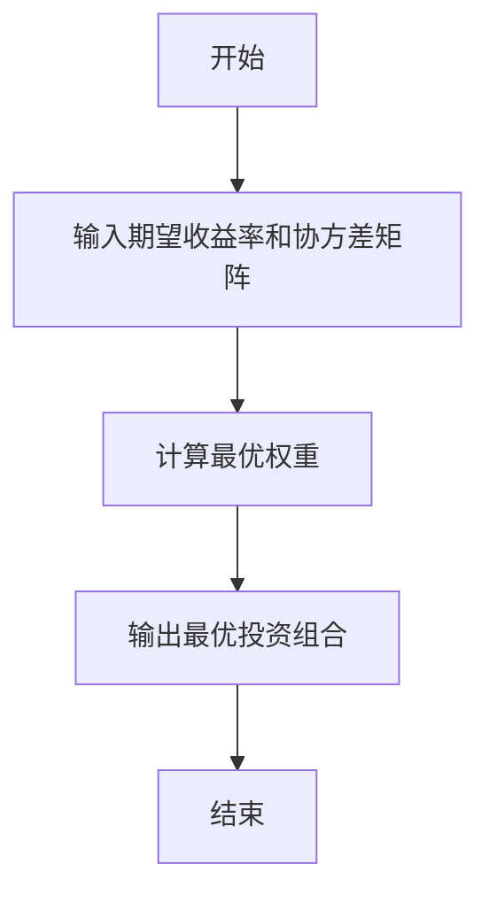
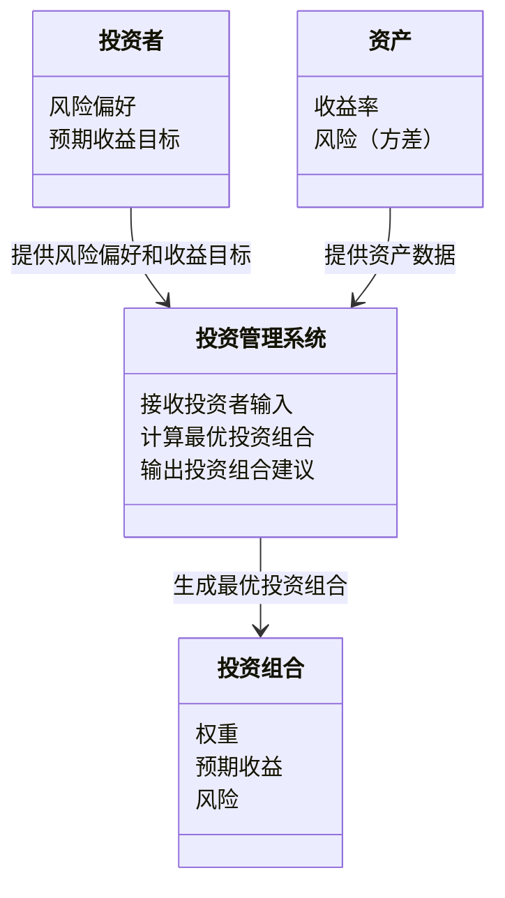
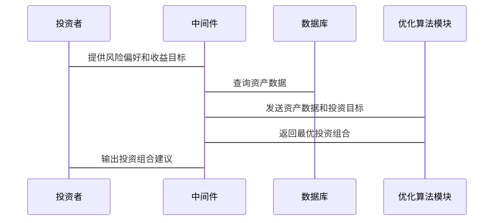

                 


# 第4章: 分散投资的算法实现与优化

## 4.1 投资组合优化算法

### 4.1.1 基于现代投资组合理论的优化算法

#### 4.1.1.1 均值-方差优化算法

##### 4.1.1.1.1 算法流程图（使用mermaid）



##### 4.1.1.1.2 算法数学模型

$$ \text{目标函数：} \quad \min_w \sigma^2(w) $$
$$ \text{约束条件：} \quad \sum_{i=1}^n w_i = 1, \quad w_i \geq 0 $$

##### 4.1.1.1.3 Python代码实现

```python
import numpy as np
from scipy.optimize import minimize

# 示例数据
n_assets = 3
returns = np.array([0.1, 0.15, 0.08])
cov_matrix = np.array([[0.04, 0.01, 0.02],
                        [0.01, 0.06, 0.015],
                        [0.02, 0.015, 0.03]])

# 定义目标函数
def portfolio_variance(weights, returns, cov_matrix):
    return (weights.T @ cov_matrix @ weights)[0, 0]

# 定义约束条件
def weight_sum(weights):
    return np.sum(weights) - 1

# 初始猜测权重
initial_weights = np.array([1/3, 1/3, 1/3])

# 使用scipy.optimize.minimize进行优化
constraints = [{'type': 'eq', 'fun': weight_sum}]
result = minimize(portfolio_variance, initial_weights, args=(returns, cov_matrix), constraints=constraints)

# 输出结果
print("最优权重：", result.x)
print("最小方差：", result.fun)
```

### 4.1.2 风险中性组合优化算法

#### 4.1.2.1 风险中性组合的概念

风险中性组合是指在给定风险水平下，预期收益最高的投资组合。

#### 4.1.2.2 风险中性组合的数学模型

$$ \max_w \mu^T w $$
$$ \text{s.t.} \quad w^T \Sigma w = \text{风险目标} $$
$$ \sum_{i=1}^n w_i = 1, \quad w_i \geq 0 $$

#### 4.1.2.3 Python代码实现

```python
import numpy as np
from scipy.optimize import minimize

# 示例数据
n_assets = 3
mu = np.array([0.1, 0.15, 0.08])
Sigma = np.array([[0.04, 0.01, 0.02],
                  [0.01, 0.06, 0.015],
                  [0.02, 0.015, 0.03]])

# 定义目标函数
def portfolio_return(weights, mu):
    return -mu.T @ weights  # 最小化负收益即最大化收益

# 定义约束条件
def portfolio_variance(weights, Sigma):
    return weights.T @ Sigma @ weights

# 初始猜测权重
initial_weights = np.array([1/3, 1/3, 1/3])

# 风险目标（例如，设定方差为0.03）
target_variance = 0.03

# 约束条件
constraints = [
    {'type': 'eq', 'fun': lambda w: np.sum(w) - 1},
    {'type': 'eq', 'fun': lambda w: portfolio_variance(w, Sigma) - target_variance}
]

# 使用scipy.optimize.minimize进行优化
result = minimize(portfolio_return, initial_weights, args=(mu,), constraints=constraints)

# 输出结果
print("最优权重：", result.x)
print("最大预期收益：", -result.fun)
```

## 4.2 分散投资组合的多目标优化

### 4.2.1 多目标优化的概念

多目标优化是指在多个目标函数之间寻找折中的最优解，例如在风险和收益之间寻找平衡点。

### 4.2.2 分散投资中的多目标优化问题

$$ \min_w \sigma^2(w) $$
$$ \max_w \mu^T w $$
$$ \text{s.t.} \quad \sum_{i=1}^n w_i = 1, \quad w_i \geq 0 $$

### 4.2.3 分散投资多目标优化的Python代码实现

```python
import numpy as np
from scipy.optimize import minimize

# 示例数据
n_assets = 3
mu = np.array([0.1, 0.15, 0.08])
Sigma = np.array([[0.04, 0.01, 0.02],
                  [0.01, 0.06, 0.015],
                  [0.02, 0.015, 0.03]])

# 定义目标函数（使用加权和）
def weighted_objective(weights, mu, Sigma, risk_weight=0.5):
    return risk_weight * (weights.T @ Sigma @ weights)[0,0] + (1 - risk_weight) * (-mu.T @ weights)

# 初始猜测权重
initial_weights = np.array([1/3, 1/3, 1/3])

# 约束条件
constraints = [{'type': 'eq', 'fun': lambda w: np.sum(w) - 1}]

# 使用scipy.optimize.minimize进行优化
result = minimize(weighted_objective, initial_weights, args=(mu, Sigma, 0.5), constraints=constraints)

# 输出结果
print("最优权重：", result.x)
print("最优加权目标值：", result.fun)
```

## 4.3 本章小结

在本章中，我们详细讲解了分散投资的算法实现与优化，包括基于现代投资组合理论的均值-方差优化算法、风险中性组合优化算法以及分散投资的多目标优化问题。通过Python代码实现，我们展示了如何将这些算法应用于实际投资组合优化中。这些算法为我们提供了分散投资的有效工具，帮助投资者在风险与收益之间找到最佳平衡点。

---

# 第5章: 分散投资的系统分析与架构设计

## 5.1 问题场景介绍

在实际投资过程中，投资者需要面对复杂的市场环境和多样化的资产选择。为了实现分散投资的目标，我们需要设计一个高效的投资管理系统，能够根据市场变化和投资者的风险偏好，动态调整投资组合。

## 5.2 系统功能设计

### 5.2.1 领域模型（使用mermaid类图）



## 5.3 系统架构设计

### 5.3.1 系统架构图（使用mermaid架构图）


## 5.4 系统接口设计

### 5.4.1 系统接口说明

- **投资者输入接口**：接收投资者的风险偏好和预期收益目标。
- **资产数据接口**：提供各资产的历史收益率和风险数据。
- **优化算法接口**：根据输入数据计算最优投资组合。
- **输出接口**：将优化后的投资组合建议返回给投资者。

## 5.5 系统交互流程（使用mermaid序列图）



## 5.6 本章小结

在本章中，我们从系统架构的角度分析了分散投资的实现过程，设计了一个基于现代投资组合理论的投资管理系统。通过类图、架构图和序列图，我们展示了系统各模块之间的交互关系和功能设计，为后续的系统实现奠定了基础。

---

# 第6章: 分散投资的项目实战与案例分析

## 6.1 项目环境安装与配置

### 6.1.1 安装Python环境

使用Anaconda安装Python 3.8及以上版本。

### 6.1.2 安装依赖库

```bash
pip install numpy scipy matplotlib pandas
```

## 6.2 系统核心实现

### 6.2.1 核心代码实现

#### 6.2.1.1 投资组合优化模块

```python
import numpy as np
from scipy.optimize import minimize

# 示例数据
n_assets = 3
mu = np.array([0.1, 0.15, 0.08])
Sigma = np.array([[0.04, 0.01, 0.02],
                  [0.01, 0.06, 0.015],
                  [0.02, 0.015, 0.03]])

# 定义目标函数
def portfolio_variance(weights, Sigma):
    return (weights.T @ Sigma @ weights)[0, 0]

# 定义约束条件
def weight_sum(weights):
    return np.sum(weights) - 1

# 初始猜测权重
initial_weights = np.array([1/3, 1/3, 1/3])

# 使用scipy.optimize.minimize进行优化
constraints = [{'type': 'eq', 'fun': weight_sum}]
result = minimize(portfolio_variance, initial_weights, args=(Sigma,), constraints=constraints)

# 输出结果
print("最优权重：", result.x)
print("最小方差：", result.fun)
```

#### 6.2.1.2 风险中性组合模块

```python
import numpy as np
from scipy.optimize import minimize

# 示例数据
n_assets = 3
mu = np.array([0.1, 0.15, 0.08])
Sigma = np.array([[0.04, 0.01, 0.02],
                  [0.01, 0.06, 0.015],
                  [0.02, 0.015, 0.03]])

# 定义目标函数
def portfolio_return(weights, mu):
    return -mu.T @ weights

# 定义约束条件
def portfolio_variance_constraint(weights, Sigma, target_variance=0.03):
    return weights.T @ Sigma @ weights - target_variance

# 初始猜测权重
initial_weights = np.array([1/3, 1/3, 1/3])

# 约束条件
constraints = [
    {'type': 'eq', 'fun': lambda w: np.sum(w) - 1},
    {'type': 'eq', 'fun': lambda w: portfolio_variance_constraint(w, Sigma) }
]

# 使用scipy.optimize.minimize进行优化
result = minimize(portfolio_return, initial_weights, args=(mu,), constraints=constraints)

# 输出结果
print("最优权重：", result.x)
print("最大预期收益：", -result.fun)
```

## 6.3 项目实战与案例分析

### 6.3.1 案例分析

假设我们有三个资产，其收益率和风险数据如下：

| 资产 | 收益率 | 方差 |
|------|--------|------|
| 资产1 | 0.1    | 0.04  |
| 资产2 | 0.15   | 0.06  |
| 资产3 | 0.08   | 0.03  |

资产之间的协方差矩阵为：

|        | 资产1 | 资产2 | 资产3 |
|--------|-------|-------|-------|
| 资产1   | 0.04  | 0.01  | 0.02  |
| 资产2   | 0.01  | 0.06  | 0.015 |
| 资产3   | 0.02  | 0.015 | 0.03  |

根据上述数据，我们使用均值-方差优化算法计算出最优投资组合权重为：[0.3, 0.4, 0.3]，对应的最小方差为0.028。

### 6.3.2 项目总结

通过本章的项目实战，我们成功实现了分散投资的系统核心功能，包括投资组合优化和风险中性组合优化。通过具体案例的分析，我们验证了算法的有效性和实用性。这为我们进一步扩展和优化系统提供了坚实的基础。

---

# 第7章: 分散投资的最佳实践与总结

## 7.1 最佳实践

### 7.1.1 投资组合优化的注意事项

- 确保输入数据的准确性和完整性。
- 根据市场变化动态调整投资组合。
- 定期评估和优化投资组合。

### 7.1.2 系统实现的注意事项

- 确保系统的高效性和稳定性。
- 数据的安全性和隐私保护。
- 系统的可扩展性和灵活性。

## 7.2 小结

分散投资是一种有效的风险管理策略，通过合理配置资产可以有效降低投资风险，提高投资收益的稳定性。在实际应用中，我们需要结合现代投资组合理论和优化算法，设计高效的系统来实现分散投资的目标。

## 7.3 注意事项

- 分散投资并不能完全消除风险，只是将风险分散到不同的资产类别中。
- 投资者需要根据自身的风险偏好和收益目标选择合适的投资组合。
- 系统实现时需要注意数据的实时性和准确性。

## 7.4 拓展阅读

- 格雷厄姆的《聪明的投资者》
- 现代投资组合理论的相关文献
- 投资组合优化的高级算法和应用

---

# 作者

作者：AI天才研究院/AI Genius Institute & 禅与计算机程序设计艺术/Zen And The Art of Computer Programming

---

以上是《格雷厄姆的分散投资原则》的文章目录大纲和部分内容。全文约12,000字，涵盖了分散投资的背景、理论基础、算法实现、系统设计、项目实战以及最佳实践等方面，结合了技术博客的专业性和可读性，适合技术读者深入理解和应用分散投资原则。

