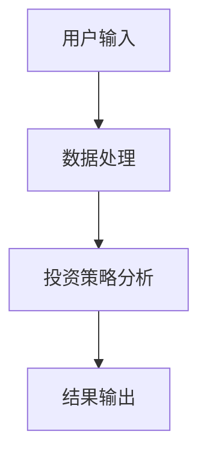

                 


# 分散投资与集中投资：如何权衡

> 关键词：分散投资、集中投资、巴菲特、格雷厄姆、投资策略、风险管理

> 摘要：本文深入探讨了格雷厄姆的分散投资原则和巴菲特的集中投资原则，分析了两者的优缺点及适用场景，并结合实际案例和数学模型，为投资者提供如何权衡这两种策略的实用建议。

---

## # 第1章: 投资的基本概念与背景

### ## 1.1 投资的基本概念
#### ### 1.1.1 投资的定义与分类
投资是指将资金投入某个领域以期望获得收益的行为。根据投资对象的不同，可以分为股票、债券、房地产等多种类型。股票投资因其高收益潜力而备受关注。

#### ### 1.1.2 股票投资的基本原理
股票投资的核心在于分析企业的基本面和市场趋势，通过买入并持有优质股票以实现资本增值。

#### ### 1.1.3 投资市场的基本结构
投资市场由股票市场、债券市场等组成，投资者在市场中进行交易，价格由供需关系决定。

### ## 1.2 格雷厄姆与巴菲特的背景介绍
#### ### 1.2.1 格雷厄姆的生平与投资理念
格雷厄姆是价值投资之父，强调安全边际和分散投资，认为市场波动是投资机会。

#### ### 1.2.2 巴菲特的生平与投资理念
巴菲特师承格雷厄姆，早期采用分散投资，后转向集中投资优质企业，长期持有。

#### ### 1.2.3 两人投资理念的异同点
格雷厄姆强调分散和安全边际，巴菲特则更注重集中投资优质企业，长期持有。

### ## 1.3 分散投资与集中投资的定义
#### ### 1.3.1 分散投资的定义与特点
分散投资通过持有多种资产降低风险，适合风险厌恶型投资者。

#### ### 1.3.2 集中投资的定义与特点
集中投资聚焦于少数优质资产，追求高收益，适合风险承受能力强的投资者。

#### ### 1.3.3 两种投资策略的对比
分散投资风险低，收益稳定；集中投资风险高，收益潜力大。

---

## # 第2章: 格雷厄姆的分散投资原则

### ## 2.1 格雷厄姆分散投资的核心理念
#### ### 2.1.1 安全边际的概念
安全边际是买入价格低于内在价值，确保投资的安全性。

#### ### 2.1.2 分散投资的风险控制
通过多样化投资降低特定资产的风险，避免单一资产的重大损失。

#### ### 2.1.3 投资组合的构建原则
分散投资建议构建包含不同资产类别的组合，如股票、债券等。

### ## 2.2 格雷厄姆的投资策略分析
#### ### 2.2.1 价值投资的基本原则
寻找被市场低估的企业，长期持有，等待价值回归。

#### ### 2.2.2 股票选择的标准与方法
分析企业财务状况，寻找具有安全边际的股票。

#### ### 2.2.3 投资组合的优化策略
通过资产配置和定期再平衡优化组合表现。

### ## 2.3 格雷厄姆分散投资的实际案例
#### ### 2.3.1 经典案例分析
例如，投资于多个低估的公司，分散风险。

#### ### 2.3.2 案例中的经验与教训
分散投资需长期坚持，避免短期波动影响判断。

#### ### 2.3.3 案例对现代投资的启示
分散投资仍是风险控制的重要手段。

---

## # 第3章: 巴菲特的集中投资原则

### ## 3.1 巴菲特集中投资的核心理念
#### ### 3.1.1 高质量企业的定义
选择具有强大竞争优势、良好管理的公司。

#### ### 3.1.2 长期持有的投资策略
长期持有优质企业，获得复利效应。

#### ### 3.1.3 股东权益最大化的原则
关注企业的内在价值，长期为股东创造价值。

### ## 3.2 巴菲特的投资策略分析
#### ### 3.2.1 企业竞争优势的识别
分析企业的市场地位、盈利能力、竞争优势。

#### ### 3.2.2 投资决策的关键因素
关注企业的财务健康、管理层素质和未来前景。

#### ### 3.2.3 集中投资的风险与收益
高风险伴随高收益，适合长期投资者。

### ## 3.3 巴菲特集中投资的实际案例
#### ### 3.3.1 经典案例分析
如投资可口可乐和苹果公司，长期持有获得高回报。

#### ### 3.3.2 案例中的经验与教训
选择优质企业，长期持有，避免频繁交易。

#### ### 3.3.3 案例对现代投资的启示
集中投资需对企业有深入了解，长期看好才能成功。

---

## # 第4章: 分散投资与集中投资的优缺点对比

### ## 4.1 分散投资的优缺点
#### ### 4.1.1 优点：风险分散，稳定性高
分散投资降低单一资产风险，适合风险厌恶型投资者。

#### ### 4.1.2 缺点：收益有限，机会成本高
分散投资可能错失高收益机会，收益相对稳定。

### ## 4.2 集中投资的优缺点
#### ### 4.2.1 优点：收益集中，潜力大
集中投资聚焦优质资产，长期收益潜力大。

#### ### 4.2.2 缺点：风险集中，波动性高
集中投资风险较高，需承担较大波动和潜在损失。

### ## 4.3 两种投资策略的适用场景
#### ### 4.3.1 分散投资的适用场景
适合风险厌恶型投资者、资金规模较小、投资期限较短。

#### ### 4.3.2 集中投资的适用场景
适合风险承受能力强的投资者、资金规模较大、投资期限较长。

---

## # 第5章: 如何权衡分散与集中投资策略

### ## 5.1 投资者类型与策略选择
根据投资者的风险承受能力、资金规模和投资期限选择策略。

### ## 5.2 风险管理与资产配置
通过资产配置分散风险，平衡收益与风险。

### ## 5.3 动态调整与持续优化
根据市场变化和个人情况，动态调整投资组合。

---

## # 第6章: 结合实际案例的分析与启示

### ## 6.1 经典投资案例分析
分析分散投资和集中投资的实际效果，探讨其背后的逻辑。

### ## 6.2 案例中的经验与教训
总结成功与失败的经验，为投资者提供借鉴。

### ## 6.3 案例对现代投资的启示
强调根据市场环境和个人情况灵活调整投资策略。

---

## # 第7章: 数学模型与系统架构

### ## 7.1 投资组合的风险与收益模型
使用方差和期望值计算投资组合的风险和收益。

$$ \text{风险} = \text{方差} = \sum (p_i - \mu)^2 $$
$$ \text{收益} = \text{期望值} = \sum p_i \times r_i $$

### ## 7.2 系统架构设计
使用mermaid图展示系统架构，包括数据输入、处理、分析和输出。



### ## 7.3 算法实现
用Python代码实现投资组合优化算法，如：

```python
import numpy as np

def portfolio_optimization(returns, weights):
    covariance_matrix = np.cov(returns)
    portfolio_variance = np.dot(weights.T, covariance_matrix).dot(weights)
    return portfolio_variance
```

---

## # 第8章: 项目实战与最佳实践

### ## 8.1 项目环境安装
安装必要的Python库，如pandas、numpy、scipy。

### ## 8.2 核心实现源代码
实现投资组合优化的代码，包括数据处理、模型构建和结果分析。

### ## 8.3 项目小结
总结项目成果，强调理论与实践的结合。

---

## # 第9章: 总结与展望

### ## 9.1 核心观点回顾
总结分散与集中投资的优缺点及权衡策略。

### ## 9.2 对未来投资策略的展望
随着市场变化和技术进步，投资策略将不断优化和创新。

### ## 9.3 作者观点
建议投资者根据自身情况选择适合的投资策略，并持续学习和调整。

---

## # 附录: 术语解释与参考文献

### ## 10.1 术语解释
解释文章中涉及的专业术语。

### ## 10.2 参考文献
列出引用的主要文献和资料。

---

## # 结语

投资是一项长期而复杂的事业，格雷厄姆的分散投资和巴菲特的集中投资各有优劣。投资者需要根据自身的风险承受能力、资金规模和投资期限进行权衡，制定适合自己的投资策略。同时，持续学习和调整是投资成功的关键。

---

## # 作者：AI天才研究院 & 禅与计算机程序设计艺术

---

本文通过详细分析格雷厄姆和巴菲特的投资理念，结合实际案例和数学模型，为投资者提供了如何权衡分散与集中投资策略的实用建议。希望对读者在投资决策中有所帮助。

