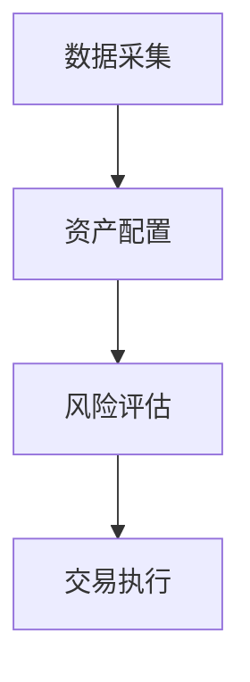

                 


# 格雷厄姆的分散投资原则：不要把鸡蛋放在一个篮子里

## 关键词：格雷厄姆、分散投资、投资组合、风险管理、价值投资

## 摘要：本文将详细探讨格雷厄姆的分散投资原则，分析其背后的数学原理、风险管理和实际应用。通过系统的理论分析和实际案例，帮助读者理解如何通过分散投资降低风险、实现稳健收益。

---

# 第1章: 格雷厄姆的投资理念与分散投资原则

## 1.1 格雷厄姆的投资哲学

### 1.1.1 价值投资的定义与核心理念

- **价值投资**：寻找市场低估的股票，长期持有，等待市场重新评估其价值。
- **核心理念**：安全边际与长期稳健收益。
- **安全边际**：通过购买低于内在价值的股票，降低投资风险。

### 1.1.2 格雷厄姆的投资风格与方法

- **买入并持有**：长期投资，避免频繁交易。
- **分散投资**：避免过度集中于单一股票或行业。
- **安全边际**：通过分析财务报表，寻找低估的股票。

### 1.1.3 分散投资在格雷厄姆理念中的地位

- 分散投资是格雷厄姆投资策略的重要组成部分。
- 通过分散投资降低特定风险（行业风险、公司风险等）。
- 分散投资与安全边际共同作用，确保投资组合的稳健性。

## 1.2 分散投资的核心原则

### 1.2.1 什么是分散投资

- **分散投资**：将资金分配到不同的资产类别、行业或地区，以降低风险。
- **风险分散**：通过多样化投资，降低特定资产或市场的波动性影响。

### 1.2.2 分散投资的数学原理

- **现代投资组合理论（MPT）**：通过分散投资，可以降低组合的整体风险。
- **方差与协方差**：资产之间的相关性影响分散投资的效果。

### 1.2.3 分散投资与风险管理

- **风险管理**：通过分散投资降低非系统性风险。
- **系统性风险**：无法通过分散投资降低，需通过资产配置应对。

## 1.3 格雷厄姆分散投资的实践案例

### 1.3.1 格雷厄姆的经典投资组合

- **股票与债券的配置比例**：格雷厄姆推荐将部分资金投资于债券，以降低风险。
- **行业分散**：避免集中投资于单一行业或市场。

### 1.3.2 分散投资在实际操作中的应用

- **具体案例**：假设投资组合中包括多种行业的股票和债券。
- **动态调整**：定期审视投资组合，根据市场变化进行调整。

### 1.3.3 分散投资的成功与失败案例

- **成功案例**：通过分散投资，避免单一资产的大幅波动。
- **失败案例**：过度分散可能导致收益不足。

## 1.4 本章小结

- 格雷厄姆的分散投资原则是其价值投资理念的重要组成部分。
- 通过分散投资，投资者可以降低特定风险，实现长期稳健收益。

---

# 第2章: 分散投资的数学模型与风险评估

## 2.1 投资组合的数学模型

### 2.1.1 投资组合的期望收益与方差

- **期望收益**：各资产的预期收益加权平均。
- **方差**：衡量投资组合收益的波动性。

$$ \text{方差} = \sum_{i=1}^{n} w_i^2 \sigma_i^2 + \sum_{i \neq j} w_i w_j \sigma_{ij} $$

### 2.1.2 现代投资组合理论（MPT）概述

- **有效投资组合**：在给定风险下，收益最大化；在给定收益下，风险最小化。
- **无风险资产与风险资产**：通过组合无风险资产和风险资产，构建有效前沿。

### 2.1.3 投资组合优化的数学公式

- **均值-方差优化**：通过优化算法，找到最优资产配置。

$$ \text{目标函数：} \min_w \sum_{i=1}^{n} w_i^2 \sigma_i^2 + \sum_{i \neq j} w_i w_j \sigma_{ij} $$
$$ \text{约束条件：} \sum_{i=1}^{n} w_i = 1 $$

## 2.2 风险分散的数学原理

### 2.2.1 单一资产的风险与收益

- **单一资产的波动性**：收益的不确定性。
- **相关性的影响**：资产之间的相关性降低分散效果。

### 2.2.2 多资产投资的风险分散效果

- **分散化的效果**：通过投资更多资产，降低组合的方差。

### 2.2.3 协方差与相关性对风险的影响

- **协方差**：衡量资产收益的相关性。
- **相关性系数**：取值范围在-1到1之间。

$$ \text{相关性系数} = \frac{\text{协方差}(x, y)}{\sigma_x \sigma_y} $$

## 2.3 分散投资的风险评估方法

### 2.3.1 风险价值（VaR）的定义与计算

- **VaR**：在一定置信水平下，可能的最大损失。
- **计算方法**：基于历史数据或统计模型。

### 2.3.2 风险调整后的收益（RAR）分析

- **RAR**：考虑风险后的收益表现。
- **公式**：$$ \text{RAR} = \frac{\text{超额收益}}{\text{风险}} $$

### 2.3.3 现代投资组合理论在分散投资中的应用

- **有效前沿**：通过MPT构建最优投资组合。

## 2.4 本章小结

- 分散投资的数学模型是理解其原理的关键。
- 通过MPT和VaR等工具，投资者可以科学评估和管理风险。

---

# 第3章: 分散投资的资产配置策略

## 3.1 资产配置的基本原则

### 3.1.1 资产配置的目标与约束

- **目标**：平衡风险与收益。
- **约束**：资金规模、投资期限、风险承受能力。

### 3.1.2 不同类型资产的风险与收益特征

- **股票**：高收益，高风险。
- **债券**：相对稳定，低收益。
- **现金**：流动性高，收益低。

### 3.1.3 资产配置的动态调整

- **定期再平衡**：根据市场变化调整配置比例。
- **动态调整**：根据个人风险偏好和市场环境调整。

## 3.2 格雷厄姆风格的分散投资策略

### 3.2.1 股票、债券与现金的配置比例

- **股票**：建议不超过投资组合的50%。
- **债券**：用于降低整体风险。
- **现金**：用于应对突发事件或市场机会。

### 3.2.2 行业与地区的分散配置

- **行业分散**：避免集中投资于单一行业。
- **地区分散**：投资于不同地区的资产，降低地域风险。

### 3.2.3 个股选择与投资集中度控制

- **个股选择**：寻找低估的股票。
- **集中度控制**：单一个股的投资比例不超过总资金的一定比例。

## 3.3 分散投资的动态再平衡

### 3.3.1 再平衡的定义与作用

- **再平衡**：定期调整投资组合，使其符合预定的资产配置比例。
- **作用**：降低风险，抓住新的投资机会。

## 3.4 本章小结

- 资产配置是分散投资的核心策略。
- 通过动态调整，投资者可以优化风险收益比。

---

# 第4章: 分散投资的风险管理与长期策略

## 4.1 分散投资的风险管理

### 4.1.1 风险分散与资产相关性

- **相关性的影响**：资产之间的相关性降低分散效果。
- **优化资产配置**：选择相关性较低的资产。

### 4.1.2 分散投资中的止损策略

- **止损点**：设定止损位，避免重大损失。
- **动态止损**：根据市场变化调整止损位。

### 4.1.3 心理因素对分散投资的影响

- **情绪化决策**：避免贪婪与恐惧影响投资决策。
- **纪律性**：坚持分散投资策略，避免短期波动干扰。

## 4.2 分散投资的长期策略

### 4.2.1 长期投资与复利效应

- **复利效应**：时间越长，收益越显著。
- **长期持有**：避免频繁交易，降低交易成本。

### 4.2.2 分散投资与市场周期

- **市场周期**：牛市与熊市中的分散投资策略。
- **逆周期投资**：在市场低谷时增加投资。

## 4.3 本章小结

- 分散投资需要科学的风险管理。
- 长期策略是实现稳健收益的关键。

---

# 第5章: 分散投资的实际案例与系统设计

## 5.1 分散投资的实际案例

### 5.1.1 2008年金融危机中的分散投资策略

- **案例背景**：金融危机期间，分散投资的组合表现优于集中投资。
- **分析**：分散投资降低了特定资产的风险。

### 5.1.2 科技股泡沫中的分散投资

- **案例背景**：2000年互联网泡沫破裂，分散投资的组合表现较好。
- **分析**：避免集中投资于单一行业。

## 5.2 分散投资的系统设计

### 5.2.1 系统模块设计

- **数据采集模块**：获取市场数据。
- **资产配置模块**：根据模型生成配置建议。
- **风险评估模块**：评估投资组合的风险。
- **交易执行模块**：执行交易指令。

### 5.2.2 系统功能流程

1. 数据采集模块获取市场数据。
2. 资产配置模块根据MPT生成最优配置。
3. 风险评估模块评估组合风险。
4. 交易执行模块根据建议执行交易。

### 5.2.3 系统架构图



## 5.3 本章小结

- 分散投资的实际案例展示了其有效性。
- 系统设计为实现分散投资提供了技术支持。

---

# 第6章: 分散投资的项目实战与优化

## 6.1 分散投资的项目实战

### 6.1.1 环境安装

- **工具安装**：安装数据分析工具（Python、Pandas、NumPy）。
- **数据获取**：获取历史市场数据。

### 6.1.2 核心代码实现

```python
import numpy as np
import pandas as pd

# 示例数据
returns = pd.DataFrame({
    '股票': [0.1, -0.05, 0.08, 0.02, -0.03],
    '债券': [0.03, 0.02, 0.04, 0.01, 0.05],
    '现金': [0, 0, 0, 0, 0]
})

# 计算协方差矩阵
cov_matrix = returns.cov()

print(cov_matrix)
```

### 6.1.3 案例分析与优化

- **案例分析**：分析投资组合的收益与风险。
- **优化策略**：根据优化结果调整资产配置。

## 6.2 分散投资的优化建议

### 6.2.1 定期再平衡

- **再平衡频率**：建议每季度或半年进行一次。
- **动态调整**：根据市场变化灵活调整。

### 6.2.2 风险监控与预警

- **风险指标**：监控VaR、波动率等指标。
- **预警机制**：当风险指标超过阈值时，触发预警。

## 6.3 本章小结

- 项目实战帮助投资者理解分散投资的实际操作。
- 优化建议为投资者提供了改进的方向。

---

# 第7章: 分散投资的总结与展望

## 7.1 分散投资的核心原则总结

- **分散投资**：降低特定风险，实现稳健收益。
- **风险管理**：通过再平衡和止损控制风险。
- **长期策略**：坚持价值投资，避免短期波动干扰。

## 7.2 分散投资的未来展望

- **智能化投资**：利用AI技术优化分散投资策略。
- **全球化资产配置**：随着市场的全球化，分散投资的范围将扩大。
- **风险管理的创新**：开发新的风险评估工具和方法。

## 7.3 本章小结

- 分散投资是实现稳健收益的重要策略。
- 未来，分散投资将更加智能化和全球化。

---

# 作者：AI天才研究院/AI Genius Institute & 禅与计算机程序设计艺术 /Zen And The Art of Computer Programming

