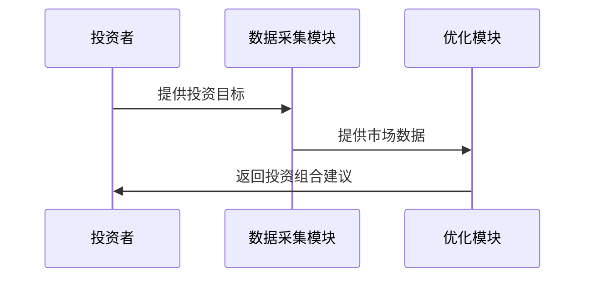

                 


# 分散投资原则：在全球化退潮中的新应用

---

## 关键词：分散投资，格雷厄姆，全球化退潮，投资组合，风险管理

---

## 摘要：  
本文深入探讨了格雷厄姆的分散投资原则在全球化退潮背景下的新应用。通过分析当前经济环境的变化，结合现代投资组合理论，本文提出了分散投资在资产配置、风险管理以及跨市场投资中的优化策略。文章从理论基础到实践应用，详细阐述了分散投资的数学模型、算法原理和系统架构，并通过实际案例分析展示了其在复杂经济环境中的有效性。

---

## 第一部分：分散投资原则的背景与现状

### 第1章：分散投资原则的背景与现状

#### 1.1 分散投资原则的起源与演变  
分散投资原则最早由本杰明·格雷厄姆提出，强调通过多样化投资来降低风险。随着全球化进程的加速，分散投资的理念逐渐从股票扩展到跨市场、跨资产的投资组合配置。然而，近年来全球化退潮趋势的出现，使得分散投资的策略需要重新调整以应对新的经济环境。  

#### 1.2 当前投资环境的复杂性  
当前全球经济面临多重挑战，包括地缘政治风险加剧、供应链重构、通货膨胀压力上升等。这些因素使得投资环境更加复杂，传统的分散投资策略面临新的考验。  

#### 1.3 分散投资原则的现实意义  
在不确定性增加的经济环境中，分散投资通过降低单一资产或市场的风险敞口，帮助投资者在波动中保持稳定性。本文将从理论与实践两个角度，探讨分散投资原则在全球化退潮中的新应用。

---

## 第二部分：分散投资原则的核心概念与联系

### 第2章：分散投资的核心概念与联系

#### 2.1 分散投资的核心原理  
分散投资的核心原理是通过将资金分配到不同的资产类别、行业或地区，降低投资组合的整体风险。以下是分散投资的关键点：  
- **风险分散**：通过投资相关性较低的资产，降低组合的整体波动性。  
- **资产配置**：根据市场环境调整各类资产的比例，以优化风险与收益的平衡。  
- **现代投资组合理论**：基于马科维茨的有效前沿理论，通过数学模型优化投资组合。  

#### 2.2 分散投资的核心要素  
以下是分散投资的核心要素：  
- **资产类别**：包括股票、债券、房地产、大宗商品等。  
- **地域分布**：全球化退潮背景下，投资者需要重新评估新兴市场与发达市场的权重。  
- **行业分布**：通过投资不同行业的资产，降低行业-specific风险。  

#### 2.3 分散投资与全球化退潮的关系  
全球化退潮背景下，地缘政治风险加剧，供应链本地化趋势明显。这些变化对分散投资的策略提出了新的要求：  
- **地域分散**：在新兴市场与发达市场之间重新平衡。  
- **行业分散**：重点布局受益于本地化供应链的行业。  
- **资产分散**：增加对实物资产（如房地产、大宗商品）的配置比例。  

---

## 第三部分：分散投资原则的数学模型与算法原理

### 第3章：分散投资的数学模型与算法原理

#### 3.1 分散投资的数学模型  
分散投资的核心是通过优化投资组合的风险与收益比。以下是相关数学模型：  

##### 3.1.1 投资组合风险的数学表达  
投资组合的风险可以用方差来衡量：  
$$\text{方差} = \sigma^2 = \mathbf{w}^T \mathbf{C} \mathbf{w}$$  
其中，$\mathbf{w}$是权重向量，$\mathbf{C}$是资产之间的协方差矩阵。  

##### 3.1.2 投资组合收益与风险的优化模型  
现代投资组合理论的目标是最小化风险（方差）的同时实现预期收益的最大化：  
$$\min_{\mathbf{w}} \mathbf{w}^T \mathbf{C} \mathbf{w}$$  
$$\text{subject to} \quad \mathbf{w}^T \mathbf{r} = \text{目标收益}$$  
其中，$\mathbf{r}$是资产的预期收益向量。  

##### 3.1.3 现代投资组合理论的核心公式  
马科维茨的有效前沿理论指出，最优投资组合是那些在给定风险水平下收益最大的组合，或在给定收益水平下风险最小的组合。其数学表达如下：  
$$\min_{\mathbf{w}} \mathbf{w}^T \mathbf{C} \mathbf{w}$$  
$$\text{subject to} \quad \mathbf{w}^T \mathbf{r} = \mu, \quad \mathbf{w}^T \mathbf{1} = 1$$  

#### 3.2 分散投资的算法原理  
以下是分散投资的算法步骤：  

##### 3.2.1 确定投资目标与约束条件  
- 确定预期收益目标。  
- 设定风险承受能力。  
- 确定投资期限与流动性需求。  

##### 3.2.2 构建资产配置模型  
- 收集历史收益与风险数据。  
- 计算资产之间的协方差矩阵。  
- 使用优化算法（如拉格朗日乘数法）求解最优投资组合。  

##### 3.2.3 实施与调整  
- 根据市场变化定期再平衡投资组合。  
- 评估投资绩效并优化配置。  

---

## 第四部分：分散投资原则的系统分析与架构设计

### 第4章：分散投资的系统分析与架构设计

#### 4.1 问题场景介绍  
全球化退潮背景下，投资者需要构建一个动态调整的分散投资系统，以应对不断变化的市场环境。  

#### 4.2 系统功能设计  
以下是系统功能模块：  
- **数据采集模块**：获取全球市场的实时数据。  
- **风险评估模块**：计算投资组合的方差与相关性。  
- **优化模块**：基于数学模型生成最优配置方案。  
- **监控与调整模块**：实时跟踪市场变化并动态调整组合。  

#### 4.3 系统架构设计  
以下是系统架构图：  


#### 4.4 系统接口设计  
- **输入接口**：投资者的投资目标与风险偏好。  
- **输出接口**：优化后的投资组合配置建议。  

#### 4.5 系统交互设计  
以下是系统交互序列图：  


---

## 第五部分：分散投资原则的项目实战

### 第5章：分散投资的项目实战

#### 5.1 环境安装  
- **工具安装**：安装Python、Pandas、NumPy等库。  
- **数据获取**：使用Yahoo Finance API获取历史数据。  

#### 5.2 核心实现  
以下是Python代码示例：  
```python
import numpy as np
import pandas as pd

# 假设我们有两支股票的数据
data = pd.DataFrame({
    '股票A': [100, 105, 98, 102, 104],
    '股票B': [80, 85, 82, 88, 86]
})

# 计算协方差矩阵
cov_matrix = data.cov()

# 计算权重
weights = np.array([0.5, 0.5])

# 计算投资组合的方差
portfolio_variance = weights.T @ cov_matrix @ weights
print("投资组合方差：", portfolio_variance)
```

#### 5.3 实际案例分析  
假设我们有两只股票，股票A和股票B，其历史收益分别为：  
- 股票A：年化收益8%，标准差12%  
- 股票B：年化收益6%，标准差8%  
两者相关系数为0.5。  

通过优化模型计算得出，最优投资组合为：  
- 股票A权重60%，股票B权重40%  
投资组合的预期收益为：  
$$0.6 \times 8\% + 0.4 \times 6\% = 7.2\%$$  
投资组合的标准差为：  
$$\sqrt{(0.6^2 \times 0.12^2) + (0.4^2 \times 0.08^2) + 2 \times 0.6 \times 0.4 \times 0.12 \times 0.08 \times 0.5} = 8.4\%$$  

---

## 第六部分：分散投资原则的最佳实践

### 第6章：分散投资的最佳实践

#### 6.1 小结  
分散投资是应对全球化退潮的有效策略，通过合理配置资产和地域，降低投资风险。  

#### 6.2 注意事项  
- 定期再平衡投资组合，避免单一资产过度集中。  
- 保持对全球经济趋势的关注，及时调整配置策略。  
- 选择可靠的金融工具与平台，确保数据的准确性和交易的便捷性。  

#### 6.3 拓展阅读  
- 马科维茨的《投资学精要》  
- 格雷厄姆的《 Intelligent Investor》  

---

## 作者：AI天才研究院/AI Genius Institute & 禅与计算机程序设计艺术/Zen And The Art of Computer Programming

---

通过本文的详细分析，我们可以看到，格雷厄姆的分散投资原则在全球化退潮背景下仍然具有重要的现实意义。通过科学的资产配置和动态调整策略，投资者可以在复杂多变的市场环境中实现稳健的投资回报。

