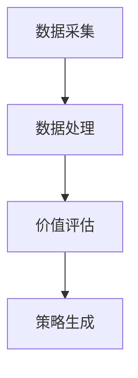

                 


# 格雷厄姆的可转换证券投资策略

## 关键词：格雷厄姆、可转换证券、投资策略、价值投资、安全边际

## 摘要：
本文系统地探讨了格雷厄姆的可转换证券投资策略，从其投资理念的背景出发，详细分析了可转换证券的定义、结构、类型及其投资价值。文章通过数学建模和系统架构设计，深入解析了格雷厄姆策略的核心要素，并结合实际案例进行了项目实战分析。文章最后总结了该策略的优势与不足，并提出了投资中的注意事项与未来研究方向。

---

# 第一部分: 格雷厄姆投资理念与可转换证券背景

## 第1章: 格雷厄姆投资理念概述

### 1.1 价值投资的起源与核心思想
- 价值投资的核心理念是寻找市场价格低于其内在价值的证券。
- 格雷厄姆强调安全边际的重要性，即购买价格远低于内在价值，以降低投资风险。
- 价值投资的两大原则：
  - 知道自己买入的是什么。
  - 买入的价格必须合理。

### 1.2 可转换证券的基本概念
- **可转换债券**：一种债券，允许持有人在特定条件下将其转换为公司股票。
- **可转换优先股**：一种优先股，同样具有可转换特性。
- **可转换证券的特性**：
  - 具有债券和股票的双重属性。
  - 提供固定收益，同时有机会获得股票上涨的收益。
  - 安全边际高，适合保守型投资者。

### 1.3 可转换证券的投资价值
- **风险与收益平衡**：可转换证券在市场波动中表现稳健，适合长期投资者。
- **市场流动性分析**：大多数可转换证券流动性较好，交易成本低。
- **定价模型**：通过期权定价模型（如Black-Scholes）评估其内在价值。

### 1.4 格雷厄姆可转换证券策略的核心要素
- **价值评估**：基于公司基本面分析，计算内在价值。
- **安全边际**：购买价格低于内在价值，确保盈利空间。
- **内在价值与市场价值对比**：识别被市场低估的投资机会。

---

## 第2章: 可转换证券的数学模型与定价分析

### 2.1 可转换债券的定价公式
- 基本定价公式：
  $$ P = C + \frac{S_0}{(1 + r)^T} $$
  其中：
  - \( P \)：可转换债券的市场价格。
  - \( C \)：债券的票面价值。
  - \( S_0 \)：转换股票的价格。
  - \( r \)：市场利率。
  - \( T \)：债券的期限。

### 2.2 期权定价模型在可转换证券中的应用
- Black-Scholes模型用于评估可转换证券的期权部分：
  $$ C = S_0 N(d_1) - K e^{-rT} N(d_2) $$
  其中：
  - \( N(d) \)：标准正态分布的累积分布函数。
  - \( d_1 = \frac{\ln(S_0/K) + (r + \sigma^2/2)T}{\sigma \sqrt{T}} \)
  - \( d_2 = d_1 - \sigma \sqrt{T} \)
  - \( \sigma \)：股票价格的波动率。

### 2.3 风险评估与收益分析
- 风险调整后的收益模型：
  $$ R = \frac{E(r) - r_f}{\sigma} $$
  其中：
  - \( E(r) \)：预期收益率。
  - \( r_f \)：无风险利率。
  - \( \sigma \)：收益波动率。

---

## 第3章: 格雷厄姆可转换证券策略的系统分析

### 3.1 系统架构设计
- **模块划分**：
  - 数据采集与处理模块。
  - 价值评估与策略生成模块。
- **系统功能设计**：
  - 数据采集：获取可转换证券的市场数据。
  - 价值评估：计算内在价值与市场价值。
  - 策略生成：基于安全边际生成投资策略。
- **系统架构图**：
  ```mermaid
  graph TD
      A[数据采集] --> B[数据处理]
      B --> C[价值评估]
      C --> D[策略生成]
  ```

---

## 第4章: 格雷厄姆可转换证券策略的项目实战

### 4.1 项目环境与工具安装
- **Python环境搭建**：使用Anaconda安装Python 3.8及以上版本。
- **数据分析工具**：安装Pandas、NumPy、Matplotlib等库。
- **数据源准备**：获取可转换证券的历史数据。

### 4.2 核心算法实现
- **价值评估函数**：
  ```python
  def intrinsic_value(price, coupon, conversion_price, stock_price, years):
      return coupon * (1 - (1/(1 + r)**years)) + (price / (1 + r)**years)
  ```

### 4.3 代码解读与案例分析
- **案例分析**：以某可转换债券为例，计算其内在价值与市场价值。
- **策略生成**：基于安全边际生成买入信号。

---

## 第5章: 总结与展望

### 5.1 策略的优缺点
- **优点**：风险较低，收益稳定。
- **缺点**：收益相对有限，不适合激进投资者。

### 5.2 投资中的注意事项
- 定期评估市场变化。
- 结合公司基本面分析。

### 5.3 未来研究方向
- 研究可转换证券在不同市场环境下的表现。
- 结合机器学习优化投资策略。

---

## 附录
### 附录A: 数学公式
- Black-Scholes模型：
  $$ C = S_0 N(d_1) - K e^{-rT} N(d_2) $$

### 附录B: 系统架构图


---

## 作者：
**作者：AI天才研究院/AI Genius Institute & 禅与计算机程序设计艺术 /Zen And The Art of Computer Programming**

---

通过以上思考，我们可以系统地理解格雷厄姆的可转换证券投资策略，并将其应用于实际投资中。

