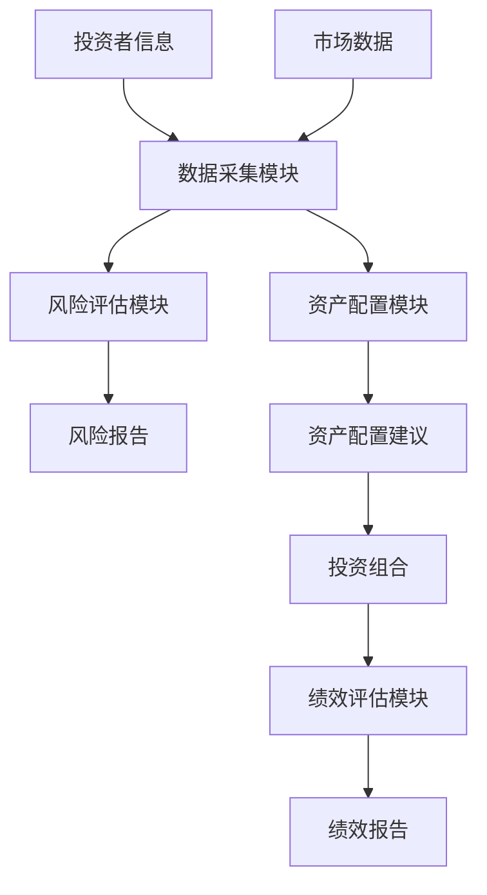
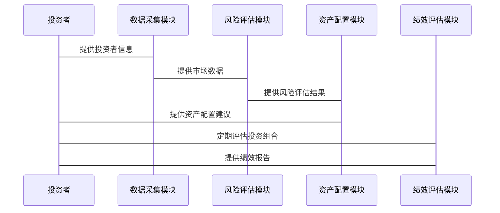

                 


```markdown
# 格雷厄姆的多元化投资理念：不要把鸡蛋放在一个篮子里

> 关键词：投资理念，多元化投资，风险管理，投资组合，资产配置，价值投资

> 摘要：本文深入探讨了格雷厄姆的多元化投资理念，从投资的基本概念到现代投资组合理论，再到实际的系统架构设计与项目实战，系统地分析了如何通过科学的资产配置和风险管理来实现投资目标。文章结合理论与实践，为读者提供了一套完整的多元化投资解决方案。

---

# 第一部分: 投资的基础与多元化理念

## 第1章: 投资的基本概念与风险

### 1.1 投资的基本概念

#### 1.1.1 投资的定义与分类
投资是指将资金或资源投入到某种资产或项目中，以期在未来获得收益或资本增值的行为。根据投资对象的不同，可以将投资分为以下几类：
- **金融投资**：包括股票、债券、基金等金融资产。
- **实物投资**：包括房地产、黄金等实物资产。
- **无形投资**：包括专利、商标等无形资产。

#### 1.1.2 投资的基本原则
1. **分散投资**：不要将所有资金投入到单一资产中，以降低风险。
2. **长期持有**：投资应以长期为目标，避免频繁交易。
3. **价值投资**：选择具有内在价值的资产进行投资。

#### 1.1.3 投资的三大目标
1. **资本增值**：通过资产增值获得收益。
2. **收入获取**：通过投资获取稳定的现金流。
3. **保值与风险控制**：确保资金安全，避免重大损失。

### 1.2 风险与收益的关系

#### 1.2.1 风险的定义与分类
风险是指在投资过程中，由于不确定因素导致投资收益低于预期甚至出现损失的可能性。风险可以分为以下几种：
- **市场风险**：由于市场波动导致的资产价格下跌风险。
- **流动性风险**：资产难以快速变现的风险。
- **信用风险**：债务人违约的风险。

#### 1.2.2 风险与收益的正相关性
一般来说，风险与收益是正相关的。高风险的资产通常具有较高的预期收益，而低风险的资产则收益相对较低。

#### 1.2.3 投资中的风险厌恶与风险偏好
投资者的风险态度会影响其投资选择。风险厌恶的投资者倾向于选择低风险、稳定收益的资产，而风险偏好的投资者则愿意承担更高的风险以追求更高的收益。

### 1.3 投资的基本原理

#### 1.3.1 资产配置的基本原理
资产配置是指将资金分配到不同的资产类别中，以实现风险与收益的最优平衡。常见的资产配置方法包括：
- **固定比例配置**：将资金按固定比例分配到不同资产类别中。
- **动态调整配置**：根据市场变化定期调整资产配置比例。

#### 1.3.2 投资组合的构建逻辑
投资组合是指一系列资产的集合，通过合理配置不同资产来分散风险并提高收益。构建投资组合的关键步骤包括：
1. 确定投资目标和风险承受能力。
2. 选择合适的资产类别。
3. 确定各资产的配置比例。
4. 定期监控和调整投资组合。

#### 1.3.3 投资的长期与短期目标
- **长期目标**：实现资产的长期增值，通常与退休规划、财富积累等目标相关。
- **短期目标**：满足特定的财务需求，如购买房产、教育支出等。

### 1.4 本章小结
本章从投资的基本概念入手，详细介绍了风险与收益的关系，以及资产配置的基本原理。通过理解这些基础概念，读者可以更好地把握多元化投资的核心理念。

---

## 第2章: 多元化投资的核心理念

### 2.1 多元化投资的定义

#### 2.1.1 多元化投资的内涵
多元化投资是指通过将资金分配到不同的资产类别、行业或地区，以降低投资风险并提高收益的一种投资策略。其核心在于通过分散投资来减少非系统性风险。

#### 2.1.2 多元化投资的外延
多元化投资不仅仅局限于股票和债券，还可以包括房地产、 commodities（大宗商品）、货币市场工具等多种资产。

### 2.2 多元化投资的原理

#### 2.2.1 投资组合理论
投资组合理论（Portfolio Theory）是多元化投资的理论基础。它指出，通过合理配置不同资产，可以有效降低投资组合的整体风险，同时提高收益。

#### 2.2.2 风险分散化机制
多元化投资的核心在于分散风险。通过将资金分配到相关性较低的资产中，可以降低投资组合的整体波动性。

#### 2.2.3 资产类别的相关性
资产的相关性是衡量不同资产价格波动关系的重要指标。相关性较低的资产组合可以更有效地分散风险。

### 2.3 多元化投资的优势

#### 2.3.1 分散风险的优势
通过多元化投资，投资者可以将风险分散到不同的资产中，从而降低整体投资组合的波动性。

#### 2.3.2 提高收益的潜力
多元化投资可以通过配置不同类型的资产来捕捉不同的收益来源，从而提高整体收益。

#### 2.3.3 抗市场波动的能力
多元化投资能够有效应对市场的周期性波动，避免因单一资产价格大幅波动而导致的重大损失。

### 2.4 本章小结
本章详细阐述了多元化投资的核心理念，包括其定义、原理及优势。通过理解这些内容，读者可以更好地掌握如何通过分散投资来降低风险并提高收益。

---

## 第3章: 格雷厄姆的投资理念与多元化策略

### 3.1 格雷厄姆的生平与投资思想

#### 3.1.1 格雷厄姆的生平简介
本杰明·格雷厄姆（Benjamin Graham）是20世纪著名的投资学家，被誉为“价值投资之父”。他的投资理念对现代投资理论产生了深远影响。

#### 3.1.2 格雷厄姆的价值投资理念
格雷厄姆主张以低于内在价值的价格买入优质的资产，并长期持有，以实现资本增值。

#### 3.1.3 格雷厄姆的长期投资策略
格雷厄姆强调长期投资的重要性，认为短期市场的波动不应影响长期的投资决策。

### 3.2 格雷厄姆的多元化投资策略

#### 3.2.1 多元化投资的必要性
格雷厄姆认为，通过多元化投资可以降低风险，避免因单一资产价格波动而导致的重大损失。

#### 3.2.2 格雷厄姆的资产配置方法
格雷厄姆建议投资者将资金分配到不同的资产类别中，如股票、债券、房地产等，以实现风险与收益的最优平衡。

#### 3.2.3 格雷厄姆的分散投资实践
格雷厄姆强调分散投资的重要性，建议投资者避免将所有资金投入到单一资产中。

### 3.3 格雷厄姆投资理念的现代应用

#### 3.3.1 格雷厄姆理念的演变
随着时间的推移，格雷厄姆的投资理念不断发展，逐渐与现代投资理论相结合。

#### 3.3.2 现代投资组合理论与格雷厄姆理念的结合
现代投资组合理论（MPT）与格雷厄姆的理念在资产配置和风险管理方面有相似之处。

#### 3.3.3 格雷厄姆理念在机构投资中的应用
许多机构投资者在构建投资组合时，会参考格雷厄姆的价值投资理念，以实现长期稳健的收益。

### 3.4 本章小结
本章从格雷厄姆的生平与投资思想出发，详细介绍了他的多元化投资策略及其现代应用。通过这些内容，读者可以更好地理解如何将格雷厄姆的理念应用于实际投资中。

---

## 第4章: 投资组合管理与风险管理

### 4.1 投资组合管理的基本框架

#### 4.1.1 投资组合管理的目标
投资组合管理的目标是通过科学的配置和调整，实现风险与收益的最优平衡。

#### 4.1.2 投资组合管理的流程
1. 确定投资目标和风险承受能力。
2. 选择合适的资产类别。
3. 确定各资产的配置比例。
4. 定期监控和调整投资组合。

#### 4.1.3 投资组合管理的关键要素
- **资产配置**：确定各资产的权重。
- **风险控制**：监控和管理投资组合的风险。
- **绩效评估**：定期评估投资组合的收益与风险。

### 4.2 风险管理的核心策略

#### 4.2.1 风险的识别与评估
1. 识别潜在的风险来源。
2. 评估各风险对投资组合的影响。

#### 4.2.2 风险的量化与分析
1. 计算各资产的风险指标，如波动率、夏普比率等。
2. 分析资产之间的相关性。

#### 4.2.3 风险的控制与应对
1. 通过分散投资降低非系统性风险。
2. 使用衍生工具对冲风险。

### 4.3 投资组合的风险调整收益分析

#### 4.3.1 风险调整收益的定义
风险调整收益是指在考虑投资风险的基础上，评估投资组合的实际收益。

#### 4.3.2 风险调整收益的计算方法
1. 计算投资组合的预期收益。
2. 计算投资组合的风险指标，如波动率。
3. 对比不同投资组合的风险调整收益。

#### 4.3.3 风险调整收益的实际应用
1. 评估不同投资策略的效果。
2. 选择风险调整收益最优的投资组合。

### 4.4 本章小结
本章从投资组合管理与风险管理的角度，详细介绍了如何通过科学的管理策略来实现投资目标。通过这些内容，读者可以更好地掌握投资组合管理的核心方法。

---

## 第5章: 现代投资组合理论与实践

### 5.1 现代投资组合理论（MPT）的概述

#### 5.1.1 MPT的基本假设
现代投资组合理论假设投资者是理性的，追求收益最大化，同时厌恶风险。

#### 5.1.2 MPT的核心思想
通过分散投资，可以降低投资组合的整体风险，同时提高收益。

#### 5.1.3 MPT的数学模型
MPT的核心是均值-方差优化模型，通过优化资产配置比例，实现风险与收益的最优平衡。

### 5.2 投资组合的优化与构建

#### 5.2.1 投资组合优化的目标
1. 最大化预期收益，同时最小化风险。
2. 根据投资者的偏好，找到最优资产配置比例。

#### 5.2.2 资产配置的数学模型
使用均值-方差模型，计算各资产的预期收益、方差和协方差，构建优化的投资组合。

#### 5.2.3 投资组合构建的步骤
1. 确定可选资产及其预期收益和风险。
2. 计算各资产的相关性。
3. 使用优化算法确定最优资产配置比例。

### 5.3 投资组合的风险与收益的平衡

#### 5.3.1 风险与收益的权衡
投资者需要在风险与收益之间找到平衡点，以实现最优投资效果。

#### 5.3.2 风险承受能力的评估
根据投资者的财务状况和风险偏好，评估其风险承受能力。

#### 5.3.3 投资组合的风险调整收益
根据投资者的风险承受能力，调整投资组合的配置比例，以实现风险与收益的最佳平衡。

### 5.4 本章小结
本章从现代投资组合理论的角度，详细介绍了投资组合的优化与构建方法。通过这些内容，读者可以更好地理解如何在实际投资中应用MPT。

---

## 第6章: 系统分析与架构设计

### 6.1 投资组合管理系统的需求分析

#### 6.1.1 系统目标
构建一个智能化的投资组合管理系统，帮助投资者实现资产配置和风险管理。

#### 6.1.2 系统功能需求
1. 资产配置建议。
2. 风险评估与预警。
3. 投资组合优化。
4. 绩效评估与报告。

#### 6.1.3 系统边界与接口
1. 输入：市场数据、投资者信息。
2. 输出：资产配置建议、风险评估报告。

### 6.2 系统架构设计

#### 6.2.1 系统功能模块
1. 数据采集模块：获取市场数据和投资者信息。
2. 风险评估模块：评估投资组合的风险。
3. 资产配置模块：优化资产配置比例。
4. 绩效评估模块：评估投资组合的收益与风险。

#### 6.2.2 系统架构图


#### 6.2.3 系统交互图


### 6.3 系统实现与测试

#### 6.3.1 系统实现
1. 数据采集模块：从多个数据源获取市场数据和投资者信息。
2. 风险评估模块：使用MPT模型评估投资组合的风险。
3. 资产配置模块：基于优化算法确定资产配置比例。
4. 绩效评估模块：定期评估投资组合的收益与风险。

#### 6.3.2 系统测试
1. 功能测试：确保各模块功能正常。
2. 性能测试：测试系统在高负载下的运行情况。
3. 安全测试：确保系统数据的安全性。

### 6.4 本章小结
本章从系统分析与架构设计的角度，详细介绍了投资组合管理系统的构建过程。通过这些内容，读者可以更好地理解如何将理论应用于实际系统中。

---

## 第7章: 项目实战与案例分析

### 7.1 环境安装与配置

#### 7.1.1 系统环境
1. 操作系统：Windows/Mac/Linux
2. 编程语言：Python 3.8+
3. 开发工具：Jupyter Notebook、VS Code
4. 第三方库：numpy、pandas、scipy、matplotlib

#### 7.1.2 数据获取
1. 从金融数据供应商获取市场数据。
2. 确定投资者信息，如风险承受能力。

### 7.2 核心代码实现

#### 7.2.1 数据预处理
```python
import numpy as np
import pandas as pd

# 假设我们有一个包含资产收益率的数据框returns
returns = pd.DataFrame({
    '资产1': [0.05, 0.03, -0.02, 0.07, 0.01],
    '资产2': [0.04, 0.06, -0.03, 0.02, 0.05],
    '资产3': [0.06, 0.02, -0.01, 0.05, 0.03]
})
```

#### 7.2.2 风险评估与优化
```python
import scipy.optimize as opt

# 定义优化目标函数
def objective(weights, returns):
    variance = np.dot(weights.T, np.dot(returns.cov(), weights))
    return variance

# 定义约束条件
cons = ({'type': 'eq', 'fun': lambda w: np.sum(w) - 1.0})

# 优化资产配置
weights = opt.minimize(objective, np.array([1/3, 1/3, 1/3]), 
                        constraints=cons, method='SLSQP')
```

#### 7.2.3 投资组合优化结果
```python
print("最优资产配置比例：", weights.x)
print("最小方差：", weights.fun)
```

### 7.3 投资组合的风险调整收益分析

#### 7.3.1 风险调整收益的计算
```python
import matplotlib.pyplot as plt

# 绘制投资组合的收益与风险关系图
risk = np.sqrt(weights.x.T @ returns.cov() @ weights.x)
return_ = weights.x.T @ returns.mean()

plt.scatter(risk, return_)
plt.xlabel('风险')
plt.ylabel('收益')
plt.title('风险-收益图')
plt.show()
```

#### 7.3.2 投资组合的风险调整收益比较
```python
# 假设还有其他资产配置方案
其他方案的风险与收益
```

### 7.4 投资组合的定期调整

#### 7.4.1 系统自动调整
```python
# 定期重新优化资产配置
def定期调整():
    # 获取最新的市场数据
    # 重新计算最优资产配置
    # 更新投资组合
    pass
```

#### 7.4.2 调整后的结果分析
```python
# 分析调整后的投资组合表现
```

### 7.5 案例分析与总结

#### 7.5.1 投资组合的构建过程
1. 确定投资者的风险承受能力。
2. 选择合适的资产类别。
3. 确定各资产的配置比例。
4. 定期监控和调整投资组合。

#### 7.5.2 案例分析
假设投资者A的风险承受能力较低，选择配置60%债券、30%股票、10%房地产。通过系统计算，最优资产配置比例为债券50%、股票30%、房地产20%。

#### 7.5.3 投资组合的绩效评估
1. 定期评估投资组合的收益与风险。
2. 根据评估结果调整资产配置比例。

### 7.6 本章小结
本章通过实际的项目实战，详细介绍了投资组合管理系统的实现过程。通过案例分析，读者可以更好地理解如何将理论应用于实际投资中。

---

## 第8章: 总结与展望

### 8.1 本章总结

#### 8.1.1 核心内容回顾
本文从投资的基本概念入手，详细介绍了格雷厄姆的多元化投资理念，并结合现代投资组合理论，探讨了投资组合的构建与管理方法。通过系统分析与项目实战，展示了如何将理论应用于实际投资中。

#### 8.1.2 投资理念的总结
多元化投资是降低风险、提高收益的有效策略。通过科学的资产配置和风险管理，投资者可以实现长期稳健的投资收益。

### 8.2 未来展望

#### 8.2.1 投资理念的演变
随着市场的变化和理论的发展，投资理念将不断演变，投资者需要不断学习和调整。

#### 8.2.2 投资技术的创新
人工智能、大数据等技术的不断发展，将为投资组合管理带来新的机遇和挑战。

#### 8.2.3 投资教育的重要性
投资者需要通过不断学习，提高自身的投资能力，以应对复杂的市场环境。

### 8.3 本章小结
本章总结了全文的核心内容，并对未来的发展趋势进行了展望。通过这些内容，读者可以更好地理解投资的长期性与复杂性。

---

## 附录: 参考文献与进一步阅读

### 1. 格雷厄姆的经典著作
1. 《股票作手回忆录》
2. 《投资的艺术》

### 2. 现代投资组合理论的经典文献
1. 哈里·马科维茨（Harry Markowitz）的《投资组合理论》

### 3. 实用投资指南
1. 《巴菲特的选股艺术》
2. 《投资最重要的简单真理》

---

## 作者：AI天才研究院/AI Genius Institute & 禅与计算机程序设计艺术 /Zen And The Art of Computer Programming
```

