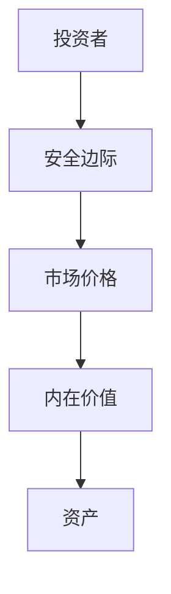
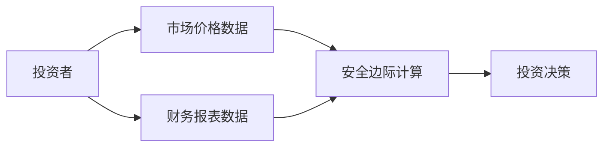

                 


# 格雷厄姆的安全边际概念

## 关键词：安全边际，投资策略，价值投资，风险管理，市场定价

## 摘要：格雷厄姆的安全边际概念是价值投资的重要理论，通过分析资产的内在价值和市场价格的差异，帮助投资者避免风险并实现稳健投资。本文详细探讨了安全边际的核心概念、计算方法、应用场景及其在现代投资中的意义。

# 第1章: 安全边际的背景与核心概念

## 1.1 安全边际的起源与背景
### 1.1.1 格雷厄姆投资理论的起源
本世纪初，Benjamin Graham提出了价值投资的概念，强调基于内在价值进行投资。他的理论奠定了现代价值投资的基础，其中安全边际是其核心思想之一。

### 1.1.2 安全边际概念的提出背景
20世纪30年代经济大萧条期间，Graham观察到市场的非理性波动，意识到投资者需要一种方法来抵御市场的短期波动，从而提出安全边际的概念。

### 1.1.3 安全边际在投资中的重要性
安全边际为投资者提供了一个缓冲区，确保在市场价格波动时仍能获得正收益，从而降低了投资风险。

## 1.2 安全边际的核心概念
### 1.2.1 安全边际的定义
安全边际是指资产的内在价值与市场价格之间的差额，这个差额越大，投资的安全性越高。

### 1.2.2 安全边际的核心要素
- 内在价值：资产在合理估值下的真实价值。
- 市场价格：资产在市场上的当前价格。
- 安全边际：内在价值与市场价格的差额。

### 1.2.3 安全边际与投资风险的关系
安全边际越大，投资风险越低，因为市场价格下跌的空间有限，不会轻易跌破内在价值。

## 1.3 安全边际与其他投资概念的对比
### 1.3.1 与基本面分析的对比
基本面分析侧重于分析公司的财务状况，而安全边际更注重价格与价值的差异。

### 1.3.2 与技术分析的对比
技术分析关注价格走势和交易量，而安全边际关注价格与内在价值的关系。

### 1.3.3 与现代投资组合理论的对比
现代投资组合理论强调分散投资以降低风险，而安全边际强调选择低估资产以降低个体风险。

## 1.4 安全边际在投资中的应用前景
### 1.4.1 安全边际的潜在应用场景
- 个股选择
- 投资组合构建
- 风险管理

### 1.4.2 投资者采用安全边际的优势
- 降低投资风险
- 提高投资收益
- 抵御市场波动

### 1.4.3 安全边际应用的挑战与机遇
- 挑战：市场波动和信息不对称
- 机遇：在市场低估时期获得超额收益

## 1.5 本章小结
安全边际是价值投资的重要工具，通过合理评估资产的内在价值和市场价格的差异，帮助投资者在波动的市场中实现稳健收益。

# 第2章: 安全边际的核心原理

## 2.1 安全边际的原理分析
### 2.1.1 安全边际的计算方法
安全边际 = 内在价值 - 市场价格

### 2.1.2 安全边际的内在价值模型
内在价值 = 现金流的现值

### 2.1.3 安全边际与市场定价的关系
当市场价格低于内在价值时，安全边际为正，投资具有安全性。

## 2.2 安全边际的属性特征对比
### 2.2.1 不同投资策略的属性对比
| 投资策略 | 安全边际 | 技术分析 | 现代投资组合理论 |
|----------|----------|----------|------------------|
| 核心     | 价格与价值差异 | 价格走势 | 分散投资         |

### 2.2.2 安全边际在不同市场环境下的表现
- 热门市场：安全边际小，投资风险高
- 冷静市场：安全边际大，投资机会多

## 2.3 安全边际的ER实体关系图


## 2.4 本章小结
通过分析安全边际的计算方法和内在价值模型，理解其在投资中的核心作用，以及在不同市场环境下的表现。

# 第3章: 安全边际的算法原理

## 3.1 安全边际的算法流程
### 3.1.1 安全边际的基本算法
1. 计算资产的内在价值
2. 确定市场价格
3. 计算安全边际 = 内在价值 - 市场价格

### 3.1.2 安全边际的优化算法
1. 使用DCF模型计算内在价值
2. 结合市场情绪调整安全边际
3. 定期更新内在价值和市场价格

## 3.2 安全边际的数学模型与公式
### 3.2.1 安全边际的计算公式
$$ \text{安全边际} = \text{内在价值} - \text{市场价格} $$

### 3.2.2 内在价值的计算公式
$$ \text{内在价值} = \sum \frac{\text{现金流}}{(1 + r)^t} $$

### 3.2.3 示例
假设某公司内在价值为100，市场价格为80，则安全边际为20。

## 3.3 安全边际的Python实现
```python
def calculate_margin_of_safety(intrinsic_value, market_price):
    return intrinsic_value - market_price

# 示例
intrinsic_value = 100
market_price = 80
margin = calculate_margin_of_safety(intrinsic_value, market_price)
print(f"安全边际为: {margin}")
```

## 3.4 本章小结
通过算法流程和公式推导，理解安全边际的计算方法及其在投资中的应用。

# 第4章: 安全边际的系统分析

## 4.1 安全边际的系统架构
### 4.1.1 系统功能设计
- 内在价值计算模块
- 市场价格获取模块
- 安全边际计算模块

### 4.1.2 系统架构设计


## 4.2 安全边际的系统交互
### 4.2.1 系统接口设计
- 获取市场价格接口
- 计算内在价值接口
- 计算安全边际接口

### 4.2.2 系统交互流程
1. 投资者输入目标资产
2. 系统获取市场价格和财务数据
3. 系统计算内在价值和安全边际
4. 系统输出投资建议

## 4.3 本章小结
通过系统架构和交互设计，理解安全边际在投资系统中的应用。

# 第5章: 安全边际的项目实战

## 5.1 项目环境安装
- 安装Python和相关库（如pandas、numpy）
- 数据获取工具（如Yahoo Finance API）

## 5.2 核心代码实现
### 5.2.1 获取数据
```python
import pandas as pd
import numpy as np

# 获取股票数据
def get_stock_data(ticker):
    # 示例数据获取
    return pd.DataFrame({'price': [100, 90, 80, 70], 'cash_flow': [50, 60, 70, 80]})
```

### 5.2.2 计算内在价值
```python
def calculate_intrinsic_value(data, discount_rate=0.1):
    cash_flows = data['cash_flow']
    present_values = []
    for i in range(len(cash_flows)):
        present_value = cash_flows[i] / (1 + discount_rate) ** i
        present_values.append(present_value)
    return np.sum(present_values)
```

### 5.2.3 计算安全边际
```python
def calculate_margin_of_safety(intrinsic_value, market_price):
    return intrinsic_value - market_price

# 示例计算
data = get_stock_data('ABC')
iv = calculate_intrinsic_value(data)
mp = data['price'][-1]
margin = calculate_margin_of_safety(iv, mp)
print(f"安全边际为: {margin}")
```

## 5.3 项目小结
通过实际案例分析，验证安全边际在投资决策中的有效性。

# 第6章: 安全边际的最佳实践与注意事项

## 6.1 最佳实践
- 定期评估资产的内在价值和市场价格
- 结合市场环境调整安全边际
- 多资产分散投资

## 6.2 注意事项
- 数据的准确性和及时性
- 模型的适用性和限制
- 市场波动和不可预见风险

## 6.3 拓展阅读
- 《The Intelligent Investor》
- 现代投资组合理论相关书籍

## 6.4 本章小结
总结安全边际的应用注意事项，并提供进一步学习的方向。

# 第7章: 总结

## 7.1 核心观点回顾
安全边际是价值投资的重要工具，帮助投资者在波动的市场中实现稳健收益。

## 7.2 未来展望
随着市场的发展和技术的进步，安全边际的应用将更加广泛和深入。

## 7.3 本章小结
重申安全边际的重要性和应用前景，为投资者提供实践指导。

# 附录: 关键术语表
- 内在价值：资产的真实价值
- 市场价格：资产的当前市场价
- 安全边际：内在价值与市场价格的差额

# 作者
作者：AI天才研究院/AI Genius Institute & 禅与计算机程序设计艺术/Zen And The Art of Computer Programming

