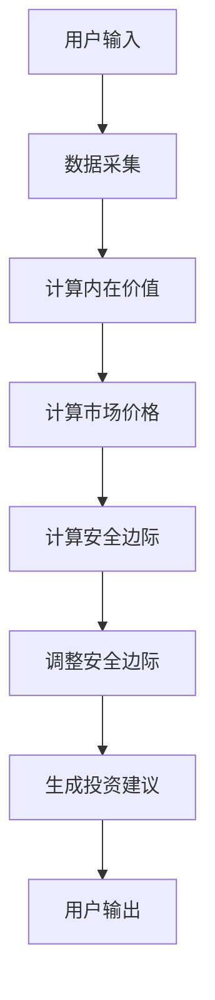
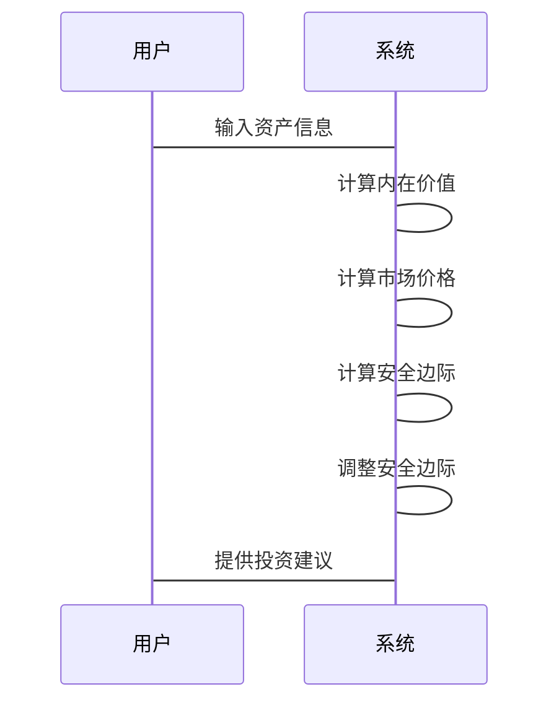

                 


# 格雷厄姆的安全边际理论在高估值市场中的调整

## 关键词：
- 格雷厄姆
- 安全边际理论
- 高估值市场
- 投资策略
- 调整策略
- 数学模型

## 摘要：
本文探讨了格雷厄姆的安全边际理论在高估值市场中的应用与调整策略。在高估值市场中，传统的安全边际理论需要进行适当调整以应对市场波动和风险。通过数学模型和实际案例分析，本文详细阐述了调整方法，并为投资者提供了实用的建议。

---

## 第1章: 格雷厄姆安全边际理论的背景与基础

### 1.1 格雷厄姆投资理论的概述

#### 1.1.1 价值投资的起源与核心理念
价值投资是由本杰明·格雷厄姆在20世纪初提出的投资理念，其核心在于寻找市场中被低估的资产，并在安全边际的基础上进行投资。格雷厄姆强调，投资者应关注资产的内在价值，而非市场的短期波动。

#### 1.1.2 安全边际理论的提出背景
安全边际理论的提出源于20世纪30年代的大萧条时期。格雷厄姆观察到，市场恐慌和非理性行为会导致资产价格大幅偏离其内在价值。为了在这种环境中保护投资者，他提出了安全边际的概念，即以低于内在价值的价格购买资产。

#### 1.1.3 安全边际在投资决策中的作用
安全边际是投资者在决策过程中考虑的缓冲区，旨在降低因市场波动或估值误差带来的风险。通过引入安全边际，投资者可以在市场高估时避免重大损失，并在市场低估时获得超额收益。

### 1.2 安全边际的核心概念与定义

#### 1.2.1 安全边际的数学定义
安全边际可以通过以下公式计算：
$$ \text{安全边际} = \text{内在价值} - \text{市场价格} $$

#### 1.2.2 安全边际与资产价值的关系
安全边际是资产内在价值与市场价格之间的差额。当市场价格低于内在价值时，资产具有安全边际，反之则没有。

#### 1.2.3 安全边际的计算方法
安全边际的计算方法包括：
1. 基于历史估值的比较
2. 基于未来现金流的贴现
3. 基于资产重置成本的评估

---

## 第2章: 高估值市场的特征与挑战

### 2.1 高估值市场的定义与特征

#### 2.1.1 市场估值水平的衡量指标
市场估值水平可以通过市盈率（P/E）、市净率（P/B）等指标来衡量。当这些指标显著高于历史平均水平时，市场被认为处于高估状态。

#### 2.1.2 高估值市场的形成原因
高估值市场的形成通常与市场泡沫、投资者非理性行为以及资金过度流入等因素有关。

#### 2.1.3 高估值市场与传统市场的区别
高估值市场的区别在于资产价格显著高于其内在价值，且市场参与者普遍存在乐观情绪。

### 2.2 高估值市场中的投资风险

#### 2.2.1 高估值市场中的泡沫风险
当市场价格远高于内在价值时，市场存在泡沫风险。一旦泡沫破裂，资产价格可能会大幅下跌。

#### 2.2.2 市场波动性对投资者的影响
高估值市场的波动性较大，投资者可能面临短期亏损的风险。

#### 2.2.3 高估值市场中的流动性风险
在高估值市场中，资产流动性可能较差，尤其是在市场调整期间，投资者可能难以以合理价格出售资产。

---

## 第3章: 格雷厄姆安全边际理论在高估值市场的调整策略

### 3.1 安全边际理论的基本框架

#### 3.1.1 格雷厄姆安全边际的计算公式
$$ \text{安全边际} = \text{内在价值} - \text{市场价格} $$

#### 3.1.2 安全边际与资产价格的关系
当市场价格低于内在价值时，安全边际为正，反之为负。

#### 3.1.3 安全边际在不同市场环境下的应用
在低估值市场中，安全边际为正，投资者可以买入资产；在高估值市场中，安全边际为负，投资者应谨慎投资。

### 3.2 高估值市场中的安全边际调整

#### 3.2.1 高估值市场中安全边际的重新定义
在高估值市场中，传统的安全边际计算方法需要进行调整。调整后的方法考虑了市场整体估值水平的影响。

#### 3.2.2 安全边际调整的数学模型
$$ \text{调整后安全边际} = k \times (\text{内在价值} - \text{市场价格}) $$

其中，k为调整因子，取值范围为0到1。调整因子k的计算公式为：
$$ k = \frac{\text{市场估值水平}}{\text{历史平均估值水平}} $$

#### 3.2.3 调整后的安全边际计算公式
$$ \text{调整后安全边际} = \frac{\text{市场估值水平}}{\text{历史平均估值水平}} \times (\text{内在价值} - \text{市场价格}) $$

---

## 第4章: 安全边际调整的数学模型与公式

### 4.1 标准安全边际公式
$$ \text{安全边际} = \text{内在价值} - \text{市场价格} $$

### 4.2 高估值市场中的调整公式
$$ \text{调整后安全边际} = k \times (\text{内在价值} - \text{市场价格}) $$

### 4.3 调整因子k的确定方法

#### 4.3.1 调整因子k的定义
调整因子k是根据市场估值水平与历史平均估值水平的比值确定的。

#### 4.3.2 调整因子k的计算公式
$$ k = \frac{\text{市场估值水平}}{\text{历史平均估值水平}} $$

---

## 第5章: 系统分析与架构设计

### 5.1 系统分析

#### 5.1.1 系统目标
本系统旨在通过调整安全边际理论，为投资者提供在高估值市场中的投资决策支持。

#### 5.1.2 系统范围
系统适用于股票、基金等金融资产的投资分析。

#### 5.1.3 系统功能需求
- 计算资产的内在价值
- 计算市场价格
- 计算安全边际
- 调整安全边际以适应高估值市场
- 提供投资建议

### 5.2 系统架构设计

#### 5.2.1 分层架构
- 数据层：收集和存储市场数据
- 业务逻辑层：计算安全边际和调整因子
- 用户界面层：展示结果和投资建议

#### 5.2.2 模块划分
- 数据采集模块
- 安全边际计算模块
- 调整因子计算模块
- 投资建议模块

#### 5.2.3 接口设计
- 数据接口：与数据源对接
- 用户接口：与用户交互

### 5.3 系统交互设计

#### 5.3.1 流程图


#### 5.3.2 序列图


---

## 第6章: 项目实战——高估值市场中的安全边际调整

### 6.1 环境安装

#### 6.1.1 系统环境要求
- 操作系统：Windows/Mac/Linux
- 开发工具：Python、Jupyter Notebook
- 数据源：金融数据API

#### 6.1.2 软件安装步骤
1. 安装Python
2. 安装Jupyter Notebook
3. 安装金融数据API接口

### 6.2 核心实现

#### 6.2.1 安全边际计算模块
```python
def calculate_intrinsic_value(asset, market_data):
    # 计算内在价值的逻辑
    return intrinsic_value
```

#### 6.2.2 调整因子计算模块
```python
def calculate_adjustment_factor(market_valuation, historical_valuation):
    k = market_valuation / historical_valuation
    return k
```

#### 6.2.3 结果展示模块
```python
def display_results(adjacent_margin):
    print("调整后安全边际:", adjacent_margin)
```

### 6.3 实际案例分析

#### 6.3.1 案例背景
假设当前市场估值水平为150%，历史平均估值水平为100%。

#### 6.3.2 数据收集与处理
- 市场数据：股票价格、财务数据
- 历史数据：过去十年的市场估值水平

#### 6.3.3 安全边际调整过程
1. 计算内在价值
2. 计算市场价格
3. 计算标准安全边际
4. 计算调整因子k
5. 计算调整后安全边际

#### 6.3.4 结果分析与总结
调整后安全边际为负，表明当前市场价格高于内在价值，投资者应谨慎投资。

---

## 第7章: 总结与最佳实践

### 7.1 总结
在高估值市场中，传统的安全边际理论需要进行适当调整。通过引入调整因子k，我们可以更准确地评估资产的安全边际，并为投资者提供更好的决策支持。

### 7.2 最佳实践 tips

1. **谨慎评估市场估值水平**：在高估值市场中，投资者应密切关注市场估值指标。
2. **动态调整安全边际**：根据市场变化及时调整安全边际。
3. **避免过度乐观**：高估值市场中，投资者应保持理性，避免被市场情绪影响。
4. **分散投资**：通过分散投资降低单一资产的风险。

### 7.3 小结
通过本文的分析，我们得出在高估值市场中，安全边际理论需要进行调整。调整后的模型能够更好地指导投资者在高估值市场中的投资决策。

### 7.4 注意事项
投资者在实际操作中应结合市场实际情况，合理应用本文提出的调整方法。

### 7.5 拓展阅读
建议进一步阅读格雷厄姆的经典著作《证券分析》，以更深入地理解安全边际理论。

---

## 作者：
AI天才研究院/AI Genius Institute  
禅与计算机程序设计艺术/Zen And The Art of Computer Programming

