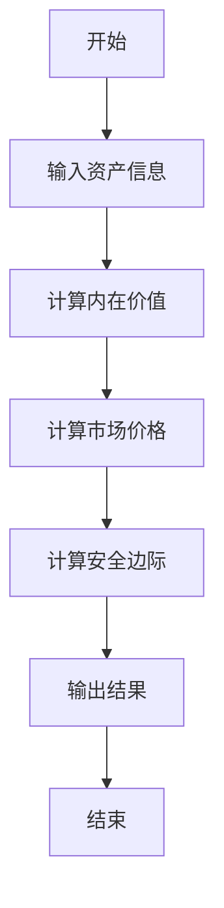
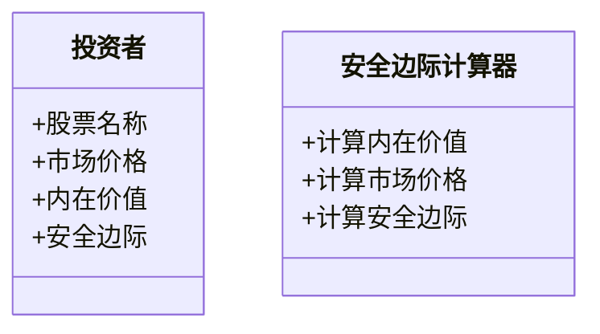
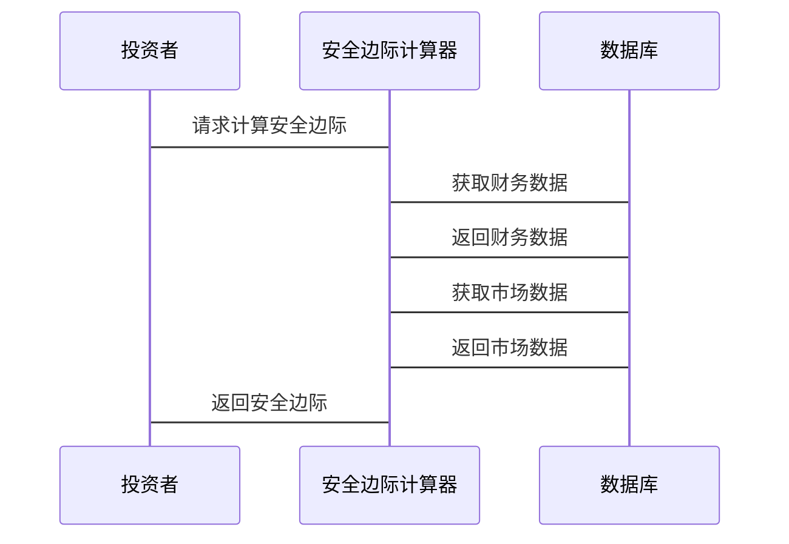

                 


# 格雷厄姆的安全边际理论实践

## 关键词：安全边际理论, 投资学, 价值投资, 内在价值, 风险控制

## 摘要：
本文系统地阐述了格雷厄姆的安全边际理论，从理论基础到实际应用进行了深入分析。通过背景介绍、核心概念、算法原理、系统架构设计、项目实战等多维度，详细探讨了安全边际理论的实践应用，帮助读者掌握投资决策的核心工具。

---

# 第1章: 安全边际理论的背景与核心概念

## 1.1 安全边际理论的起源与演变

### 1.1.1 投资学的起源与发展
投资学作为一门古老而现代的学科，其起源可以追溯到古代的商业活动。从简单的商品交换到现代的金融投资，投资学经历了漫长的发展过程。随着资本主义经济的兴起，投资学逐渐成为一门独立的学科，并在20世纪得到了快速发展。

### 1.1.2 格雷厄姆与安全边际理论的提出
本杰明·格雷厄姆（Benjamin Graham）是20世纪著名的投资学家，被誉为“价值投资之父”。他在1934年出版的《证券分析》一书中首次系统地提出了安全边际理论。格雷厄姆认为，投资者应该以低于内在价值的价格购买股票，从而在市场波动中获得超额收益。

### 1.1.3 安全边际理论的核心思想
安全边际理论的核心思想是通过计算股票的内在价值，并比较其与市场价格的差异，来确定投资的安全性。具体来说，内在价值是指公司未来现金流的现值，而市场价格则是由市场供需关系决定的。通过比较内在价值与市场价格，投资者可以找到具有安全边际的投资标的。

## 1.2 安全边际理论的核心概念

### 1.2.1 投资的定义与分类
投资是指将资金投入到能够产生收益的资产中，以实现资产增值的过程。根据资产类型，投资可以分为股票、债券、房地产等多种形式。股票投资是最常见的形式之一，也是安全边际理论的主要应用领域。

### 1.2.2 内在价值与市场价格的关系
内在价值是指公司未来现金流的现值，它是股票的真正价值。市场价格则是由市场供需关系决定的，可能高于或低于内在价值。安全边际理论认为，市场价格与内在价值之间的差异是投资风险的重要来源。

### 1.2.3 安全边际的定义与计算方法
安全边际是指内在价值与市场价格之间的差额。计算安全边际的方法是：安全边际 = 内在价值 - 市场价格。如果安全边际为正，说明股票价格低于其内在价值，具有投资价值；如果安全边际为负，说明股票价格高于其内在价值，具有投资风险。

## 1.3 安全边际理论与价值投资的联系

### 1.3.1 价值投资的定义与特点
价值投资是一种投资策略，强调以低于内在价值的价格购买股票。其核心思想是寻找市场先生的错误定价，并从中获利。价值投资的特点是长期、逆向和安全边际导向。

### 1.3.2 安全边际在价值投资中的作用
安全边际是价值投资的核心工具。通过计算安全边际，投资者可以确定股票的内在价值与市场价格之间的差异，从而找到具有投资价值的标的。安全边际越大，投资风险越小，收益潜力越大。

### 1.3.3 安全边际与风险控制的关系
安全边际是风险控制的重要工具。通过计算安全边际，投资者可以量化投资风险，并在市场波动中保持投资组合的稳定性。安全边际越大，投资组合的风险越小。

## 1.4 安全边际在投资中的重要性

### 1.4.1 安全边际作为投资决策的核心工具
安全边际是投资决策的核心工具。通过计算安全边际，投资者可以量化投资风险，并在市场波动中做出明智的投资决策。

### 1.4.2 安全边际在不同市场环境中的应用
安全边际在不同市场环境中的应用有所不同。在牛市中，安全边际较小，投资者需要更加谨慎；在熊市中，安全边际较大，投资者可以找到更多的投资机会。

### 1.4.3 安全边际与长期投资收益的关系
安全边际与长期投资收益密切相关。通过计算安全边际，投资者可以找到具有长期收益潜力的股票，并在市场波动中保持投资信心。

---

# 第2章: 安全边际理论的核心原理

## 2.1 安全边际的计算方法

### 2.1.1 内在价值的计算公式
内在价值的计算公式为：
$$ V = \frac{CF}{r} $$
其中，CF是公司未来现金流，r是折现率。

### 2.1.2 市场价格与安全边际的计算
市场价格与安全边际的计算公式为：
$$ \text{安全边际} = V - P $$
其中，V是内在价值，P是市场价格。

### 2.1.3 安全边际的量化标准
安全边际的量化标准通常以内在价值的一定比例为基础。例如，安全边际可以设定为内在价值的20%或30%。具体标准可以根据市场环境和投资目标进行调整。

## 2.2 安全边际的属性特征对比

### 2.2.1 不同投资品种的安全边际计算差异
不同投资品种的安全边际计算差异主要体现在内在价值的计算方法上。例如，股票的内在价值可以通过现金流折现法计算，而债券的内在价值可以通过现金流贴现法计算。

### 2.2.2 安全边际与资产流动性关系
资产流动性与安全边际密切相关。流动性强的资产具有较小的安全边际，而流动性弱的资产具有较大的安全边际。这是因为流动性强的资产价格更容易受市场波动影响。

### 2.2.3 安全边际与市场波动性的关系
市场波动性与安全边际密切相关。市场波动性越大，安全边际越小，投资风险越高。

## 2.3 安全边际的ER实体关系图

```mermaid
erDiagram
    actor 投资者 {
        <name>
        <资产>
        <市场价格>
    }
    actor 市场 {
        <公司>
        <现金流>
        <折现率>
    }
    actor 安全边际计算 {
        <内在价值>
        <安全边际>
    }
```

---

# 第3章: 安全边际理论的算法原理

## 3.1 安全边际计算的算法流程



### 3.1.1 算法输入与输出
- 输入：资产信息（公司名称、财务数据、市场数据）
- 输出：安全边际

### 3.1.2 内在价值计算的算法步骤
1. 收集公司财务数据（收入、利润、现金流等）。
2. 确定折现率。
3. 计算公司未来现金流的现值，即内在价值。

### 3.1.3 安全边际计算的算法实现
1. 计算内在价值。
2. 获取市场价格。
3. 计算安全边际 = 内在价值 - 市场价格。

## 3.2 安全边际计算的数学模型

### 3.2.1 内在价值计算公式
$$ V = \frac{CF}{r} $$

### 3.2.2 安全边际计算公式
$$ \text{安全边际} = V - P $$

### 3.2.3 代码实现

```python
def calculate_intrinsic_value(cash_flow, discount_rate):
    return cash_flow / discount_rate

def calculate_market_price(stock ticker):
    # 获取股票市场价格
    pass

def calculate_margin_of_safety(intrinsic_value, market_price):
    return intrinsic_value - market_price

# 示例代码
cash_flow = 100
discount_rate = 0.1
intrinsic_value = calculate_intrinsic_value(cash_flow, discount_rate)
market_price = calculate_market_price("AAPL")
margin_of_safety = calculate_margin_of_safety(intrinsic_value, market_price)
print("安全边际 =", margin_of_safety)
```

---

# 第4章: 系统分析与架构设计方案

## 4.1 问题场景介绍
在投资分析系统中，投资者需要计算股票的安全边际，并做出投资决策。

## 4.2 系统功能设计



## 4.3 系统架构设计


## 4.4 系统接口设计



---

# 第5章: 项目实战

## 5.1 环境安装
需要安装Python和相关库（如pandas、numpy）。

## 5.2 系统核心实现源代码

```python
import pandas as pd
import numpy as np

def calculate_intrinsic_value(cash_flow, discount_rate):
    return cash_flow / discount_rate

def calculate_market_price(ticker):
    # 示例代码，实际需要从数据源获取
    return pd.read_csv(f'data/{ticker}.csv')['close'].iloc[-1]

def calculate_margin_of_safety(intrinsic_value, market_price):
    return intrinsic_value - market_price

# 示例代码
cash_flow = 100
discount_rate = 0.1
market_price = calculate_market_price("AAPL")
intrinsic_value = calculate_intrinsic_value(cash_flow, discount_rate)
margin_of_safety = calculate_margin_of_safety(intrinsic_value, market_price)
print(f"安全边际 = {margin_of_safety}")
```

---

# 第6章: 总结

## 6.1 本章小结
安全边际理论是价值投资的核心工具，通过计算内在价值与市场价格的差异，投资者可以找到具有安全边际的投资标的，并在市场波动中实现长期收益。

## 6.2 投资建议与注意事项
1. 选择具有较大安全边际的股票进行投资。
2. 定期重新评估投资组合的安全边际。
3. 结合市场环境和公司基本面进行投资决策。

## 6.3 未来研究方向
1. 安全边际在不同类型资产中的应用。
2. 安全边际与风险管理的结合。
3. 安全边际在量化投资中的应用。

---

# 作者：AI天才研究院/AI Genius Institute & 禅与计算机程序设计艺术 /Zen And The Art of Computer Programming
---

