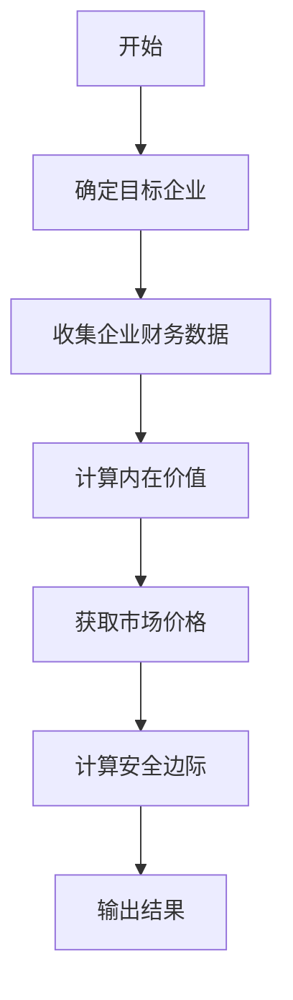

                 


# 格雷厄姆的安全边际：如何在投资中留有余地

## 关键词
安全边际，投资策略，格雷厄姆，价值投资，风险管理，投资决策

## 摘要
安全边际是格雷厄姆投资理论中的核心概念，强调在投资决策中留有一定的安全空间，以避免因市场价格波动带来的损失。本文将从安全边际的背景、核心概念、计算方法、系统分析、项目实战以及最佳实践等方面进行详细阐述。通过实际案例和数学模型，深入分析安全边际在投资中的应用，帮助投资者在复杂多变的市场环境中做出明智的投资决策。

---

## 第一部分：安全边际的背景与核心概念

### 第1章：安全边际的起源与定义

#### 1.1 安全边际的起源
- **投资学的演变**：从古典经济学到现代金融理论，投资学经历了从简单到复杂的演变过程。格雷厄姆的安全边际理论诞生于20世纪初，是价值投资的重要基石。
- **格雷厄姆与安全边际的提出**：本杰明·格雷厄姆是价值投资的鼻祖，他通过分析市场波动性和企业基本面，提出了安全边际的概念。
- **安全边际的核心理念**：安全边际强调在购买资产时，市场价格应低于其内在价值，从而为投资者提供一个“安全空间”，以应对市场波动和不确定性。

#### 1.2 安全边际的定义
- **安全边际的定义与内涵**：安全边际是市场价格与内在价值之间的差额，即 $ \text{安全边际} = \text{内在价值} - \text{市场价格} $。
- **安全边际的数学表达式**：安全边际率可以表示为 $ \text{安全边际率} = \frac{\text{内在价值} - \text{市场价格}}{\text{市场价格}} \times 100\% $。
- **安全边际与投资风险的关系**：安全边际越大，投资风险越小。通过留有安全边际，投资者能够在市场下跌时避免损失。

#### 1.3 安全边际的重要性
- **安全边际在投资决策中的作用**：安全边际是价值投资的核心，帮助投资者在市场狂热时保持冷静，在市场恐慌时抓住机会。
- **安全边际与长期投资收益的关系**：长期来看，注重安全边际的投资策略能够带来稳定的超额收益。
- **安全边际在不同市场环境中的应用**：无论是牛市还是熊市，安全边际都能帮助投资者做出更明智的投资决策。

#### 1.4 安全边际与其他投资策略的区别
- **与价值投资的异同**：价值投资注重寻找被市场低估的资产，而安全边际是实现价值投资的重要工具。
- **与成长投资的异同**：成长投资注重企业的成长潜力，而安全边际更关注价格与价值的匹配。
- **与技术分析的异同**：技术分析依赖于价格走势，而安全边际注重基本面分析。

---

## 第二部分：安全边际的核心概念与计算方法

### 第2章：安全边际的计算原理

#### 2.1 安全边际的计算步骤
- **确定企业的内在价值**：通过DCF（现金流折现法）等方法评估企业的内在价值。
- **评估市场的市场价格**：通过市场数据获取企业的当前市场价格。
- **计算安全边际**：比较内在价值与市场价格，计算安全边际率。

#### 2.2 内在价值的评估方法
- **格雷厄姆的估值方法**：格雷厄姆提出用市盈率、市净率等指标评估企业的内在价值。
- **现金流折现法**：通过预测未来现金流并将其折现，计算企业的内在价值。
- **市盈率与市净率分析**：通过比较企业的市盈率和市净率与行业平均水平，判断其估值是否合理。

#### 2.3 市场价格与安全边际的确定
- **市场价格的波动性分析**：市场价格受市场情绪和外部因素影响，波动较大。
- **安全边际的确定方法**：通过比较市场价格与内在价值，确定是否留有安全边际。

---

## 第三部分：安全边际的算法原理与系统分析

### 第3章：安全边际的算法原理

#### 3.1 算法流程图


#### 3.2 数学模型与公式
- 内在价值计算公式：
  $$ \text{内在价值} = \sum_{t=1}^{n} \frac{\text{现金流}_t}{(1 + r)^t} $$
  其中，$r$ 是折现率，$n$ 是预测年数，$\text{现金流}_t$ 是第 $t$ 年的现金流。
- 安全边际计算公式：
  $$ \text{安全边际} = \text{内在价值} - \text{市场价格} $$

#### 3.3 实例分析
假设某企业的内在价值为100元，市场价格为80元，则安全边际为20元，安全边际率为25%。

---

### 第4章：安全边际的系统分析

#### 4.1 系统架构设计


#### 4.2 功能模块设计
- **股票选择模块**：筛选具有成长性和稳定性的企业。
- **内在价值计算模块**：使用DCF方法计算企业的内在价值。
- **安全边际计算模块**：比较市场价格与内在价值，计算安全边际。
- **投资决策模块**：根据安全边际率决定是否买入或卖出。

---

## 第四部分：安全边际的项目实战

### 第5章：安全边际计算器的开发

#### 5.1 环境安装
- 安装Python和必要的库（如pandas、numpy）。

#### 5.2 核心代码实现
```python
import pandas as pd
import numpy as np

def calculate_intrinsic_value(enterprise_value, free_cash_flow, discount_rate, years):
    """
    计算企业的内在价值
    """
    cash_flows = []
    for year in range(years):
        cash_flows.append(free_cash_flow * (1 + 0.05)**year)  # 假设现金流年增长率为5%
    present_value = sum([cash_flow / (1 + discount_rate)**i for i, cash_flow in enumerate(cash_flows)])
    return present_value

def calculate_margin_of_safety(intrinsic_value, market_price):
    """
    计算安全边际
    """
    margin = intrinsic_value - market_price
    margin_of_safety_percent = (margin / market_price) * 100
    return margin, margin_of_safety_percent

# 示例数据
enterprise_value = 1000000
free_cash_flow = 100000
discount_rate = 0.08
years = 5
market_price = 800000

# 计算内在价值
iv = calculate_intrinsic_value(enterprise_value, free_cash_flow, discount_rate, years)
# 计算安全边际
margin, margin_percent = calculate_margin_of_safety(iv, market_price)

print(f"内在价值：{iv}")
print(f"市场价格：{market_price}")
print(f"安全边际：{margin}")
print(f"安全边际率：{margin_percent}%")
```

#### 5.3 代码解读
- `calculate_intrinsic_value`函数：使用现金流折现法计算内在价值。
- `calculate_margin_of_safety`函数：计算安全边际和安全边际率。
- 示例数据：假设企业价值、现金流、贴现率和年数，计算内在价值和安全边际。

#### 5.4 实际案例分析
以某科技公司为例，计算其安全边际，判断是否具备投资价值。

---

## 第五部分：最佳实践与小结

### 第6章：安全边际的实践应用

#### 6.1 最佳实践
- **长期视角**：注重企业的长期价值，而非短期波动。
- **分散投资**：通过分散投资降低风险。
- **持续学习**：不断更新知识，适应市场变化。

#### 6.2 小结
安全边际是价值投资的核心，帮助投资者在复杂市场中做出明智决策。通过本文的分析和实例，读者可以掌握安全边际的计算方法和应用策略。

---

## 作者：AI天才研究院 & 禅与计算机程序设计艺术

---

**本文基于格雷厄姆的安全边际理论，结合实际案例和数学模型，详细阐述了安全边际的计算方法和应用策略。通过系统分析和项目实战，帮助投资者在投资中留有余地，实现稳健收益。**

