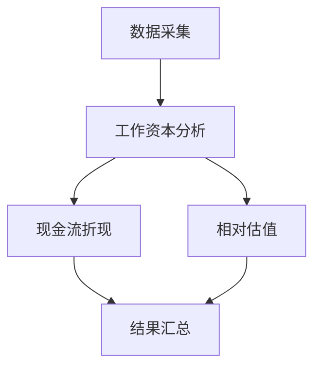

                 


# 格雷厄姆的工作资本分析在现代企业估值中的应用

**关键词：** 格雷厄姆, 工作资本分析, 企业估值, 现金流折现法, 相对估值法

**摘要：**  
本文详细探讨了格雷厄姆的工作资本分析方法在现代企业估值中的应用。通过分析工作资本的核心概念、扩展应用以及与现代估值方法的结合，展示了如何在复杂市场环境中优化企业估值过程。文章还通过具体案例分析和系统设计，进一步验证了工作资本分析的现代应用价值。

---

## 第一章: 格雷厄姆工作资本分析概述

### 1.1 格雷厄姆及其投资理念
格雷厄姆是价值投资的鼻祖，其核心理念是寻找市场低估的企业，通过分析企业基本面进行投资。工作资本分析是其理论体系中的重要组成部分。

### 1.2 工作资本分析的定义与特点
工作资本指流动资产减去短期负债，反映企业的短期偿债能力和运营效率。

### 1.3 工作资本分析的现代扩展
随着现代企业的复杂性增加，工作资本分析需要结合现金流、无形资产等因素。

---

## 第二章: 工作资本分析的理论基础

### 2.1 企业估值的核心要素
企业价值由资产、负债和所有者权益构成，工作资本是其中的重要组成部分。

### 2.2 工作资本分析的数学模型
$$ 工作资本 = 流动资产 - 短期负债 $$

### 2.3 工作资本分析的边界与外延
工作资本分析需与其他估值方法结合，如现金流折现法和相对估值法。

---

## 第三章: 工作资本分析的核心概念与联系

### 3.1 核心概念原理
工作资本与企业盈利能力、成长性密切相关。

### 3.2 核心概念属性特征对比
| 概念       | 特征1 | 特征2 | 特征3 |
|------------|-------|-------|-------|
| 工作资本   | 数值化 | 动态性 | 相关性 |
| 企业价值   | 综合性 | 战略性 | 可比性 |

### 3.3 ER实体关系图
```mermaid
graph TD
    A[企业] --> B[工作资本]
    B --> C[流动资产]
    B --> D[短期负债]
    A --> E[企业价值]
    E -->
```

---

## 第四章: 工作资本分析的现代应用

### 4.1 现代企业估值的挑战
技术投入、品牌价值等无形资产对企业价值的影响日益重要。

### 4.2 工作资本分析与现金流折现法
现金流折现法（DCF）是现代企业估值的重要方法，结合工作资本分析可以更全面地评估企业价值。

### 4.3 工作资本分析与相对估值法
相对估值法（Relative Valuation）通过比较可比公司，调整估值指标，提高估值的合理性。

### 4.4 大数据与人工智能技术的应用
通过大数据和AI技术，动态调整估值模型，提高计算的准确性和效率。

---

## 第五章: 案例分析

### 5.1 案例背景
选择一家科技型制造企业，分析其工作资本、现金流和市场价值。

### 5.2 数据分析
计算工作资本、现金流折现值，分析相对估值指标。

### 5.3 结果分析
通过分析得出企业合理价值，验证工作资本分析的有效性。

---

## 第六章: 系统架构设计

### 6.1 系统功能设计
系统包括数据采集、工作资本分析、现金流折现、相对估值和结果汇总模块。

### 6.2 系统架构图


### 6.3 系统接口设计
定义数据接口，确保各模块之间的数据交互流畅。

---

## 第七章: 项目实战

### 7.1 环境配置
安装必要的库和工具，如Python、Pandas、NumPy等。

### 7.2 核心代码实现
编写代码实现工作资本分析和现金流折现功能。

```python
import pandas as pd
import numpy as np

# 数据导入
data = pd.read_csv('企业数据.csv')

# 工作资本计算
working_capital = data['流动资产'] - data['短期负债']

# 现金流折现计算
discount_rate = 0.1
cash_flows = data['现金流']
discounted_value = np.npv(discount_rate, cash_flows)

print("工作资本:", working_capital)
print("现金流折现值:", discounted_value)
```

### 7.3 代码应用解读
解释代码的功能，展示如何结合工作资本分析和现金流折现法进行估值。

### 7.4 实际案例分析
以具体企业为例，详细解读如何应用上述方法进行估值。

### 7.5 项目小结
总结项目实施过程中的经验与教训，提出改进建议。

---

## 第八章: 总结与展望

### 8.1 本章小结
总结工作资本分析在现代企业估值中的应用价值，强调其与现代估值方法的结合的重要性。

### 8.2 未来展望
随着技术进步和市场变化，工作资本分析需要不断创新，以适应更复杂的估值需求。

---

## 附录

### 附录A: 术语解释
列出本文中涉及的专业术语及其简要解释。

### 附录B: 数据来源
详细说明数据来源和处理方法。

### 附录C: 参考文献
列出参考的文献和资料。

---

**作者：AI天才研究院 & 禅与计算机程序设计艺术**

