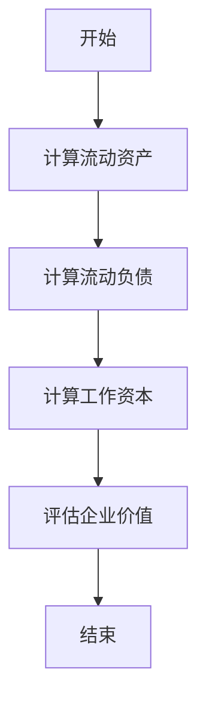
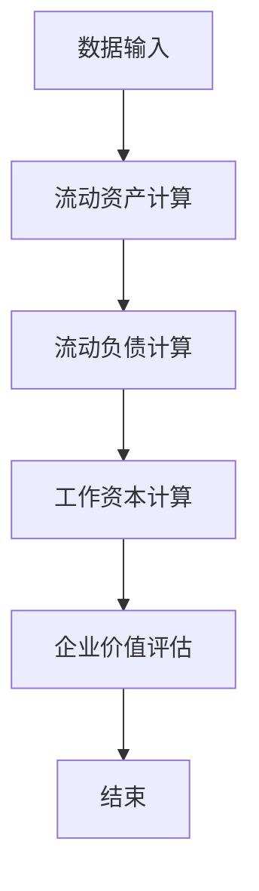

                 


# 格雷厄姆的工作资本分析方法

> 关键词：格雷厄姆，工作资本分析，价值投资，企业估值，流动资产，流动负债

> 摘要：格雷厄姆的工作资本分析方法是价值投资的重要工具，用于评估企业的内在价值。本文详细阐述了工作资本分析的核心概念、数学模型、系统架构及项目实现，帮助读者掌握这一经典的投资分析方法。

---

## 第1章 工作资本分析的背景与重要性

### 1.1 工作资本分析的起源与发展

格雷厄姆是价值投资的鼻祖，他的工作资本分析方法为现代投资理论奠定了基础。工作资本分析通过评估企业的流动资产和流动负债，帮助投资者发现被低估的投资机会。与其他投资方法不同，工作资本分析更注重企业的内在价值，而非市场情绪。

### 1.2 工作资本分析在投资决策中的作用

工作资本分析可以帮助投资者评估企业的短期偿债能力，识别财务风险，从而做出更明智的投资决策。通过分析流动资产和流动负债，投资者可以了解企业的财务健康状况，判断其是否具备长期投资价值。

---

## 第2章 工作资本分析的核心概念与原理

### 2.1 工作资本的定义与核心要素

工作资本是流动资产减去流动负债，反映了企业的短期财务状况。流动资产包括现金、应收账款、存货等，而流动负债则包括应付账款、短期债务等。通过分析这些要素，可以评估企业的流动资金状况。

### 2.2 工作资本分析的数学模型与公式

格雷厄姆的工作资本分析公式如下：
$$ \text{工作资本} = \text{流动资产} - \text{流动负债} $$

内在价值的计算公式为：
$$ \text{内在价值} = \frac{\text{净利润} \times \text{永续增长率}}{\text{资本成本} - \text{增长率}} $$

---

## 第3章 工作资本的构成与分类

### 3.1 流动资产分析

流动资产包括现金、应收账款、存货等。现金是流动性最强的资产，应收账款则是企业未来收取的款项，存货是企业销售商品前的库存。通过分析这些部分，可以评估企业的资金流动性。

### 3.2 流动负债分析

流动负债包括应付账款、短期债务等。应付账款是企业尚未支付的账款，短期债务则是企业短期内需要偿还的债务。流动负债的管理直接影响企业的短期偿债能力。

---

## 第4章 工作资本分析的数学模型与算法原理

### 4.1 工作资本分析的数学模型

工作资本分析的数学模型通过流动资产和流动负债的差额来评估企业的财务状况。公式为：
$$ \text{工作资本} = \text{流动资产} - \text{流动负债} $$

### 4.2 工作资本分析的算法流程图



---

## 第5章 工作资本分析的系统架构与实现

### 5.1 系统架构设计

工作资本分析系统包括数据输入、流动资产计算、流动负债计算、工作资本计算、企业价值评估等功能模块。

### 5.2 系统架构图



---

## 第6章 项目实战：工作资本分析工具的实现

### 6.1 环境安装

安装Python和相关库，如Pandas、NumPy。

### 6.2 核心代码实现

```python
def calculate_working_capital(current_assets, current_liabilities):
    return current_assets - current_liabilities

# 示例数据
current_assets = 500000
current_liabilities = 300000
working_capital = calculate_working_capital(current_assets, current_liabilities)
print(f"工作资本为：{working_capital}")
```

### 6.3 案例分析

以某公司为例，计算其工作资本，评估其财务状况。

---

## 第7章 总结与展望

### 7.1 总结

工作资本分析是价值投资的重要工具，通过评估企业的流动资产和流动负债，帮助投资者发现潜在的投资机会。

### 7.2 最佳实践 tips

1. 定期更新财务数据，保持分析的准确性。
2. 结合其他分析方法，全面评估企业价值。
3. 避免过度依赖单一指标，综合考虑多方面因素。

---

## 作者

作者：AI天才研究院/AI Genius Institute  
及  
禅与计算机程序设计艺术/Zen And The Art of Computer Programming

