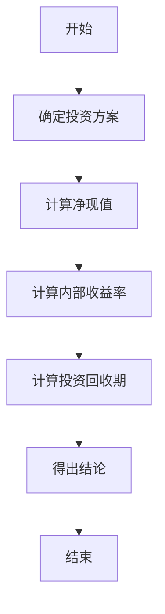
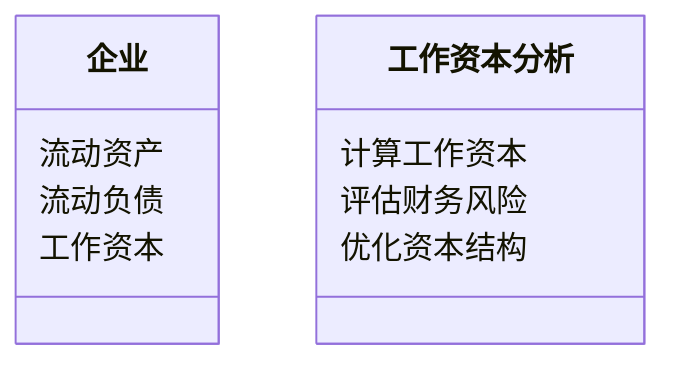

                 


# 格雷厄姆的工作资本分析：适应轻资产商业模式

> 关键词：工作资本分析，轻资产商业模式，格雷厄姆投资理论，财务分析，企业价值评估

> 摘要：本文深入探讨了格雷厄姆的工作资本分析方法及其在轻资产商业模式中的应用。通过分析工作资本的核心概念、算法原理、系统架构设计以及实际项目案例，本文详细阐述了如何利用工作资本分析优化企业价值评估，特别是在轻资产商业模式下的应用策略。文章还结合了数学公式、流程图和代码示例，帮助读者更好地理解和应用这些方法。

---

# 第一部分: 格雷厄姆的工作资本分析基础

## 第1章: 工作资本分析的定义与背景

### 1.1 工作资本分析的定义

#### 1.1.1 工作资本的定义

工作资本（Working Capital）是指企业在日常运营中用于支持核心业务活动的流动资产减去流动负债的部分，是衡量企业短期偿债能力和运营效率的重要指标。具体而言，工作资本 = 流动资产 - 流动负债。它反映了企业在短期内偿还债务的能力，同时也是评估企业财务健康状况的关键指标之一。

#### 1.1.2 工作资本与企业价值的关系

工作资本与企业价值密切相关。充足的流动资产（如现金、应收账款、存货等）能够支持企业的日常运营，确保企业能够按时支付账单和履行合同义务。同时，合理的流动负债（如应付账款、短期借款等）能够优化企业的资金使用效率。工作资本的合理性是企业长期稳健发展的基础。

#### 1.1.3 工作资本分析的适用场景

工作资本分析适用于多种场景，包括：

- 企业财务健康状况评估
- 投资决策支持
- 贷款申请与授信额度评估
- 企业并购与重组中的价值评估

### 1.2 轻资产商业模式的特点

#### 1.2.1 轻资产模式的定义

轻资产商业模式（Light Asset Business Model）是指企业通过减少对实体资产的依赖，转而依赖无形资产（如数据、品牌、技术、知识资本等）来实现业务增长和价值创造的一种商业模式。轻资产模式通常具有以下特点：

- 低固定资产投入
- 高度依赖知识资本和技术
- 强调运营效率和创新能力
- 灵活的市场响应能力

#### 1.2.2 轻资产模式的优势与劣势

**优势：**

- 资本需求低，资金风险小
- 灵活性高，适应市场变化能力强
- 更容易实现全球化扩张
- 依赖创新和技术驱动增长

**劣势：**

- 业务稳定性较差，容易受市场波动影响
- 知识资本难以直接量化
- 依赖外部合作伙伴，存在合作风险

#### 1.2.3 轻资产模式与传统商业模式的对比

| 对比维度         | 轻资产模式                     | 传统商业模式                   |
|------------------|-------------------------------|-------------------------------|
| 资产结构         | 以无形资产为主                | 以固定资产为主                |
| 投资门槛         | 低                           | 高                           |
| 运营效率         | 高                           | 中等                         |
| 市场响应能力     | 强                           | 较弱                         |
| 风险承受能力     | 中等                         | 较高                         |

### 1.3 格雷厄姆投资理论的核心思想

#### 1.3.1 格雷厄姆的投资理念概述

本杰明·格雷厄姆（Benjamin Graham）是价值投资的鼻祖，他提出了一系列投资理论和方法，其中包括工作资本分析。格雷厄姆认为，投资者应该以低于企业实际价值的价格购买优质资产，以确保投资的安全性和收益性。

#### 1.3.2 工作资本分析在格雷厄姆理论中的地位

工作资本分析是格雷厄姆投资理论中的重要组成部分。他认为，企业的工作资本状况直接反映了企业的财务健康状况和短期偿债能力。通过分析工作资本，投资者可以更好地评估企业的财务风险和经营稳定性。

#### 1.3.3 格雷厄姆分析方法的现代应用

尽管格雷厄姆的理论提出于几十年前，但其核心思想在现代投资分析中仍然具有重要的参考价值。特别是在轻资产商业模式下，工作资本分析可以帮助投资者更好地评估企业的价值和风险。

---

## 第2章: 工作资本分析的核心概念与联系

### 2.1 核心概念的原理

#### 2.1.1 工作资本的构成要素

工作资本由流动资产和流动负债两部分构成。流动资产包括现金、应收账款、存货等，流动负债包括应付账款、短期借款等。合理的工作资本结构能够确保企业的日常运营和债务偿还。

#### 2.1.2 工作资本与企业价值的关系

工作资本是企业价值的重要组成部分。充足的工作资本能够支持企业的日常运营，减少财务风险，从而提升企业价值。然而，过高的工作资本可能会导致资金闲置，降低资金使用效率；而过低的工作资本则可能引发偿债风险。

#### 2.1.3 工作资本分析的数学模型

$$工作资本 = 流动资产 - 流动负债$$

其中，流动资产和流动负债的具体构成如下：

- 流动资产 = 现金 + 应收账款 + 存货 + 其他流动资产
- 流动负债 = 应付账款 + 短期借款 + 其他流动负债

### 2.2 核心概念的对比分析

#### 2.2.1 财务比率分析与工作资本分析的对比

| 分析方法         | 财务比率分析                 | 工作资本分析                 |
|------------------|------------------------------|------------------------------|
| 分析对象         | 财务比率（如ROE、ROI等）      | 工作资本及其结构             |
| 分析目的         | 评估企业财务绩效             | 评估企业短期偿债能力和运营效率 |
| 适用场景         | 全面财务分析                 | 短期财务健康评估             |

#### 2.2.2 资产负债表分析与工作资本分析的对比

| 分析方法         | 资产负债表分析               | 工作资本分析                 |
|------------------|------------------------------|------------------------------|
| 分析对象         | 资产、负债、所有者权益       | 工作资本及其结构             |
| 分析目的         | 评估企业整体财务状况         | 评估企业短期财务健康状况     |
| 适用场景         | 全面财务分析                 | 短期财务健康评估             |

#### 2.2.3 利润表分析与工作资本分析的对比

| 分析方法         | 利润表分析                   | 工作资本分析                 |
|------------------|------------------------------|------------------------------|
| 分析对象         | 收入、成本、利润             | 工作资本及其结构             |
| 分析目的         | 评估企业盈利能力             | 评估企业短期偿债能力和运营效率 |
| 适用场景         | 盈利能力分析                 | 短期财务健康评估             |

### 2.3 ER实体关系图

```mermaid
erDiagram
    工作资本 <----> 企业
    工作资本 <----> 资产
    工作资本 <----> 负债
```

---

## 第3章: 工作资本分析的算法原理

### 3.1 算法原理概述

工作资本分析的核心算法包括以下几个方面：

#### 3.1.1 净现值法（Net Present Value, NPV）

净现值法是评估投资项目盈利能力的重要方法。公式如下：

$$NPV = \sum_{t=1}^{n} \frac{CF_t}{(1 + r)^t}$$

其中，\(CF_t\) 是第 \(t\) 年的现金流，\(r\) 是贴现率。

#### 3.1.2 内部收益率法（Internal Rate of Return, IRR）

内部收益率法是通过计算使净现值为零的贴现率来评估投资项目。公式如下：

$$0 = \sum_{t=1}^{n} \frac{CF_t}{(1 + IRR)^t}$$

#### 3.1.3 投资回收期法（Payback Period）

投资回收期法是通过计算回收初始投资所需的时间来评估投资项目。

### 3.2 算法流程图



### 3.3 Python实现示例

```python
def npv(cash_flows, discount_rate):
    return sum(cf / (1 + discount_rate)**t for t, cf in enumerate(cash_flows))
```

---

## 第4章: 系统分析与架构设计方案

### 4.1 问题场景介绍

在轻资产商业模式下，企业通常依赖于数据分析和模型优化来实现价值增长。因此，如何通过工作资本分析优化企业的财务管理和价值评估，成为企业面临的重要问题。

### 4.2 系统功能设计

#### 4.2.1 领域模型



#### 4.2.2 系统架构设计


### 4.3 系统接口设计

系统接口设计包括以下几个部分：

- 数据输入接口
- 数据处理接口
- 数据输出接口

---

## 第5章: 项目实战

### 5.1 环境安装

需要安装以下工具和库：

- Python
- Mermaid
- matplotlib
- pandas

### 5.2 系统核心实现源代码

```python
import pandas as pd
from matplotlib import pyplot as plt

def calculate_working_capital(data):
    current_assets = data['流动资产']
    current_liabilities = data['流动负债']
    return current_assets - current_liabilities

data = {
    '流动资产': 100000,
    '流动负债': 50000
}
wc = calculate_working_capital(data)
print(f"工作资本为：{wc}")
```

### 5.3 案例分析

假设某轻资产企业的流动资产为100,000元，流动负债为50,000元，其工作资本为50,000元。通过分析，我们可以得出该企业的短期偿债能力和运营效率。

---

## 第6章: 最佳实践 tips、小结、注意事项、拓展阅读

### 6.1 小结

工作资本分析是评估企业财务健康状况的重要工具，特别是在轻资产商业模式下，其作用更加显著。通过合理的工作资本管理，企业可以优化资本结构，降低财务风险，提升整体价值。

### 6.2 注意事项

- 在实际应用中，需结合企业的具体情况和市场环境进行分析
- 数据的准确性和完整性是工作资本分析的关键
- 需关注宏观经济环境和行业特点

### 6.3 拓展阅读

- 《格雷厄姆投资经典》
- 《轻资产商业模式的创新与实践》
- 《工作资本分析与企业价值评估》

---

作者：AI天才研究院/AI Genius Institute & 禅与计算机程序设计艺术 /Zen And The Art of Computer Programming

