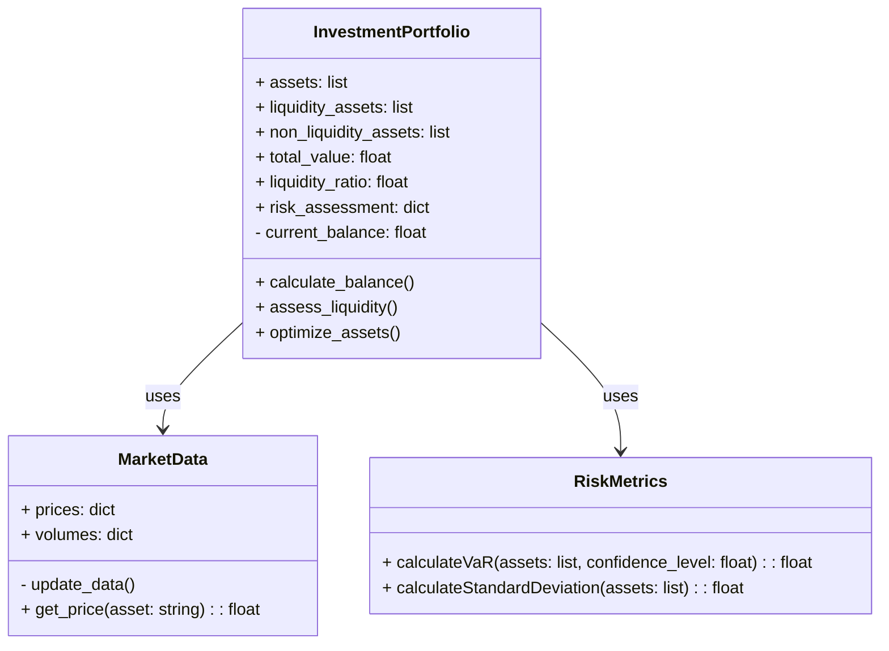
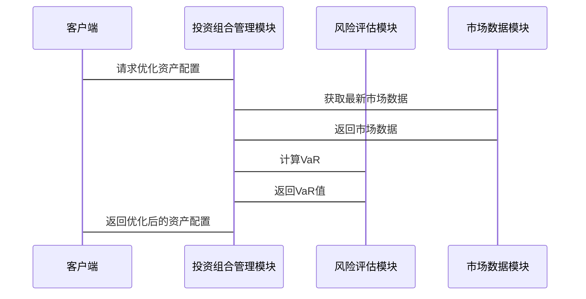

                 


# 格雷厄姆的工作资本策略：关注流动性

## 关键词：格雷厄姆、工作资本策略、流动性管理、投资策略、数学模型、系统架构

## 摘要：本文深入探讨了格雷厄姆的工作资本策略，重点分析了流动性在其投资策略中的核心作用。通过背景介绍、核心概念、数学模型、系统架构、项目实战和总结等部分，详细阐述了流动性管理的重要性及其在现代投资中的应用。文章结合理论与实践，提供了丰富的案例分析和数学模型，帮助读者全面理解并应用格雷厄姆的策略。

---

## 第一部分：格雷厄姆工作资本策略的背景与基础

### 第1章：格雷厄姆工作资本策略概述

#### 1.1 格雷厄姆的生平与投资理念

**1.1.1 格雷厄姆的生平简介**

本杰明·格雷厄姆（Benjamin Graham）是20世纪著名的投资学家，被誉为“价值投资之父”。他出生于1894年，毕业于哥伦比亚大学，曾在多家银行和投资公司工作。他的投资理念深刻影响了后来的投资者，包括沃伦·巴菲特。

**1.1.2 格雷厄姆的价值投资理论**

格雷厄姆提出的价值投资理论强调以低于内在价值的价格购买优质的公司股票。他认为市场短期波动不可预测，但长期来看，价格会回归其内在价值。因此，投资者应关注公司的基本面，寻找被市场低估的投资标的。

**1.1.3 工作资本策略的提出背景**

工作资本策略是格雷厄姆为应对市场波动而提出的一种资本管理方法。它强调在投资组合中保留足够的流动性，以应对市场的不确定性，并抓住投资机会。

#### 1.2 工作资本策略的核心概念

**1.2.1 工作资本的定义与特点**

工作资本是指投资者在投资过程中需要预留的、能够随时变现的资金。其特点包括安全性、流动性和稳定性。

**1.2.2 工作资本与传统资本管理的区别**

传统资本管理注重资本的保值和增值，而工作资本策略更强调流动性，注重在市场波动中保持灵活性。

**1.2.3 格雷厄姆策略在现代投资中的应用**

尽管格雷厄姆的策略最初是为应对市场波动，但其核心思想在现代投资中仍具有重要意义，尤其是在风险管理和资产配置方面。

---

## 第二部分：流动性管理的核心概念与策略

### 第2章：流动性管理的理论基础

#### 2.1 流动性与投资风险

**2.1.1 流动性的定义与分类**

流动性指资产快速变现而不损失价值的能力。可分为市场流动性、资金流动性和资产流动性。

**2.1.2 流动性对投资组合的影响**

流动性高的资产在市场下跌时更容易变现，但可能牺牲收益。流动性低的资产可能在市场波动中面临更大的损失。

**2.1.3 流动性风险的评估方法**

常用的评估方法包括流动性比率（如流动比率、速动比率）和流动性缺口分析。

#### 2.2 格雷厄姆策略中的流动性管理

**2.2.1 流动性在工作资本中的作用**

格雷厄姆认为，流动性是投资组合的重要组成部分，能够帮助投资者在市场恐慌时抓住机会。

**2.2.2 流动性管理的三要素：来源、分配、监控**

- **来源**：包括现金、短期债券等高流动性资产。
- **分配**：根据市场情况调整资产配置，确保足够的流动性。
- **监控**：定期评估投资组合的流动性状况，及时调整。

**2.2.3 流动性管理的动态调整机制**

根据市场波动和投资目标的变化，动态调整流动性资产的比例，以应对不确定性。

---

## 第三部分：流动性管理的数学模型与算法

### 第3章：流动性风险的数学评估

#### 3.1 流动性风险的量化方法

**3.1.1 流动性风险的度量指标**

- **流动性比率**：如流动比率、速动比率。
- **市场深度**：衡量资产在市场中的交易量和价格稳定性。

**3.1.2 使用标准差衡量资产波动性**

标准差反映了资产价格的波动程度，波动性越高，流动性风险越大。

**3.1.3 风险价值（VaR）模型的应用**

VaR模型用于估计投资组合在一定置信水平下的潜在损失，帮助评估流动性风险。

#### 3.2 资本配置的优化算法

**3.2.1 线性规划模型在流动性管理中的应用**

线性规划模型用于在流动性约束下优化资本配置，最大化收益或最小化风险。

**3.2.2 Markowitz有效组合理论**

通过优化资产组合，找到在给定风险水平下的最优收益，或在给定收益下的最小风险。

**3.2.3 算法实现与案例分析**

- **Python代码实现**：使用Scipy.optimize模块进行优化计算。
- **案例分析**：假设一个投资组合，优化其流动性配置，计算最优解。

---

## 第四部分：系统分析与架构设计方案

### 第4章：系统架构设计

#### 4.1 问题场景介绍

假设一个投资者希望应用格雷厄姆的策略，构建一个投资组合，其中需要管理流动性资产和非流动性资产。

#### 4.2 系统功能设计（领域模型Mermaid类图）



#### 4.3 系统架构设计（Mermaid架构图）


#### 4.4 系统接口设计

- 投资组合管理模块接口：
  - `get_current_balance()`
  - `calculate_liquidity_ratio()`
  - `optimize_asset_allocations()`
- 风险评估模块接口：
  - `calculateVaR(confidence_level: float) -> float`
  - `calculateStandardDeviation() -> float`

#### 4.5 系统交互（Mermaid序列图）



---

## 第五部分：项目实战

### 第5章：项目实战分析

#### 5.1 环境安装

安装必要的Python库，如NumPy、Pandas、Scipy、Matplotlib。

```bash
pip install numpy pandas scipy matplotlib
```

#### 5.2 核心代码实现

**5.2.1 计算流动性比率**

```python
import numpy as np
import pandas as pd

def calculate_liquidity_ratio(assets):
    liquid_assets = [a for a in assets if a['type'] == 'liquid']
    total_liabilities = sum(a['value'] for a in assets if a['type'] == 'liability')
    return sum(a['value'] for a in liquid_assets) / total_liabilities
```

**5.2.2 计算VaR**

```python
from scipy.stats import norm

def calculate VaR(assets, confidence_level=0.95):
    returns = pd.DataFrame([a['return'] for a in assets])
    std_dev = returns.std()
    z_score = norm.ppf(1 - confidence_level)
    VaR = z_score * std_dev
    return VaR
```

**5.2.3 优化资产配置**

```python
from scipy.optimize import minimize

def optimize_assets(assets, target_return):
    # 定义目标函数和约束条件
    # 使用线性规划或其他优化方法
    # 返回优化后的资产配置
    pass
```

#### 5.3 案例分析

假设一个投资组合，包括股票、债券和现金。通过分析市场数据，计算流动性比率和VaR，优化资产配置。

#### 5.4 结果解读

根据优化结果，调整资产配置，确保在保证流动性的同时，最大化收益或最小化风险。

---

## 第六部分：总结与展望

### 第6章：总结与展望

#### 6.1 总结

本文全面探讨了格雷厄姆的工作资本策略，特别是流动性管理在投资中的重要性。通过理论分析、数学模型和系统设计，展示了如何在实际中应用这些策略。

#### 6.2 最佳实践 tips

- 定期评估投资组合的流动性状况。
- 根据市场变化动态调整资产配置。
- 使用数学模型和工具辅助决策。

#### 6.3 展望

未来，随着技术的发展，如人工智能和大数据分析，流动性管理将更加精准和高效。投资者应持续学习和适应市场的变化，以抓住更多的投资机会。

---

## 作者：AI天才研究院/AI Genius Institute & 禅与计算机程序设计艺术 /Zen And The Art of Computer Programming

---

这篇文章详细探讨了格雷厄姆的工作资本策略，结合理论与实践，为读者提供了全面的分析和指导。通过系统的章节安排和详细的代码示例，帮助读者理解并应用流动性管理在投资中的重要性。

