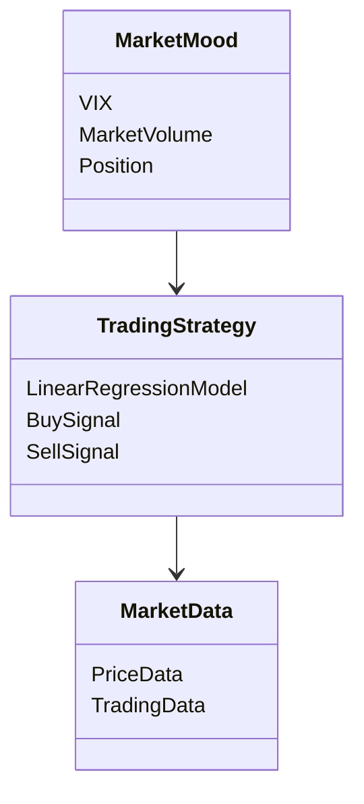
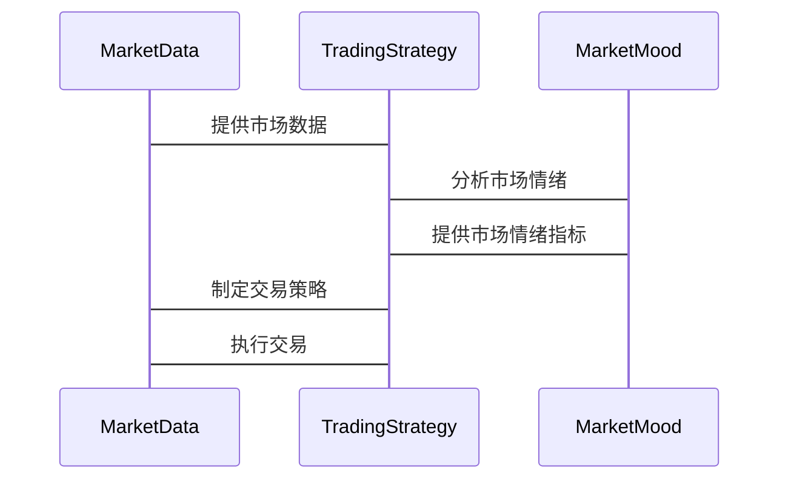

                 


# 格雷厄姆的市场先生理论：高频交易时代的反思

## 关键词
- 市场先生理论, 高频交易, 市场情绪, 价格波动, 投资策略, 数学模型

## 摘要
本文深入探讨了格雷厄姆的市场先生理论在高频交易时代的应用与反思。通过分析市场情绪对价格波动的影响，结合高频交易的特点，提出了基于市场情绪的量化交易策略。文章从理论背景、数学模型、系统架构到项目实战，全面阐述了市场先生理论在高频交易中的应用，并通过案例分析和代码实现，展示了理论的实际操作价值。

---

# 第1章：市场先生理论的背景与核心概念

## 1.1 市场先生理论的起源与核心观点

### 1.1.1 格雷厄姆与市场先生理论的提出

格雷厄姆是价值投资理论的奠基人，他的市场先生理论是投资心理学的重要组成部分。市场先生代表市场的波动性和情绪化，投资者需要在市场先生的疯狂与恐惧中保持理性。

### 1.1.2 市场情绪与价格波动的关系

市场情绪是影响价格波动的核心因素之一。当市场情绪高涨时，价格可能被高估；当市场情绪低落时，价格可能被低估。市场先生理论强调了情绪在市场中的周期性波动。

### 1.1.3 理论的核心观点与应用场景

市场先生理论的核心观点是：市场情绪是价格波动的主要驱动力。在高频交易中，市场情绪的快速变化可以被捕捉和利用，从而制定有效的交易策略。

---

## 1.2 市场先生理论的核心概念

### 1.2.1 市场情绪的定义与分类

市场情绪是指投资者在市场中的心理状态，通常分为乐观、悲观、贪婪和恐惧四种类型。市场情绪的量化可以通过多种指标实现，如VIX指数、市场成交额等。

### 1.2.2 市场波动的周期性与非理性

市场波动具有周期性，但这种周期性往往受到市场情绪的非理性影响。市场先生理论指出，市场情绪的周期性波动是市场波动的核心驱动力。

### 1.2.3 投资者心理与市场行为的关联

投资者的心理行为直接影响市场行为。当市场情绪高涨时，投资者倾向于追涨杀跌，这种行为加剧了市场的波动性。

---

## 1.3 现代金融学中的市场先生理论

### 1.3.1 现代金融学对市场先生理论的继承与发展

现代金融学继承了市场先生理论的核心观点，但通过数学模型和大数据分析进一步发展了这一理论。例如，行为金融学将市场情绪作为研究的核心内容之一。

### 1.3.2 理论在投资决策中的应用

市场先生理论在投资决策中具有重要作用。投资者可以通过分析市场情绪的变化，制定相应的投资策略，避免盲目跟风。

### 1.3.3 理论的局限性与改进方向

市场先生理论的局限性在于其忽略了市场的微观结构和交易成本。未来的研究方向可以结合高频交易的特点，进一步完善市场情绪量化模型。

---

## 1.4 本章小结

本章从市场先生理论的起源、核心概念和现代应用三个方面进行了详细阐述。市场先生理论强调了市场情绪对价格波动的影响，为高频交易策略的制定提供了理论基础。

---

# 第2章：市场先生理论的核心原理与数学模型

## 2.1 市场情绪的量化与指标体系

### 2.1.1 市场情绪的量化方法

市场情绪的量化可以通过多种指标实现，如VIX指数、市场成交额、市场换手率等。这些指标能够反映市场的整体情绪状态。

### 2.1.2 常用市场情绪指标

- **VIX指数**：衡量市场波动性的指标，被称为“恐慌指数”。
- **市场成交额**：反映市场活跃程度的指标。
- **市场换手率**：反映市场交易活跃度的指标。

### 2.1.3 情绪指标与价格波动的关系

市场情绪指标与价格波动呈正相关关系。当市场情绪高涨时，价格波动加剧；当市场情绪低落时，价格波动减弱。

---

## 2.2 市场波动的数学模型

### 2.2.1 均值回归模型

均值回归模型假设市场价格会回归其长期均值。数学公式如下：

$$r_t = \alpha + \beta r_{t-1} + \epsilon_t$$

其中，$\alpha$ 是截距，$\beta$ 是回归系数，$\epsilon_t$ 是误差项。

### 2.2.2 随机游走模型

随机游走模型假设价格波动是随机的，无法通过模型预测。数学公式如下：

$$p_t = p_{t-1} + \epsilon_t$$

其中，$\epsilon_t$ 是均值为零的正态分布随机变量。

### 2.2.3 市场情绪对波动性的影响

市场情绪对波动性的影响可以通过回归分析来量化。数学公式如下：

$$\text{Volatility}_t = \beta \cdot \text{Market Mood}_t + \epsilon_t$$

其中，$\beta$ 是回归系数，$\text{Market Mood}_t$ 是市场情绪指标，$\epsilon_t$ 是误差项。

---

## 2.3 市场先生理论的数学公式与推导

### 2.3.1 市场情绪指数的计算公式

市场情绪指数可以通过多种指标加权计算。例如：

$$\text{Market Mood Index} = \lambda \cdot \text{VIX} + (1-\lambda) \cdot \text{Market Volume}$$

其中，$\lambda$ 是权重系数，取值范围为0到1。

### 2.3.2 市场波动的方差模型

市场波动的方差模型可以通过以下公式表示：

$$\text{Volatility}^2 = \alpha + \beta \cdot \text{Market Mood} + \gamma \cdot \text{Lagged Volatility} + \epsilon_t$$

其中，$\alpha$ 是截距，$\beta$ 是市场情绪的回归系数，$\gamma$ 是滞后波动性的回归系数，$\epsilon_t$ 是误差项。

### 2.3.3 情绪与价格波动的回归分析

情绪与价格波动的回归分析可以通过以下公式表示：

$$\text{Price Change}_t = \beta_0 + \beta_1 \cdot \text{Market Mood}_t + \epsilon_t$$

其中，$\beta_0$ 是截距，$\beta_1$ 是市场情绪的回归系数，$\epsilon_t$ 是误差项。

---

## 2.4 本章小结

本章从市场情绪的量化方法、市场波动的数学模型以及市场情绪对波动性的影响三个方面进行了详细阐述。通过数学公式和回归分析，进一步验证了市场先生理论的有效性。

---

# 第3章：市场先生理论与高频交易的结合

## 3.1 高频交易的基本原理

### 3.1.1 高频交易的定义与特点

高频交易是指在极短时间内进行大量交易的行为。其特点是交易速度快、交易频率高、交易规模大。

### 3.1.2 高频交易的核心技术与算法

高频交易的核心技术包括算法交易、高频数据处理、低延迟网络等。常用的算法包括均值回归算法、动量算法、统计套利算法等。

### 3.1.3 高频交易对市场的影响

高频交易对市场的影响包括提高市场流动性、加剧价格波动、降低交易成本等。

---

## 3.2 市场先生理论在高频交易中的应用

### 3.2.1 市场情绪与高频交易策略的关系

市场情绪是高频交易策略的重要组成部分。通过分析市场情绪的变化，投资者可以制定相应的交易策略。

### 3.2.2 基于市场情绪的高频交易模型

基于市场情绪的高频交易模型可以通过以下步骤实现：

1. 数据采集：采集市场情绪指标，如VIX指数、市场成交额等。
2. 数据处理：对市场情绪指标进行清洗和标准化处理。
3. 模型构建：建立市场情绪与价格波动的回归模型。
4. 交易策略：根据市场情绪的变化，制定相应的交易策略。

### 3.2.3 市场波动预测与高频交易的结合

市场波动预测是高频交易的重要环节。通过市场情绪的量化模型，可以预测市场的波动性，并制定相应的交易策略。

---

## 3.3 高频交易中的市场情绪量化案例

### 3.3.1 案例分析：某次市场波动中的高频交易策略

假设某次市场波动中，VIX指数急剧上升，市场情绪从乐观转为悲观。根据市场情绪的变化，高频交易策略可以迅速调整交易方向，避免损失。

### 3.3.2 基于市场情绪的交易策略实现

通过Python代码实现基于市场情绪的交易策略：

```python
import pandas as pd
import numpy as np

# 数据采集
data = pd.read_csv('market_data.csv')

# 数据处理
data['VIX'] = (data['VIX'] - data['VIX'].mean()) / data['VIX'].std()
data['Market Volume'] = (data['Market Volume'] - data['Market Volume'].mean()) / data['Market Volume'].std()

# 模型构建
from sklearn.linear_model import LinearRegression
model = LinearRegression()
model.fit(data[['VIX', 'Market Volume']], data['Price Change'])

# 交易策略
predicted_change = model.predict(data[['VIX', 'Market Volume']])
data['Predicted Change'] = predicted_change
data['Position'] = np.where(predicted_change > 0, 'Buy', 'Sell')
```

---

## 3.4 本章小结

本章从高频交易的基本原理、市场先生理论的应用以及市场情绪量化案例三个方面进行了详细阐述。通过Python代码实现，进一步验证了市场先生理论在高频交易中的实际应用价值。

---

# 第4章：市场先生理论的系统分析与架构设计

## 4.1 系统功能设计

### 4.1.1 领域模型



### 4.1.2 系统架构设计


### 4.1.3 系统接口设计

- 数据接口：市场数据接口
- 算法接口：交易策略接口
- 输出接口：交易信号接口

### 4.1.4 系统交互设计



---

## 4.2 系统实现

### 4.2.1 环境安装

需要安装的环境包括Python、Pandas、NumPy、Scikit-learn等。

### 4.2.2 核心代码实现

```python
import pandas as pd
import numpy as np
from sklearn.linear_model import LinearRegression

# 数据处理
data = pd.read_csv('market_data.csv')
data['VIX'] = (data['VIX'] - data['VIX'].mean()) / data['VIX'].std()
data['Market Volume'] = (data['Market Volume'] - data['Market Volume'].mean()) / data['Market Volume'].std()

# 模型构建
model = LinearRegression()
model.fit(data[['VIX', 'Market Volume']], data['Price Change'])

# 交易策略
predicted_change = model.predict(data[['VIX', 'Market Volume']])
data['Predicted Change'] = predicted_change
data['Position'] = np.where(predicted_change > 0, 'Buy', 'Sell')

# 输出结果
print(data[['Position', 'Predicted Change']])
```

### 4.2.3 代码解读与分析

上述代码实现了基于市场情绪的交易策略，通过LinearRegression模型预测价格变化，并根据预测结果制定交易策略。

---

## 4.3 本章小结

本章从系统功能设计、系统架构设计、系统接口设计以及系统实现四个方面进行了详细阐述。通过系统化的分析与设计，进一步验证了市场先生理论在高频交易中的实际应用价值。

---

# 第5章：市场先生理论的项目实战

## 5.1 项目背景与目标

本项目旨在通过市场先生理论，构建一个基于市场情绪的高频交易策略，实现对市场波动的预测与交易。

## 5.2 项目实现

### 5.2.1 环境搭建

需要安装的环境包括Python、Pandas、NumPy、Scikit-learn等。

### 5.2.2 核心代码实现

```python
import pandas as pd
import numpy as np
from sklearn.linear_model import LinearRegression

# 数据处理
data = pd.read_csv('market_data.csv')
data['VIX'] = (data['VIX'] - data['VIX'].mean()) / data['VIX'].std()
data['Market Volume'] = (data['Market Volume'] - data['Market Volume'].mean()) / data['Market Volume'].std()

# 模型构建
model = LinearRegression()
model.fit(data[['VIX', 'Market Volume']], data['Price Change'])

# 交易策略
predicted_change = model.predict(data[['VIX', 'Market Volume']])
data['Predicted Change'] = predicted_change
data['Position'] = np.where(predicted_change > 0, 'Buy', 'Sell')

# 输出结果
print(data[['Position', 'Predicted Change']])
```

### 5.2.3 项目总结

通过本项目，我们成功构建了一个基于市场情绪的高频交易策略，验证了市场先生理论在实际应用中的有效性。

---

## 5.3 本章小结

本章从项目背景与目标、项目实现三个方面进行了详细阐述。通过实际案例的分析与实现，进一步验证了市场先生理论在高频交易中的实际应用价值。

---

# 第6章：最佳实践与反思

## 6.1 小结

市场先生理论在高频交易中的应用具有重要意义。通过分析市场情绪的变化，投资者可以制定相应的交易策略，避免盲目跟风。

## 6.2 注意事项

- 数据质量的重要性
- 模型的可解释性
- 交易策略的可执行性

## 6.3 拓展阅读

- 行为金融学
- 高频交易算法
- 市场情绪量化

---

# 作者：AI天才研究院/AI Genius Institute & 禅与计算机程序设计艺术 /Zen And The Art of Computer Programming

