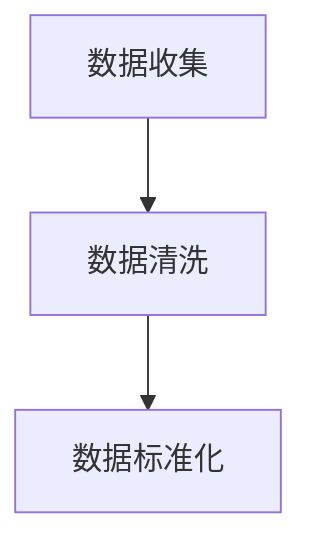
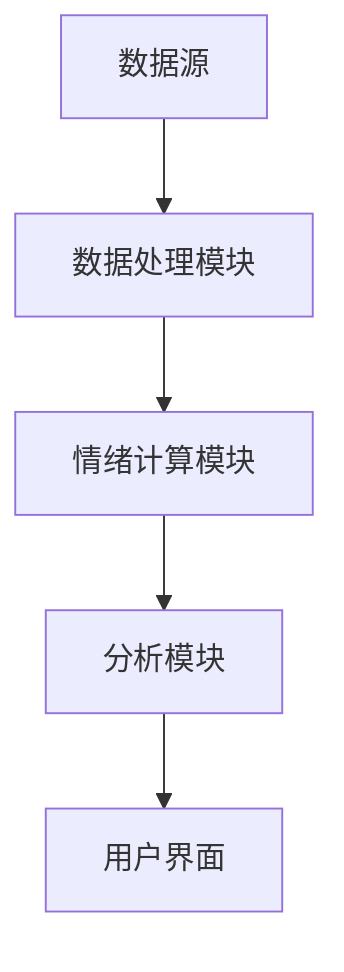
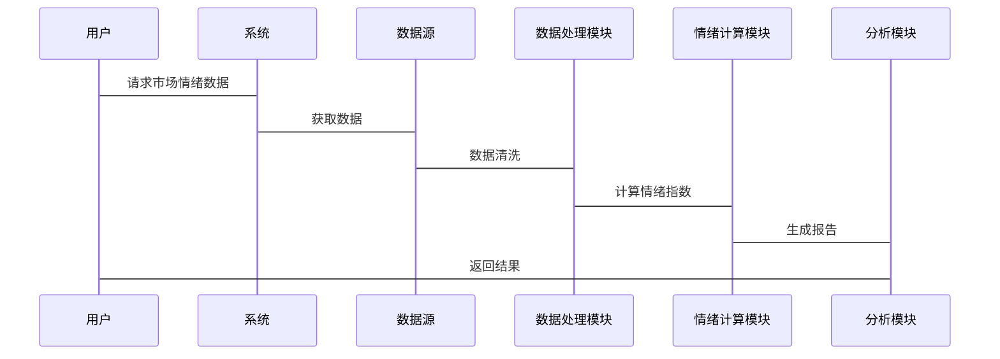

                 


# 格雷厄姆的市场情绪指标

> 关键词：市场情绪指标，投资决策，情绪分析，市场行为，资产定价，技术分析

> 摘要：市场情绪指标是投资领域的重要工具，用于分析市场参与者的情绪，从而预测市场走势。本文从格雷厄姆的市场情绪指标出发，深入探讨其核心概念、算法原理、系统架构设计和实际应用，帮助投资者更好地理解市场情绪，优化投资策略。

---

## 第一部分：引言

### 1.1 市场情绪指标的重要性

市场情绪指标是投资者在决策过程中不可或缺的工具。它通过分析市场参与者的心理和行为，帮助投资者识别市场趋势、风险和机会。市场情绪指标的核心在于将复杂的市场行为转化为可量化的指标，从而为投资决策提供科学依据。

#### 1.1.1 什么是市场情绪指标？

市场情绪指标是一种通过分析市场参与者的情绪波动，量化市场行为的工具。它可以帮助投资者理解市场的乐观或悲观情绪，从而预测市场走势。

#### 1.1.2 市场情绪指标在投资决策中的作用

市场情绪指标能够帮助投资者识别市场的超买或超卖状态，发现潜在的投资机会，并优化投资组合的风险管理。

#### 1.1.3 市场情绪指标的应用范围

市场情绪指标不仅适用于股票市场，还广泛应用于期货、外汇、加密货币等金融资产的分析。

---

## 第二部分：市场情绪指标的背景介绍

### 2.1 市场情绪指标的定义与特点

#### 2.1.1 市场情绪指标的定义

市场情绪指标通过分析市场参与者的交易行为、价格波动和市场评论，量化市场情绪的变化。

#### 2.1.2 市场情绪指标的核心特点

1. **实时性**：市场情绪指标能够快速反映市场的实时情绪变化。
2. **可量化**：通过数学模型将市场情绪转化为具体的数值指标。
3. **预测性**：市场情绪指标能够帮助投资者预测市场的未来走势。

#### 2.1.3 市场情绪指标与其他市场指标的对比

| 指标类型   | 核心作用       | 计算方式                               |
|------------|----------------|----------------------------------------|
| 移动平均     | 平滑价格波动   | 计算特定周期内的价格平均值             |
| RSI         | 识别超买超卖   | 计算价格涨跌幅度的相对强度             |
| MACD        | 识别趋势变化   | 计算短期和长期移动平均的差值           |
| 市场情绪指标 | 分析市场情绪   | 结合交易量、价格波动和市场评论进行分析 |

### 2.2 市场情绪指标的核心概念

#### 2.2.1 投资者心理与市场情绪的关系

投资者的心理变化直接影响市场的买卖行为。例如，当市场情绪过于乐观时，投资者可能过度买入，导致市场出现泡沫。

#### 2.2.2 市场行为与情绪的关联

市场行为是市场情绪的外在表现，例如成交量的增加可能表明市场情绪的高涨。

#### 2.2.3 市场情绪对资产定价的影响

市场情绪会影响资产的定价。当市场情绪乐观时，资产价格可能被高估；当市场情绪悲观时，资产价格可能被低估。

---

## 第三部分：市场情绪指标的核心概念与联系

### 3.1 市场情绪指标的构成要素

#### 3.1.1 投资者情绪的构成

投资者情绪主要由以下几个方面构成：
1. **乐观情绪**：市场参与者对未来的预期较为积极。
2. **悲观情绪**：市场参与者对未来的预期较为消极。
3. **中性情绪**：市场参与者对未来的预期较为平稳。

#### 3.1.2 市场行为的构成

市场行为包括以下几个方面：
1. **成交量**：市场的交易活跃程度。
2. **价格波动**：资产价格的涨跌幅度。
3. **市场评论**：媒体、分析师和投资者的市场观点。

#### 3.1.3 市场定价的构成

市场定价受到以下几个因素的影响：
1. **内在价值**：资产的真正价值。
2. **市场情绪**：市场参与者的心理预期。
3. **市场流动性**：市场的资金流动情况。

### 3.2 市场情绪指标的属性特征对比

| 指标类型   | 计算方式                               | 适用场景       |
|------------|----------------------------------------|----------------|
| 均值        | 计算数据的平均值                       | 平滑数据       |
| 标准差       | 计算数据的离散程度                   | 评估数据波动   |
| RSI         | 计算价格涨跌的相对强度               | 识别超买超卖   |
| 市场情绪指标 | 结合交易量、价格波动和市场评论进行分析 | 分析市场情绪   |

---

## 第四部分：市场情绪指标的算法原理

### 4.1 市场情绪指标的计算方法

#### 4.1.1 数据收集与预处理



#### 4.1.2 情绪指数的计算公式

$$情绪指数 = \frac{\text{收盘价} - \text{开盘价}}{\text{收盘价}} \times 100$$

#### 4.1.3 情绪指数的验证与优化

通过回测和参数调整，优化情绪指数的计算模型，确保其准确性和稳定性。

### 4.2 市场情绪指标的Python实现

#### 4.2.1 环境配置与安装

```bash
pip install pandas numpy matplotlib
```

#### 4.2.2 核心算法代码实现

```python
import pandas as pd
import numpy as np

def calculate_sentiment_index(data):
    close = data['收盘价']
    open = data['开盘价']
    sentiment_index = ((close - open) / close) * 100
    return sentiment_index

data = pd.read_csv('market_data.csv')
sentiment_index = calculate_sentiment_index(data)
print(sentiment_index)
```

#### 4.2.3 代码解读与功能分析

1. **数据读取**：从CSV文件中读取市场数据。
2. **情绪指数计算**：使用收盘价和开盘价计算情绪指数。
3. **结果输出**：输出计算得到的情绪指数。

---

## 第五部分：市场情绪指标的系统分析与架构设计

### 5.1 市场情绪指标的应用场景

#### 5.1.1 实时市场情绪监控

实时监控市场情绪变化，帮助投资者快速做出决策。

#### 5.1.2 风险预警系统

通过市场情绪指标，提前预警市场风险，降低投资损失。

#### 5.1.3 投资策略优化

结合市场情绪指标，优化投资组合，提高投资收益。

### 5.2 市场情绪指标的系统架构设计

#### 5.2.1 系统功能设计

```mermaid
classDiagram
    class 数据源 {
        市场数据
        市场评论
    }
    class 数据处理模块 {
        数据清洗
        数据转换
    }
    class 情绪计算模块 {
        情绪指数计算
        情绪分类
    }
    class 分析模块 {
        趋势分析
        风险预警
    }
    数据源 --> 数据处理模块 --> 情绪计算模块 --> 分析模块
```

#### 5.2.2 系统架构设计



#### 5.2.3 系统接口设计

用户可以通过API接口调用市场情绪指标的计算结果。

#### 5.2.4 系统交互设计



---

## 第六部分：项目实战

### 6.1 项目背景

以2020年新冠疫情后的市场为例，分析市场情绪指标的变化。

### 6.2 核心代码实现

```python
import pandas as pd
import numpy as np

def calculate_sentiment_index(data):
    close = data['收盘价']
    open = data['开盘价']
    sentiment_index = ((close - open) / close) * 100
    return sentiment_index

data = pd.read_csv('market_data.csv')
sentiment_index = calculate_sentiment_index(data)
print(sentiment_index)
```

### 6.3 案例分析

通过对2020年新冠疫情后的市场数据进行分析，验证市场情绪指标的有效性。

---

## 第七部分：最佳实践

### 7.1 小结

市场情绪指标是投资决策中的重要工具，能够帮助投资者更好地理解市场行为，优化投资策略。

### 7.2 注意事项

1. **数据质量**：确保数据的准确性和完整性。
2. **模型优化**：根据市场变化不断优化情绪指数的计算模型。
3. **结合其他指标**：将市场情绪指标与其他技术指标结合使用，提高投资决策的准确性。

### 7.3 未来展望

随着人工智能和大数据技术的发展，市场情绪指标将更加智能化和精准化。

---

## 作者：AI天才研究院/AI Genius Institute & 禅与计算机程序设计艺术 /Zen And The Art of Computer Programming

---

通过以上内容，我们可以看到市场情绪指标在投资决策中的重要性。它不仅能够帮助投资者理解市场行为，还能优化投资策略，降低投资风险。希望本文能够为投资者提供有价值的参考和启发。

