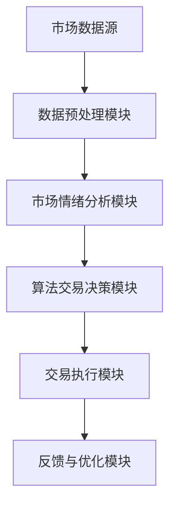
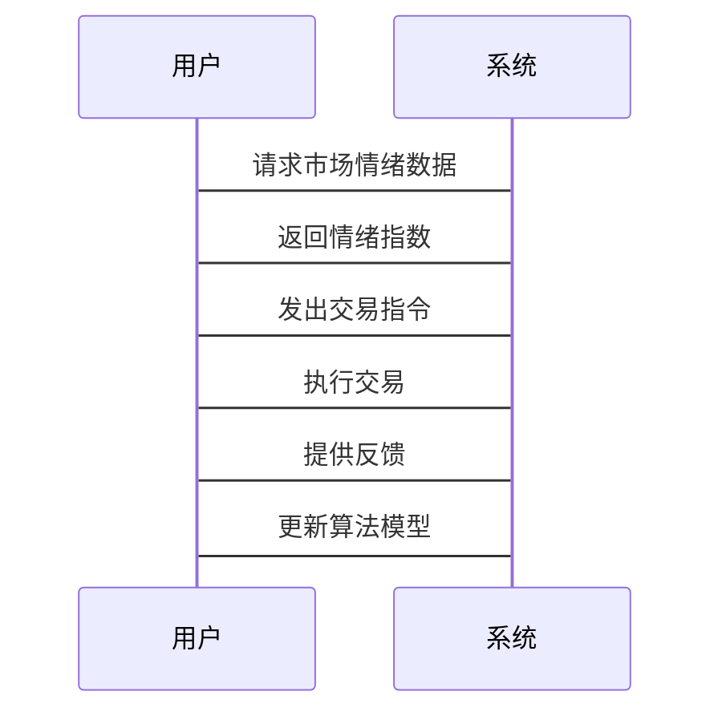

                 

# 格雷厄姆的市场情绪理论：应对算法交易的影响

> **关键词**：格雷厄姆、市场情绪理论、算法交易、市场行为分析、技术分析  
> **摘要**：本文深入探讨了格雷厄姆的市场情绪理论及其在现代金融市场的应用，特别是算法交易对市场情绪的影响。通过分析市场情绪与算法交易的关系，本文提出了应对算法交易影响的策略，为投资者提供了理论支持和实践指导。

---

## 第一部分：市场情绪理论与算法交易的背景

### 第1章：市场情绪理论的起源与发展

#### 1.1 格雷厄姆的市场情绪理论概述

##### 1.1.1 市场情绪理论的定义
市场情绪理论是投资学中的一个重要理论，主要研究投资者情绪对市场行为的影响。格雷厄姆在《智慧的投资者》中提出，市场的价格波动往往与投资者的心理预期有关。市场情绪可以通过投资者的行为数据、新闻传播和社交媒体分析来衡量。

##### 1.1.2 格雷厄姆的市场情绪理论核心观点
格雷厄姆认为，市场情绪具有周期性，且投资者的情绪波动会放大市场的波动性。市场情绪可以分为乐观和悲观两类，分别对应市场的上涨和下跌趋势。

##### 1.1.3 理论的背景与历史发展
市场情绪理论起源于20世纪初，格雷厄姆是该领域的先驱之一。随着金融市场的不断发展，市场情绪理论在实践中得到了广泛应用，尤其是在算法交易兴起的背景下，市场情绪分析变得更加重要。

#### 1.2 算法交易的兴起

##### 1.2.1 算法交易的基本概念
算法交易是指利用计算机算法自动执行交易决策的过程。它基于数学模型和大数据分析，能够在极短的时间内完成交易。

##### 1.2.2 算法交易的技术基础
算法交易依赖于高速数据处理、数学建模和分布式计算技术。其核心在于通过算法捕捉市场中的微小价格波动，从而实现盈利。

##### 1.2.3 算法交易对市场的深远影响
算法交易的普及显著提高了交易效率，但也带来了市场波动性增加、交易成本降低等问题。算法交易还可能导致市场的短期波动，影响市场情绪的稳定性。

---

### 第2章：市场情绪与算法交易的相互作用

#### 2.1 市场情绪的多维度分析

##### 2.1.1 投资者情绪的分类
投资者情绪可以分为理性情绪和非理性情绪。理性情绪基于基本面分析，而非理性情绪则受到市场情绪波动的影响。

##### 2.1.2 市场情绪的周期性特征
市场情绪具有周期性，通常表现为“乐观→狂热→恐慌→绝望→复苏”的循环。

##### 2.1.3 市场情绪与市场波动的关系
市场情绪的波动会直接影响市场的价格波动。当市场情绪过于乐观时，价格可能被高估；当市场情绪过于悲观时，价格可能被低估。

#### 2.2 算法交易对市场情绪的影响

##### 2.2.1 算法交易如何放大市场情绪
算法交易能够快速响应市场情绪的变化，从而放大市场的波动性。例如，算法交易可以迅速推高价格，引发更多的买入行为。

##### 2.2.2 算法交易引发的市场情绪波动
算法交易的高频交易特性可能导致市场的短期情绪波动。例如，算法交易可能在短时间内触发大量的止损订单，加剧市场的恐慌情绪。

##### 2.2.3 算法交易对市场情绪的预测作用
通过分析市场情绪数据，算法交易可以预测市场的未来走势。例如，当市场情绪指数高于历史平均水平时，算法交易可能会预测市场将出现下跌趋势。

---

### 第3章：格雷厄姆市场情绪理论的数学模型

#### 3.1 市场情绪指数的构建

##### 3.1.1 情绪指数的定义与计算公式
市场情绪指数（Market Sentiment Index, MSI）是用来衡量市场情绪的指标。其计算公式如下：

$$
\text{MSI} = \frac{\text{买入信号} - \text{卖出信号}}{\text{买入信号} + \text{卖出信号}}
$$

其中，买入信号和卖出信号分别代表投资者的买卖行为。

##### 3.1.2 情绪指数的时间序列分析
通过时间序列分析，可以发现市场情绪的变化趋势。例如，使用ARIMA模型对市场情绪指数进行预测。

##### 3.1.3 情绪指数与市场波动的关系
市场情绪指数与市场波动性呈正相关关系。当市场情绪指数较高时，市场波动性较大。

#### 3.2 算法交易的数学模型

##### 3.2.1 算法交易的基本原理
算法交易基于数学模型，通过分析市场数据来生成交易信号。例如，使用移动平均线（MA）模型进行交易决策。

##### 3.2.2 算法交易的数学公式
以下是一个简单的算法交易模型：

$$
\text{交易信号} = f(\text{价格数据}, \text{参数})
$$

其中，$f$ 是一个函数，$\text{价格数据}$ 包括收盘价、开盘价等，$\text{参数}$ 包括移动平均线的天数等。

---

### 第4章：市场情绪与算法交易的系统架构设计

#### 4.1 系统功能设计

##### 4.1.1 市场情绪监测模块
市场情绪监测模块负责收集和分析市场情绪数据，生成市场情绪指数。

##### 4.1.2 算法交易执行模块
算法交易执行模块根据市场情绪指数生成交易信号，并执行交易。

##### 4.1.3 数据分析与反馈模块
数据分析与反馈模块负责分析交易结果，优化算法模型。

#### 4.2 系统架构图
以下是系统的架构图：

#### 4.3 接口设计与交互流程

##### 4.3.1 系统接口设计
系统接口包括数据输入接口、交易执行接口和反馈接口。

##### 4.3.2 系统交互流程图
以下是系统的交互流程图：

---

## 第五部分：应对算法交易影响的最佳实践

### 第5章：市场情绪与算法交易的平衡

#### 5.1 优化算法交易模型

##### 5.1.1 引入市场情绪反馈机制
通过引入市场情绪反馈机制，可以优化算法交易模型。例如，当市场情绪过于乐观时，算法交易模型可以降低仓位。

##### 5.1.2 结合基本面分析
将基本面分析与算法交易相结合，可以减少市场情绪波动对交易决策的干扰。

#### 5.2 提高市场情绪分析的准确性

##### 5.2.1 使用多源数据
通过收集更多的市场数据，例如社交媒体数据和新闻数据，可以提高市场情绪分析的准确性。

##### 5.2.2 优化算法模型
通过优化算法模型，例如使用深度学习模型，可以提高市场情绪预测的准确性。

#### 5.3 加强风险管理

##### 5.3.1 设置止损机制
通过设置止损机制，可以减少市场情绪波动对投资组合的影响。

##### 5.3.2 分散投资
通过分散投资，可以降低算法交易对市场情绪的影响。

---

## 第六部分：结论与展望

### 6.1 结论

本文深入探讨了格雷厄姆的市场情绪理论及其在算法交易中的应用。通过分析市场情绪与算法交易的关系，提出了应对算法交易影响的策略。

### 6.2 未来展望

未来，随着算法交易的不断发展，市场情绪分析将更加重要。通过引入人工智能和大数据技术，可以进一步提高市场情绪分析的准确性，优化算法交易模型。

---

## 参考文献

1. 格雷厄姆，本杰明. 《智慧的投资者》. 北京：机械工业出版社，2012.
2. 肖恩·O. 霍尔特. 《算法交易：机.conflict

---

**作者：AI天才研究院/AI Genius Institute & 禅与计算机程序设计艺术 /Zen And The Art of Computer Programming**

