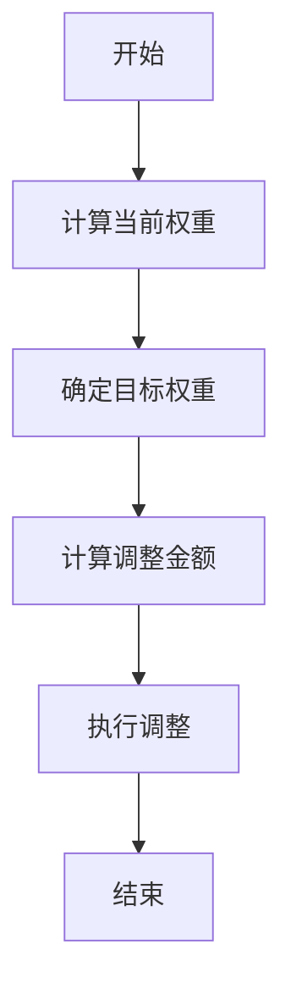
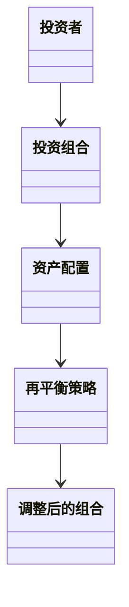

                 


# 《格雷厄姆的投资组合再平衡策略》

---

## 关键词：  
投资组合再平衡、资产配置、价值投资、投资策略、风险管理、投资组合优化  

---

## 摘要：  
本文深入分析了格雷厄姆的投资组合再平衡策略，从其核心概念、数学模型、系统架构到实际应用进行了全面探讨。通过详细的逻辑推理和实例分析，揭示了如何通过动态调整资产配置来优化投资组合，降低风险并实现长期收益目标。文章内容包括背景介绍、核心概念、数学模型、系统架构、项目实战以及最佳实践等，旨在为投资者提供理论与实践相结合的指导。

---

## 第一部分：投资组合再平衡策略概述

### 第1章：投资组合再平衡的背景与意义

#### 1.1 投资组合再平衡的定义与核心概念
- **1.1.1 投资组合再平衡的定义**  
  投资组合再平衡是指根据市场变化、资产表现和个人投资目标的变化，定期或不定期地调整投资组合中各资产的配置比例，以维持既定的投资策略和风险收益目标。

- **1.1.2 投资组合再平衡的核心要素**  
  - **资产配置**：不同资产类别在组合中的比例，如股票、债券、现金等。  
  - **投资目标**：收益目标和风险承受能力。  
  - **市场环境**：宏观经济环境、市场波动等。  

- **1.1.3 投资组合再平衡的意义与目标**  
  - 维持资产配置的纪律性，避免偏离初始投资策略。  
  - 降低风险，避免过度集中于某一资产类别。  
  - 利用市场波动，低位买入，高位卖出，实现超额收益。  

#### 1.2 投资组合再平衡的背景与问题背景
- **1.2.1 资产配置与投资组合管理的重要性**  
  资产配置是投资组合管理的核心，决定了组合的收益和风险特征。合理的资产配置能够分散风险，提高收益稳定性。  

- **1.2.2 再平衡策略的必要性**  
  随着市场波动和资产价格的变化，投资组合的实际资产比例会偏离初始配置。如果不及时调整，可能导致风险超限或收益不达预期。  

- **1.2.3 格雷厄姆投资理念与再平衡策略的关系**  
  格雷厄姆强调安全边际和长期投资，再平衡策略是其实现投资目标的重要手段之一。  

---

### 第2章：投资组合再平衡的核心概念与联系

#### 2.1 核心概念原理
- **2.1.1 资产配置的动态调整**  
  资产配置需要根据市场环境和个人目标进行动态调整，而非一成不变。  

- **2.1.2 投资组合的风险与收益平衡**  
  再平衡策略通过调整资产比例，优化风险与收益的平衡，避免单一资产的剧烈波动对整体组合的影响。  

- **2.1.3 再平衡策略与投资目标的关系**  
  再平衡策略是实现投资目标的重要工具，通过定期调整确保组合表现符合预期。  

#### 2.2 核心概念属性特征对比表格
| 概念       | 定义                                                                 | 特性                   | 示例                     |
|------------|----------------------------------------------------------------------|------------------------|--------------------------|
| 资产配置   | 不同资产类别在组合中的比例                                           | 灵活性、分散性         | 股票、债券、现金         |
| 再平衡策略 | 根据市场变化调整资产比例                                             | 定期性、主动性         | 定期再平衡、事件驱动再平衡|
| 投资目标   | 组合的收益与风险目标                                                 | 稳定性、长期性         | 高收益、低风险           |

#### 2.3 ER实体关系图（Mermaid流程图）


---

### 第3章：投资组合再平衡的数学模型与算法

#### 3.1 数学模型
- **3.1.1 投资组合权重计算公式**  
  $$ w_i = \frac{A_i}{\sum_{j=1}^{n} A_j} $$
  其中，\( w_i \) 表示第 \( i \) 个资产的权重，\( A_i \) 表示第 \( i \) 个资产的金额，\( n \) 表示资产总数。  

- **3.1.2 再平衡调整公式**  
  $$ A_i' = w_i \times T $$
  其中，\( A_i' \) 表示调整后的第 \( i \) 个资产金额，\( T \) 表示调整后的总金额。  

#### 3.2 算法流程图（Mermaid）


---

### 第4章：投资组合再平衡的系统分析与架构设计

#### 4.1 系统分析
- **4.1.1 问题场景介绍**  
  投资者需要根据市场变化调整投资组合，确保资产配置符合投资目标。  

- **4.1.2 项目介绍**  
  开发一个自动化再平衡系统，帮助投资者实现动态资产配置。  

- **4.1.3 系统功能需求**  
  - 计算当前资产权重。  
  - 确定目标权重。  
  - 计算调整金额。  
  - 执行调整并记录历史数据。  

#### 4.2 系统架构设计
- **4.2.1 领域模型（Mermaid类图）**


---

## 第二部分：投资组合再平衡策略的项目实战

### 第5章：项目实战

#### 5.1 环境安装
- 安装Python和必要的库，如NumPy、Pandas、Matplotlib等。

#### 5.2 核心实现源代码
```python
import numpy as np
import pandas as pd

def calculate_weights/assets):
    return assets / assets.sum()

def rebalance_portfolio(current_assets, target_weights):
    current_weights = calculate_weights(current_assets)
    target_weights = np.array(target_weights)
    rebalanced_assets = current_assets * (target_weights / current_weights)
    return rebalanced_assets
```

#### 5.3 代码应用解读与分析
- 计算当前权重：使用 `calculate_weights` 函数。  
- 确定目标权重：根据投资目标设定。  
- 计算调整金额：通过 `rebalance_portfolio` 函数实现。  

#### 5.4 实际案例分析
- 假设初始资产为 $100,000，目标权重为股票60%、债券30%、现金10%。  
- 市场波动导致股票跌至50%，债券涨至40%，现金10%。  
- 通过再平衡策略，将股票调整回60%，债券调整回30%。  

---

## 第三部分：总结与展望

### 第6章：最佳实践与注意事项
- 定期检查投资组合的再平衡情况。  
- 根据市场环境和个人目标动态调整策略。  
- 注意交易成本和税务影响。  

### 第7章：小结与展望
- 本文详细介绍了格雷厄姆的投资组合再平衡策略，从理论到实践进行了全面分析。  
- 未来可以在动态资产配置和风险管理方面进行更深入的研究。

---

## 作者：  
**AI天才研究院/AI Genius Institute & 禅与计算机程序设计艺术 /Zen And The Art of Computer Programming**  

---

感谢您的阅读！如果需要进一步探讨或技术支持，请随时联系。

