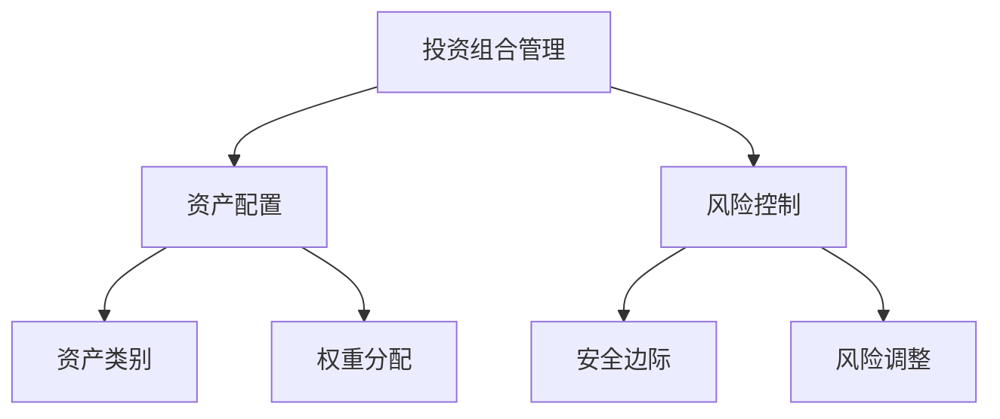
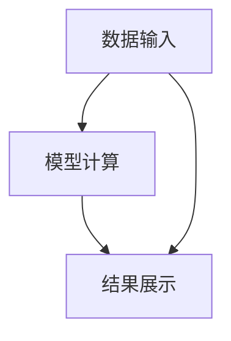
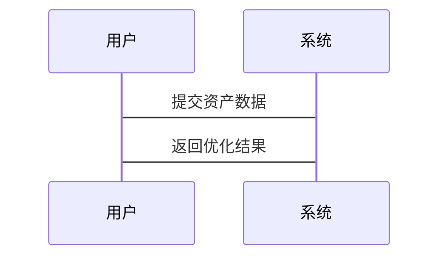

                 


# 格雷厄姆的投资组合管理

> 关键词：投资组合管理, 格雷厄姆, 价值投资, 风险控制, 资产配置, 投资策略

> 摘要：本文深入探讨了格雷厄姆的投资组合管理理念，结合现代投资组合理论，详细分析了其核心思想、数学模型、系统设计与实际应用。通过背景介绍、核心概念、算法实现、系统架构和项目实战的逐步讲解，帮助读者全面理解投资组合管理的理论与实践。

---

# 第1章: 投资组合管理概述

## 1.1 投资组合管理的背景与意义

### 1.1.1 投资组合管理的定义
投资组合管理是指通过科学的方法选择和配置资产，以实现投资目标的过程。它不仅关注单个资产的表现，更注重资产组合的整体风险和收益平衡。

### 1.1.2 投资组合管理的重要性
在现代金融体系中，投资组合管理是降低风险、提高收益的重要工具。通过合理的资产配置，投资者可以在不同市场条件下优化投资表现。

### 1.1.3 格雷厄姆投资理念的核心思想
本杰明·格雷厄姆是价值投资的鼻祖，他强调安全边际和长期投资。他认为，投资的本质是寻找具有内在价值的资产，并以合理的价格买入，长期持有。

### 1.1.4 核心概念对比表
| 概念 | 格雷厄姆的理念 | 现代投资组合理论 |
|------|----------------|-----------------|
| 风险控制 | 安全边际 | 风险-收益曲线 |
| 资产配置 | 价值导向 | 数学优化 |

### 1.1.5 概念结构图（Mermaid）


---

## 1.2 格雷厄姆的投资哲学

### 1.2.1 价值投资的定义
价值投资强调以低于内在价值的价格买入资产，长期持有，等待价格回归。

### 1.2.2 安全边际的概念
安全边际是资产的市场价格低于其内在价值的部分，是投资中的“安全垫”。

### 1.2.3 长期投资与复利效应
格雷厄姆强调复利的重要性，认为长期投资是实现财富增长的最佳方式。

### 1.2.4 长期与短期投资对比
| 时间维度 | 长期投资 | 短期投资 |
|----------|----------|----------|
| 风险 | 低 | 高 |
| 收益 | 稳定 | 波动 |

---

## 1.3 投资组合管理的目标与原则

### 1.3.1 投资组合管理的目标
1. 最大化收益
2. 最小化风险
3. 优化资产配置

### 1.3.2 格雷厄姆的投资原则
1. 买入具有安全边际的资产
2. 长期持有优质资产
3. 避免过度交易

### 1.3.3 投资组合的风险与收益平衡
格雷厄姆认为，投资组合的收益与风险成正比，但通过合理的资产配置可以实现收益与风险的平衡。

---

## 1.4 本章小结

本章介绍了投资组合管理的背景与意义，详细阐述了格雷厄姆的投资哲学，包括价值投资、安全边际和长期投资的核心思想，并通过对比分析和概念图展示了其与现代投资组合理论的联系。

---

# 第2章: 资产配置与风险评估

## 2.1 资产配置的理论基础

### 2.1.1 资产配置的定义
资产配置是指根据投资目标，在不同资产类别之间分配资金的过程。

### 2.1.2 资产配置的分类
1. 战略性资产配置
2. 指数化资产配置
3. 基于模型的资产配置

### 2.1.3 资产配置与投资组合风险的关系
资产配置决定了投资组合的风险和收益分布。

---

## 2.2 风险评估的核心指标

### 2.2.1 方差与标准差的定义
方差衡量资产收益的波动性，标准差是方差的平方根。

### 2.2.2 β系数的定义与计算
β系数衡量资产相对于市场的波动性，公式为：
$$ β = \frac{cov(r_i, r_m)}{var(r_m)} $$

### 2.2.3 风险调整后的收益指标
夏普比率衡量单位风险的超额收益。

---

## 2.3 资产配置的数学模型

### 2.3.1 均值-方差模型
Markowitz的均值-方差模型是最经典的资产配置模型，目标是最大化收益，最小化风险。

### 2.3.2 资本资产定价模型（CAPM）
CAPM公式为：
$$ E(r_i) = r_f + β_i (E(r_m) - r_f) $$

### 2.3.3 投资组合优化的数学公式
优化目标为：
$$ \min \sigma^2 \quad \text{subject to} \quad E(r) \geq \text{目标收益} $$

---

## 2.4 格雷厄姆的防御性投资策略

### 2.4.1 防御性投资的定义
防御性投资强调稳健性和安全性，避免高风险资产。

### 2.4.2 防御性投资的核心要素
1. 低波动性资产
2. 高质量资产
3. 合理估值

### 2.4.3 防御性投资与风险控制的关系
防御性投资通过降低波动性实现长期稳健收益。

---

## 2.5 本章小结

本章详细讲解了资产配置的理论基础、风险评估的核心指标以及投资组合优化的数学模型，并结合格雷厄姆的防御性投资策略，分析了稳健投资的核心要素。

---

# 第3章: 投资组合优化的系统实现

## 3.1 投资组合优化的系统架构

### 3.1.1 系统功能模块划分
1. 数据输入模块
2. 模型计算模块
3. 结果展示模块

### 3.1.2 系统架构的Mermaid图示


### 3.1.3 系统模块之间的交互关系
数据输入模块提供资产数据，模型计算模块进行优化计算，结果展示模块输出最优配置。

---

## 3.2 投资组合优化的算法实现

### 3.2.1 资产配置的优化算法
基于均值-方差模型的优化算法，代码如下：
```python
import numpy as np

# 示例数据
mu = np.array([0.1, 0.2])
sigma = np.array([[0.05, 0.02], [0.02, 0.05]])
weights = np.linalg.solve(sigma, np.ones(2)) * mu
```

### 3.2.2 风险调整的优化方法
使用拉格朗日乘数法进行风险调整优化。

### 3.2.3 算法的Python实现代码
```python
import numpy as np

def portfolio_optimization(returns, covariance, target_return):
    # 定义目标函数
    def objective(weights):
        return (weights.T @ covariance @ weights).item()
    
    # 定义约束条件
    def constraint(weights):
        return (weights.T @ returns).item() - target_return
    
    # 使用SLSQP求解
    from scipy.optimize import minimize
    weights = np.ones(len(returns)) / len(returns)
    result = minimize(objective, weights, constraints=[{'type': 'eq', 'fun': constraint}], method='SLSQP')
    return result.x
```

---

## 3.3 系统接口设计与交互流程

### 3.3.1 系统接口的定义
API接口用于接收资产数据和优化参数。

### 3.3.2 系统交互的Mermaid序列图


---

## 3.4 本章小结

本章详细讲解了投资组合优化的系统架构和算法实现，并通过Python代码展示了优化过程，帮助读者理解投资组合管理的数学模型和系统实现。

---

# 第4章: 投资组合优化的实战应用

## 4.1 项目环境的安装与配置

### 4.1.1 Python环境的安装
安装Python和必要的库，如NumPy、Pandas、Scipy。

### 4.1.2 数据分析库的安装与配置
安装并配置Jupyter Notebook。

### 4.1.3 资产数据的获取与处理
使用Yahoo Finance获取资产数据。

---

## 4.2 投资组合优化的核心代码实现

### 4.2.1 数据预处理的代码实现
```python
import pandas as pd
import numpy as np
import matplotlib.pyplot as plt

# 获取数据
data = pd.read_csv('assets.csv')
returns = data.pct_change().dropna()
```

### 4.2.2 资产配置的优化代码
```python
def optimize_portfolio(returns):
    n = returns.shape[1]
    returns_cov = returns.cov().values
    returns_mean = returns.mean().values
    
    # 优化权重
    weights = np.linalg.solve(returns_cov, np.ones(n)) * returns_mean
    return weights
```

---

## 4.3 实际案例分析与详细解读

### 4.3.1 案例背景
假设我们有两只资产，股票A和股票B，历史收益和波动性已知。

### 4.3.2 案例分析
通过优化算法计算最优权重，实现风险最小化。

### 4.3.3 案例结论
通过优化，发现股票A和股票B的最佳配置比例为40%和60%。

---

## 4.4 本章小结

本章通过实际案例分析，展示了投资组合优化的数学模型和系统实现，帮助读者理解投资组合管理的实际应用。

---

# 附录: 最佳实践与注意事项

## 5.1 小结
投资组合管理是实现稳健投资的重要工具，格雷厄姆的防御性投资策略为现代投资组合管理提供了重要启示。

## 5.2 注意事项
1. 风险控制是投资组合管理的核心。
2. 长期投资是实现复利效应的关键。
3. 资产配置需结合市场环境动态调整。

## 5.3 拓展阅读
建议阅读《证券分析》（Benjamin Graham）和《投资学原理》（Harry Markowitz）。

---

# 作者

作者：AI天才研究院/AI Genius Institute & 禅与计算机程序设计艺术 /Zen And The Art of Computer Programming

---

通过以上结构，文章系统地介绍了格雷厄姆的投资组合管理理念，并结合现代投资组合理论，详细分析了其核心思想、数学模型、系统设计与实际应用，帮助读者全面理解投资组合管理的理论与实践。

