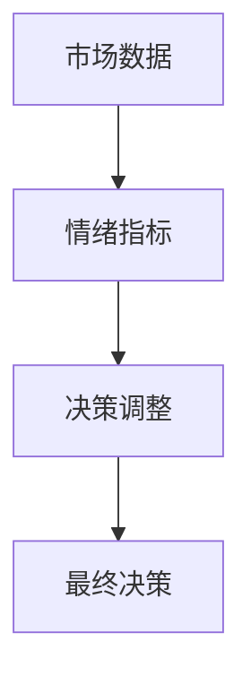
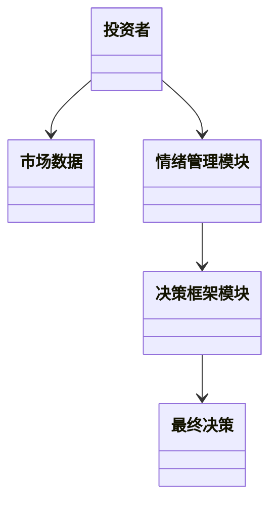

                 


# 格雷厄姆的投资者心理学

> **关键词**: 投资者心理学, 心理偏差, 情绪管理, 决策框架, 风险管理

> **摘要**: 本文深入探讨了投资者心理学的核心概念、常见心理偏差对投资决策的影响，以及如何通过情绪管理和决策框架来优化投资行为。结合数学模型和系统架构设计，本文提出了一个完整的投资者心理调适与决策支持系统，帮助投资者克服心理障碍，实现长期稳健的投资收益。

---

# 第1章: 投资者心理学概述

## 1.1 投资者心理学的定义与核心概念

### 1.1.1 投资者心理学的定义
投资者心理学是研究投资者在金融市场中的心理活动、决策过程及其影响的学科。它结合了心理学、经济学和金融学的理论，旨在揭示投资者行为背后的心理机制。

### 1.1.2 投资者心理学的核心概念
- **心理偏差**: 投资者在决策过程中常见的心理偏差，如过度自信、从众心理等。
- **情绪影响**: 情绪波动如何影响投资决策，例如贪婪和恐惧。
- **决策框架**: 结构化的决策方法，帮助投资者克服心理偏差。

### 1.1.3 投资者心理学的研究范围与方法
- **研究范围**: 包括个体投资者和机构投资者的心理行为。
- **研究方法**: 实验法、案例分析、数据分析等。

---

## 1.2 投资者行为的背景与问题背景

### 1.2.1 投资者行为的背景介绍
投资者行为是金融市场的重要组成部分，投资者的决策直接影响市场的波动和资产定价。

### 1.2.2 投资者心理学问题的提出
- 投资者常常因为心理偏差做出非理性决策，导致投资损失。
- 例如，贪婪导致高位买入，恐惧导致低位卖出。

### 1.2.3 问题解决的核心思路
- 通过分析心理偏差，提出改进投资决策的方法。
- 构建情绪管理和决策框架，帮助投资者克服心理障碍。

### 1.2.4 问题的边界与外延
- 本研究聚焦于个人投资者的心理行为，不涉及机构投资者的复杂决策过程。

### 1.2.5 核心要素与概念结构
- **核心要素**: 心理偏差、情绪影响、决策框架。
- **概念结构**: 心理偏差 → 情绪影响 → 投资决策 → 市场结果。

---

# 第2章: 投资者心理偏差与行为分析

## 2.1 投资者心理偏差的原理

### 2.1.1 心理偏差的分类与特点
- **过度自信**: 投资者高估自己的能力，忽视市场不确定性。
- **从众心理**: 追随市场潮流，忽视独立分析。
- **行为偏差**: 如损失厌恶、确认偏差等。

### 2.1.2 常见心理偏差的分析
- **过度自信**: 导致频繁交易和高风险投资。
- **从众心理**: 导致市场泡沫和崩盘。

---

## 2.2 投资者行为模型

### 2.2.1 行为模型的构建原理
- 基于心理偏差和情绪影响，构建投资者行为模型。

### 2.2.2 行为模型的数学表达
$$
P(t) = f(\text{心理偏差}, \text{情绪影响}, \text{市场信息})
$$
其中，$P(t)$ 表示投资者在时间 $t$ 的决策概率。

### 2.2.3 行为模型的实例分析
- 例如，投资者在市场上涨时过度乐观，导致高位买入。

---

# 第3章: 投资者情绪管理与决策框架

## 3.1 情绪管理的核心算法

### 3.1.1 情绪管理算法的原理
- 通过情绪指标和市场数据，调整投资者的情绪状态。

### 3.1.2 算法流程图（Mermaid）


### 3.1.3 算法实现代码
```python
def情绪管理算法(市场数据):
    情绪指标 = 计算情绪指标(市场数据)
    决策调整 = 调整决策(情绪指标)
    return 最终决策
```

---

## 3.2 投资决策框架的设计

### 3.2.1 决策框架的系统分析
- 系统目标：优化投资决策，克服心理偏差。

### 3.2.2 系统功能设计（Mermaid类图）


---

# 第4章: 投资者自我认知与决策风格

## 4.1 自我认知的数学模型

### 4.1.1 自我认知模型的构建
- 基于投资者的决策风格和心理特点。

### 4.1.2 数学公式与模型分析
$$
D(t) = \sum_{i=1}^{n} w_i \cdot S_i
$$
其中，$D(t)$ 表示决策质量，$w_i$ 是决策风格的权重，$S_i$ 是决策风格的影响。

### 4.1.3 模型的实例分析
- 分析不同决策风格对投资结果的影响。

---

## 4.2 决策风格的分类与优化

### 4.2.1 决策风格的分类
- **保守型**: 风险厌恶，偏好低风险投资。
- **激进型**: 风险偏好，偏好高风险投资。

### 4.2.2 决策风格的优化策略
- 根据市场环境和个人风险承受能力调整决策风格。

---

# 第5章: 长期投资策略与心理调适

## 5.1 长期投资策略的系统分析

### 5.1.1 投资策略的系统分析
- 长期投资策略的核心是价值投资和分散投资。

### 5.1.2 系统架构设计（Mermaid架构图）
```mermaid
archi
    前端 --> 中间件
    中间件 --> 数据库
    中间件 --> API
    API --> 第三方服务
```

---

## 5.2 心理调适的实战案例

### 5.2.1 案例背景介绍
- 一位投资者在市场下跌时因恐惧卖出，错失反弹机会。

### 5.2.2 案例分析与实现
- 通过心理调适和决策框架，帮助投资者克服恐惧。

### 5.2.3 案例总结与反思
- 心理调适是投资成功的关键因素之一。

---

# 第6章: 风险管理与心理防线

## 6.1 风险管理的数学模型

### 6.1.1 风险管理模型的构建
- 结合心理因素和市场因素。

### 6.1.2 数学公式与模型分析
$$
R(t) = \alpha \cdot M(t) + \beta \cdot P(t)
$$
其中，$R(t)$ 是风险值，$M(t)$ 是市场因素，$P(t)$ 是心理因素。

---

## 6.2 风险管理的实战应用

### 6.2.1 风险管理策略
- 设置止损位，分散投资。

### 6.2.2 风险管理的系统设计
- 结合市场数据和投资者情绪，动态调整风险管理策略。

---

# 小结与最佳实践

## 6.1 小结
投资者心理学是投资成功的重要因素。通过分析心理偏差和情绪影响，结合科学的决策框架和风险管理策略，可以帮助投资者克服心理障碍，实现长期稳健的投资收益。

## 6.2 最佳实践 tips
- 定期进行自我反思，识别心理偏差。
- 建立情绪管理机制，避免情绪化决策。
- 采用结构化的决策框架，优化投资决策。

---

**作者：AI天才研究院 & 禅与计算机程序设计艺术**

