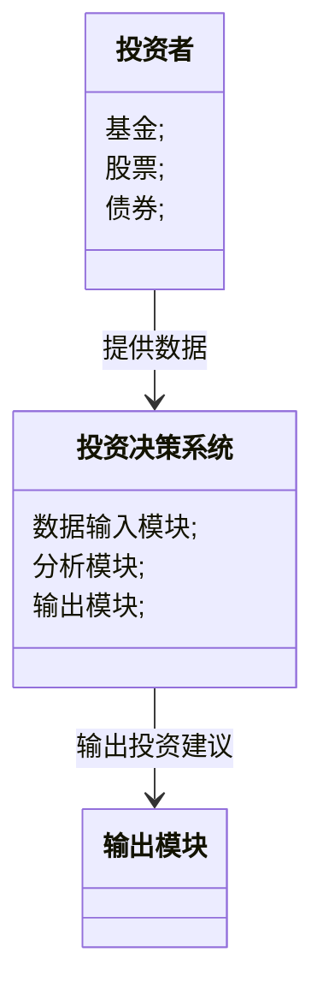
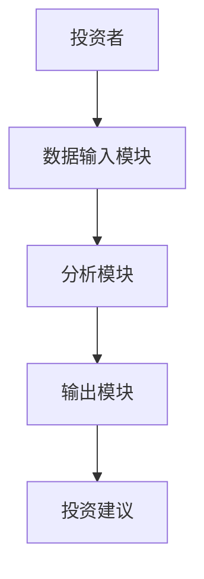
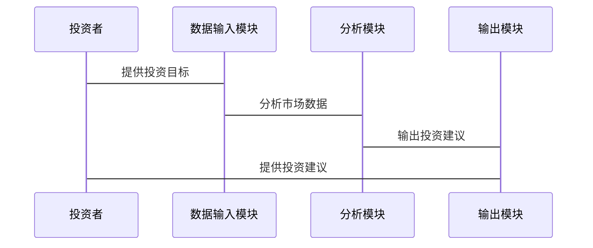

                 


# 格雷厄姆的投资者教育理念

> 关键词：投资者教育，价值投资，风险管理，安全边际，长期投资

> 摘要：本文将详细探讨格雷厄姆的投资者教育理念，涵盖其核心思想、投资策略、风险管理方法以及在现代投资中的应用。通过理论分析、算法原理、系统架构和项目实战的结合，全面解析格雷厄姆的投资理念，并为读者提供实践指导和深入的思考。

---

## 第一部分: 投资者教育的核心理念与背景

### 第1章: 投资者教育的基本概念

#### 1.1 投资与投资人的定义
- **投资的基本定义**：投资是通过将资金投入特定资产或项目，以期望在未来获得超过初始投入的价值的行为。
- **投资人的角色与分类**：投资人可以是个人、机构或基金，根据投资目标和风险承受能力进行分类。
- **投资与投机的区别**：投资强调长期价值和基本面分析，而投机则更多依赖市场情绪和短期价格波动。

#### 1.2 资本市场与投资环境
- **资本市场的基本结构**：包括股票市场、债券市场、基金市场等，是投资者进行资产配置的主要场所。
- **投资者与市场的互动关系**：投资者的行为影响市场价格，而市场价格又反过来影响投资者的决策。
- **当前投资环境的特点与挑战**：信息透明度高、市场波动大、金融工具多样化等。

#### 1.3 格雷厄姆的投资者教育理念
- **格雷厄姆的生平简介**：本杰明·格雷厄姆是价值投资之父，他的投资理念影响了包括巴菲特在内的众多投资者。
- **格雷厄姆投资理念的核心思想**：强调安全边际、长期投资和价值发现。
- **格雷厄姆理念的现代意义**：在当前复杂的投资环境中，格雷厄姆的理念依然具有重要的指导意义。

---

## 第2章: 价值投资的基本原理

### 2.1 价值投资的定义与特点
- **价值投资的定义**：通过分析企业的基本面，寻找市场价格低于其内在价值的投资机会。
- **价值投资的核心特点**：注重长期持有、强调安全边际、关注企业内在价值。
- **价值投资与成长投资的区别**：价值投资关注低估的价值，成长投资关注高增长的潜力。

### 2.2 格雷厄姆的价值投资体系
- **安全边际的概念**：安全边际是指市场价格与内在价值之间的差距，确保投资的安全性和收益性。
- **内在价值的计算方法**：通过对企业未来现金流的折现来计算内在价值。
- **股票分析的三要素**：价格、价值、市场情绪。

### 2.3 价值投资的实践原则
- **长期投资的重要性**：避免短期波动的干扰，专注于长期价值。
- **分散投资的风险控制**：通过分散投资降低单一资产的风险。
- **耐心与纪律在投资中的作用**：坚持投资计划，避免情绪化决策。

---

## 第3章: 投资者的心理与行为分析

### 3.1 投资者心理偏差的分析
- **过度自信偏差**：投资者倾向于高估自己的能力，忽视市场的不确定性。
- **情绪化决策偏差**：市场波动容易引发投资者的贪婪或恐惧，导致非理性决策。
- **羊群效应的负面影响**：投资者跟随市场潮流，忽视独立思考。

### 3.2 格雷厄姆对投资者心理的洞察
- **投资者情绪波动的周期性**：市场情绪通常呈现周期性波动，投资者需要识别并利用这种周期性。
- **避免非理性决策的方法**：通过严格的投资纪律和基本面分析来控制情绪影响。
- **理性思考在投资中的重要性**：坚持逻辑分析，避免被市场情绪左右。

### 3.3 投资者行为的改进策略
- **建立长期投资心态**：关注长期价值，避免短期波动的干扰。
- **培养独立思考能力**：不盲目跟随市场潮流，坚持独立分析。
- **定期审视投资策略**：根据市场变化和个人情况调整投资计划。

---

## 第4章: 投资组合管理与风险管理

### 4.1 投资组合的基本原理
- **投资组合的定义与作用**：通过将资金分配到多种资产，降低投资风险并提高收益。
- **投资组合的分散化效应**：通过分散投资降低单一资产的风险。
- **投资组合的风险与收益平衡**：在风险可控的前提下，追求最大化的收益。

### 4.2 格雷厄姆的风险管理策略
- **安全边际在风险管理中的应用**：通过寻找市场价格低于内在价值的资产，降低投资风险。
- **资产配置的优化方法**：根据个人风险承受能力和投资目标进行资产配置。
- **定期调整投资组合的必要性**：根据市场变化和个人情况，定期审视并调整投资组合。

### 4.3 风险管理的实战技巧
- **确定个人风险承受能力**：根据自身财务状况和心理承受能力，制定合适的风险管理策略。
- **使用止损策略控制风险**：设定止损点，避免重大亏损。
- **监测市场变化**：定期跟踪市场动态，及时调整投资策略。

---

## 第5章: 价值投资的数学模型与算法实现

### 5.1 价值投资的数学模型
- **内在价值的计算公式**：$$ V = \frac{CF}{r - g} $$
  其中，\( V \) 为内在价值，\( CF \) 为未来现金流，\( r \) 为贴现率，\( g \) 为增长率。
- **安全边际的计算方法**：$$ \text{安全边际} = V - P $$
  其中，\( P \) 为市场价格。

### 5.2 价值投资的算法实现
```python
def calculate_intrinsic_value(cash_flows, discount_rate, growth_rate):
    return sum(cash_flows) / (discount_rate - growth_rate)

def calculate_margin_of_safety(intrinsic_value, market_price):
    return intrinsic_value - market_price
```

### 5.3 投资组合优化的数学模型
- **马科维茨有效前沿模型**：通过优化投资组合的收益和风险，找到最优资产配置。
- **投资组合优化的Python实现**：
```python
import numpy as np
from scipy.optimize import minimize

def portfolio_optimization(returns, covariance_matrix, target_return):
    n = len(returns)
    # 目标是最小化风险
    objective = {'type': 'min', 'fun': lambda x: np.dot(x.T, np.dot(covariance_matrix, x))}
    # 约束条件：收益等于目标收益
    constraint = {'type': 'eq', 'fun': lambda x: np.dot(x.T, returns) - target_return}
    bounds = [(0, 1) for _ in range(n)]
    result = minimize(objective['fun'], np.ones(n)/n, constraints=[objective, constraint], bounds=bounds)
    return result.x
```

---

## 第6章: 系统架构与投资决策支持

### 6.1 投资决策系统的功能设计
- **领域模型设计**：使用 Mermaid 绘制类图，展示投资决策系统的核心模块。


### 6.2 系统架构设计
- **系统架构图**：使用 Mermaid 绘制系统架构图。


### 6.3 系统接口设计
- **接口设计**：定义输入和输出接口，确保系统模块之间的通信。
- **交互流程图**：使用 Mermaid 绘制交互流程图。


---

## 第7章: 项目实战与案例分析

### 7.1 环境安装与配置
- **Python 环境安装**：安装 Python 和相关库（如 NumPy、Pandas、Matplotlib）。
- **Jupyter Notebook 配置**：安装并配置 Jupyter Notebook 用于代码实现。

### 7.2 核心代码实现
```python
import pandas as pd
import numpy as np

# 示例数据：假设我们有三只股票的收益率和协方差矩阵
returns = np.array([0.1, 0.2, 0.15])
covariance_matrix = np.array([
    [0.02, 0.01, 0.015],
    [0.01, 0.03, 0.02],
    [0.015, 0.02, 0.035]
])

# 调用投资组合优化函数
weights = portfolio_optimization(returns, covariance_matrix, 0.12)
print("最优权重:", weights)
```

### 7.3 案例分析与总结
- **案例分析**：以具体股票为例，分析其内在价值和市场价格，计算安全边际，制定投资策略。
- **总结**：通过案例分析，验证格雷厄姆理念的实践效果，总结投资经验。

---

## 第8章: 最佳实践与小结

### 8.1 最佳实践
- **定期学习与反思**：保持对市场和投资理念的更新。
- **坚持长期投资**：避免短期波动的干扰，专注长期价值。
- **分散投资与风险管理**：通过分散投资降低风险，定期审视投资组合。

### 8.2 小结
- 本文从理论到实践，全面解析了格雷厄姆的投资者教育理念，通过数学模型、算法实现和系统架构的结合，为读者提供了全面的投资指导。

---

## 第9章: 注意事项与拓展阅读

### 9.1 注意事项
- **风险提示**：投资有风险，需谨慎决策。
- **持续学习**：市场环境不断变化，需持续学习和调整策略。

### 9.2 拓展阅读
- 推荐书籍：《聪明的投资者》（The Intelligent Investor）——本杰明·格雷厄姆
- 推荐博客：投资理念相关的技术博客和投资分析文章。

---

## 作者信息

作者：AI天才研究院/AI Genius Institute & 禅与计算机程序设计艺术 /Zen And The Art of Computer Programming

---

通过以上结构化的内容，我们可以系统地了解格雷厄姆的投资者教育理念，并将其应用于实际投资中。

