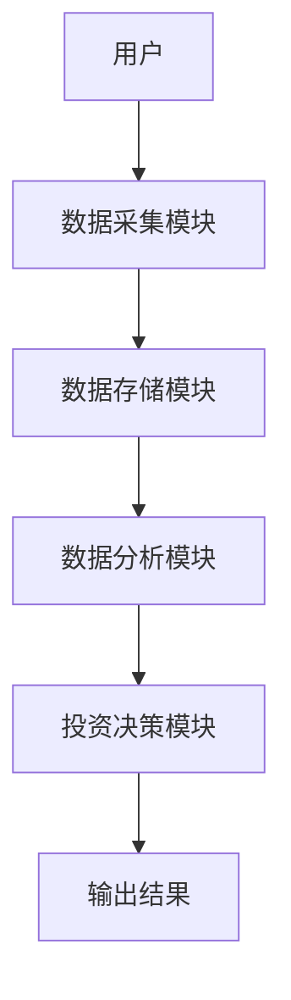
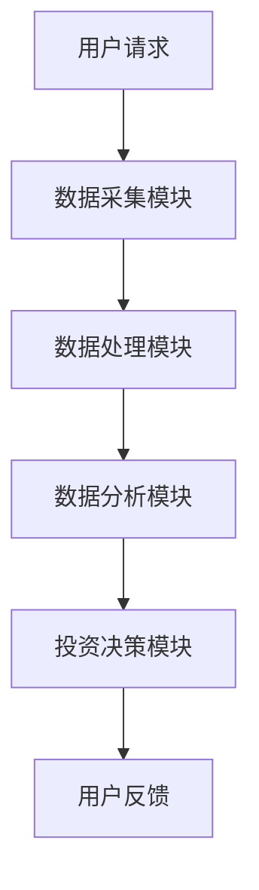

                 


# 格雷厄姆的特殊情况投资：寻找套利机会

## 关键词：格雷厄姆、特殊情况投资、套利机会、投资策略、价值投资、事件驱动型套利

## 摘要：本文深入探讨了格雷厄姆的特殊情况投资策略，特别聚焦于寻找套利机会的方法。通过分析套利机会的来源、识别方法、数学模型以及实际案例，本文为投资者提供了系统化的投资框架。结合价值投资的核心理念，本文详细阐述了如何利用套利机会在市场中获取超额收益，并提供了实际操作的建议和注意事项。

---

# 第一部分: 格雷厄姆的特殊情况投资基础

## 第1章: 特殊情况投资概述

### 1.1 什么是特殊情况投资

#### 1.1.1 投资的基本概念

投资是通过将资金分配到不同的资产类别中，以期获得超过资金时间价值的收益。投资的核心在于识别资产的内在价值，并通过合理的价格进行买卖。

#### 1.1.2 特殊情况投资的定义

特殊情况投资是指在特定市场条件下，利用资产的暂时性价格偏差，通过套利策略实现超额收益的投资方式。这种投资策略通常依赖于市场效率的不足，寻找价格与价值的不匹配。

#### 1.1.3 格雷厄姆投资理论的核心思想

本杰明·格雷厄姆是价值投资的鼻祖，他提出的核心思想是：市场价格围绕内在价值波动，投资者应以低于内在价值的价格买入资产，并在价格回归内在价值时卖出。格雷厄姆强调安全边际的重要性，即购买价格与内在价值之间的差距越大，投资的安全性越高。

---

### 1.2 套利机会的基本概念

#### 1.2.1 套利的定义

套利是指利用市场中价格差异，通过同时买入低估资产和卖出高估资产，以期在价格回归合理水平时获得无风险或低风险的利润。套利的核心在于发现价格与价值的偏离，并通过交易行为获利。

#### 1.2.2 套利的类型与特点

套利可以分为以下几种类型：

1. **市场套利**：利用不同市场或资产类别之间的价格差异进行套利。
2. **公司套利**：利用公司内部信息或特殊事件（如并购、重组）进行套利。
3. **事件驱动型套利**：基于公司特定事件（如破产、重组）进行套利。

套利的特点包括：
- **低风险**：通常利用价格偏差，风险较小。
- **高收益**：通过套利机会可以获得超额收益。
- **短期性**：套利机会往往短暂，需快速反应。

#### 1.2.3 套利与投资的区别

套利与投资的主要区别在于：
- **套利**：短期、基于价格偏差，风险较低。
- **投资**：长期、基于资产的内在价值，风险较高。

---

### 1.3 格雷厄姆的特殊情况投资方法

#### 1.3.1 价值投资的核心理念

格雷厄姆的价值投资理念强调：
- **内在价值**：资产的真实价值，独立于市场价格。
- **安全边际**：购买价格低于内在价值，确保投资的安全性。

#### 1.3.2 特殊情况投资的适用场景

特殊情况投资适用于以下场景：
- 市场效率不足，存在价格偏差。
- 特定事件（如并购、重组）发生时，市场反应滞后。

#### 1.3.3 格雷厄姆的套利策略

格雷厄姆的套利策略包括：
1. **寻找低估资产**：通过基本面分析，识别市场价格低于内在价值的资产。
2. **利用市场差异**：在不同市场或资产类别中寻找价格差异，进行套利交易。
3. **事件驱动型套利**：在特定事件发生时，利用价格波动进行套利。

---

## 第2章: 套利机会的识别与分析

### 2.1 套利机会的来源

#### 2.1.1 市场套利机会

市场套利机会通常源于不同市场之间的价格差异。例如，同一资产在不同交易所的价格差异可以通过同时买入低价市场和卖出高价市场进行套利。

#### 2.1.2 公司套利机会

公司套利机会通常源于公司内部信息或特定事件。例如，在公司并购或重组过程中，内部信息可能提前反映在股价中，套利者可以通过买入低估股票或卖出高估股票获利。

#### 2.1.3 事件驱动型套利

事件驱动型套利是指在特定事件发生时，利用市场反应的滞后性进行套利。例如，在公司宣布破产后，股价可能短期内暴跌，但其资产价值可能被低估，套利者可以通过买入低价股票获利。

---

### 2.2 套利机会的识别标准

#### 2.2.1 市场效率与套利机会

市场效率越低，套利机会越多。套利者应关注市场效率不足的领域，如新兴市场或小盘股。

#### 2.2.2 公司基本面分析

套利者应通过基本面分析，识别公司内在价值与市场价格的偏差。例如，通过市盈率、市净率等指标，判断公司是否被市场低估或高估。

#### 2.2.3 事件驱动型套利的判断指标

套利者应关注以下指标：
- 公司事件的公告时间。
- 市场反应的滞后性。
- 事件的潜在影响。

---

### 2.3 套利机会的筛选与评估

#### 2.3.1 数据收集与初步筛选

套利者需要收集以下数据：
- 市场数据：不同市场的价格、成交量等。
- 公司数据：公司财务报表、事件公告等。
- 历史数据：过去的价格波动、套利机会等。

#### 2.3.2 套利机会的定量评估

套利机会的定量评估包括：
- 计算套利空间：市场价格与内在价值的差异。
- 评估风险：套利机会的波动性、流动性风险等。

#### 2.3.3 套利机会的定性分析

套利机会的定性分析包括：
- 市场环境：整体市场状况、政策影响等。
- 公司状况：公司基本面、管理团队等。
- 事件影响：事件的潜在影响、市场反应等。

---

## 第3章: 套利机会的数学模型与算法

### 3.1 套利定价模型

#### 3.1.1 套利定价模型的基本原理

套利定价模型（APT）由约翰·林特耐（John Lintner）提出，其基本原理是：资产的预期收益可以通过其风险因素（beta）和市场预期收益来解释。

$$ E(r_i) = r_f + \beta_i (E(r_m) - r_f) $$

其中：
- $E(r_i)$：资产i的预期收益。
- $r_f$：无风险利率。
- $\beta_i$：资产i的beta系数。
- $E(r_m)$：市场预期收益。

#### 3.1.2 套利定价模型的应用

套利定价模型可以用于：
- 评估资产的预期收益。
- 判断资产是否被市场高估或低估。

#### 3.1.3 套利定价模型的Python实现

以下是一个简单的Python代码示例，用于计算资产的预期收益：

```python
import numpy as np

# 假设数据
beta = 1.2  # 资产i的beta系数
rf = 0.05    # 无风险利率
rm = 0.10    # 市场预期收益

# 计算预期收益
expected_return = rf + beta * (rm - rf)
print(f"预期收益: {expected_return}")
```

---

## 第4章: 套利机会的系统分析与架构设计

### 4.1 投资系统的需求分析

#### 4.1.1 系统目标与范围

系统目标：识别和评估套利机会，提供投资建议。

系统范围：涵盖市场数据采集、套利机会识别、投资决策支持等功能。

#### 4.1.2 系统功能需求

- 数据采集：收集市场数据、公司数据等。
- 数据分析：计算套利空间、评估风险。
- 投资决策：提供套利机会的建议。

#### 4.1.3 系统性能需求

- 数据处理速度：快速响应用户查询。
- 数据存储容量：支持大规模数据存储。

---

### 4.2 投资系统的架构设计

#### 4.2.1 系统架构图



#### 4.2.2 数据流图



---

## 第5章: 套利机会的项目实战

### 5.1 套利机会的实战案例分析

#### 5.1.1 案例背景

某公司宣布破产重组，市场反应滞后，股价大幅下跌。

#### 5.1.2 数据分析

通过基本面分析，发现公司资产价值被低估，市场价格低于内在价值。

#### 5.1.3 投资策略

买入该公司股票，等待股价回归内在价值。

---

## 第六部分: 最佳实践与注意事项

### 6.1 最佳实践

- **持续学习**：关注市场动态，学习新的套利策略。
- **风险控制**：合理分散投资，降低风险。
- **技术辅助**：利用技术工具（如Python）提高分析效率。

### 6.2 小结

套利机会是格雷厄姆特殊情况投资的重要组成部分，通过识别和分析套利机会，投资者可以在市场中获取超额收益。

### 6.3 注意事项

- **市场风险**：套利机会可能因市场变化而消失。
- **流动性风险**：套利交易可能因流动性不足而难以变现。
- **信息风险**：套利机会可能因信息不对称而难以识别。

### 6.4 拓展阅读

- 格雷厄姆的《聪明的投资者》。
- 《套利定价模型》。

---

## 作者：AI天才研究院 & 禅与计算机程序设计艺术

---

通过以上思考过程，我们逐步构建了文章的逻辑框架，并详细阐述了每个部分的内容。接下来，我会根据这个思考过程撰写完整的文章。

