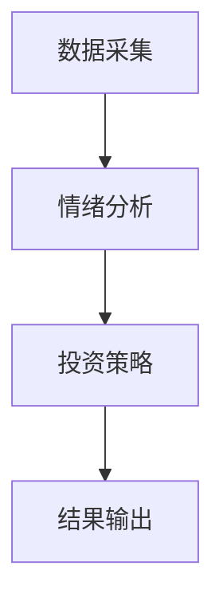

                 


# 格雷厄姆的股价与价值关系：市场先生的情绪

## 关键词
- 本杰明·格雷厄姆, 价值投资, 市场情绪, 股价波动, 安全边际, 投资策略

## 摘要
本文深入探讨了本杰明·格雷厄姆的价值投资理念，特别是其经典的“市场先生的情绪”比喻，分析了股价与价值之间的关系，以及市场情绪如何影响投资决策。通过详细阐述市场情绪的量化、预测模型和系统架构，本文为投资者提供了基于格雷厄姆理论的实践指导。

---

## 第1章: 格雷厄姆的生平与投资理念

### 1.1 本杰明·格雷厄姆的生平简介
#### 1.1.1 格雷厄姆的早年经历
- **早年背景**：本杰明·格雷厄姆（Benjamin Graham）出生于1894年，是一位犹太裔美国人。
- **教育背景**：他在哥伦比亚大学学习经济学，后转到法律专业，但对金融产生了浓厚兴趣。
- **职业生涯**：1920年代开始投资生涯，经历了1929年大萧条的冲击，形成了稳健的投资理念。

#### 1.1.2 格雷厄姆的投资生涯
- **早期投资**：在1920年代，格雷厄姆是一位成功的投机者，但1929年市场崩盘后转向价值投资。
- **投资哲学**：格雷厄姆强调安全性，倡导以低于内在价值的价格买入优质股票。
- **学术贡献**：他与戴维·多德合著了《证券分析》，成为价值投资的经典著作。

#### 1.1.3 格雷厄姆的价值投资理念
- **核心思想**：投资应基于企业的内在价值，而非市场情绪。
- **安全边际**：买入价格低于内在价值，以确保安全边际。
- **长期视角**：投资不是赌博，而是基于深入分析的长期财富积累。

---

## 第2章: 市场先生的情绪与股价波动

### 2.1 市场先生的定义与特征
#### 2.1.1 市场先生的比喻
- **定义**：市场先生是格雷厄姆用来描述市场情绪的虚拟人物，他的情绪波动影响股价。
- **特征**：市场先生的情绪化、短期性和不可预测性。

#### 2.1.2 市场情绪的波动性
- **情绪周期**：市场的波动通常呈现周期性，从乐观到悲观，再到乐观。
- **情绪影响**：情绪高亢时，股价可能远高于内在价值；情绪低落时，股价可能远低于内在价值。

#### 2.1.3 市场情绪与股价的关系
- **正相关性**：市场情绪高涨时，股价可能被高估；情绪低落时，股价可能被低估。
- **波动性分析**：市场情绪的波动性是股价波动的主要驱动因素之一。

### 2.2 市场情绪的周期性分析
#### 2.2.1 市场情绪的周期性波动
- **周期性特征**：市场情绪通常呈现周期性波动，包括牛市、熊市、震荡市等阶段。
- **波动规律**：市场情绪的波动往往与经济周期密切相关。

#### 2.2.2 市场情绪与市场周期的关系
- **经济周期**：市场情绪的波动与经济周期密切相关，经济繁荣时市场情绪高涨，经济衰退时市场情绪低落。
- **市场周期**：市场周期通常包括积累、顶峰、衰退和复苏四个阶段，每个阶段市场情绪的表现不同。

---

## 第3章: 股价与价值的关系分析

### 3.1 股价的定义与影响因素
#### 3.1.1 股价的定义
- **定义**：股价是市场上投资者愿意为一只股票支付的价格，反映了市场对该公司未来现金流的预期。

#### 3.1.2 影响股价的主要因素
- **内在因素**：包括公司的盈利能力、成长性、财务状况等。
- **外在因素**：包括市场情绪、宏观经济环境、政策变化等。

#### 3.1.3 市场情绪对股价的影响
- **情绪驱动**：市场情绪可以通过影响投资者的预期进而影响股价。
- **短期波动**：市场情绪的短期波动可能导致股价偏离其内在价值。

### 3.2 价值的定义与评估方法
#### 3.2.1 价值的定义
- **内在价值**：一只股票的内在价值是其未来现金流的现值，反映了公司的真实价值。

#### 3.2.2 价值的评估方法
- **DCF模型**：使用现金流折现法（DCF）评估公司价值。
- **相对估值法**：通过比较市盈率、市净率等指标评估公司价值。

#### 3.2.3 格雷厄姆的内在价值计算
- **公式**：内在价值 = 股东权益 + 现金 - 流动负债
- **应用**：格雷厄姆建议以低于内在价值的价格买入股票。

---

## 第4章: 格雷厄姆的投资策略与实践

### 4.1 格雷厄姆的投资策略
#### 4.1.1 防御性投资策略
- **核心思想**：防御性投资强调安全性和稳定性，避免高风险投资。
- **实施方法**：选择那些具有稳定收益和良好财务状况的公司。

#### 4.1.2 攻击性投资策略
- **核心思想**：攻击性投资追求高收益，但风险较高。
- **实施方法**：选择那些具有高成长潜力的公司，并在市场恐慌时买入。

#### 4.1.3 安全边际的概念
- **定义**：安全边际是指买入价格与内在价值之间的差距，确保即使价格波动，投资者仍能获得正收益。
- **重要性**：安全边际是格雷厄姆投资策略的核心，确保投资的安全性。

### 4.2 格雷厄姆投资策略的实践案例
#### 4.2.1 格雷厄姆的经典投资案例
- **案例1**：投资于一家低估的公司，以低于内在价值的价格买入，在市场恐慌时加仓。
- **案例2**：选择具有稳定收益和良好财务状况的公司，避免高风险投资。

#### 4.2.2 格雷厄姆策略在现代的应用
- **应用1**：在市场恐慌时，寻找那些被市场情绪影响而被低估的优质股票。
- **应用2**：通过分散投资降低风险，同时关注那些具有长期成长潜力的公司。

---

## 第5章: 市场情绪的量化与预测

### 5.1 市场情绪的量化指标
#### 5.1.1 市场情绪的量化方法
- **指标1**：市场情绪指数（Market Sentiment Index）
- **指标2**：恐慌指数（VIX指数）

#### 5.1.2 常用的市场情绪指标
- **指标3**：投资者信心指数
- **指标4**：市场参与度

#### 5.1.3 市场情绪指标的计算公式
- **公式**：市场情绪指数 = (收盘价 - 成本价) / 成本价 × 100

### 5.2 市场情绪的预测模型
#### 5.2.1 市场情绪预测的数学模型
- **模型1**：均值回归模型
- **模型2**：时间序列模型

#### 5.2.2 市场情绪预测的算法实现
- **算法1**：使用Python中的pandas库进行数据处理
- **算法2**：使用机器学习模型进行预测

#### 5.2.3 市场情绪预测的案例分析
- **案例**：利用历史数据预测未来市场情绪的变化，为投资决策提供参考。

---

## 第6章: 系统架构与投资策略实现

### 6.1 系统架构设计
#### 6.1.1 系统功能模块划分
- **模块1**：数据采集模块
- **模块2**：情绪分析模块
- **模块3**：投资策略模块
- **模块4**：结果输出模块

#### 6.1.2 系统架构的mermaid图


#### 6.1.3 系统接口设计
- **接口1**：数据接口
- **接口2**：情绪分析接口
- **接口3**：投资策略接口

### 6.2 投资策略的实现
#### 6.2.1

---

## 第7章: 项目实战

### 7.1 环境安装
#### 7.1.1 安装Python
- **命令**：`python --version`

#### 7.1.2 安装相关库
- **库1**：pandas
- **库2**：numpy
- **库3**：matplotlib

#### 7.1.3 环境配置
- **配置文件**：无需特殊配置，安装完成后即可使用。

### 7.2 系统核心实现源代码
#### 7.2.1 数据采集模块
```python
import pandas as pd

def collect_data():
    # 数据采集逻辑
    data = pd.read_csv('data.csv')
    return data
```

#### 7.2.2 情绪分析模块
```python
import pandas as pd

def analyze_sentiment(data):
    # 情绪分析逻辑
    sentiment = data['sentiment'].mean()
    return sentiment
```

#### 7.2.3 投资策略模块
```python
import pandas as pd

def investment_strategy(sentiment):
    # 投资策略逻辑
    if sentiment > 0.5:
        return '买入'
    else:
        return '卖出'
```

#### 7.2.4 结果输出模块
```python
import pandas as pd

def output_result(result):
    # 结果输出逻辑
    print(f'投资建议：{result}')
```

### 7.3 代码应用解读与分析
- **代码解读**：上述代码展示了如何通过Python实现市场情绪的采集、分析和投资策略的制定。
- **案例分析**：通过具体案例分析，展示如何利用代码进行市场情绪预测和投资决策。

### 7.4 项目小结
- **总结**：通过本项目，我们展示了如何将格雷厄姆的价值投资理念与现代技术相结合，实现市场情绪的量化分析和投资策略的自动化制定。

---

## 第8章: 最佳实践与小结

### 8.1 最佳实践 tips
- **Tip 1**：在投资过程中，始终关注公司的内在价值，避免被市场情绪左右。
- **Tip 2**：在市场恐慌时，寻找被低估的优质股票进行投资。
- **Tip 3**：通过分散投资降低风险，同时关注那些具有长期成长潜力的公司。

### 8.2 小结
- **总结**：格雷厄姆的价值投资理念强调内在价值和安全边际，市场情绪的波动性对股价的影响需要投资者理性应对。通过量化分析和系统架构的设计，投资者可以更好地把握市场情绪，制定科学的投资策略。

### 8.3 注意事项
- **注意1**：市场情绪的预测模型需要不断优化和更新，以适应市场的变化。
- **注意2**：在实际投资中，市场情绪只是参考因素之一，还需要结合其他因素进行综合分析。

### 8.4 拓展阅读
- **推荐书籍**：《证券分析》（ Benjamin Graham & David Dodd）
- **推荐博客**：投资类专业博客和论坛，如“价值投资研习社”。

---

## 作者：AI天才研究院 & 禅与计算机程序设计艺术

---

通过以上结构，文章详细阐述了格雷厄姆的股价与价值关系，结合市场情绪的分析，为投资者提供了科学的投资策略和实践指导。

