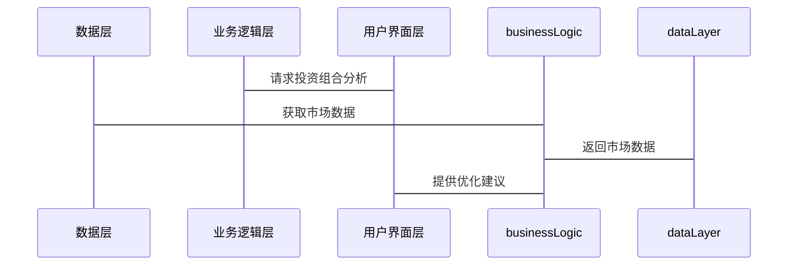

                 

# 格雷厄姆的股债平衡策略在现代市场中的应用

## 关键词：股债平衡策略, 格雷厄姆, 现代市场, 投资组合, 风险管理

## 摘要：本文详细探讨了格雷厄姆的股债平衡策略在现代市场环境中的应用。首先介绍了格雷厄姆的投资理念及其股债平衡策略的核心概念，然后分析了现代市场环境下的策略调整与优化。通过数学模型和系统架构设计，展示了如何将股债平衡策略与现代技术相结合。最后，通过实际案例分析，总结了最佳实践和未来发展趋势。

---

## 第一部分: 引言

### 第1章: 格雷厄姆的股债平衡策略概述

#### 1.1 格雷厄姆投资理念的背景

##### 1.1.1 格雷厄姆的生平与投资思想
 Benjamin Graham 是价值投资的鼻祖，他的投资理念强调安全边际和长期稳健的回报。他提出的股债平衡策略旨在通过平衡股票和债券的投资比例，降低整体投资组合的风险，同时保持稳定的收益。

##### 1.1.2 股债平衡策略的起源与发展
 格雷厄姆在20世纪30年代提出了股债平衡策略，旨在帮助投资者在波动的市场中实现稳健的投资回报。随着金融市场的演变，该策略在实践中不断被优化和调整。

##### 1.1.3 现代市场环境下的应用价值
 现代市场环境复杂多变，包括全球化、金融创新和数字化工具的普及。格雷厄姆的股债平衡策略在这些变化中依然具有重要的应用价值，尤其是在风险管理方面。

#### 1.2 股债平衡策略的核心概念

##### 1.2.1 股票与债券的基本特性
 股票具有较高的收益潜力，但也伴随着较高的波动性和风险。债券则相对稳定，具有固定的利息收入，风险较低。

##### 1.2.2 股债平衡策略的定义与目标
 股债平衡策略是指将投资组合中的资产分为股票和债券，通过合理配置两者的比例，以在风险和收益之间找到最佳平衡点。

##### 1.2.3 现代市场中的策略调整
 现代市场环境的变化，如低利率环境、通货膨胀压力和市场的高度波动性，要求投资者对股债平衡策略进行调整，以适应新的市场条件。

### 第2章: 现代市场环境下的股债平衡策略

#### 2.1 现代市场的新特点

##### 2.1.1 全球化与金融创新
 全球化使得投资者可以投资于全球市场，金融创新带来了新的投资工具和策略，如ETFs和对冲基金。

##### 2.1.2 市场波动性与风险因素
 现代市场的波动性增加，风险因素更加复杂，如地缘政治风险和经济政策变化，对投资组合的影响更大。

##### 2.1.3 数字化与技术驱动的投资工具
 技术的进步使得投资者可以利用大数据和算法交易等工具，实时监控和调整投资组合。

#### 2.2 现代市场中的股债平衡策略调整

##### 2.2.1 策略的适用性与局限性
 股债平衡策略在现代市场中的适用性依然存在，但也面临一些局限性，如在极端市场条件下可能无法有效分散风险。

##### 2.2.2 现代市场中的策略优化
 通过引入动态资产配置和风险管理技术，优化股债平衡策略，以应对市场环境的变化。

##### 2.2.3 技术与数据驱动的策略改进
 利用大数据和机器学习技术，分析市场数据，优化投资组合配置，提升策略的有效性。

---

## 第二部分: 核心概念与联系

### 第3章: 核心概念的原理与联系

#### 3.1 股债平衡策略的数学模型

##### 3.1.1 股票与债券的风险收益特征
 股票的风险收益特征可以通过历史数据和统计模型进行分析，债券的风险则主要体现在利率风险和信用风险。

##### 3.1.2 投资组合的优化模型
 使用均值-方差优化模型，计算最优的股债比例，以最小化投资组合的风险，同时最大化预期收益。

##### 3.1.3 股债比例的计算公式
 通过以下公式计算股债比例：
 $$ \text{最优股债比例} = \frac{\text{债券预期收益} - \text{股票预期收益}}{\text{股票风险溢价}} $$

#### 3.2 核心概念对比分析

##### 3.2.1 股票与债券的属性对比
 通过对比表格展示股票和债券在收益、风险、流动性等方面的差异。

| 特性 | 股票 | 债券 |
|------|------|------|
| 收益 | 高   | 中   |
| 风险 | 高   | 低   |
| 流动性 | 高 | 中 |

##### 3.2.2 不同市场环境下的策略差异
 在牛市中，股票比例可能增加；在熊市中，债券比例可能增加，以降低风险。

##### 3.2.3 股债平衡与非平衡策略的优缺点
 股债平衡策略的优点是风险分散，缺点是可能在市场上涨时收益不及单一股票投资；非平衡策略的优点是可能获得更高收益，缺点是风险更大。

### 第4章: 股债平衡策略的系统架构

#### 4.1 系统功能设计

##### 4.1.1 投资组合管理模块
 负责监控和管理投资组合的股债比例，实时调整以适应市场变化。

##### 4.1.2 风险评估模块
 通过分析市场数据，评估投资组合的风险，提供风险管理建议。

##### 4.1.3 策略优化模块
 根据市场变化和投资者目标，优化股债平衡策略，提供最优配置建议。

#### 4.2 系统架构设计

##### 4.2.1 分层架构设计
 系统分为数据层、业务逻辑层和用户界面层，各层之间通过接口进行交互。

##### 4.2.2 模块间交互
 使用mermaid序列图展示模块间的交互流程。

---

## 第三部分: 项目实战与总结

### 第5章: 项目实战

#### 5.1 环境安装

##### 5.1.1 安装Python环境
 使用Anaconda安装Python 3.8及以上版本。

##### 5.1.2 安装相关库
 安装pandas、numpy、scipy等库。

#### 5.2 核心代码实现

##### 5.2.1 数据获取与处理
 使用pandas库获取历史数据并进行清洗。

##### 5.2.2 股债比例计算
 使用均值-方差优化模型计算最优股债比例。

##### 5.2.3 投资组合优化
 根据市场变化动态调整股债比例。

#### 5.3 案例分析

##### 5.3.1 数据分析与可视化
 使用matplotlib绘制投资组合的风险收益曲线。

##### 5.3.2 案例解读
 通过具体案例展示股债平衡策略在实际中的应用效果。

### 第6章: 总结与展望

#### 6.1 最佳实践

##### 6.1.1 风险管理
 强调风险管理的重要性，建议投资者定期审视和调整投资组合。

##### 6.1.2 动态调整策略
 根据市场环境变化，及时调整股债比例，以适应新的市场条件。

#### 6.2 总结

 本文详细探讨了格雷厄姆的股债平衡策略在现代市场中的应用，结合理论分析和实际案例，展示了如何通过技术手段优化投资策略，实现稳健的投资回报。

#### 6.3 未来展望

 随着技术的进步和市场的变化，股债平衡策略将更加依赖于数据科学和人工智能技术，投资者需要不断学习和适应新的工具和方法，以应对复杂的市场环境。

---

## 作者：AI天才研究院/AI Genius Institute & 禅与计算机程序设计艺术 /Zen And The Art of Computer Programming

---

通过以上结构，文章系统地介绍了格雷厄姆的股债平衡策略，并结合现代市场环境和先进技术，详细讲解了策略的应用和优化方法。希望对读者有所帮助。

