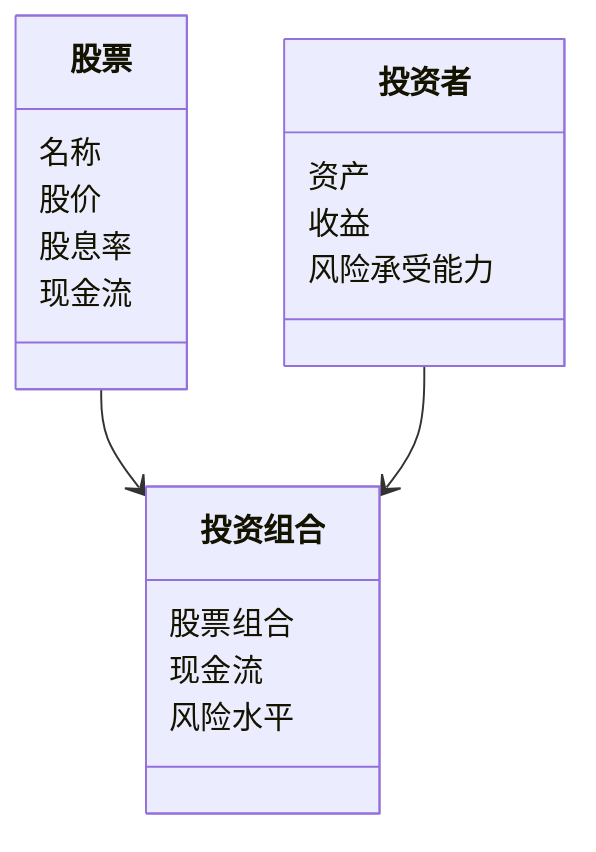

                 


# 格雷厄姆的股息投资理念：稳定现金流的重要性

## 关键词：格雷厄姆，股息投资，现金流，防御性投资，投资策略

## 摘要：本文深入探讨了格雷厄姆的股息投资理念，重点分析了稳定现金流在投资中的重要性。通过系统的分析和实际案例，本文为读者提供了从理论到实践的全面指导，帮助投资者理解和应用格雷厄姆的股息投资策略。

---

# 第一部分: 格雷厄姆的股息投资理念概述

## 第1章: 格雷厄姆的投资理念概述

### 1.1 格雷厄姆的生平与投资思想

#### 1.1.1 格雷厄姆的生平简介
 Benjamin Graham（1894-1976）是20世纪著名的投资大师，被誉为“价值投资之父”。他在金融分析领域的主要贡献在于提出了“安全边际”和“防御性投资”的理念，这些理念对后来的投资者产生了深远影响。格雷厄姆的学生巴菲特更是将这些理念发扬光大，成为全球投资领域的传奇人物。

#### 1.1.2 格雷厄姆的投资哲学
 格雷厄姆的投资哲学以“防御性投资”为核心，强调长期稳定的投资回报，而非短期的超额收益。他认为，投资者应以获取稳定的现金流为目标，而非盲目追求市场波动带来的收益。这种投资策略特别适合那些希望长期稳健投资的投资者。

#### 1.1.3 格雷厄姆与巴菲特的师生关系
 格雷厄姆是巴菲特的导师，巴菲特在后来的职业生涯中将格雷厄姆的价值投资理念进一步发展和传播。格雷厄姆的《证券分析》一书对巴菲特的投资思想产生了深远影响，尤其是其中关于股息投资和安全边际的概念。

### 1.2 股息投资的基本概念

#### 1.2.1 什么是股息
 股息是公司向股东分配的利润部分，通常以每股形式发放。股息可以是现金、股票或其他资产形式，但最常见的形式是现金股息。股息的发放取决于公司的盈利能力和董事会的决定。

#### 1.2.2 股息的分类与特点
 股息可以分为普通股息和特别股息。普通股息是公司定期发放的股息，而特别股息则是在公司盈利特别丰厚时发放的额外股息。股息的特点包括稳定性、可预测性和可持续性。

#### 1.2.3 股息投资的定义与特点
 股息投资是指投资者通过购买股票并获得股息收入来实现投资收益的投资方式。其特点包括低风险、稳定收益和长期增长潜力。

---

## 第2章: 稳定现金流的重要性

### 2.1 现金流在投资中的作用

#### 2.1.1 现金流的基本概念
 现金流是指企业在一定时期内现金的流入和流出。现金流可以分为经营活动现金流、投资活动现金流和筹资活动现金流。稳定现金流是企业财务健康的重要指标。

#### 2.1.2 现金流与企业价值的关系
 现金流是评估企业价值的重要指标之一。稳定的现金流意味着企业具有持续的盈利能力和健康的财务状况，从而能够为股东提供稳定的股息回报。

#### 2.1.3 稳定现金流对企业长期发展的意义
 稳定的现金流是企业长期发展的基石。它不仅能够支持企业的日常运营，还能为未来的投资和发展提供资金。

### 2.2 格雷厄姆对稳定现金流的重视

#### 2.2.1 格雷厄姆的防御性投资策略
 格雷厄姆倡导防御性投资，即通过投资那些具有稳定现金流和高分红能力的公司，以规避市场波动带来的风险。

#### 2.2.2 稳定现金流在防御性投资中的地位
 在格雷厄姆的投资理念中，稳定现金流是防御性投资的核心。他主张选择那些能够持续分红且股息增长的公司，以确保投资的长期稳定性。

#### 2.2.3 现金流分析在投资决策中的应用
 格雷厄姆强调通过现金流分析来评估公司的财务健康状况。他建议投资者关注公司的自由现金流、股息支付率和现金流质量等指标，以确保投资的安全性和稳定性。

---

# 第二部分: 股息投资的核心概念与分析方法

## 第3章: 股息投资的核心概念

### 3.1 股息投资的原理

#### 3.1.1 股息投资的基本原理
 股息投资的基本原理是通过投资那些能够持续分红的公司，以实现稳定的股息收入和资本增值。这种投资策略注重企业的盈利能力和分红能力，而非市场短期波动。

#### 3.1.2 股息投资的内在逻辑
 股息投资的内在逻辑在于通过选择那些具有稳定现金流和高分红能力的公司，降低投资风险并实现长期收益。

#### 3.1.3 股息投资与股票价值的关系
 股票价值不仅取决于当前的股息收入，还取决于公司的长期盈利能力。格雷厄姆认为，股息是衡量公司价值的重要指标之一。

### 3.2 稳定现金流的评估标准

#### 3.2.1 现金流质量的评估指标
 现金流质量可以通过经营活动现金流净额、自由现金流和现金流与净利润的比例等指标来评估。这些指标能够帮助投资者判断公司的盈利能力和现金流的稳定性。

#### 3.2.2 现金流可持续性的判断方法
 判断现金流的可持续性需要考虑公司的盈利模式、行业竞争状况和财务健康状况。格雷厄姆建议投资者选择那些现金流稳定且可持续增长的公司。

#### 3.2.3 现金流风险的分析框架
 现金流风险可以通过分析公司的现金流波动性、行业风险和宏观经济环境等因素来评估。格雷厄姆强调，投资者应选择那些现金流风险较低的公司。

---

## 第4章: 股息投资的分析方法

### 4.1 股息率分析

#### 4.1.1 股息率的计算公式
 股息率 = 每股股息 / 每股股价 × 100%

#### 4.1.2 股息率的高低与投资风险的关系
 股息率高不一定意味着投资风险低。过高的股息率可能意味着公司的分红能力不足，而过低的股息率可能意味着公司的盈利潜力有限。格雷厄姆建议投资者选择那些股息率适中且稳定的公司。

#### 4.1.3 股息率的行业差异分析
 不同行业的股息率差异较大。例如，公用事业和金融行业通常具有较高的股息率，而科技行业则股息率较低。投资者需要根据行业特点选择适合的投资标的。

### 4.2 现金流分析

#### 4.2.1 现金流分析的基本步骤
 现金流分析的基本步骤包括数据收集、指标计算、趋势分析和综合评估。格雷厄姆建议投资者通过现金流分析来评估公司的财务健康状况。

#### 4.2.2 现金流质量的评估指标
 现金流质量的评估指标包括经营活动现金流净额、自由现金流和现金流与净利润的比例。这些指标能够帮助投资者判断公司的盈利能力和现金流的稳定性。

---

# 第三部分: 系统分析与架构设计

## 第5章: 股息投资的系统分析

### 5.1 问题场景介绍
 投资者希望通过股息投资实现稳定的现金流收入，但面临如何选择合适的标的和如何进行风险控制的问题。格雷厄姆的防御性投资策略为解决这些问题提供了理论依据。

### 5.2 项目介绍
 本项目旨在通过系统化的分析方法，帮助投资者选择那些具有稳定现金流和高分红能力的公司，构建一个稳健的投资组合。

### 5.3 系统功能设计

#### 5.3.1 领域模型设计
 下面是一个简单的领域模型类图，展示了股息投资系统的核心实体及其关系：



### 5.4 系统架构设计

#### 5.4.1 系统架构图
 下面是一个股息投资系统的架构图：


---

# 第四部分: 项目实战

## 第6章: 股息投资实战指南

### 6.1 环境安装
 为了进行股息投资分析，投资者需要安装以下工具：
 - 数据分析工具（如Excel或Python）
 - 股票数据分析库（如Yahoo Finance API）
 - 数据可视化工具（如Matplotlib）

### 6.2 核心实现

#### 6.2.1 数据收集
 使用Yahoo Finance API获取股票的股息率和现金流数据。

```python
import pandas as pd
import yfinance as yf

# 下载数据
data = yf.download(tickers='AAPL', period='5y', interval='1d')
```

#### 6.2.2 数据分析
 计算股息率和现金流指标。

```python
# 计算股息率
data['Dividend Yield'] = data['DIVIDEND'] / data['Adj Close']

# 计算现金流
data['Cash Flow'] = data['Cash Flow from Operations']
```

### 6.3 实际案例分析

#### 6.3.1 案例分析
 以苹果公司为例，分析其股息率和现金流情况。

```python
# 分析苹果公司
apple = yf.Ticker('AAPL')
apple_info = apple.info
print(apple_info['dividendYield'])
```

### 6.4 代码实现与解读
 下面是一个完整的股息投资分析代码示例：

```python
import pandas as pd
import yfinance as yf

# 下载数据
data = yf.download(tickers='AAPL', period='5y', interval='1d')

# 计算股息率
data['Dividend Yield'] = data['DIVIDEND'] / data['Adj Close']

# 计算现金流
data['Cash Flow'] = data['Cash Flow from Operations']

# 可视化
import matplotlib.pyplot as plt

data['Dividend Yield'].plot()
plt.title('Dividend Yield Analysis')
plt.show()
```

---

# 第五部分: 总结与展望

## 第7章: 总结与展望

### 7.1 总结
 本文深入探讨了格雷厄姆的股息投资理念，重点分析了稳定现金流在投资中的重要性。通过系统的分析和实际案例，本文为读者提供了从理论到实践的全面指导。

### 7.2 展望
 未来，随着金融市场的不断发展，股息投资策略也将不断优化。投资者可以通过技术分析和大数据分析进一步提升投资决策的科学性和准确性。

---

# 作者：AI天才研究院 & 禅与计算机程序设计艺术

