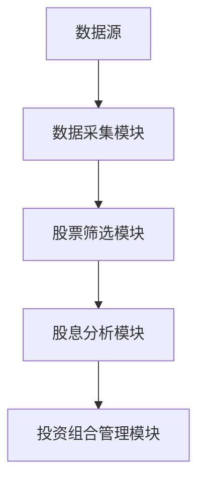

                 


# 格雷厄姆的股息投资策略：稳定收益的来源

> 关键词：格雷厄姆, 股息投资, 稳定收益, 价值投资, 股票分析, 投资策略, 股息率

> 摘要：本篇文章深入探讨了格雷厄姆的股息投资策略，分析了其核心理念、数学模型、系统架构设计以及实际项目案例。通过详细阐述股息投资的背景、核心概念、算法原理、系统设计和项目实现，本文为读者提供了全面理解格雷厄姆股息投资策略的框架。

---

## 第一部分: 格雷厄姆的股息投资哲学

### 第1章: 格雷厄姆的投资理念与股息策略

#### 1.1 格雷厄姆的投资哲学
格雷厄姆是价值投资的鼻祖，他强调以低于内在价值的价格购买优质资产。股息作为股票价值的重要组成部分，是其实现长期稳定收益的核心手段之一。本文将从格雷厄姆的投资哲学出发，逐步解析其股息投资策略的精髓。

#### 1.2 股息投资策略的背景
股息投资策略是一种以股息收入为主要收益来源的投资方式。通过选择高股息率或具有稳定股息增长潜力的股票，投资者可以在市场波动中获得相对稳定的收益。格雷厄姆认为，股息是衡量企业盈利能力的重要指标，也是企业内在价值的体现。

---

## 第二部分: 股息投资的核心概念

### 第2章: 股息的基本属性

#### 2.1 股息率的计算公式
股息率是衡量股票股息收益的重要指标，公式为：
$$股息率 = \frac{每股股息}{股价}$$

通过股息率，投资者可以评估股票的分红能力，以及与其他投资品种相比的收益潜力。

#### 2.2 股息支付率的定义
股息支付率是企业实际支付的股息与净利润的比率，公式为：
$$股息支付率 = \frac{股息支付总额}{净利润}$$

#### 2.3 股息增长的衡量指标
股息增长的可持续性是股息投资的核心考量因素之一。投资者需要分析企业的盈利能力和股息支付能力，以判断股息增长的潜力。

---

### 第3章: 股息投资的核心要素

#### 3.1 高质量股息支付者的特点
- 稳定的股息支付历史
- 足够的现金流支持
- 合理的股息支付率

#### 3.2 股息增长的可持续性分析
- 企业的盈利增长能力
- 行业地位与竞争优势
- 财务健康状况

#### 3.3 股票估值与股息收益率的关系
股息收益率与股票估值密切相关。投资者需要综合考虑股息收益率和市盈率、市净率等估值指标，以确定股票的内在价值。

---

## 第三部分: 股息投资策略的数学模型与公式

### 第4章: 股息增长模型

#### 4.1 股息增长模型的数学表达
股息增长模型是评估股票价值的重要工具，公式为：
$$P = \frac{D_1}{r - g}$$

其中：
- $P$ 是股票价格
- $D_1$ 是第一年的股息
- $r$ 是折现率
- $g$ 是股息增长率

#### 4.2 股息增长模型的应用
通过股息增长模型，投资者可以估算股票的内在价值，从而做出合理的投资决策。

---

## 第四部分: 股息投资策略的系统架构设计

### 第5章: 系统功能设计

#### 5.1 数据采集模块
- 从Yahoo Finance获取股票数据
- 数据清洗与预处理
- 数据存储与管理

#### 5.2 股票筛选模块
- 根据股息率、股息支付率等指标筛选股票
- 生成股息投资组合
- 风险评估与优化

#### 5.3 股息分析模块
- 股票估值分析
- 股息收益率计算
- 股息增长潜力评估

#### 5.4 投资组合管理模块
- 股票组合优化
- 风险与收益分析
- 投资组合调整与再平衡

---

### 第6章: 系统架构图



---

## 第五部分: 项目实战与最佳实践

### 第7章: 项目实战

#### 7.1 环境安装
- 安装Python环境
- 安装Pandas、numpy等数据分析库
- 安装Yahoo Finance数据接口

#### 7.2 核心代码实现

```python
import pandas as pd
import numpy as np

# 获取股票数据
def get_stock_data(tickers):
    data = []
    for ticker in tickers:
        df = pd.read_csv(f'data/{ticker}.csv')
        data.append(df)
    return pd.concat(data, keys=tickers, axis=1)

# 股息率计算
def calculate_dividend_yield(data):
    dividend_yield = data['股息'] / data['股价']
    return dividend_yield

# 股票筛选
def screen_stocks(data, threshold):
    selected = data[data['股息率'] > threshold]
    return selected
```

#### 7.3 案例分析
以实际股票数据为例，分析高股息股票的投资组合，并计算其预期收益与风险。

---

### 第8章: 最佳实践

#### 8.1 小结
格雷厄姆的股息投资策略通过筛选高股息率和具有稳定股息增长潜力的股票，为投资者提供了实现稳定收益的有效方法。

#### 8.2 注意事项
- 风险控制是股息投资的重要组成部分
- 需要定期调整投资组合
- 股息投资适合长期投资者

#### 8.3 拓展阅读
建议读者进一步阅读格雷厄姆的经典著作《聪明的投资者》，深入了解其价值投资理念。

---

## 作者信息

作者：AI天才研究院/AI Genius Institute & 禅与计算机程序设计艺术 /Zen And The Art of Computer Programming

---

通过以上内容，读者可以系统地理解格雷厄姆的股息投资策略，并将其应用于实际投资中。

