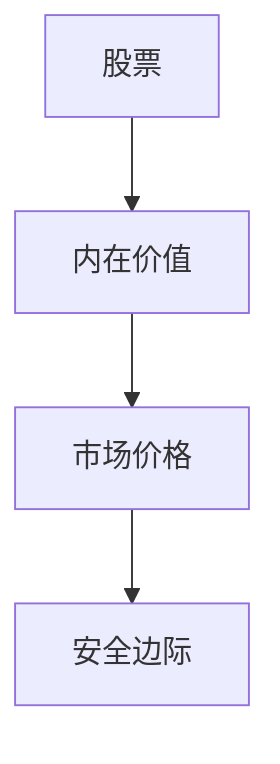
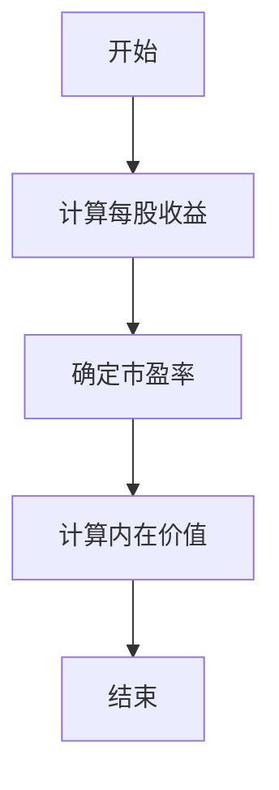
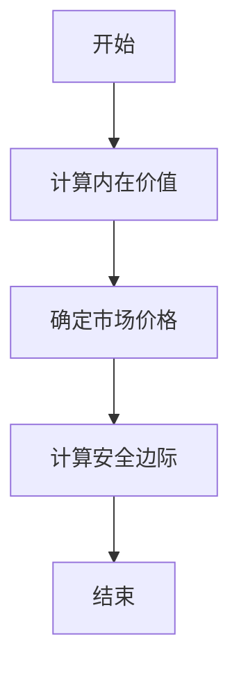

                 

# 格雷厄姆的股票估值模型

> 关键词：股票估值，价值投资，安全边际，内在价值，投资模型，投资策略

> 摘要：本文详细探讨了格雷厄姆的股票估值模型，从基础理论到实际应用，结合数学公式、算法流程图和Python代码，深入分析了格雷厄姆模型的核心概念、计算方法及其在投资决策中的应用。通过案例分析，展示了如何运用格雷厄姆的理论进行股票估值，并结合风险管理与投资者心理，提出了优化的投资策略。

---

# 目录

1. [格雷厄姆的股票估值模型基础](#graham-s-stock-valuation-model-foundation)
2. [格雷厄姆股票估值模型的核心概念](#graham-stock-valuation-models-core-concepts)
3. [格雷厄姆模型的算法原理](#graham-models-algorithm-principles)
4. [格雷厄姆模型的实际应用案例](#graham-models-real-world-application-cases)
5. [风险管理与投资者心理](#risk-management-and-investor-psychology)
6. [格雷厄姆模型的投资组合优化](#graham-model-investment-portfolio-optimization)
7. [结论](#conclusion)
8. [作者](#author)

---

# 第1章: 格雷厄姆的股票估值模型基础

## 1.1 股票估值的重要性与格雷厄姆的贡献

### 1.1.1 股票估值的核心问题

股票估值是投资者在股票市场中进行决策的基础，它涉及到对股票内在价值的评估以及对市场价格的分析。格雷厄姆作为价值投资的鼻祖，提出了许多影响深远的股票估值方法。

#### 1.1.1.1 股票估值的基本概念

股票估值是指通过对公司财务数据和市场情况的分析，估算出股票的内在价值，以决定其是否值得投资。股票估值的核心在于寻找被市场低估的股票，即其市场价格低于其内在价值。

#### 1.1.1.2 股票估值的意义与挑战

股票估值的意义在于帮助投资者做出明智的投资决策，降低投资风险。然而，股票估值也面临许多挑战，例如市场的不确定性和公司财务数据的复杂性。

#### 1.1.1.3 格雷厄姆在股票估值领域的贡献

格雷厄姆提出了“安全边际”的概念，强调在投资时应考虑市场价格与内在价值之间的差距，以确保投资的安全性。

### 1.1.2 格雷厄姆的价值投资理念

#### 1.1.2.1 价值投资的定义与特点

价值投资是一种投资策略，旨在通过寻找市场价格低于内在价值的股票来实现长期稳定的收益。

#### 1.1.2.2 格雷厄姆的安全边际概念

安全边际是指内在价值与市场价格之间的差额。格雷厄姆认为，只有当市场价格低于内在价值时，才值得投资。

#### 1.1.2.3 价值投资与成长投资的区别

价值投资注重股票的内在价值，而成长投资则注重公司的成长潜力。格雷厄姆的价值投资理念强调稳健和安全，而成长投资则更注重高增长。

### 1.1.3 股票估值的基本方法

#### 1.1.3.1 市盈率法

市盈率（P/E）是衡量股票价值的重要指标之一。市盈率法通过比较股票的市盈率与行业平均水平，来判断其是否被低估或高估。

#### 1.1.3.2 市净率法

市净率（P/B）是另一种常用的股票估值方法，它通过比较股票的市净率与行业平均水平，来判断其是否被低估或高估。

#### 1.1.3.3 股息率法

股息率是股票的年股息与股价的比率。股息率法通过分析股息率的变化，来判断股票的投资价值。

## 1.2 格雷厄姆股票估值模型的核心概念

### 1.2.1 内在价值的定义

内在价值是股票在理论上应具有的价值，与市场价格无关。格雷厄姆认为，内在价值是股票估值的核心。

### 1.2.2 内在价值的计算公式

$$ V = \frac{E}{P} $$

其中，V为内在价值，E为每股收益，P为市盈率。

### 1.2.3 安全边际的计算公式

$$ S = V - P $$

其中，S为安全边际，V为内在价值，P为市场价格。

### 1.2.4 格雷厄姆模型的核心要素对比

| 核心要素 | 定义 | 重要性 |
|----------|------|--------|
| 内在价值 | 股票的真实价值 | 核心 |
| 市场价格 | 当前股票价格 | 次要 |
| 安全边际 | 内在价值与市场价格的差值 | 关键 |

### 1.2.5 格雷厄姆模型的ER实体关系图

## 1.3 格雷厄姆模型的算法原理

### 1.3.1 内在价值计算算法

#### 1.3.1.1 算法步骤

1. 计算每股收益（E）。
2. 确定合理的市盈率（P）。
3. 计算内在价值（V = E * P）。

#### 1.3.1.2 算法流程图

### 1.3.2 安全边际计算算法

#### 1.3.2.1 算法步骤

1. 计算内在价值（V）。
2. 确定市场价格（P）。
3. 计算安全边际（S = V - P）。

#### 1.3.2.2 算法流程图

### 1.3.3 格雷厄姆模型的数学模型与公式

$$ V = \frac{E}{P} $$
$$ S = V - P $$

---

# 第2章: 格雷厄姆股票估值模型的实际应用

## 2.1 格雷厄姆模型在实际投资中的应用

### 2.1.1 确定内在价值

通过分析公司的财务数据，计算其每股收益和市盈率，进而确定内在价值。

### 2.1.2 计算安全边际

比较市场价格与内在价值，确定是否存在安全边际。

### 2.1.3 投资决策

根据安全边际的大小，决定是否投资。

## 2.2 格雷厄姆模型的案例分析

### 2.2.1 案例一：苹果公司

1. 计算苹果公司的每股收益和市盈率。
2. 确定其内在价值。
3. 比较市场价格与内在价值，计算安全边际。

### 2.2.2 案例二：微软公司

1. 计算微软公司的每股收益和市盈率。
2. 确定其内在价值。
3. 比较市场价格与内在价值，计算安全边际。

---

# 第3章: 风险管理与投资者心理

## 3.1 风险管理的重要性

### 3.1.1 风险的定义与分类

股票投资中的风险包括市场风险、流动性风险、公司特有风险等。

### 3.1.2 格雷厄姆模型中的风险管理

通过安全边际的计算，降低投资风险。

## 3.2 投资者心理与行为

### 3.2.1 投资者心理偏差

包括过度自信、从众心理等。

### 3.2.2 心理因素对投资决策的影响

投资者心理偏差可能导致非理性的投资决策。

## 3.3 管理心理因素的策略

### 3.3.1 提高自我认知

通过学习和反思，减少心理偏差的影响。

### 3.3.2 设立投资纪律

制定明确的投资策略，避免情绪化决策。

---

# 第4章: 格雷厄姆模型的投资组合优化

## 4.1 投资组合的基本概念

### 4.1.1 投资组合的定义

投资组合是指投资者持有的各种资产的组合。

### 4.1.2 投资组合的目标

实现资产的保值与增值。

## 4.2 格雷厄姆模型在投资组合中的应用

### 4.2.1 选择低估股票

通过格雷厄姆模型筛选出具有安全边际的股票，构建投资组合。

### 4.2.2 定期调整

根据市场变化和公司情况，定期调整投资组合。

## 4.3 投资组合优化的策略

### 4.3.1 分散投资

通过投资多种股票，降低投资风险。

### 4.3.2 定期再平衡

根据市场变化，调整投资比例，保持投资组合的稳定性。

---

# 第5章: 结论

## 5.1 格雷厄姆模型的核心思想

格雷厄姆的股票估值模型以内在价值和安全边际为核心，强调稳健和安全的投资策略。

## 5.2 格雷厄姆模型的现实意义

格雷厄姆模型为投资者提供了科学的股票估值方法，帮助他们在复杂多变的市场中做出明智的投资决策。

## 5.3 未来展望

随着市场的发展，格雷厄姆模型需要不断更新和完善，以适应新的市场环境和投资者需求。

---

# 作者

作者：AI天才研究院/AI Genius Institute  
& 禅与计算机程序设计艺术 /Zen And The Art of Computer Programming

