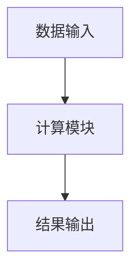
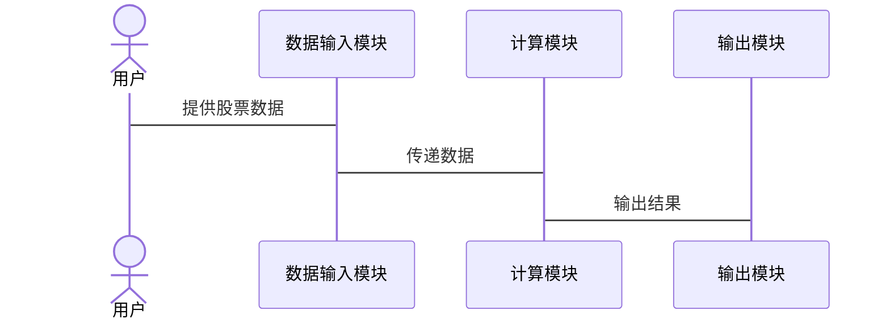

                 


# 格雷厄姆的股票选择公式

**关键词：** 格雷厄姆, 股票选择, 价值投资, 股票筛选, 投资策略, 股票估值

**摘要：** 格雷厄姆的股票选择公式是价值投资的重要工具，本文详细解读了该公式的背景、核心概念、数学模型、系统架构及实战应用。通过分析公式背后的逻辑和实际案例，帮助投资者理解和应用这一经典投资策略。

---

# 第一部分: 格雷厄姆的股票选择公式概述

## 第1章: 背景介绍

### 1.1 价值投资的起源

#### 1.1.1 投资的基本概念与定义

投资是指将资金投入某一领域，期望在未来获得超过初始投入的收益。投资可以分为股票、债券、房地产等多种形式，其中股票投资因其高回报潜力而备受关注。

#### 1.1.2 价值投资的兴起与发展

价值投资是一种通过深入分析企业的基本面，寻找市场价格低于其内在价值的股票的投资策略。该理念由本杰明·格雷厄姆和戴维·多德在20世纪初提出，强调安全边际和长期投资。

#### 1.1.3 格雷厄姆与巴菲特的价值投资理念

本杰明·格雷厄姆是价值投资的鼻祖，他提出了“市场先生”理论，认为市场情绪波动会影响股价，但长期来看，股价应回归其内在价值。沃伦·巴菲特师承格雷厄姆，进一步发展了价值投资理念，强调企业内在价值和长期盈利能力。

---

## 第2章: 核心概念与公式

### 2.1 格雷厄姆股票选择公式的核心要素

#### 2.1.1 市盈率（P/E Ratio）

市盈率是衡量股票价格是否合理的重要指标，计算公式为：
$$ \text{市盈率} = \frac{\text{股价}}{\text{每股收益}} $$

#### 2.1.2 市净率（P/B Ratio）

市净率是股价与每股净资产的比率，公式为：
$$ \text{市净率} = \frac{\text{股价}}{\text{每股净资产}} $$

#### 2.1.3 股息率（Dividend Yield）

股息率是衡量股票分红能力的指标，计算为：
$$ \text{股息率} = \frac{\text{股息支付额}}{\text{股价}} $$

#### 2.1.4 预估合理股价（Intrinsic Value）

合理股价是基于企业内在价值的评估，格雷厄姆提出：
$$ \text{合理股价} = \frac{2.5 \times \text{EPS}}{\text{长期国债收益率}} $$

---

### 2.2 格雷厄姆公式的核心公式

#### 2.2.1 公式的基本形式

格雷厄姆的股票选择公式：
$$ \text{合理股价} = \frac{2.5 \times \text{EPS}}{\text{长期国债收益率}} $$

其中，EPS为每股收益，长期国债收益率代表无风险利率。

#### 2.2.2 公式的变量解释与计算步骤

- EPS计算：净利润除以普通股股数。
- 长期国债收益率：反映市场无风险利率，通常选取长期国债的收益率。

#### 2.2.3 实例分析

假设某公司EPS为5元，长期国债收益率为4%，则合理股价为：
$$ \frac{2.5 \times 5}{0.04} = 31.25 \text{元} $$

---

## 第3章: 格雷厄姆公式背后的数学模型

### 3.1 格雷厄姆公式的核心数学原理

#### 3.1.1 EPS的计算公式

$$ \text{EPS} = \frac{\text{净利润}}{\text{普通股股数}} $$

#### 3.1.2 市盈率的计算公式

$$ \text{市盈率} = \frac{\text{股价}}{\text{EPS}} $$

---

## 第4章: 系统分析与架构设计

### 4.1 系统目标与功能需求

#### 4.1.1 系统目标：基于格雷厄姆公式的股票筛选工具

设计一个系统，根据格雷厄姆公式筛选出具有投资价值的股票。

#### 4.1.2 功能需求：数据输入、计算、结果输出

系统需要输入股票数据，计算合理股价，输出筛选结果。

### 4.2 系统架构设计

#### 4.2.1 数据流图



#### 4.2.2 模块划分与交互流程



---

## 第5章: 项目实战

### 5.1 环境安装

需要安装Python和相关库，如pandas和numpy。

### 5.2 核心实现源代码

```python
import pandas as pd

def calculate_intrinsic_value(df):
    df['EPS'] = df['净利润'] / df['普通股股数']
    df['合理股价'] = (2.5 * df['EPS']) / df['长期国债收益率']
    return df

# 示例数据
data = {
    '股票代码': ['A', 'B', 'C'],
    '净利润': [10, 15, 20],
    '普通股股数': [100, 200, 250],
    '长期国债收益率': [0.04, 0.05, 0.06]
}

df = pd.DataFrame(data)
result = calculate_intrinsic_value(df)
print(result)
```

### 5.3 代码解读与分析

代码读取数据，计算EPS和合理股价，输出结果。

### 5.4 实际案例分析

以某公司为例，计算其合理股价，判断其是否被低估。

### 5.5 项目小结

总结项目实现过程，强调公式在实际中的应用价值。

---

## 第6章: 最佳实践 tips

### 6.1 小结

格雷厄姆公式是价值投资的重要工具，但需结合市场环境和其他因素综合分析。

### 6.2 注意事项

避免机械应用公式，关注公司基本面和市场变化。

### 6.3 拓展阅读

推荐相关书籍和文章，深入学习价值投资。

---

**作者：AI天才研究院 & 禅与计算机程序设计艺术**

