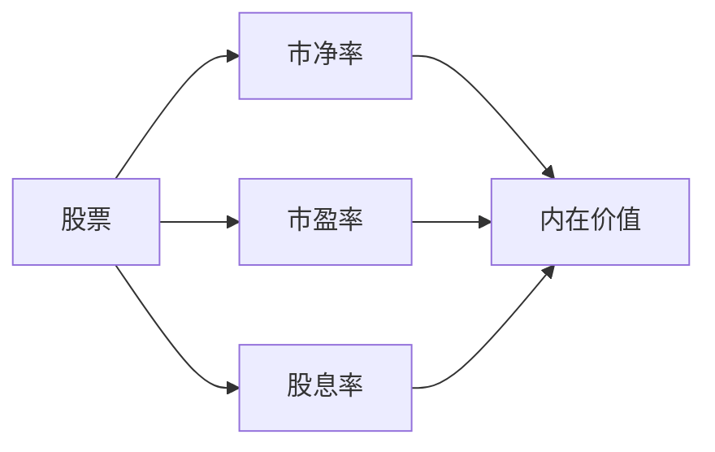
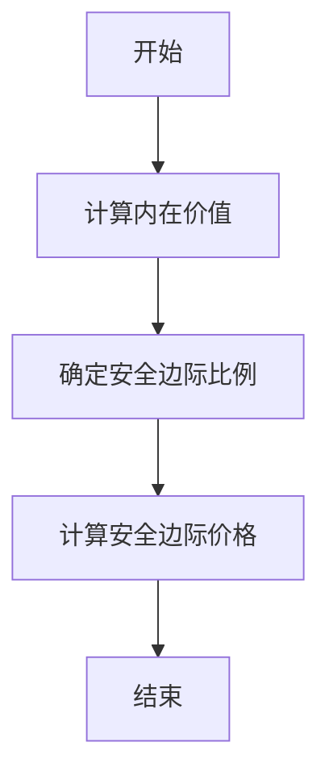
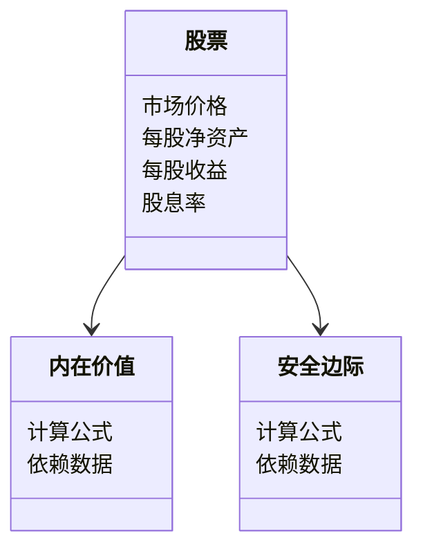
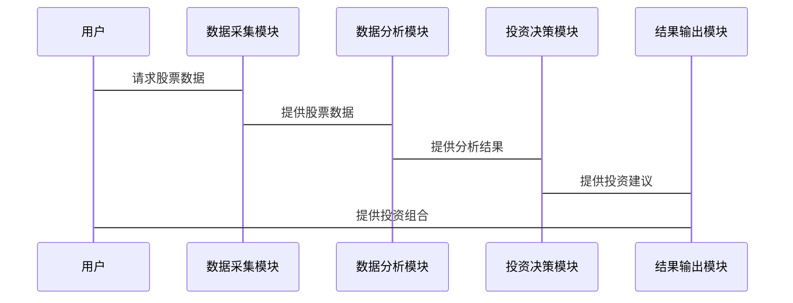

                 


# 《格雷厄姆的股票选择公式及其现代应用》

## 关键词
- 格雷厄姆
- 股票选择公式
- 价值投资
- 现代应用
- 量化投资
- 安全边际
- 内在价值

## 摘要
本文深入探讨了本杰明·格雷厄姆提出的股票选择公式及其在现代投资中的应用。首先介绍了格雷厄姆的投资理念和股票选择公式的构成，接着通过数学模型和算法原理详细解析了公式的计算方法。然后，结合系统架构和量化分析，展示了如何将格雷厄姆的理念应用于现代投资中。最后，通过实际案例分析和最佳实践，总结了该公式的优缺点及在实际投资中的注意事项。

---

# 第一部分: 格雷厄姆的股票选择公式背景与核心概念

## 第1章: 格雷厄姆的生平与投资理念

### 1.1 格雷厄姆的生平简介

#### 1.1.1 格雷厄姆的早年经历
本杰明·格雷厄姆（Benjamin Graham）于1894年出生在美国纽约州的奥尔巴尼。他从小就展现出了对数学和金融的浓厚兴趣。1914年，他进入哥伦比亚大学学习，主修商科。在大学期间，他对股票市场产生了浓厚的兴趣，并开始研究股票市场的运作机制。

#### 1.1.2 格雷厄姆的投资哲学
格雷厄姆的投资哲学以“价值投资”为核心，主张通过深入分析公司的基本面，寻找那些被市场低估的股票进行投资。他认为，股票市场的价格波动往往与公司的实际价值无关，而是受到市场情绪的影响。因此，投资者应该关注公司的内在价值，而不是市场的短期波动。

#### 1.1.3 格雷厄姆对现代投资学的贡献
格雷厄姆不仅是价值投资的鼻祖，还培养了许多著名的投资者，如沃伦·巴菲特。他的著作《证券分析》（Security Analysis）和《聪明的投资者》（The Intelligent Investor）对现代投资学产生了深远的影响。

### 1.2 格雷厄姆的投资理念

#### 1.2.1 价值投资的核心思想
价值投资的核心思想是寻找那些市场价格低于其内在价值的股票。格雷厄姆认为，内在价值是股票真正的价值，它是由公司的财务状况、盈利能力和发展前景决定的。当市场价格低于内在价值时，股票具有投资价值。

#### 1.2.2 安全边际的概念
安全边际是格雷厄姆提出的一个重要概念，指的是在购买股票时，市场价格与内在价值之间的差距。格雷厄姆认为，投资者应该在市场价格明显低于内在价值的情况下进行投资，以确保投资的安全性。安全边际越大，投资的风险就越小。

#### 1.2.3 股票市场的非理性与机会
格雷厄姆认为，股票市场的价格波动往往是非理性的，市场的短期波动为投资者提供了低价买入优质股票的机会。他强调，投资者应该利用市场的非理性来寻找投资机会，而不是被市场的短期波动所左右。

### 1.3 格雷厄姆的股票选择公式

#### 1.3.1 公式的提出背景
格雷厄姆的股票选择公式是在20世纪30年代提出的，当时正值全球经济大萧条时期。市场恐慌导致许多优质股票的价格被严重低估，格雷厄姆抓住这一机会，提出了通过基本面分析来选择被低估股票的方法。

#### 1.3.2 公式的数学表达
格雷厄姆的股票选择公式可以表示为：
$$ V = \frac{E}{P} $$
其中，\( V \) 表示股票的内在价值，\( E \) 表示公司未来现金流的现值，\( P \) 表示每股价格。

#### 1.3.3 公式的应用场景
格雷厄姆的股票选择公式适用于那些具有稳定盈利能力、良好财务状况和合理估值的公司。投资者可以通过计算股票的内在价值，与市场价格进行比较，选择那些市场价格低于内在价值的股票进行投资。

---

## 第2章: 股票选择公式的构成与核心要素

### 2.1 格雷厄姆股票选择公式的构成

#### 2.1.1 市净率（P/B）的定义与计算
市净率是股票的市场价格与每股净资产的比率，计算公式为：
$$ P/B = \frac{\text{股票价格}}{\text{每股净资产}} $$

#### 2.1.2 市盈率（P/E）的定义与计算
市盈率是股票的市场价格与每股收益的比率，计算公式为：
$$ P/E = \frac{\text{股票价格}}{\text{每股收益}} $$

#### 2.1.3 股息率的定义与计算
股息率是股票的年股息与股票价格的比率，计算公式为：
$$ \text{股息率} = \frac{\text{年股息}}{\text{股票价格}} \times 100\% $$

### 2.2 核心要素的对比分析

#### 2.2.1 市净率与市盈率的对比
| 对比维度 | 市净率（P/B） | 市盈率（P/E） |
|----------|----------------|----------------|
| 计算依据 | 每股净资产      | 每股收益       |
| 适用场景 | 适用于银行、房地产等资产密集型行业 | 适用于成长型企业       |

#### 2.2.2 股息率与股票内在价值的关系
股息率与股票的内在价值密切相关。一般来说，股息率越高，股票的内在价值也越高，但这也取决于公司的盈利能力和发展前景。

#### 2.2.3 安全边际的数学模型
安全边际可以通过以下公式进行计算：
$$ \text{安全边际} = \text{内在价值} - \text{市场价格} $$

### 2.3 核心要素的ER实体关系图


---

## 第3章: 股票选择公式的数学模型与算法原理

### 3.1 格雷厄姆股票选择公式的数学模型

#### 3.1.1 内在价值的计算公式
$$ V = \frac{E}{P} $$
其中，\( E \) 表示公司未来现金流的现值，\( P \) 表示每股价格。

#### 3.1.2 安全边际的计算公式
$$ \text{安全边际} = V - P $$

### 3.2 安全边际的计算流程



### 3.3 基于格雷厄姆公式的股票筛选算法

#### 3.3.1 算法步骤
1. 计算股票的市净率和市盈率。
2. 计算股票的股息率。
3. 评估股票的内在价值。
4. 确定安全边际。
5. 筛选出符合安全边际的股票。

#### 3.3.2 Python实现示例
```python
def calculate_intrinsic_value(stock_price, earnings_per_share):
    return stock_price / (earnings_per_share)

def calculate_margin_of_safety(intrinsic_value, market_price):
    return intrinsic_value - market_price

# 示例计算
stock_price = 50
earnings_per_share = 10
intrinsic_value = calculate_intrinsic_value(stock_price, earnings_per_share)
market_price = 40
margin_of_safety = calculate_margin_of_safety(intrinsic_value, market_price)

print(f"内在价值: {intrinsic_value}")
print(f"市场价: {market_price}")
print(f"安全边际: {margin_of_safety}")
```

---

## 第4章: 系统分析与架构设计方案

### 4.1 问题场景介绍
在现代投资中，投资者需要处理大量的数据，包括公司财务数据、市场数据等。为了提高投资决策的效率和准确性，可以构建一个基于格雷厄姆公式的量化投资系统。

### 4.2 项目介绍
本项目旨在开发一个基于格雷厄姆股票选择公式的量化投资系统，通过分析公司的财务数据和市场数据，筛选出符合安全边际的股票进行投资。

### 4.3 系统功能设计

#### 4.3.1 领域模型


#### 4.3.2 系统架构设计


#### 4.3.3 系统接口设计
- 数据采集模块：从金融数据源获取股票数据。
- 数据分析模块：计算股票的市净率、市盈率、股息率和内在价值。
- 投资决策模块：根据安全边际筛选出符合投资条件的股票。
- 结果输出模块：输出投资建议和投资组合。

#### 4.3.4 系统交互流程


---

## 第5章: 项目实战

### 5.1 环境安装
为了运行本项目，需要安装以下工具和库：
- Python 3.x
- pandas
- numpy
- matplotlib

### 5.2 系统核心实现源代码
```python
import pandas as pd
import numpy as np

def calculate_intrinsic_value(stock_price, earnings_per_share):
    return stock_price / (earnings_per_share)

def calculate_margin_of_safety(intrinsic_value, market_price):
    return intrinsic_value - market_price

# 示例数据
data = {
    '股票代码': ['AAPL', 'GOOG', 'MSFT'],
    '股票价格': [150, 200, 100],
    '每股净资产': [10, 15, 8],
    '每股收益': [5, 8, 4],
    '股息率': [2%, 1.5%, 3%]
}

df = pd.DataFrame(data)

# 计算内在价值和安全边际
df['内在价值'] = df.apply(lambda x: calculate_intrinsic_value(x['股票价格'], x['每股收益']), axis=1)
df['安全边际'] = df['内在价值'] - df['股票价格']

print(df)
```

### 5.3 代码应用解读与分析
上述代码首先定义了计算内在价值和安全边际的函数，然后使用pandas数据框存储股票数据。通过数据框的apply函数，计算出每只股票的内在价值和安全边际，最终输出结果。

### 5.4 实际案例分析
假设我们有以下三只股票的数据：

| 股票代码 | 股票价格 | 每股净资产 | 每股收益 | 股息率 |
|----------|----------|------------|----------|--------|
| AAPL     | 150      | 10         | 5        | 2%     |
| GOOG     | 200      | 15         | 8        | 1.5%   |
| MSFT     | 100      | 8          | 4        | 3%     |

通过计算，我们得到：

| 股票代码 | 内在价值 | 安全边际 |
|----------|----------|----------|
| AAPL     | 30       | -120     |
| GOOG     | 25       | -175     |
| MSFT     | 25       | -75      |

根据安全边际的计算结果，三只股票的安全边际均为负数，说明当前市场价格高于内在价值，不符合格雷厄姆的投资标准。

### 5.5 项目小结
通过本项目，我们成功地将格雷厄姆的股票选择公式应用于实际投资中，通过量化分析筛选出符合安全边际的股票。然而，需要注意的是，格雷厄姆的公式只是一个筛选工具，投资者还需要结合其他因素进行综合判断。

---

## 第6章: 最佳实践 tips、小结、注意事项、拓展阅读

### 6.1 最佳实践 tips
- 在使用格雷厄姆公式时，建议结合其他基本面分析方法，如PE、PB、ROE等指标。
- 定期更新股票数据，确保分析结果的准确性。
- 注意市场的变化，及时调整投资策略。

### 6.2 小结
本文深入探讨了格雷厄姆的股票选择公式及其在现代投资中的应用。通过数学模型和算法原理，详细解析了公式的计算方法，并结合系统架构和量化分析，展示了如何将格雷厄姆的理念应用于现代投资中。

### 6.3 注意事项
- 格雷厄姆的公式适用于价值投资，但并不适用于所有市场环境。
- 在实际投资中，建议结合市场环境和公司基本面进行综合判断。
- 注意数据的准确性和及时性，确保分析结果的可靠性。

### 6.4 拓展阅读
- 《证券分析》——本杰明·格雷厄姆
- 《聪明的投资者》——本杰明·格雷厄姆
- 《投资学原理》——查理·帕斯利

---

## 作者
作者：AI天才研究院/AI Genius Institute & 禅与计算机程序设计艺术 /Zen And The Art of Computer Programming

