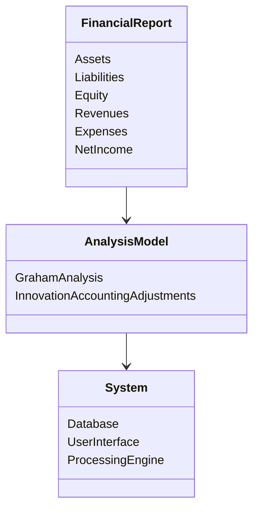
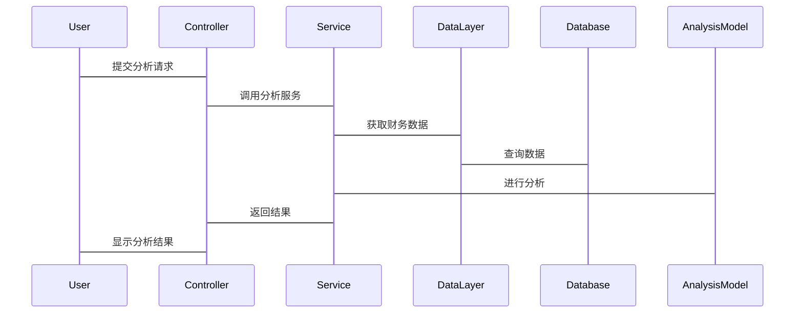

                 


# 格雷厄姆的财务报表分析：应对创新会计处理方法

## 关键词：格雷厄姆、财务报表分析、创新会计、投资分析、风险管理

## 摘要：本文详细探讨了格雷厄姆的财务报表分析方法，特别是如何应对创新会计处理方法。文章首先介绍了格雷厄姆分析方法的背景与核心概念，然后分析了创新会计处理对财务报表的影响，提出了应对策略。通过数学模型、系统架构和项目实战等多维度的分析，本文为读者提供了全面的视角和实用的指导，帮助他们在复杂多变的会计环境中做出明智的投资决策。

---

## 第一部分: 格雷厄姆的财务报表分析基础

---

### 第1章: 财务报表分析的背景与演变

#### 1.1 财务报表分析的定义与作用

##### 1.1.1 财务报表分析的基本概念
财务报表分析是通过对公司财务报表（资产负债表、利润表、现金流量表）的解读，评估企业的财务状况、盈利能力和未来发展前景的过程。它是投资者、债权人和管理层做出决策的重要依据。

##### 1.1.2 财务报表分析的作用与意义
1. 评估企业的财务健康状况。
2. 识别企业的盈利能力和发展潜力。
3. 为投资决策提供数据支持。
4. 通过历史数据和趋势分析预测未来表现。

##### 1.1.3 财务报表分析的演变历程
- 传统财务报表分析：基于历史数据的静态分析。
- 现代财务报表分析：引入动态分析、比率分析和趋势分析。
- 当前趋势：结合大数据和人工智能技术，进行实时、智能化的分析。

#### 1.2 格雷厄姆的财务分析方法

##### 1.2.1 格雷厄姆的分析理念
本杰明·格雷厄姆是价值投资的鼻祖，他强调以低于内在价值的价格买入优质股票。他的分析方法注重企业的基本面，尤其是财务报表数据。

##### 1.2.2 格雷厄姆的估值方法
格雷厄姆提出了“内在价值”概念，即企业未来现金流的现值。他通过分析企业的盈利能力、资产质量、负债水平等因素，计算出企业的内在价值，作为投资决策的依据。

##### 1.2.3 格雷厄姆与现代财务分析的联系
格雷厄姆的方法奠定了现代财务分析的基础，尤其是他对安全边际的重视，为投资者在面对市场波动时提供了保护。

#### 1.3 创新会计处理方法的背景

##### 1.3.1 会计准则的演变
会计准则的不断更新，如IFRS和US GAAP的趋同，为企业提供了更多的灵活性，但也带来了创新会计处理的可能性。

##### 1.3.2 创新会计处理的动机与影响
企业为了优化财务表现或应对监管要求，可能会采用创新的会计处理方法。这些方法可能影响财务报表的真实性和可比性。

##### 1.3.3 创新会计处理对财务报表分析的挑战
分析师需要识别和调整创新会计处理带来的偏差，确保分析结果的准确性。

---

### 第2章: 格雷厄姆财务报表分析的核心概念

#### 2.1 格雷厄姆分析模型的构成

##### 2.1.1 核心概念：内在价值与市场价值
- **内在价值**：企业未来现金流的现值。
- **市场价值**：市场参与者对企业的估值。
- **安全边际**：内在价值与市场价值的差额，提供了投资的安全空间。

##### 2.1.2 核心概念：资产、负债与所有者权益
- **资产**：企业拥有的资源，预期能带来经济利益。
- **负债**：企业欠款，需在未来偿还。
- **所有者权益**：企业的净资产，等于资产减去负债。

##### 2.1.3 核心概念：收益质量与可持续性
- **收益质量**：净利润的来源和质量，影响企业的持续盈利能力。
- **可持续性**：企业盈利的持续性，取决于行业地位、竞争优势等因素。

#### 2.2 财务报表分析的维度

##### 2.2.1 资产负债表分析
- **资产结构**：流动资产与非流动资产的比例。
- **负债结构**：短期负债与长期负债的比例。
- **偿债能力**：流动比率、速动比率等指标。

##### 2.2.2 利润表分析
- **收入与成本**：收入增长趋势，成本控制能力。
- **盈利能力**：净利润率、毛利率等指标。
- **Margins and Returns on Equity**：ROE（净资产收益率）。

##### 2.2.3 现金流量表分析
- **经营活动现金流**：企业日常运营产生的现金流。
- **投资活动现金流**：企业投资活动的现金流。
- **筹资活动现金流**：企业筹资活动的现金流。

#### 2.3 格雷厄姆分析模型与创新会计的结合

##### 2.3.1 格雷厄姆模型的适用性
格雷厄姆模型适用于传统的会计处理方法，但在面对创新会计时，需要进行调整。

##### 2.3.2 创新会计对模型的影响
创新会计可能影响企业的财务报表数据，导致格雷厄姆模型的估值出现偏差。

##### 2.3.3 应对创新会计的策略
1. **识别创新会计处理**：通过审阅财务报表和注释，识别可能的创新会计处理。
2. **调整估值模型**：根据创新会计的影响，调整格雷厄姆模型的参数。
3. **加强基本面分析**：结合行业趋势和企业基本面，验证财务数据的合理性。

---

### 第3章: 创新会计处理方法的分析框架

#### 3.1 创新会计处理方法的分类

##### 3.1.1 创新会计处理的类型
1. **收入确认的创新**：如将收入确认时点提前。
2. **资产计量的创新**：如采用公允价值计量。
3. **负债确认的创新**：如推迟负债的确认。

##### 3.1.2 创新会计处理的典型案例
- 公允价值计量的使用：如金融资产的公允价值变动。
- 收购交易的会计处理：如商誉的确认和计量。

##### 3.1.3 创新会计处理的识别方法
1. **审阅财务报表注释**：识别会计政策的变化。
2. **比较不同期间的财务数据**：分析数据变化的合理性。
3. **行业比较**：与同行业公司进行比较，识别异常值。

#### 3.2 创新会计处理对财务报表的影响

##### 3.2.1 资产负债表的影响
- 资产可能被高估或低估。
- 负债可能被低估或高估。

##### 3.2.2 利润表的影响
- 收入可能被提前确认，导致利润虚高。
- 成本可能被延迟确认，影响利润的准确性。

##### 3.2.3 现金流量表的影响
- 经营活动现金流可能与实际不符。
- 投资和筹资活动现金流可能被人为调整。

#### 3.3 应对创新会计处理的分析策略

##### 3.3.1 格雷厄姆模型的调整
- 调整收入确认政策的影响。
- 重新评估资产和负债的公允价值。

##### 3.3.2 创新会计处理的应对方法
1. **加强财务报表分析的深度**：不仅仅是看数字，还要理解背后的会计处理。
2. **结合行业知识**：了解企业的商业模式和行业特点，识别创新会计的可能性。
3. **对比分析**：与同行业公司进行对比，识别异常值。

##### 3.3.3 多维度验证与交叉分析
- 结合财务数据和非财务信息，进行多维度验证。
- 通过交叉分析，确保数据的一致性和合理性。

---

### 第4章: 格雷厄姆分析模型的数学模型与公式

#### 4.1 格雷厄姆分析模型的数学表达

##### 4.1.1 内在价值公式
$$ V = \frac{E \times (1+g)}{r} $$
其中，\( E \) 是企业的当前盈利，\( g \) 是盈利增长率，\( r \) 是折现率。

##### 4.1.2 安全边际计算公式
$$ \text{安全边际} = V - P $$
其中，\( V \) 是内在价值，\( P \) 是市场价格。

#### 4.2 创新会计处理的数学分析

##### 4.2.1 创新会计处理对资产的影响
$$ \text{调整后资产} = \text{原始资产} \pm \text{创新调整项} $$

##### 4.2.2 创新会计处理对利润的影响
$$ \text{调整后利润} = \text{原始利润} \pm \text{创新调整项} $$

---

## 第二部分: 应对创新会计处理的系统分析与架构设计

---

### 第5章: 应对创新会计处理的系统架构设计

#### 5.1 问题场景介绍
在当前的会计环境中，创新会计处理方法越来越普遍，传统的财务分析方法需要进行调整，以应对新的挑战。

#### 5.2 系统功能设计

##### 5.2.1 领域模型（mermaid类图）


##### 5.2.2 系统架构设计（mermaid架构图）
```mermaid
architectural
    DataLayer [数据层] --> ServiceLayer [服务层] --> ControllerLayer [控制层] --> ViewLayer [视图层]
    DataLayer --> Database
    ServiceLayer --> AnalysisModel
```

##### 5.2.3 系统接口设计
- 数据接口：从数据库中获取财务数据。
- 用户接口：供用户输入分析参数和查看结果。

##### 5.2.4 系统交互（mermaid序列图）


---

### 第6章: 应对创新会计处理的项目实战

#### 6.1 环境安装

##### 6.1.1 安装Python和相关库
```bash
pip install numpy pandas matplotlib
```

#### 6.2 系统核心实现源代码

##### 6.2.1 财务数据处理代码
```python
import pandas as pd

# 加载财务数据
df = pd.read_csv('financial_data.csv')

# 创新会计调整
def adjust_innovation_accounting(row):
    if row['account_type'] == 'asset':
        return row['value'] * 1.1
    elif row['account_type'] == 'liability':
        return row['value'] * 0.9
    else:
        return row['value']

# 应用调整
df['adjusted_value'] = df.apply(adjust_innovation_accounting, axis=1)
```

##### 6.2.2 格雷厄姆分析代码
```python
def calculate_intrinsic_value(eps, growth_rate, discount_rate):
    return eps * (1 + growth_rate) / discount_rate

# 计算内在价值
intrinsic_value = calculate_intrinsic_value(df['eps'], df['growth_rate'], df['discount_rate'])
```

#### 6.3 代码应用解读与分析
通过上述代码，我们可以对财务数据进行创新会计调整，并计算出企业的内在价值。这有助于投资者在面对创新会计处理时，做出更准确的投资决策。

#### 6.4 实际案例分析
以某公司为例，假设其财务数据如下：

| 账务项目 | 原始值 | 调整后值 |
|---------|--------|----------|
| 资产    | 1000   | 1100     |
| 负债    | 500    | 450      |
| 所有者权益 | 500    | 650      |

调整后的财务数据可以帮助我们更准确地评估企业的财务状况。

---

## 第三部分: 应对创新会计处理的注意事项与总结

---

### 第7章: 应对创新会计处理的注意事项

#### 7.1 注意事项
1. **持续学习**：会计准则和处理方法不断变化，需要持续关注行业动态。
2. **多维度分析**：结合财务数据和非财务信息，进行综合分析。
3. **谨慎投资**：在面对创新会计处理时，保持谨慎，避免盲目跟风。

#### 7.2 小结
通过本文的分析，我们了解了格雷厄姆的财务报表分析方法在应对创新会计处理时的应用。创新会计处理虽然增加了分析的难度，但也为投资者提供了更多的思考空间。

---

### 第8章: 项目总结与拓展阅读

#### 8.1 项目总结
通过对创新会计处理的分析和应对策略的制定，我们掌握了如何在复杂多变的会计环境中，利用格雷厄姆的分析方法，做出明智的投资决策。

#### 8.2 注意事项
- 在实际操作中，需要结合企业的具体情况，灵活调整分析方法。
- 定期回顾和更新分析模型，以适应新的会计处理方法。

#### 8.3 拓展阅读
- 格雷厄姆的《 Intelligent Investor》
- 《财务报表分析与决策》
- 《会计学：概念与应用》

---

## 作者：AI天才研究院/AI Genius Institute & 禅与计算机程序设计艺术 /Zen And The Art of Computer Programming

