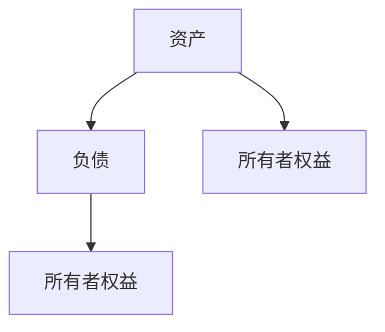
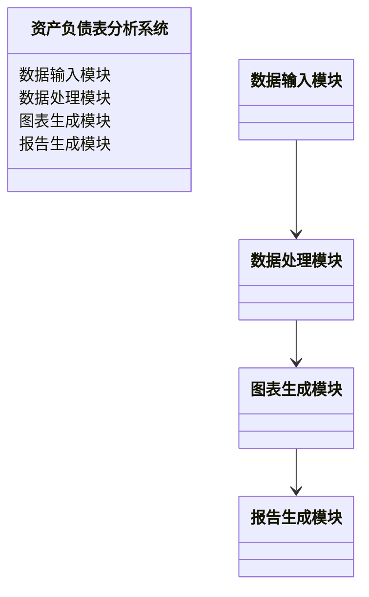

                 


# 《格雷厄姆的资产负债表分析技巧》

## 关键词：资产负债表，格雷厄姆，财务分析，比率分析，投资技巧，杜邦分析

## 摘要：本文深入探讨了格雷厄姆的资产负债表分析技巧，从基础概念到高级方法，结合实际案例，详细讲解了如何通过分析资产负债表来评估企业财务健康状况和投资价值。文章系统地介绍了核心概念、分析方法、系统架构设计和实战技巧，帮助读者掌握这一经典的投资分析方法。

---

## 第1章: 资产负债表的基础知识

### 1.1 资产负债表的定义与结构

#### 1.1.1 资产负债表的定义
资产负债表是反映企业在某一特定日期财务状况的报表，主要由资产、负债和所有者权益三部分组成，是企业财务健康状况的晴雨表。

#### 1.1.2 资产负债表的基本结构
资产 = 负债 + 所有者权益

#### 1.1.3 资产负债表的重要性
- 揭示企业的财务状况
- 评估企业的偿债能力
- 为投资决策提供依据

### 1.2 格雷厄姆的分析理念

#### 1.2.1 格雷厄姆的价值投资理论
格雷厄姆认为，市场短期是投票器，长期是称重机，注重企业的内在价值。

#### 1.2.2 格雷厄姆对资产负债表的重视
格雷厄姆强调，通过分析资产负债表可以评估企业的财务健康状况和长期发展潜力。

#### 1.2.3 格雷厄姆分析方法的核心思想
- 以合理的价格买入优质的资产
- 重视企业的财务稳定性
- 关注企业的偿债能力和盈利能力

### 1.3 资产负债表的核心要素

#### 1.3.1 资产的定义与分类
- **资产**：企业拥有的资源，预期能为企业带来经济利益。
- 分类：流动资产、非流动资产

#### 1.3.2 负债的定义与分类
- **负债**：企业由于过去的交易或事项而产生的、预期会导致经济利益流出的现时义务。
- 分类：流动负债、非流动负债

#### 1.3.3 所有者权益的定义与分类
- **所有者权益**：企业资产扣除负债后由所有者享有的剩余权益。
- 主要包括股本、资本公积、盈余公积、未分配利润等。

---

## 第2章: 资产负债表的核心概念与联系

### 2.1 核心概念原理

#### 2.1.1 资产负债表的核心要素
- 资产：流动性、变现能力、收益能力
- 负债：偿债压力、期限结构
- 所有者权益：净资产价值、盈利能力

#### 2.1.2 资产负债表的内在联系
资产和负债的结构直接影响企业的偿债能力和财务稳定性。

#### 2.1.3 资产负债表的外在表现
通过财务比率（如资产负债率、流动比率）来衡量企业的财务健康状况。

### 2.2 核心概念对比表格

#### 2.2.1 资产与负债的对比
| 项目         | 资产                  | 负债                  |
|--------------|-----------------------|-----------------------|
| 定义         | 企业拥有的资源        | 企业欠别人的债务      |
| 影响         | 增加企业价值          | 增加企业债务负担      |
| 分类         | 流动资产、非流动资产    | 流动负债、非流动负债   |

#### 2.2.2 流动资产与非流动资产的对比
| 项目         | 流动资产              | 非流动资产            |
|--------------|-----------------------|------------------------|
| 定义         | 可以在一年内变现的资产  | 无法在一年内变现的资产 |
| 例子         | 现金、应收账款、存货    | 固定资产、无形资产     |

#### 2.2.3 流动负债与非流动负债的对比
| 项目         | 流动负债              | 非流动负债            |
|--------------|-----------------------|------------------------|
| 定义         | 一年内需偿还的债务    | 超过一年才需偿还的债务 |
| 例子         | 应付账款、短期借款      | 长期借款、应付债券     |

### 2.3 ER实体关系图



### 2.4 本章小结
通过对比和关系图，我们明确了资产负债表中各要素之间的关系，为后续的分析奠定了基础。

---

## 第3章: 资产负债表分析方法

### 3.1 格雷厄姆的比率分析法

#### 3.1.1 常用财务比率分类
- **流动性比率**：衡量企业偿还短期债务的能力
- **杠杆比率**：衡量企业财务杠杆和偿债压力
- **周转率**：衡量企业资产的使用效率
- **盈利能力比率**：衡量企业利用资产赚取利润的能力

#### 3.1.2 资产负债率的计算与分析
公式：$$ 资产负债率 = \frac{负债}{资产} $$
分析：资产负债率越高，企业财务杠杆越大，风险也越高。

#### 3.1.3 流动比率的计算与分析
公式：$$ 流动比率 = \frac{流动资产}{流动负债} $$
分析：流动比率越高，企业短期偿债能力越强。

#### 3.1.4 速动比率的计算与分析
公式：$$ 速动比率 = \frac{速动资产}{流动负债} $$
分析：速动比率更能反映企业短期偿债能力。

### 3.2 趋势分析法

#### 3.2.1 资产负债表的趋势分析
- 比较企业连续几年的资产负债表，观察各项指标的变化趋势。

#### 3.2.2 关键指标的变化趋势分析
- 资产规模增长是否合理
- 负债结构是否优化
- 所有者权益是否稳定增长

#### 3.2.3 趋势分析在投资决策中的应用
- 识别企业的财务健康状况
- 判断企业的未来发展前景

### 3.3 行业比较法

#### 3.3.1 行业标准的确定
- 根据行业特点确定合理的财务比率范围。

#### 3.3.2 行业比较法的步骤
1. 确定可比公司
2. 收集可比公司的财务数据
3. 计算并比较关键指标
4. 分析差异原因

#### 3.3.3 行业比较法的注意事项
- 行业差异可能影响财务比率的合理性
- 确保数据的可比性和准确性

### 3.4 本章小结
通过比率分析、趋势分析和行业比较，我们可以全面评估企业的财务状况和投资价值。

---

## 第4章: 资产负债表分析的高级技巧

### 4.1 杜邦分析法

#### 4.1.1 杜邦分析法的定义
杜邦分析法是一种通过分解ROE（净资产收益率）来评估企业盈利能力的方法。

#### 4.1.2 杜邦分析法的步骤
1. 计算ROE
2. 分解ROE为净利率、总资产周转率和杠杆比率的乘积
3. 分析各因素对企业盈利能力的影响

#### 4.1.3 杜邦分析法在资产负债表中的应用
- 通过ROE分解，识别企业盈利的关键因素
- 评估企业的财务杠杆和资产使用效率

### 4.2 质量分析法

#### 4.2.1 质量分析法的定义
质量分析法通过分析企业的现金流量和资产质量，评估企业的财务健康状况。

#### 4.2.2 质量分析法的步骤
1. 分析企业现金流量表
2. 评估企业资产的流动性
3. 判断企业的财务可持续性

#### 4.2.3 质量分析法在资产负债表中的应用
- 识别企业的现金流健康状况
- 评估企业的资产质量
- 判断企业的财务风险

### 4.3 综合分析法

#### 4.3.1 综合分析法的定义
综合分析法结合多种分析方法，全面评估企业的财务状况。

#### 4.3.2 综合分析法的步骤
1. 结合资产负债表、利润表和现金流量表进行分析
2. 使用多种财务比率和分析方法
3. 综合判断企业的财务健康状况

#### 4.3.3 综合分析法在资产负债表中的应用
- 全面评估企业的财务状况
- 综合判断企业的投资价值
- 识别潜在的财务风险

### 4.4 本章小结
通过杜邦分析法、质量分析法和综合分析法，我们可以更深入地评估企业的财务状况和投资价值。

---

## 第5章: 资产负债表分析的系统架构设计

### 5.1 项目介绍

#### 5.1.1 项目背景
随着企业规模的扩大，资产负债表分析的复杂性也在增加，需要系统化的解决方案。

#### 5.1.2 项目目标
开发一个高效的资产负债表分析系统，帮助投资者和企业管理人员快速评估财务状况。

### 5.2 系统功能设计

#### 5.2.1 系统功能模块
- 数据输入与管理模块
- 财务比率计算模块
- 图表生成与展示模块
- 报告生成模块

#### 5.2.2 功能模块设计


### 5.3 系统架构设计

#### 5.3.1 系统架构图
```mermaid
client --> 资产负债表分析系统
asset_balance_sheet --> data_storage
data_storage --> analysis_engine
analysis_engine --> report_generator
report_generator --> client
```

### 5.4 系统接口设计

#### 5.4.1 数据接口
- 输入接口：接收资产负债表数据
- 输出接口：生成分析报告和图表

#### 5.4.2 数据格式
- 数据输入格式：CSV或Excel
- 数据输出格式：PDF或HTML报告

### 5.5 系统交互设计

#### 5.5.1 系统交互流程
1. 用户输入资产负债表数据
2. 系统进行数据处理和分析
3. 系统生成分析报告和图表
4. 用户查看分析结果

### 5.6 本章小结
通过系统架构设计，我们可以高效地进行资产负债表分析，提升分析的准确性和效率。

---

## 第6章: 资产负债表分析的实战案例

### 6.1 环境安装与数据准备

#### 6.1.1 环境安装
- 安装Python和Pandas库
- 安装Jupyter Notebook

#### 6.1.2 数据准备
- 下载某上市公司的资产负债表数据
- 数据清洗和预处理

### 6.2 核心实现源代码

#### 6.2.1 数据加载与处理
```python
import pandas as pd

# 加载资产负债表数据
df = pd.read_csv('balance_sheet.csv')

# 数据清洗
df = df.dropna()
df = df.astype(float)
```

#### 6.2.2 财务比率计算
```python
# 计算流动比率
流动资产 = df['流动资产'].sum()
流动负债 = df['流动负债'].sum()
流动比率 =流动资产 /流动负债

# 计算速动比率
速动资产 = df['速动资产'].sum()
速动比率 =速动资产 /流动负债

# 计算资产负债率
资产负债率 = df['负债'].sum() / df['资产'].sum()
```

#### 6.2.3 图表生成
```python
import matplotlib.pyplot as plt

plt.figure(figsize=(10,6))
plt.plot(df['年份'], df['流动比率'], label='流动比率')
plt.plot(df['年份'], df['速动比率'], label='速动比率')
plt.title('流动比率与速动比率趋势图')
plt.xlabel('年份')
plt.ylabel('比率')
plt.legend()
plt.show()
```

### 6.3 案例分析与解读

#### 6.3.1 实际案例分析
分析某上市公司的资产负债表，计算流动比率、速动比率和资产负债率，判断其财务健康状况。

#### 6.3.2 关键指标解读
- 流动比率：判断企业短期偿债能力
- 速动比率：更严格的短期偿债能力指标
- 资产负债率：衡量企业财务杠杆和风险

### 6.4 本章小结
通过实战案例，我们掌握了如何将理论应用于实际分析，提升了分析能力。

---

## 第7章: 总结与最佳实践

### 7.1 本章小结
本文系统地介绍了格雷厄姆的资产负债表分析技巧，从基础概念到高级方法，结合实际案例，帮助读者掌握这一经典的投资分析方法。

### 7.2 最佳实践 tips

#### 7.2.1 分析技巧
- 结合多种分析方法（比率分析、趋势分析、行业比较）
- 使用工具辅助分析（Excel、Python）

#### 7.2.2 风险提示
- 数据的准确性和完整性
- 行业特性的考虑
- 综合分析的重要性

### 7.3 注意事项
- 保持对财务报表的敏感性
- 定期更新分析方法和工具
- 遵守职业道德和规范

### 7.4 拓展阅读
- 《投资学基础》
- 《财务报表分析》
- 格雷厄姆的其他著作

---

## 作者：AI天才研究院/AI Genius Institute & 禅与计算机程序设计艺术 /Zen And The Art of Computer Programming

---

通过本文的系统讲解，读者可以全面掌握格雷厄姆的资产负债表分析技巧，提升自身的财务分析能力，为投资决策提供有力支持。

