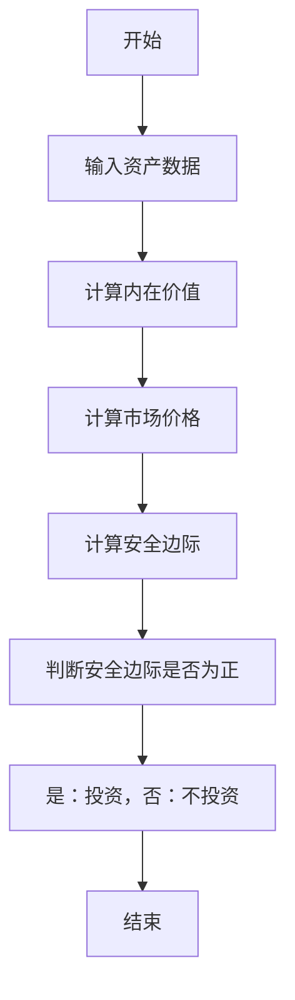
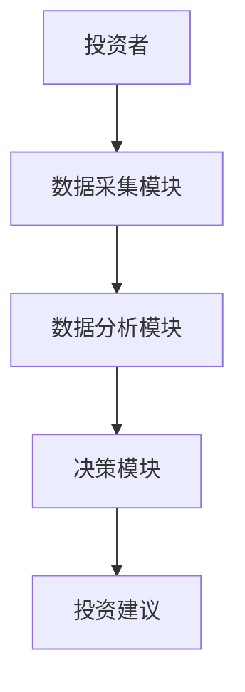

                 


# 格雷厄姆的防御型投资策略

## 关键词：
- 防御型投资
- 格雷厄姆
- 安全边际
- 内在价值
- 投资策略

## 摘要：
《格雷厄姆的防御型投资策略》系统介绍了 Benjamin Graham 的防御型投资理念，强调通过安全边际和内在价值评估来构建稳健的投资组合。文章从背景、核心概念、算法原理、系统架构到项目实战，全面解析了防御型投资的策略，适合风险厌恶型投资者和希望稳健投资的读者。

---

## 第一部分：防御型投资策略的背景与基础

### 第1章：防御型投资的基本概念

#### 1.1 防御型投资的定义与特点

- **1.1.1 防御型投资的定义**  
  防御型投资是一种注重安全性和稳健性的投资策略，旨在通过精选低风险、高价值的资产，避免重大损失，实现长期稳定的收益。

- **1.1.2 防御型投资的核心特点**  
  - 低风险：优先选择具有稳定收益和良好财务状况的资产。  
  - 高安全边际：购买价格低于内在价值的资产，以降低风险。  
  - 长期导向：注重长期价值积累，而非短期波动。

- **1.1.3 防御型投资与进攻型投资的区别**  
  | 方面   | 防御型投资                  | 进攻型投资                  |  
  |--------|-----------------------------|-----------------------------|  
  | 目标   | 稳定收益，避免重大损失      | 追求高收益                  |  
  | 风险   | 低风险                     | 高风险                     |  
  | 时间   | 长期导向                   | 短期或中期导向              |  

#### 1.2 防御型投资的历史与发展

- **1.2.1 防御型投资的起源**  
  防御型投资的理念可以追溯到18世纪，但在20世纪初由 Benjamin Graham 和 David Dodd 系统化，成为价值投资的基础。

- **1.2.2 格雷厄姆的贡献**  
  Benjamin Graham 发明了“安全边际”概念，并将防御型投资系统化，奠定了现代价值投资的理论基础。

- **1.2.3 防御型投资在现代的应用**  
  随着市场的变化，防御型投资策略不断演变，但其核心理念——寻找低估资产、注重安全边际——仍然适用。

#### 1.3 防御型投资的适用场景

- **1.3.1 风险厌恶型投资者**  
  适合那些无法承受重大损失，追求稳定收益的投资者。

- **1.3.2 不同市场周期中的应用**  
  在市场下跌时，防御型投资能提供保护；在市场上涨时，也能获得合理收益。

- **1.3.3 防御型投资的局限性**  
  - 可能错失市场上涨带来的超额收益。  
  - 在某些市场环境下，防御型资产可能表现不佳。

---

## 第二部分：防御型投资的核心概念与原理

### 第2章：防御型投资的核心原则

#### 2.1 安全边际

- **2.1.1 安全边际的定义**  
  安全边际是指资产的市场价格低于其内在价值的部分，是防御型投资中控制风险的关键因素。

- **2.1.2 安全边际的计算方法**  
  安全边际 = 内在价值 - 市场价格

- **2.1.3 安全边际在投资决策中的作用**  
  确保以低于内在价值的价格买入资产，降低亏损风险。

#### 2.2 内在价值评估

- **2.2.1 内在价值的定义**  
  内在价值是资产在未来现金流的现值，反映了其真实价值。

- **2.2.2 内在价值的计算方法**  
  内在价值 = ∑(未来现金流 / (1 + r)^t)  
  其中，r 为折现率，t 为时间。

- **2.2.3 内在价值与市场价值的关系**  
  当市场价格低于内在价值时，资产具有安全边际。

#### 2.3 股票选择标准

- **2.3.1 低市盈率与市净率**  
  市盈率 = 股价 / 每股收益  
  市净率 = 股价 / 每股净资产  

- **2.3.2 高股息率**  
  股息率 = 每股股息 / 股价  

- **2.3.3 公司财务状况分析**  
  重点考察资产负债表，确保公司财务健康，避免高负债和低现金流。

---

### 第3章：防御型投资的核心概念与联系

#### 3.1 核心概念的原理

- 防御型投资通过安全边际和内在价值评估，确保以合理价格买入优质资产，控制风险。

#### 3.2 核心概念的属性特征对比

| 概念       | 安全边际                | 内在价值                |
|------------|------------------------|-------------------------|
| 定义       | 内在价值 - 市场价格      | 未来现金流的现值        |
| 作用       | 控制风险                | 指导投资决策            |
| 计算公式   | $$安全边际 = 内在价值 - 市场价格$$ | $$内在价值 = \sum_{t=1}^{n} \frac{\text{现金流}}{(1 + r)^t}$$ |

#### 3.3 实体关系图（ER图）

```mermaid
erDiagram
    投资者 o-(:拥有) 资产
    资产 o-(:具备) 内在价值
    资产 o-(:具备) 安全边际
    内在价值 --|> 现金流
    安全边际 --|> 市场价格
```

---

## 第三部分：防御型投资的数学模型与算法原理

### 第4章：防御型投资的数学模型

#### 4.1 内在价值计算模型

- **公式**  
  $$内在价值 = \sum_{t=1}^{n} \frac{\text{现金流}}{(1 + r)^t}$$  
  其中，r 是折现率，n 是预测的年数。

- **步骤**  
  1. 估计未来现金流。  
  2. 选择合理的折现率。  
  3. 计算未来现金流的现值。  
  4. 求和得到内在价值。

- **示例**  
  假设一家公司未来5年的现金流分别为100、120、150、180、200万元，折现率为10%。  
  内在价值 = 100/(1.1) + 120/(1.1)^2 + 150/(1.1)^3 + 180/(1.1)^4 + 200/(1.1)^5 ≈ 402.14万元。

#### 4.2 安全边际计算模型

- **公式**  
  $$安全边际 = 内在价值 - 市场价格$$

- **步骤**  
  1. 计算资产的内在价值。  
  2. 确定资产的市场价格。  
  3. 计算安全边际。  
  4. 如果安全边际为正，资产具有投资价值。

- **示例**  
  某股票的内在价值为50元，市场价格为40元。  
  安全边际 = 50 - 40 = 10元。  
  该股票具有10元的安全边际，值得投资。

#### 4.3 风险评估模型

- **公式**  
  风险 = $$\frac{市场价格}{内在价值}$$  
  - 风险 < 1：市场价格低于内在价值，风险低。  
  - 风险 ≥ 1：市场价格高于内在价值，风险高。

- **步骤**  
  1. 计算资产的内在价值。  
  2. 确定资产的市场价格。  
  3. 计算风险 = 市场价格 / 内在价值。  
  4. 根据风险值判断资产的风险等级。

---

### 第5章：防御型投资算法的实现

#### 5.1 算法原理

- 防御型投资算法通过计算内在价值和安全边际，筛选出具有投资价值的资产。

#### 5.2 算法流程图



---

## 第四部分：防御型投资的系统分析与架构设计

### 第6章：防御型投资决策系统的架构设计

#### 6.1 系统概述

- 系统目标：通过数据分析，筛选出具有防御型投资价值的资产。
- 系统功能模块：
  - 数据采集模块：收集资产的财务数据和市场数据。
  - 数据分析模块：计算内在价值、安全边际，评估风险。
  - 决策模块：根据分析结果，生成投资建议。

#### 6.2 系统架构设计



---

## 第五部分：防御型投资的项目实战

### 第7章：防御型投资策略的实现

#### 7.1 环境配置

- 安装 Python 和相关库（Pandas、NumPy、Matplotlib）。

#### 7.2 数据收集

- 收集目标公司的财务数据和市场数据。

#### 7.3 数据分析代码

```python
import pandas as pd
import numpy as np

# 示例数据：某公司的财务数据和市场数据
data = {
    '年份': [2018, 2019, 2020, 2021, 2022],
    '现金流': [100, 120, 150, 180, 200],
    '市场价格': [40, 45, 50, 55, 60]
}

df = pd.DataFrame(data)

# 计算内在价值
discount_rate = 0.1
intrinsic_value = df['现金流'].sum() / (1 + discount_rate) ** df['年份']

# 计算安全边际
market_price = df['市场价格'].mean()
safety_margin = intrinsic_value.mean() - market_price

print(f"内在价值：{intrinsic_value}")
print(f"市场价格：{market_price}")
print(f"安全边际：{safety_margin}")
```

#### 7.4 案例分析

- 通过代码计算某公司的内在价值和安全边际，判断其是否具有投资价值。

---

## 第六部分：总结与展望

### 第8章：最佳实践

- **小结**  
  防御型投资通过安全边际和内在价值评估，帮助投资者在市场波动中保持稳健。

### 第9章：注意事项

- 避免过度依赖单一指标。
- 定期重新评估资产的内在价值和安全边际。

### 第10章：拓展阅读

- 推荐书籍：《The Intelligent Investor》（本杰明·格雷厄姆）。

---

## 作者

作者：AI天才研究院/AI Genius Institute & 禅与计算机程序设计艺术/Zen And The Art of Computer Programming

---

通过以上详细的内容，您将全面理解格雷厄姆的防御型投资策略，并能够实际应用这些策略进行稳健投资。

