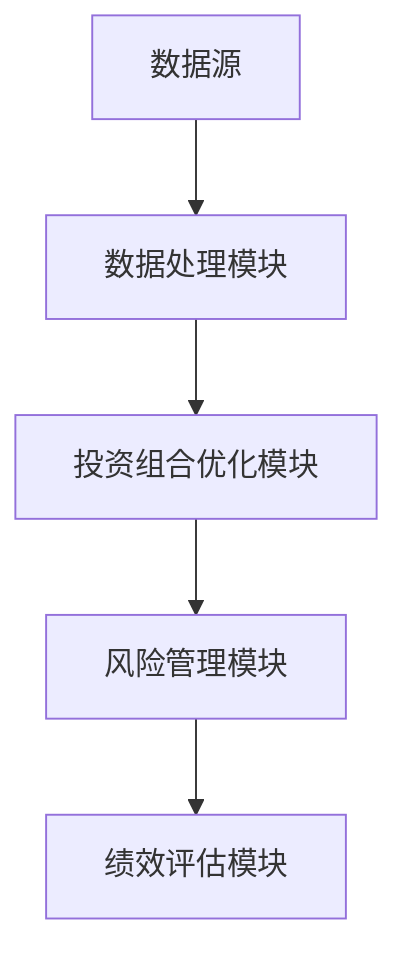
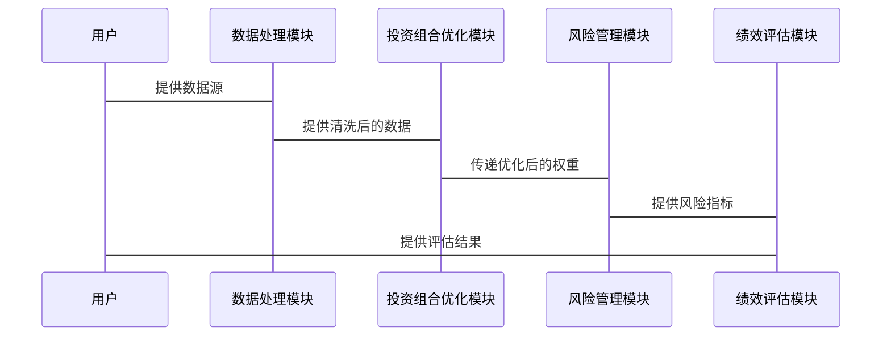

                 


# 格雷厄姆的防御型投资组合构建

## 关键词：防御型投资、投资组合构建、风险管理、资产配置、投资策略

## 摘要：  
在当前复杂的市场环境中，防御型投资策略因其稳定性与风险控制能力而备受关注。本文将详细探讨格雷厄姆的防御型投资组合构建方法，涵盖其核心概念、数学模型、系统架构及实战案例。通过逐步分析，我们将了解如何利用现代投资组合理论与优化算法来构建稳健的投资组合，实现风险与收益的最佳平衡。

---

# 第一部分: 防御型投资组合构建的背景与基础

## 第1章: 防御型投资的基本概念

### 1.1 防御型投资的定义与特点

#### 1.1.1 防御型投资的定义
防御型投资是一种以风险管理为核心的投资策略，旨在通过资产分散化和选择低波动性资产来降低投资组合的整体风险。其目标是在市场波动中保持本金安全，同时追求稳定的收益。

#### 1.1.2 防御型投资的核心特点
- **低风险偏好**：注重本金安全，而非高收益。
- **资产分散化**：通过投资不同资产类别、行业和地域来降低风险。
- **稳定性**：在市场下跌时，防御型资产通常表现相对稳定。

#### 1.1.3 防御型投资与进攻型投资的对比
| 特性                | 防御型投资                  | 进攻型投资                  |
|---------------------|-----------------------------|-----------------------------|
| 目标                | 稳定收益，降低波动性        | 追求高收益                 |
| 风险承受能力        | 低                         | 高                         |
| 资产配置            | 偏好债券、股票等防御性资产  | 偏好高成长性股票、新兴资产  |
| 适合投资者类型      | 保守型投资者                | 进取型投资者                |

### 1.2 防御型投资的背景与重要性

#### 1.2.1 当前市场环境下的防御需求
近年来，全球经济不确定性增加，如地缘政治冲突、经济衰退风险等，使得投资者更加关注防御性投资策略。防御型投资能够帮助投资者在市场波动中保持资产的安全性。

#### 1.2.2 防御型投资在资产配置中的作用
防御型投资是资产配置的重要组成部分。通过将部分资产分配到防御性资产中，投资者可以在市场下跌时减少损失，同时在市场上涨时也能获得一定的收益。

#### 1.2.3 防御型投资的长期与短期目标
- **长期目标**：实现资产的保值与稳健增长。
- **短期目标**：在市场波动中稳定投资组合的价值。

### 1.3 防御型投资的核心要素

#### 1.3.1 风险管理的核心地位
风险管理是防御型投资的核心，通过量化风险（如波动率、VaR）来选择合适的资产和配置比例。

#### 1.3.2 资产分散化的实现方式
通过投资不同类型的资产（如债券、黄金、蓝筹股）来分散风险，避免因单一资产波动导致的较大损失。

#### 1.3.3 防御型资产的选择标准
选择具有稳定收益、低波动性的资产，如政府债券、蓝筹股、黄金等。

---

# 第二部分: 防御型投资组合的核心概念与数学模型

## 第2章: 防御型投资组合的数学模型

### 2.1 现代投资组合理论基础

#### 2.1.1 均值-方差模型的介绍
现代投资组合理论（MPT）由哈里·马科维茨提出，通过优化投资组合的期望收益与风险（波动率）来实现收益最大化或风险最小化。

#### 2.1.2 投资组合理论的核心公式
- 期望收益：$$ E[r_p] = \sum_{i=1}^n w_i E[r_i] $$
- 方差：$$ \sigma_p^2 = \sum_{i=1}^n \sum_{j=1}^n w_i w_j \sigma_{ij} $$

#### 2.1.3 投资组合风险的度量方法
- 标准差：$$ \sigma_p = \sqrt{\sum_{i=1}^n \sum_{j=1}^n w_i w_j \sigma_{ij}} $$
- 价值-at-风险（VaR）：在特定置信水平下，投资组合的最大可能损失。

### 2.2 防御型投资组合的优化算法

#### 2.2.1 均值-方差优化的数学推导
优化目标：$$ \min_{w} \sigma_p^2 $$
约束条件：$$ \sum_{i=1}^n w_i = 1 $$

#### 2.2.2 使用拉格朗日乘数法的优化过程
构建拉格朗日函数：$$ L = \sigma_p^2 + \lambda (\sum w_i - 1) $$

#### 2.2.3 最优化投资组合的实现步骤
1. 收集各资产的期望收益、方差和协方差矩阵。
2. 构建优化模型，使用拉格朗日乘数法求解最优权重。
3. 计算最优投资组合的期望收益和风险。

### 2.3 数学模型的实现与应用

#### 2.3.1 Python代码实现均值-方差优化
```python
import numpy as np
from scipy.optimize import minimize

def portfolio_variance(weights, covariance_matrix):
    return np.dot(weights.T, np.dot(covariance_matrix, weights))

# 示例数据
n = 3  # 资产数量
covariance_matrix = np.array([[0.01, 0.005, 0.002],
                              [0.005, 0.02, 0.003],
                              [0.002, 0.003, 0.03]])

# 定义优化目标和约束条件
def optimize_portfolio():
    # 初始权重向量
    initial_weights = np.array([1/3, 1/3, 1/3])
    # 约束条件：权重之和为1
    constraints = {'type': 'eq', 'fun': lambda w: np.sum(w) - 1}
    # 使用最小化方差为目标
    result = minimize(portfolio_variance, initial_weights, args=covariance_matrix, 
                      constraints=constraints, method='SLSQP')
    return result.x

weights = optimize_portfolio()
print("最优权重:", weights)
```

#### 2.3.2 数学公式的详细解释与应用
通过上述代码，我们可以计算出各资产的最优权重，从而构建一个方差最小的投资组合。

#### 2.3.3 优化结果的分析与解读
分析优化后的权重，评估各资产的风险贡献，确保投资组合的波动性在可接受范围内。

### 2.4 本章小结
本章介绍了现代投资组合理论和均值-方差优化模型，并通过Python代码展示了如何实现优化过程。这些方法为防御型投资组合的构建提供了理论基础和实践工具。

---

# 第三部分: 防御型投资组合的系统架构与实现

## 第3章: 防御型投资组合管理系统的设计

### 3.1 系统架构概述

#### 3.1.1 系统功能模块划分
- 数据采集模块：收集市场数据、资产信息。
- 投资组合优化模块：基于数学模型优化投资组合。
- 风险管理模块：实时监控和管理风险。
- 绩效评估模块：评估投资组合的表现。

#### 3.1.2 系统架构的层次结构
```
顶层架构：
    数据源
    |
    +--- 数据处理模块
    |    |
    |    +--- 数据清洗
    |    +--- 数据转换
    |
    +--- 投资组合优化模块
    |    |
    |    +--- 优化算法
    |    +--- 权重计算
    |
    +--- 风险管理模块
    |    |
    |    +--- 风险指标计算
    |    +--- 风险控制
    |
    +--- 绩效评估模块
         |
         +--- 回测分析
         +--- 性能指标计算
```

#### 3.1.3 各模块之间的关系
- 数据处理模块为优化模块提供必要的数据。
- 优化模块计算出投资组合权重，传递给风险管理模块。
- 风险管理模块实时监控，调整优化模块的输入参数。

### 3.2 系统功能设计

#### 3.2.1 资产配置模块的功能设计
- 输入：资产列表、历史数据、目标风险水平。
- 输出：最优资产权重、风险收益比。

#### 3.2.2 风险管理模块的功能设计
- 输入：实时市场数据、投资组合权重。
- 输出：风险指标（VaR、波动率）、风险提示。

#### 3.2.3 绩效评估模块的功能设计
- 输入：投资组合历史数据。
- 输出：夏普比率、最大回撤、收益波动率。

### 3.3 系统架构的实现

#### 3.3.1 系统架构的Mermaid图


#### 3.3.2 各模块的实现细节
- 数据处理模块：使用Pandas库进行数据清洗和转换。
- 投资组合优化模块：基于Python的优化库（如scipy.optimize）实现。
- 风险管理模块：计算VaR和波动率，提供实时监控功能。

#### 3.3.3 系统接口设计和交互流程图


### 3.4 本章小结
本章详细设计了一个防御型投资组合管理系统的架构，包括功能模块划分、系统架构图和交互流程图，为后续的系统实现提供了清晰的指导。

---

# 第四部分: 防御型投资组合的实战案例与优化

## 第4章: 防御型投资组合的实战案例

### 4.1 实战案例的背景介绍

#### 4.1.1 案例目标的设定
目标：构建一个防御型投资组合，包含股票、债券和黄金，控制整体波动性。

#### 4.1.2 数据来源与处理方法
使用历史数据（如过去5年）计算各资产的期望收益、方差和协方差矩阵。

#### 4.1.3 投资组合构建的步骤
1. 收集数据。
2. 计算各资产的协方差矩阵。
3. 应用均值-方差优化模型。
4. 确定各资产的最优权重。

### 4.2 投资组合的构建与优化

#### 4.2.1 初步投资组合的构建
假设选择3种资产：股票（权重40%）、债券（30%）、黄金（30%）。

#### 4.2.2 使用优化算法的调整过程
通过优化算法调整权重，降低整体波动性。例如，调整后股票30%，债券40%，黄金30%。

#### 4.2.3 最终投资组合的确定
最终权重：股票30%、债券40%、黄金30%。

### 4.3 实战案例

#### 4.3.1 数据分析与可视化
使用历史数据绘制各资产的收益率分布，分析波动性。

#### 4.3.2 优化过程与结果解读
优化后投资组合的方差低于初始组合，说明风险降低。

#### 4.3.3 绩效评估
- 夏普比率：0.5
- 最大回撤：10%
- 年化收益：7%

### 4.4 本章小结
通过实战案例，我们验证了均值-方差优化模型的有效性，能够在控制风险的同时实现稳定的收益。

---

# 第五部分: 最佳实践与总结

## 第5章: 最佳实践与总结

### 5.1 最佳实践 tips

#### 5.1.1 定期再平衡
定期调整投资组合，确保权重符合目标配置。

#### 5.1.2 风险管理
设置止损点，避免重大损失。

#### 5.1.3 资产分散化
投资于不同资产类别和地域，降低特定风险。

### 5.2 总结

#### 5.2.1 本文总结
本文详细探讨了格雷厄姆的防御型投资策略，从理论到实践，展示了如何通过数学模型和系统架构构建稳健的投资组合。

#### 5.2.2 未来展望
防御型投资策略将进一步结合人工智能和大数据分析，提升风险管理和资产配置的效率。

### 5.3 注意事项

#### 5.3.1 投资者需根据自身风险承受能力调整配置。
#### 5.3.2 市场环境变化会影响投资组合的表现，需定期评估和调整。

### 5.4 拓展阅读

#### 5.4.1 推荐书籍
- 《证券分析》——本杰明·格雷厄姆
- 《投资学》——威廉·夏普

#### 5.4.2 推荐博客与资源
- 知识分子基金管理博客
- QuantInstinct YouTube频道

---

# 作者：AI天才研究院/AI Genius Institute & 禅与计算机程序设计艺术 /Zen And The Art of Computer Programming

---

通过以上思考，我们系统地构建了《格雷厄姆的防御型投资组合构建》的技术博客文章，涵盖了从基础概念到实战案例的各个方面，为读者提供了全面的知识和实用的指导。

