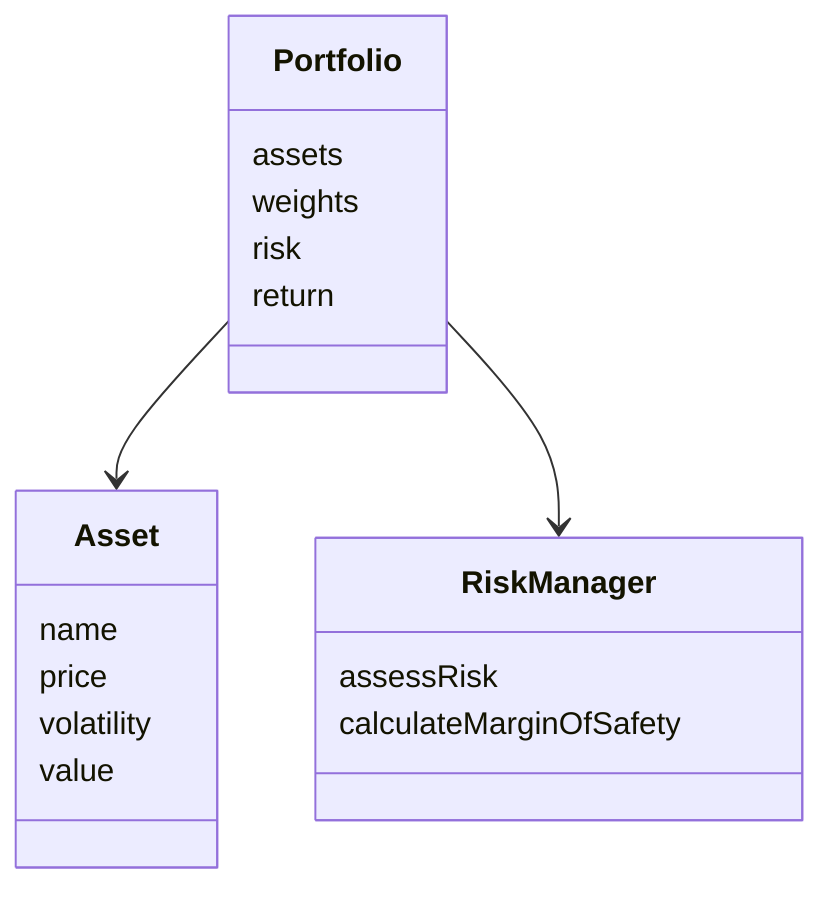
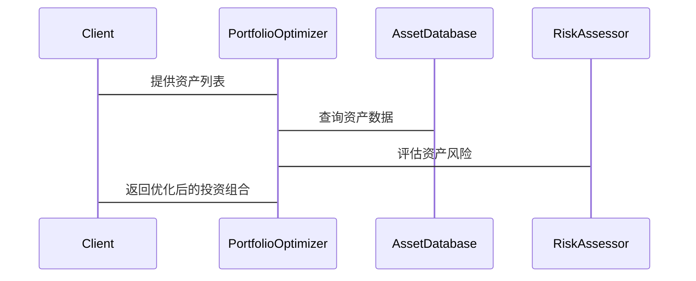

                 


# 格雷厄姆的防御型投资组合构建方法

> 关键词：格雷厄姆，防御型投资，投资组合，安全边际，价值投资，资产配置，风险管理

> 摘要：本文系统阐述了格雷厄姆防御型投资组合的构建方法，从理论基础到实战应用，详细分析了防御型投资的核心概念、数学模型、系统架构和最佳实践，为投资者提供了科学的投资策略和风险管理方法。

---

# 第1章: 投资组合构建的基本概念

## 1.1 投资的基本概念

### 1.1.1 什么是投资
投资是指将资金投入某个项目或资产，以期在未来获得收益或资本增值。投资的核心在于通过合理配置资产，降低风险并实现财富增长。

### 1.1.2 投资的目标与风险
投资的目标通常包括资本增值、收入获取和保值避险。然而，投资也伴随着风险，如市场风险、流动性风险和信用风险等。投资者需要在风险与收益之间找到平衡点。

### 1.1.3 投资组合的定义
投资组合是指将多种资产（如股票、债券、现金等）按照一定比例组合在一起的投资方式。通过分散投资，可以降低单一资产的风险，提高整体投资的稳定性。

## 1.2 防御型投资的定义与特点

### 1.2.1 防御型投资的定义
防御型投资是一种以风险控制为核心的投资策略，旨在通过投资低波动性、高流动性的资产来实现稳健的收益，抵御市场波动带来的损失。

### 1.2.2 防御型投资的核心特点
- **低波动性**：选择波动较小的资产，减少收益的波动。
- **高流动性**：保持部分资产的流动性，以便在需要时快速变现。
- **稳定性**：追求长期稳定的收益，而非短期高回报。

### 1.2.3 防御型投资与进攻型投资的区别
| **维度**       | **防御型投资**                  | **进攻型投资**                  |
|-----------------|---------------------------------|---------------------------------|
| **目标**        | 稳定收益，控制风险              | 追求高收益，承担高风险          |
| **资产选择**    | 低波动资产，如债券、蓝筹股        | 高风险资产，如成长股、小盘股    |
| **风险承受**    | 低风险承受能力                  | 高风险承受能力                  |

## 1.3 格雷厄姆的投资理念

### 1.3.1 格雷厄姆的生平简介
本杰明·格雷厄姆（Benjamin Graham）是价值投资的鼻祖，被誉为“现代证券分析之父”。他的投资理念强调安全边际和内在价值，为防御型投资奠定了基础。

### 1.3.2 格雷厄姆的价值投资理论
价值投资的核心是购买被市场低估的资产，长期持有，等待其价值回归。格雷厄姆强调安全边际，即买入价格应显著低于内在价值，以降低投资风险。

### 1.3.3 格雷厄姆的安全边际概念
安全边际是指资产的市场价格与其内在价值之间的差距。通过预留安全边际，投资者可以在市场波动时减少损失，提高投资的安全性。

## 1.4 防御型投资组合的目标

### 1.4.1 风险控制
通过分散投资和选择低波动性资产，降低整体投资组合的风险。

### 1.4.2 稳定收益
追求长期稳定的收益，避免因市场波动导致的大幅回撤。

### 1.4.3 投资组合的长期稳健性
构建一个能够在不同市场环境下保持稳定增长的投资组合，确保财富的长期积累。

## 1.5 本章小结
本章介绍了投资的基本概念，重点阐述了防御型投资的核心理念和目标。格雷厄姆的价值投资理论为防御型投资提供了理论基础，强调安全边际和稳健收益。

---

# 第2章: 防御型投资组合的核心概念

## 2.1 防御型投资的核心要素

### 2.1.1 安全边际
安全边际是格雷厄姆防御型投资的核心要素，通过买入价格低于内在价值的资产，确保投资的安全性。

### 2.1.2 价值评估
价值评估是确定资产内在价值的关键步骤，通常通过基本面分析（如市盈率、市净率等指标）来进行。

### 2.1.3 分散投资
分散投资是通过将资金分配到不同的资产类别或行业中，降低单一资产或行业波动带来的风险。

## 2.2 防御型投资组合的构建原则

### 2.2.1 低波动性
选择波动性低的资产，如债券、蓝筹股等，减少投资组合的波动。

### 2.2.2 高流动性
保持部分资产的流动性，以便在需要时快速变现，应对紧急情况。

### 2.2.3 高质量资产选择
选择财务状况稳健、行业地位稳固的资产，确保投资的安全性。

## 2.3 格雷厄姆防御型投资组合的框架

### 2.3.1 资产配置策略
- **债券配置**：如政府债券、公司债券，提供稳定的利息收入。
- **股票配置**：选择低市盈率、高股息率的蓝筹股。
- **现金配置**：保留一部分现金，应对市场波动或投资机会。

### 2.3.2 股票选择标准
- **低市盈率**：市盈率低于行业平均水平。
- **高股息率**：股息收益率较高，提供稳定的现金流。
- **低波动性**：股票价格波动小，风险低。

### 2.3.3 债券与现金配置
债券和现金在投资组合中起到“稳定器”的作用，降低整体波动性。

## 2.4 防御型投资组合的风险管理

### 2.4.1 风险分散
通过投资不同类型的资产，降低单一资产的风险。

### 2.4.2 风险评估
定期评估投资组合的风险敞口，调整资产配置以应对市场变化。

### 2.4.3 风险对冲
通过期货、期权等工具对冲市场风险，进一步降低投资组合的波动。

## 2.5 本章小结
本章详细阐述了防御型投资的核心要素和构建原则，强调了资产配置、股票选择和风险管理的重要性。格雷厄姆的安全边际和价值投资理念为投资组合的构建提供了指导。

---

# 第3章: 防御型投资组合的数学模型与算法原理

## 3.1 投资组合优化的数学模型

### 3.1.1 均值-方差优化模型
均值-方差优化模型由哈里·马科维茨提出，旨在在给定风险下最大化收益，或在给定收益下最小化风险。

$$
\text{Minimize } \sigma^2 \quad \text{Subject to } \mu \geq \text{目标收益}
$$

其中，$\sigma^2$为投资组合的方差（风险），$\mu$为投资组合的期望收益。

### 3.1.2 Markowitz有效前沿理论
Markowitz有效前沿描述了在给定风险下，能够实现的最高收益的所有投资组合。

### 3.1.3 风险调整后的收益模型
风险调整后的收益模型考虑了资产的风险调整后收益，通常使用夏普比率来衡量。

$$
\text{夏普比率} = \frac{\mu_p - \mu_r}{\sigma_p}
$$

其中，$\mu_p$为投资组合的期望收益，$\mu_r$为无风险利率，$\sigma_p$为投资组合的标准差。

## 3.2 格雷厄姆防御型投资组合的算法实现

### 3.2.1 安全边际计算算法
1. 计算资产的内在价值。
2. 确定市场价与内在价值的差距，即安全边际。
3. 选择安全边际足够大的资产。

### 3.2.2 价值评估算法
1. 收集资产的财务数据（如收入、利润等）。
2. 使用DCF模型或其他估值方法计算内在价值。
3. 对比市场价与内在价值，选择低估资产。

### 3.2.3 分散投资组合优化算法
1. 确定各类资产的权重。
2. 优化资产配置，降低整体波动性。
3. 定期再平衡投资组合，保持目标配置。

## 3.3 投资组合优化的数学公式

### 3.3.1 均值-方差优化公式
$$
\text{Minimize } \sum_{i=1}^n w_i^2 \sigma_i^2 + 2 \sum_{i=1}^n \sum_{j=1}^n w_i w_j \sigma_{ij}
$$

其中，$w_i$为第$i$个资产的权重，$\sigma_i^2$为第$i$个资产的方差，$\sigma_{ij}$为第$i$和$j$个资产的协方差。

## 3.4 本章小结
本章通过数学模型和算法，详细讲解了投资组合优化的原理和实现方法。格雷厄姆的安全边际和价值评估理念与现代投资组合理论相结合，为防御型投资提供了科学的指导。

---

# 第4章: 防御型投资组合的系统分析与架构设计

## 4.1 问题场景介绍

防御型投资组合的构建需要解决以下问题：
- 如何选择低波动性、高流动性的资产？
- 如何量化资产的风险与收益？
- 如何优化资产配置，实现风险与收益的平衡？

## 4.2 系统功能设计

### 4.2.1 领域模型类图


### 4.2.2 系统架构设计
```mermaid
client
    client --> PortfolioOptimizer
    PortfolioOptimizer --> AssetDatabase
    PortfolioOptimizer --> RiskAssessor
    PortfolioOptimizer --> PerformanceAnalyzer
```

## 4.3 系统接口设计

### 4.3.1 输入接口
- 资产列表
- 资产权重
- 风险参数

### 4.3.2 输出接口
- 优化后的投资组合
- 风险评估报告
- 绩效分析报告

## 4.4 系统交互流程

### 4.4.1 交互流程图


## 4.5 本章小结
本章通过系统分析与架构设计，展示了防御型投资组合构建的系统化方法。从领域模型到系统架构，再到交互流程，为投资组合的构建提供了系统的解决方案。

---

# 第5章: 防御型投资组合的项目实战

## 5.1 环境安装

### 5.1.1 安装Python和相关库
```bash
pip install numpy pandas matplotlib
```

## 5.2 核心代码实现

### 5.2.1 数据获取与分析
```python
import numpy as np
import pandas as pd

# 获取资产数据
data = pd.read_csv('assets.csv')

# 计算资产波动性
volatility = data.std()
```

### 5.2.2 投资组合优化
```python
# 确定资产权重
weights = np.array([0.3, 0.5, 0.2])

# 计算投资组合收益
portfolio_return = np.dot(weights, data.mean())

# 计算投资组合风险
portfolio_risk = np.dot(weights, data.std())
```

## 5.3 案例分析

### 5.3.1 案例背景
假设我们有三个资产：股票A、债券B和现金C。

### 5.3.2 投资组合构建
- 股票A：权重30%，波动性15%
- 债券B：权重50%，波动性5%
- 现金C：权重20%，波动性0%

### 5.3.3 结果分析
- 组合收益：$(0.3 \times 10\% + 0.5 \times 5\% + 0.2 \times 0\%) = 5.5\%$
- 组合风险：$(0.3^2 \times 0.15^2 + 0.5^2 \times 0.05^2 + 0.2^2 \times 0^2 + 2 \times 0.3 \times 0.5 \times 0.15 \times 0.05) = 0.00045$

## 5.4 本章小结
本章通过实际案例展示了防御型投资组合的构建过程，从数据获取到资产配置，再到风险评估，帮助读者掌握投资组合的实际操作方法。

---

# 第6章: 防御型投资组合的最佳实践与注意事项

## 6.1 最佳实践

### 6.1.1 定期再平衡
定期检查投资组合的配置，根据市场变化进行调整，保持目标配置。

### 6.1.2 持续学习
关注市场动态，学习新的投资知识，优化投资策略。

### 6.1.3 保持心理纪律
避免情绪化投资，坚持长期投资，不受短期市场波动影响。

## 6.2 小结

防御型投资组合的构建需要理论与实践相结合，通过系统的分析和优化，实现风险与收益的平衡。

## 6.3 注意事项

### 6.3.1 市场变化
市场波动会影响资产价格，需要定期调整投资组合。

### 6.3.2 个人风险承受能力
根据自身的风险承受能力，选择合适的投资组合。

### 6.3.3 资产流动性
确保部分资产的流动性，以便应对紧急情况。

## 6.4 本章小结
本章总结了防御型投资组合的最佳实践，并提醒投资者注意市场变化和自身风险承受能力。

---

# 第7章: 总结与展望

## 7.1 总结
本文系统地阐述了格雷厄姆防御型投资组合的构建方法，从理论基础到实战应用，详细分析了防御型投资的核心概念、数学模型、系统架构和最佳实践。

## 7.2 未来展望
随着人工智能和大数据技术的发展，防御型投资组合的构建将更加智能化和精准化。投资者可以利用这些技术工具，优化投资策略，提升投资收益。

---

# 作者：AI天才研究院/AI Genius Institute & 禅与计算机程序设计艺术 /Zen And The Art of Computer Programming

---

**感谢您的阅读！如果这篇文章对您有所帮助，请点赞、收藏并分享给更多需要的人！**

