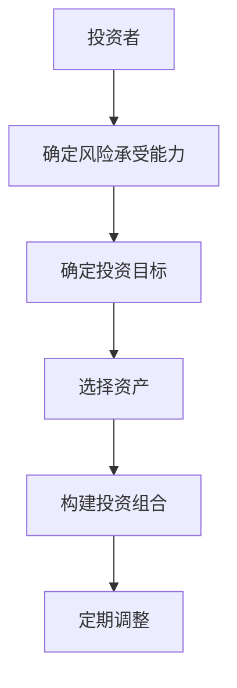
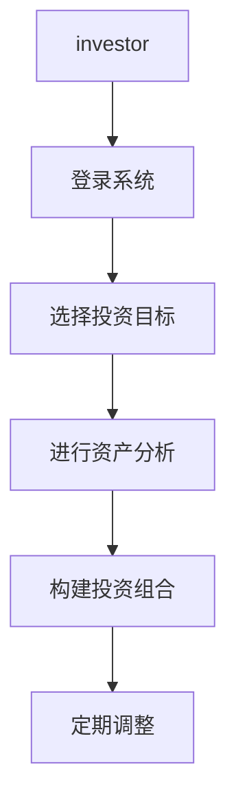

                 


# 格雷厄姆的防御型投资者策略

> 关键词：防御型投资，格雷厄姆，价值投资，安全边际，风险管理，投资策略

> 摘要：本文详细探讨了格雷厄姆的防御型投资者策略，从其核心思想到数学模型，从系统架构到项目实战，全面分析了防御型投资的理论与实践。文章通过详细讲解格雷厄姆的投资哲学、防御型投资的核心策略、数学模型与风险评估、系统架构与实现、项目实战与案例分析，以及最佳实践与注意事项，为读者提供了全面的视角来理解和应用防御型投资策略。

---

## 第1章: 防御型投资者策略概述

### 1.1 投资的背景与防御型投资的概念

#### 1.1.1 投资的定义与分类
投资是指将资金投入到某种资产或项目中，以期获得未来的收益或价值增长。投资可以分为多种类型，包括股票、债券、房地产、黄金等。每种投资类型都有其独特的风险和收益特征。

#### 1.1.2 股票市场的基本运作机制
股票市场是投资者进行股票交易的场所，其基本运作机制包括买方、卖方、交易所、经纪人等角色。股票价格受市场供需、公司业绩、宏观经济等多种因素影响。

#### 1.1.3 投资者的基本类型
投资者可以分为保守型、稳健型和激进型。保守型投资者注重本金的安全，稳健型投资者追求稳定的收益，而激进型投资者则愿意承担更高的风险以追求更高的回报。

#### 1.1.4 防御型投资的定义与特点
防御型投资是一种注重风险控制、追求稳定收益的投资策略。其核心特点是注重安全边际、分散投资、长期持有优质资产。

---

### 1.2 格雷厄姆的防御型投资策略的核心思想

#### 1.2.1 安全边际的概念
安全边际是指资产的市场价格低于其内在价值的部分。格雷厄姆认为，通过购买市场价格低于内在价值的资产，可以降低投资风险。

#### 1.2.2 内在价值的计算方法
内在价值是指资产在正常市场条件下所能产生的未来现金流的现值。格雷厄姆强调，投资者应基于基本面分析计算内在价值。

#### 1.2.3 风险控制的重要性
格雷厄姆认为，防御型投资者应注重分散投资、避免过度集中风险，并在市场波动中保持冷静。

---

## 第2章: 格雷厄姆的投资哲学

### 2.1 格雷厄姆的生平与贡献

#### 2.1.1 格雷厄姆的生平简介
本杰明·格雷厄姆（Benjamin Graham）是20世纪著名的投资学家，被誉为“价值投资之父”。他出生于1894年，逝世于1976年，其投资理念对全球金融界产生了深远影响。

#### 2.1.2 格雷厄姆对投资理论的贡献
格雷厄姆提出了价值投资的理念，强调以低于内在价值的价格购买优质资产。他的著作《证券分析》和《 Intelligent Investor》奠定了现代价值投资的基础。

#### 2.1.3 格雷厄姆的价值投资理念
格雷厄姆的价值投资理念强调安全边际、内在价值和长期投资。他认为，市场波动是投资者的机会，而不是风险。

---

### 2.2 格雷厄姆防御型投资的核心思想

#### 2.2.1 安全边际的概念
安全边际是格雷厄姆价值投资的核心思想。他建议投资者购买市场价格低于内在价值的资产，以降低投资风险。

#### 2.2.2 内在价值的计算方法
格雷厄姆通过基本面分析计算内在价值，包括分析公司的财务报表、行业地位、盈利能力等。

#### 2.2.3 风险控制的重要性
格雷厄姆强调，防御型投资者应注重分散投资、避免过度集中风险，并在市场波动中保持冷静。

---

## 第3章: 防御型投资的策略与实践

### 3.1 防御型投资的主要策略

#### 3.1.1 价值投资策略
价值投资策略是格雷厄姆提出的，强调以低于内在价值的价格购买优质资产。这种方法注重基本面分析，寻找被市场低估的资产。

#### 3.1.2 股息投资策略
股息投资策略注重选择股息收益率高的股票，适合稳健型投资者。通过长期持有高股息股票，投资者可以获得稳定的现金流。

#### 3.1.3 平衡投资策略
平衡投资策略是在股票和债券之间进行合理配置，以降低整体投资组合的风险。这种方法适合风险偏好较低的投资者。

---

### 3.2 防御型投资的实践步骤

#### 3.2.1 确定投资目标与风险承受能力
投资者需要明确自己的投资目标和风险承受能力，制定合适的投资策略。

#### 3.2.2 选择优质企业进行投资
通过基本面分析，选择具有强大财务状况、良好行业地位和稳定盈利能力的企业进行投资。

#### 3.2.3 构建分散化的投资组合
通过分散投资，降低单一资产的风险，实现投资组合的稳定性。

---

## 第4章: 防御型投资的数学模型与风险评估

### 4.1 投资风险的量化分析

#### 4.1.1 风险的定义与分类
投资风险可以分为系统性风险和非系统性风险。系统性风险是整个市场面临的风险，而非系统性风险是特定资产或企业面临的独特风险。

#### 4.1.2 风险与收益的权衡关系
高风险通常伴随着高收益，但防御型投资者更注重风险控制，追求稳定的收益。

#### 4.1.3 风险调整后的收益指标（夏普比率）
夏普比率是衡量投资组合风险调整后收益的指标。公式为：
$$ \text{夏普比率} = \frac{R_p - R_f}{\sigma_p} $$
其中，\( R_p \) 是投资组合的平均收益，\( R_f \) 是无风险利率，\( \sigma_p \) 是投资组合的收益率标准差。

---

### 4.2 防御型投资的数学模型

#### 4.2.1 投资组合的期望收益计算
投资组合的期望收益可以通过加权平均法计算：
$$ E(R_p) = \sum w_i R_i $$
其中，\( w_i \) 是第i个资产的投资比例，\( R_i \) 是第i个资产的期望收益。

#### 4.2.2 投资组合的风险评估公式
投资组合的风险可以通过方差或标准差衡量：
$$ \text{方差} = \sum w_i^2 \sigma_i^2 + \sum w_i w_j \sigma_{i,j} $$
其中，\( \sigma_i^2 \) 是第i个资产的方差，\( \sigma_{i,j} \) 是第i个和第j个资产之间的协方差。

#### 4.2.3 现代投资组合理论（MPT）的应用
MPT强调通过分散投资降低风险，实现最优风险-收益组合。以下是MPT的简单流程图：



---

## 第5章: 防御型投资的系统架构与实现

### 5.1 投资组合管理系统的设计

#### 5.1.1 系统功能模块划分
投资组合管理系统主要包括数据采集、分析、优化、监控和报告五大模块。

#### 5.1.2 系统架构的实体关系图
以下是系统架构的实体关系图：

```mermaid
erd
    investor(investor_id, name, risk_level, target_return)
    asset(asset_id, name, sector, market_value, intrinsic_value)
    investment(investor_id, asset_id, investment_amount, investment_date)
    portfolio(portfolio_id, investor_id, asset_allocation, total_value)
    risk_assessment(portfolio_id, risk_score, risk_report)
```

---

#### 5.1.3 系统交互流程图
以下是系统交互流程图：



---

### 5.2 投资组合管理系统的实现

#### 5.2.1 系统环境的安装与配置
需要安装Python、Pandas、NumPy等工具，并配置数据源。

#### 5.2.2 投资组合管理系统的核心代码实现
以下是Python代码示例：

```python
import pandas as pd
import numpy as np

# 数据处理
data = pd.read_csv('assets.csv')
data['value_ratio'] = data['market_value'] / data['intrinsic_value']

# 安全边际筛选
defensive_assets = data[data['value_ratio'] < 1]

# 投资组合构建
weights = [0.4, 0.3, 0.2, 0.1]
portfolio = defensive_assets.head(4).apply(lambda x: x * weights, axis=1)
```

#### 5.2.3 系统功能的详细解读与分析
系统功能包括数据采集、分析、优化、监控和报告。通过这些功能，投资者可以实现高效的投资组合管理。

---

## 第6章: 防御型投资的项目实战与案例分析

### 6.1 项目实战环境的搭建

#### 6.1.1 开发环境的安装与配置
需要安装Python、Pandas、NumPy等工具，并配置数据源。

#### 6.1.2 数据源的获取与处理
数据源包括股票价格、财务报表等，需要进行清洗和预处理。

#### 6.1.3 系统功能的实现与测试
通过编写代码实现投资组合管理系统的功能，并进行测试和优化。

---

### 6.2 防御型投资的案例分析

#### 6.2.1 典型防御型投资案例的选取
选取一家具有强大财务状况、良好行业地位和稳定盈利能力的企业进行分析。

#### 6.2.2 案例的详细分析与解读
通过基本面分析和市场数据分析，评估该企业的内在价值和安全边际。

#### 6.2.3 案例的总结与经验分享
总结案例分析的经验和教训，分享防御型投资的实战技巧。

---

## 第7章: 防御型投资的最佳实践与注意事项

### 7.1 防御型投资的最佳实践

#### 7.1.1 长期投资的重要性
长期投资可以降低市场波动的影响，实现资产的稳定增长。

#### 7.1.2 分散投资的风险控制
通过分散投资，降低单一资产的风险，实现投资组合的稳定性。

#### 7.1.3 定期审视与调整投资组合
根据市场变化和个人财务状况，定期审视和调整投资组合。

---

### 7.2 防御型投资的注意事项

#### 7.2.1 避免过度分散投资
过度分散投资可能导致收益下降，降低投资组合的整体回报。

#### 7.2.2 避免盲目跟风投资
投资者应基于基本面分析，避免盲目跟风。

#### 7.2.3 避免过度关注短期波动
防御型投资者应注重长期价值，避免过度关注短期市场波动。

---

## 第8章: 总结与展望

### 8.1 总结

格雷厄姆的防御型投资者策略强调安全边际、分散投资和长期持有优质资产。通过合理配置资产和风险控制，投资者可以在市场波动中实现稳健的收益。

---

### 8.2 展望

随着金融市场的不断发展，防御型投资策略将不断创新和优化。未来，投资者可以通过人工智能、大数据等技术手段，进一步提升投资决策的科学性和准确性。

---

## 作者：AI天才研究院/AI Genius Institute & 禅与计算机程序设计艺术 /Zen And The Art of Computer Programming

