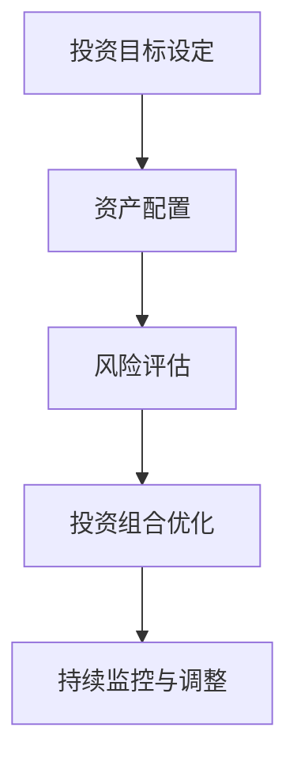
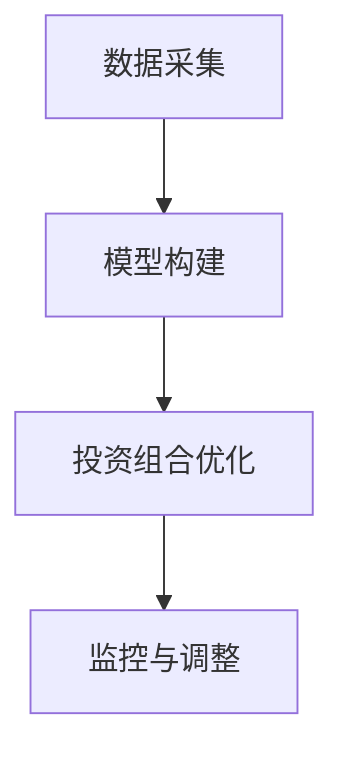
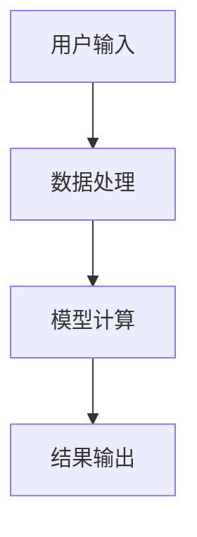

                 


# 格雷厄姆的防御型投资者策略：稳健致胜

**关键词：** 防御型投资，格雷厄姆，投资策略，风险管理，稳健收益

**摘要：**  
本文深入探讨了格雷厄姆的防御型投资者策略，从其核心理念到实际应用，详细分析了稳健投资的方法。通过数学模型、系统架构和实际案例，展示了如何在复杂市场环境中实现长期稳定的收益。本文适合对投资策略感兴趣的专业人士和投资者阅读。

---

## 第一部分: 防御型投资策略的背景与基础

### 第1章: 防御型投资策略概述

#### 1.1 防御型投资的核心概念

##### 1.1.1 防御型投资的定义
防御型投资是一种以稳健和安全为目标的投资策略，注重风险控制和长期收益。它通过分散投资、选择低波动资产等方式，降低市场波动带来的影响。

##### 1.1.2 防御型投资的核心理念
防御型投资强调“安全边际”，即以低于内在价值的价格买入资产，确保在市场下跌时仍有足够的缓冲空间。其核心理念包括：
1. **价值投资**：寻找被市场低估的资产。
2. **分散投资**：避免过度集中在高风险资产。
3. **风险管理**：优先考虑资本的保全。

##### 1.1.3 防御型投资与进攻型投资的区别
| 方面       | 防御型投资              | 进攻型投资              |
|------------|-------------------------|-------------------------|
| 目标       | 稳定收益，避免本金损失    | 高收益，愿意承担高风险  |
| 风险偏好   | 低风险偏好              | 高风险偏好              |
| 资产配置   | 侧重债券、蓝筹股等稳健资产| 侧重成长股、高风险债券等|
| 时机选择   | 偏好市场低点              | 偏好市场高点              |

#### 1.2 防御型投资的背景与现状

##### 1.2.1 当前市场环境分析
当前全球经济不确定性增加，市场波动加剧，投资者更倾向于稳健策略。防御型投资在经济衰退或市场波动时表现尤为突出。

##### 1.2.2 投资者心理与行为分析
投资者在市场波动时容易产生恐慌情绪，防御型策略帮助投资者避免非理性决策，保持纪律性。

##### 1.2.3 防御型投资的适用场景
适用于风险承受能力低、追求长期稳健收益的投资者，尤其在市场低迷时。

---

### 第2章: 防御型投资的理论基础

#### 2.1 马克·格雷厄姆的防御型投资策略

##### 2.1.1 格雷厄姆的投资理念
格雷厄姆是价值投资之父，强调“安全边际”和内在价值。他认为市场先生是疯狂的，投资者应独立于市场波动做出理性决策。

##### 2.1.2 防御型投资的核心原则
1. **寻找低估资产**：买入价格低于内在价值的资产。
2. **分散投资**：避免集中风险。
3. **长期持有**：耐心等待市场回归合理估值。

##### 2.1.3 防御型投资的实践方法
1. **基本面分析**：研究公司财务状况，评估内在价值。
2. **安全边际**：买入价格低于内在价值一定比例的资产。
3. **定期再平衡**：根据市场变化调整投资组合。

#### 2.2 防御型投资的数学模型与公式

##### 2.2.1 防御型投资组合的构建公式
$$ 投资组合收益 = \sum_{i=1}^{n} w_i \times r_i $$
其中，\( w_i \) 是资产 \( i \) 的权重，\( r_i \) 是资产 \( i \) 的预期收益。

##### 2.2.2 风险调整后的收益模型
$$ R_p = \sum_{i=1}^{n} w_i \times r_i $$
$$ \sigma_p = \sqrt{\sum_{i=1}^{n} \sum_{j=1}^{n} w_i w_j \sigma_{ij}} $$
其中，\( R_p \) 是投资组合的预期收益，\( \sigma_p \) 是投资组合的风险（标准差），\( \sigma_{ij} \) 是资产 \( i \) 和 \( j \) 的协方差。

#### 2.3 防御型投资的系统架构设计

##### 2.3.1 系统功能模块


---

## 第二部分: 防御型投资者的核心策略

### 第3章: 防御型投资的核心策略

#### 3.1 资产配置策略

##### 3.1.1 股票配置
选择低波动、高分红的蓝筹股或指数基金，降低市场风险。

##### 3.1.2 债券配置
投资政府债券、企业债等固定收益资产，提供稳定的利息收入。

##### 3.1.3 现金管理
保留部分现金用于应对突发事件，避免在市场低点被迫卖出。

#### 3.2 价值投资策略

##### 3.2.1 寻找低估资产
通过基本面分析，找到市场价格低于内在价值的资产。

##### 3.2.2 安全边际
买入价格低于内在价值一定比例的资产，降低风险。

#### 3.3 风险管理策略

##### 3.3.1 仓位控制
避免过度集中，分散投资以降低风险。

##### 3.3.2 止损机制
设定止损点，避免亏损过大。

##### 3.3.3 持股纪律
坚持长期持有，避免频繁交易。

---

### 第4章: 防御型投资的具体实施方法

#### 4.1 投资组合优化

##### 4.1.1 确定投资目标
明确投资目标和风险承受能力。

##### 4.1.2 选择资产类别
根据目标选择股票、债券、现金等资产。

##### 4.1.3 计算权重
根据风险偏好确定各资产的权重。

#### 4.2 风险控制

##### 4.2.1 定期再平衡
定期调整投资组合，确保与目标一致。

##### 4.2.2 监控市场波动
密切关注市场变化，及时调整策略。

---

## 第三部分: 防御型投资的风险管理与心理因素

### 第5章: 风险管理

#### 5.1 市场风险

##### 5.1.1 市场波动分析
通过历史数据分析市场波动，评估潜在风险。

##### 5.1.2 投资组合风险
计算投资组合的风险，如VaR（在险值）。

#### 5.2 利率风险

##### 5.2.1 利率变化对债券的影响
长期债券受利率影响较大，需谨慎选择。

##### 5.2.2 短期债券的优势
短期债券受利率影响较小，流动性更高。

#### 5.3 操作风险

##### 5.3.1 非系统性风险
公司特有风险，通过分散投资降低。

##### 5.3.2 交易风险
避免频繁交易，减少交易成本和错误决策。

---

### 第6章: 投资者心理因素

#### 6.1 情绪影响

##### 6.1.1 恐慌与贪婪
市场下跌时避免恐慌抛售，上涨时避免贪婪追涨。

##### 6.1.2 羊群效应
避免盲目跟随市场情绪，保持独立判断。

#### 6.2 心理调节

##### 6.2.1 建立长期视角
关注长期目标，忽略短期波动。

##### 6.2.2 保持耐心
市场波动是暂时的，耐心持有优质资产。

---

## 第四部分: 防御型投资的系统分析与架构设计

### 第7章: 系统分析

#### 7.1 系统功能模块

##### 7.1.1 数据采集
收集市场数据，如股价、债券收益率等。

##### 7.1.2 模型构建
使用数学模型优化投资组合。

##### 7.1.3 监控与调整
实时监控市场变化，调整投资组合。

#### 7.2 系统架构设计

##### 7.2.1 模块划分


##### 7.2.2 模块交互


---

## 第五部分: 防御型投资的项目实战

### 第8章: 项目实战

#### 8.1 环境安装

##### 8.1.1 安装Python
```bash
pip install numpy pandas matplotlib
```

#### 8.2 核心算法实现

##### 8.2.1 投资组合优化
```python
import numpy as np

# 示例代码：计算最优投资组合
returns = np.array([0.05, 0.07, 0.06])
weights = np.array([1/3, 1/3, 1/3])
expected_return = np.sum(weights * returns)
```

#### 8.3 实际案例分析

##### 8.3.1 案例选择
假设投资组合包括股票、债券和现金，权重分别为40%、40%、20%。

##### 8.3.2 结果分析
计算投资组合的预期收益和风险，评估是否达到防御型目标。

---

## 第六部分: 最佳实践与小结

### 第9章: 最佳实践

#### 9.1 小结

##### 9.1.1 核心要点总结
防御型投资强调稳健、分散和风险管理，通过安全边际和长期持有实现稳健收益。

#### 9.2 注意事项

##### 9.2.1 避免过度集中
分散投资是关键，避免集中于高风险资产。

##### 9.2.2 定期再平衡
根据市场变化调整投资组合，确保与目标一致。

#### 9.3 未来展望

##### 9.3.1 数字化投资
利用技术手段优化投资组合，提高效率。

##### 9.3.2 智能投顾
人工智能在投资决策中的应用日益广泛，未来防御型投资将更加智能化。

---

**作者：AI天才研究院 & 禅与计算机程序设计艺术**  
**链接：[阅读完整文章](#)**

