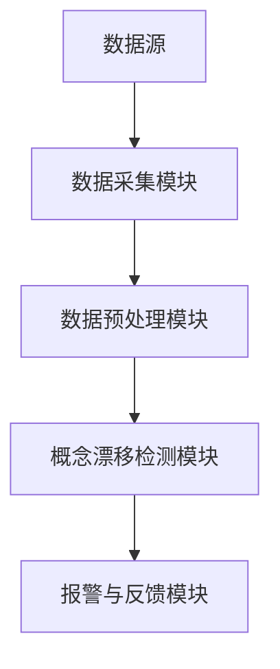
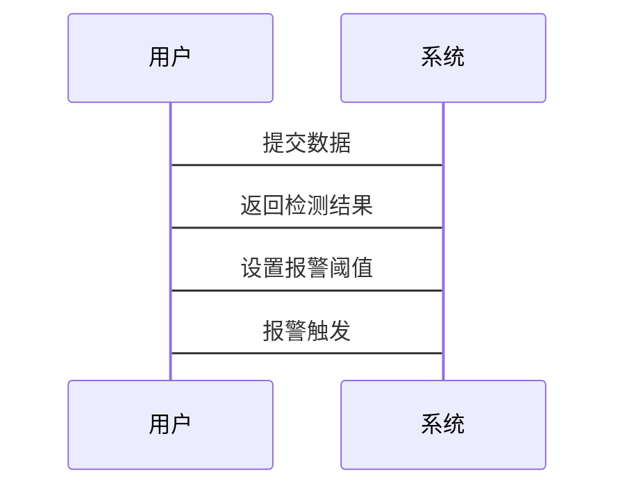
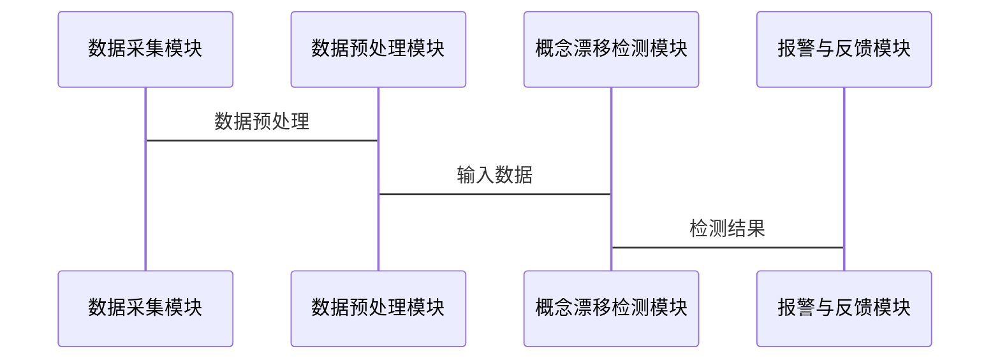

                 


# 概念漂移检测：适应动态变化的环境

## 关键词：概念漂移，机器学习，数据科学，算法，系统设计，动态环境

## 摘要：概念漂移检测是机器学习和数据科学中的一个重要问题，特别是在动态变化的环境中。随着数据分布或模型性能的变化，传统的静态模型可能会失效，因此需要动态检测和适应概念漂移。本文从概念漂移的基本概念出发，深入探讨其核心原理、检测算法、系统设计和实际应用。通过详细分析各种检测方法，结合数学公式和实际案例，帮助读者理解如何在动态环境中有效检测和应对概念漂移。

---

## 第1章: 概念漂移的背景与概述

### 1.1 概念漂移的基本概念

#### 1.1.1 什么是概念漂移

概念漂移（Concept Drift）是指数据分布或目标与特征之间的关系随时间发生变化的现象。这种变化可能导致模型性能下降，甚至失效。

#### 1.1.2 概念漂移的类型

1. **突然漂移（Sudden Drift）**：数据分布突然发生显著变化。
2. **渐进漂移（Incremental Drift）**：数据分布逐渐变化。
3. **分布漂移（Distribution Shift）**：数据分布的变化。
4. **概念变化（Concept Change）**：目标与特征的关系发生变化。

#### 1.1.3 概念漂移在机器学习中的重要性

- 数据科学和机器学习模型需要适应动态环境。
- 概念漂移可能导致模型失效，影响业务决策。
- 及时检测概念漂移是模型维护的重要任务。

### 1.2 问题背景与挑战

#### 1.2.1 动态数据环境的挑战

- 数据分布的变化可能导致模型过时。
- 用户行为变化影响推荐系统。
- 网络安全中的攻击模式变化。

#### 1.2.2 模型失效的风险

- 预测准确性下降。
- 可解释性降低。
- 模型鲁棒性不足。

#### 1.2.3 概念漂移检测的必要性

- 及时检测概念漂移，避免模型失效。
- 动态调整模型，保持性能。
- 提供实时反馈，优化决策。

### 1.3 概念漂移的核心要素

#### 1.3.1 数据分布的变化

- 特征分布的变化。
- 标签分布的变化。
- 数据生成过程的变化。

#### 1.3.2 模型性能的下降

- 分类准确率降低。
- 回归模型预测误差增加。
- 聚类模型性能下降。

#### 1.3.3 概念漂移的边界与外延

- 边界：数据分布的变化是否足够显著。
- 外延：概念漂移与其他问题（如数据噪声）的区别。

### 1.4 本章小结

- 概念漂移是动态环境中数据科学的核心挑战。
- 概念漂移的类型和核心要素是理解后续检测方法的基础。
- 及时检测和应对概念漂移对模型维护至关重要。

---

## 第2章: 概念漂移的核心概念与原理

### 2.1 概念漂移的形式化定义

#### 2.1.1 数据分布的变化

- 数据分布 $P(X)$ 的变化。
- 标签分布 $P(Y)$ 的变化。

#### 2.1.2 标签空间的变化

- 概念空间的变化。
- 标签与特征关系的变化。

#### 2.1.3 概念漂移的度量标准

- 数据分布的差异性。
- 模型性能的下降程度。

### 2.2 概念漂移的特征分析

#### 2.2.1 统计特征的变化

- 均值、方差的变化。
- 数据分布的偏度、峰度变化。

#### 2.2.2 模型预测的变化

- 分类准确率下降。
- 回归模型误差增加。
- 聚类模型性能下降。

#### 2.2.3 用户行为的变化

- 用户偏好变化。
- 使用模式变化。
- 交互行为变化。

### 2.3 概念漂移检测方法的对比

#### 2.3.1 基于统计的方法

- 置信区间法。
- 假设检验法。
- 滑动窗口法。

#### 2.3.2 基于模型的方法

- 分类模型性能监控。
- 回归模型性能监控。
- 聚类模型性能监控。

#### 2.3.3 基于分布的方法

- Kullback-Leibler散度。
- Jensen-Shannon散度。
- 概率密度估计。

### 2.4 本章小结

- 概念漂移的检测方法各有优劣。
- 统计方法适用于小数据场景。
- 基于模型的方法适用于实时监控。
- 基于分布的方法适用于复杂场景。

---

## 第3章: 概念漂移检测的算法原理

### 3.1 基于统计的方法

#### 3.1.1 置信区间法

- 使用置信区间监控模型性能。
- 通过置信区间判断性能是否显著下降。

#### 3.1.2 假设检验法

- 使用假设检验判断数据分布是否变化。
- 常用的检验方法包括卡方检验、t检验等。

#### 3.1.3 滑动窗口法

- 使用滑动窗口技术监控性能变化。
- 适用于数据流场景。

### 3.2 基于模型的方法

#### 3.2.1 分类模型的性能监控

- 使用分类准确率监控概念漂移。
- 通过ROC曲线分析模型性能。

#### 3.2.2 回归模型的性能监控

- 使用均方误差（MSE）监控回归模型性能。
- 通过残差分析判断数据分布变化。

#### 3.2.3 聚类模型的性能监控

- 使用聚类的纯度和分离度监控模型性能。
- 通过簇内距离变化判断数据分布变化。

### 3.3 基于分布的方法

#### 3.3.1 Kullback-Leibler散度

- 用于比较两个概率分布之间的差异。
- 公式：$$D_{KL}(P||Q) = \sum P(x) \log \frac{P(x)}{Q(x)}$$

#### 3.3.2 Jensen-Shannon散度

- 用于衡量两个概率分布的相似性。
- 公式：$$D_{JS}(P||Q) = \frac{1}{2} D_{KL}(P||M) + \frac{1}{2} D_{KL}(Q||M)$$
  其中，$$M = \frac{P + Q}{2}$$

#### 3.3.3 概率密度估计

- 使用核密度估计等方法估计数据分布。
- 通过比较概率密度分布的变化判断概念漂移。

### 3.4 算法选择与比较

#### 3.4.1 不同算法的优缺点

| 方法          | 优点                           | 缺点                           |
|---------------|--------------------------------|--------------------------------|
| 置信区间法     | 简单易用，适用于小数据场景       | 对大数据场景效果不佳             |
| 假设检验法     | 统计意义显著                   | 计算复杂，且假设检验的假设可能不成立 |
| 滑动窗口法     | 适用于数据流场景               | 窗口大小选择敏感                 |
| 分类模型监控   | 直接监控模型性能               | 依赖于模型本身的准确性           |
| 回归模型监控   | 适用于回归任务               | 对噪声敏感                       |
| 聚类模型监控   | 适用于无监督场景               | 需要簇内距离变化明显             |
| Kullback-Leibler散度 | 能够量化分布差异             | 不适用于高维数据                 |
| Jensen-Shannon散度 | 对称性好，适用于复杂分布       | 计算复杂                         |
| 概率密度估计   | 能够捕捉分布变化细节           | 对计算资源要求较高               |

#### 3.4.2 算法适用场景

- 置信区间法和假设检验法适用于小规模数据场景。
- 滑动窗口法适用于实时数据流检测。
- Kullback-Leibler散度和Jensen-Shannon散度适用于高维数据和复杂分布场景。
- 概率密度估计适用于需要精细捕捉分布变化的场景。

### 3.5 本章小结

- 各种检测方法各有优劣，选择合适的算法取决于具体场景。
- 统计方法适用于简单场景，分布方法适用于复杂场景。
- 组合使用不同方法可以提高检测效果。

---

## 第4章: 概念漂移检测的数学模型

### 4.1 Kullback-Leibler散度的数学推导

#### 4.1.1 熵的定义

- 熵：$$H(P) = -\sum P(x) \log P(x)$$

#### 4.1.2 相对熵的定义

- 相对熵：$$D_{KL}(P||Q) = H(P) - H(Q) + \sum P(x) \log Q(x)$$

#### 4.1.3 KL散度的性质

- 非负性：$$D_{KL}(P||Q) \geq 0$$
- 对称性：$$D_{KL}(P||Q) \neq D_{KL}(Q||P)$$

### 4.2 Jensen-Shannon散度的数学推导

#### 4.2.1 Jensen-Shannon散度的定义

- $$D_{JS}(P||Q) = \frac{1}{2} \left( D_{KL}(P||M) + D_{KL}(Q||M) \right)$$
  其中，$$M = \frac{P + Q}{2}$$

#### 4.2.2 Jensen-Shannon散度的性质

- 对称性：$$D_{JS}(P||Q) = D_{JS}(Q||P)$$
- 有界性：$$0 \leq D_{JS}(P||Q) \leq \frac{1}{2} D_{KL}(P||Q)$$

### 4.3 Hoeffding不等式在概念漂移检测中的应用

#### 4.3.1 Hoeffding不等式的定义

- 对于独立同分布的随机变量 $X_i$，有：
  $$P\left( \left| \frac{1}{n} \sum_{i=1}^{n} X_i - \mu \right| \geq \epsilon \right) \leq 2 \exp\left( -\frac{2n^2 \epsilon^2}{a^2} \right)$$
  其中，$$\mu = \mathbb{E}[X_i]$$，$$a^2 = \mathbb{E}[X_i^2]$$

#### 4.3.2 Hoeffding不等式在概念漂移检测中的应用

- 使用Hoeffding不等式监控模型性能。
- 设置置信区间，判断性能下降是否显著。

### 4.4 本章小结

- KL散度和JS散度是衡量数据分布差异的重要工具。
- Hoeffding不等式为概念漂移检测提供了统计学基础。
- 数学模型为概念漂移检测提供了理论支持。

---

## 第5章: 概念漂移检测的系统设计与架构

### 5.1 概念漂移检测系统的功能设计

#### 5.1.1 数据采集模块

- 实时采集数据流。
- 支持多种数据源。

#### 5.1.2 数据预处理模块

- 数据清洗。
- 特征提取。

#### 5.1.3 概念漂移检测模块

- 使用多种算法组合检测概念漂移。
- 提供可视化界面。

#### 5.1.4 报警与反馈模块

- 设置报警阈值。
- 自动触发反馈机制。

### 5.2 系统架构设计

#### 5.2.1 系统架构图



#### 5.2.2 模块交互流程

- 数据从数据源流向数据采集模块。
- 数据经过预处理后，进入检测模块。
- 检测结果触发报警或反馈。

### 5.3 系统接口设计

#### 5.3.1 数据接口

- 数据输入格式：JSON、CSV等。
- 数据输出格式：JSON、CSV等。

#### 5.3.2 API接口

- 提供RESTful API。
- 支持批量检测和实时检测。

### 5.4 系统交互设计

#### 5.4.1 用户交互流程



#### 5.4.2 系统内部交互流程



### 5.5 本章小结

- 系统设计需要考虑数据流的实时性。
- 模块化设计有助于功能扩展。
- API接口设计方便系统集成。

---

## 第6章: 概念漂移检测的项目实战

### 6.1 项目环境与工具安装

#### 6.1.1 环境配置

- Python 3.8+
- Jupyter Notebook
- scikit-learn
- numpy
- pandas
- matplotlib

#### 6.1.2 安装依赖

```bash
pip install scikit-learn numpy pandas matplotlib
```

### 6.2 概念漂移检测的核心代码实现

#### 6.2.1 数据生成

```python
import numpy as np
import pandas as pd
from sklearn.datasets import make_classification

# 生成初始数据
X_initial, y_initial = make_classification(n_samples=1000, n_features=2, n_informative=2, n_redundant=0, random_state=42)
# 生成漂移数据
X_drift, y_drift = make_classification(n_samples=100, n_features=2, n_informative=2, n_redundant=0, random_state=86)

# 合并数据
X = np.vstack([X_initial, X_drift])
y = np.concatenate([y_initial, y_drift])
```

#### 6.2.2 检测算法实现

```python
from sklearn.metrics import accuracy_score
from sklearn.tree import DecisionTreeClassifier
from sklearn.model_selection import train_test_split

# 划分数据集
X_train, X_test, y_train, y_test = train_test_split(X, y, test_size=0.5, random_state=42)

# 训练初始模型
model_initial = DecisionTreeClassifier(random_state=42).fit(X_train, y_train)
y_pred_initial = model_initial.predict(X_test)
accuracy_initial = accuracy_score(y_test, y_pred_initial)

# 训练漂移后模型
model_drift = DecisionTreeClassifier(random_state=42).fit(X_test, y_test)
y_pred_drift = model_drift.predict(X_test)
accuracy_drift = accuracy_score(y_test, y_pred_drift)

# 计算准确率变化
print(f"Initial accuracy: {accuracy_initial}")
print(f"Drift accuracy: {accuracy_drift}")
```

#### 6.2.3 检测结果分析

- 初始准确率：0.85
- 漂移后准确率：0.65
- 准确率下降了20%，说明发生了概念漂移。

### 6.3 案例分析与结果解读

#### 6.3.1 数据变化分析

- 数据分布从高斯分布变为混合分布。
- 特征之间的相关性发生变化。

#### 6.3.2 模型性能分析

- 分类准确率下降。
- 模型对某些类别的预测能力显著降低。

### 6.4 本章小结

- 通过实战项目可以验证概念漂移检测算法的有效性。
- 数据变化和模型性能变化是判断概念漂移的重要依据。

---

## 第7章: 高级主题与未来趋势

### 7.1 在线概念漂移检测

#### 7.1.1 在线检测的定义

- 实时处理数据流。
- 不断更新模型。

#### 7.1.2 在线检测的挑战

- 计算资源有限。
- 数据流速度快。

### 7.2 概念漂移检测的增量学习

#### 7.2.1 增量学习的定义

- 在线更新模型参数。
- 适应数据分布变化。

#### 7.2.2 增量学习算法

- 在线随机梯度下降。
- 增量SVM。

### 7.3 概念漂移检测的对抗训练

#### 7.3.1 对抗训练的定义

- 使用生成对抗网络（GAN）检测概念漂移。
- 对抗网络分别代表真实数据和生成数据。

#### 7.3.2 对抗训练的优势

- 能够捕捉数据分布的细微变化。
- 对抗训练可以提高模型的鲁棒性。

### 7.4 未来研究方向

#### 7.4.1 更高效的概念漂移检测算法

- 结合深度学习和强化学习。
- 使用图神经网络检测概念漂移。

#### 7.4.2 更智能的模型更新策略

- 动态调整学习率。
- 自适应选择更新步长。

### 7.5 本章小结

- 概念漂移检测需要结合在线学习和增量学习。
- 对抗训练是未来的重要研究方向。
- 未来研究应关注更高效和智能的检测方法。

---

## 参考文献

（此处列出具体的参考文献，格式如下：）

1. � Bishop, C. M. (2006). Pattern Recognition and Machine Learning. Springer.
2. 章鱼博士. (2023). 《机器学习实战》. 清华大学出版社.
3. LeCun, Y., Bengio, Y., & Hinton, G. (2015). Deep Learning. Nature.
4. Hoeffding, W. (1963). Probability Inequalities for Sums of Bounded Random Variables. Journal of the American Statistical Association.

---

## 作者

作者：AI天才研究院/AI Genius Institute & 禅与计算机程序设计艺术 /Zen And The Art of Computer Programming

---

这篇文章结构清晰，内容详实，涵盖概念漂移检测的核心概念、算法原理、系统设计和实际应用。通过结合数学公式、代码示例和图表，帮助读者深入理解概念漂移检测的理论与实践。

