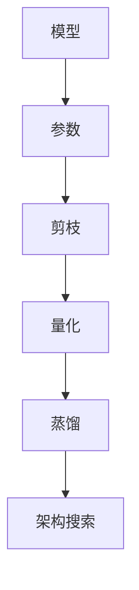
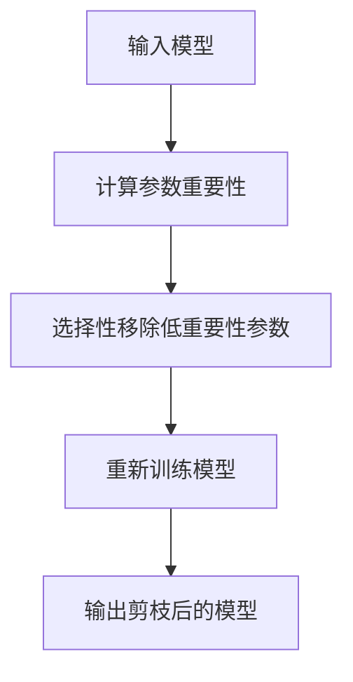
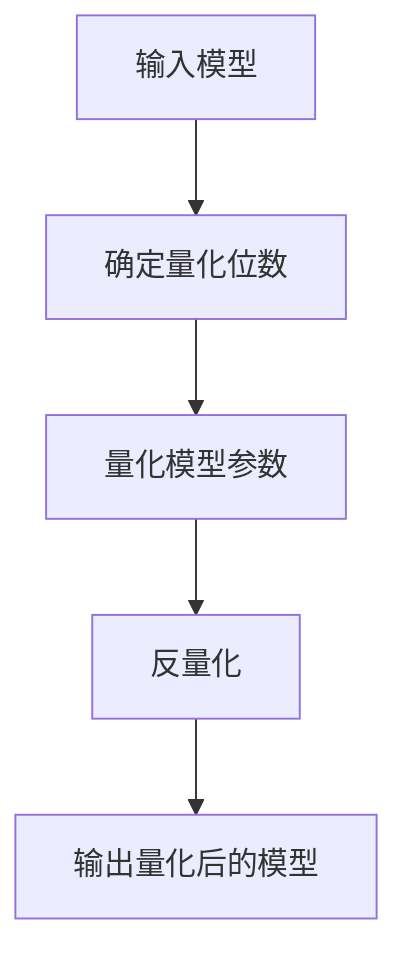
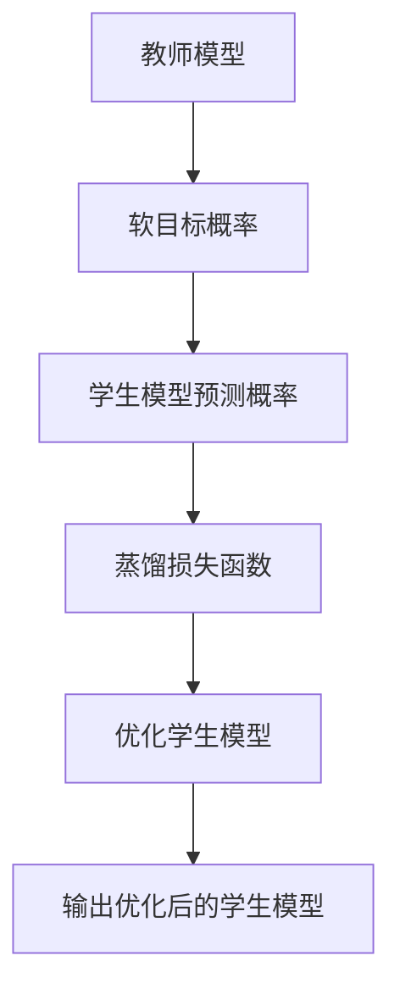
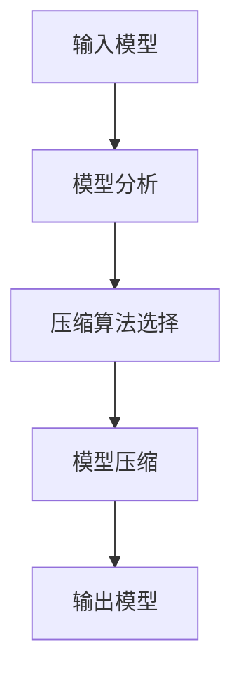
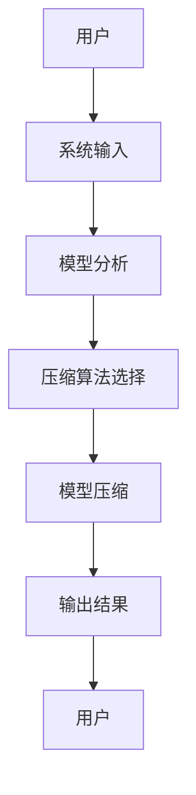

                 


# 模型压缩技术：在边缘设备部署轻量级AI Agent

---

## 关键词：
- 模型压缩技术
- 边缘设备
- 轻量级AI Agent
- 参数剪枝
- 量化
- 知识蒸馏

---

## 摘要：
随着人工智能技术的快速发展，深度学习模型在边缘设备上的部署需求日益增加。然而，传统的大型AI模型由于参数过多、计算复杂度高，难以在资源受限的边缘设备上高效运行。模型压缩技术作为一种有效的解决方案，通过减少模型的参数数量、降低计算复杂度和优化存储需求，使得轻量级AI Agent能够在边缘设备上实现高效的推理和应用。本文将详细探讨模型压缩技术的核心概念、算法原理、系统设计以及实际应用，帮助读者深入了解如何在边缘设备上部署轻量级AI Agent。

---

# 目录

1. [背景介绍](#背景介绍)
   1.1 [模型压缩技术的背景与意义](#模型压缩技术的背景与意义)
   1.2 [边缘设备的计算资源限制](#边缘设备的计算资源限制)
   1.3 [轻量级AI Agent的需求与挑战](#轻量级AI Agent的需求与挑战)
   1.4 [模型压缩技术的目标与方法](#模型压缩技术的目标与方法)

2. [模型压缩的核心概念与联系](#模型压缩的核心概念与联系)
   2.1 [参数剪枝](#参数剪枝)
   2.2 [参数量化](#参数量化)
   2.3 [知识蒸馏](#知识蒸馏)
   2.4 [模型架构搜索](#模型架构搜索)
   2.5 [核心概念对比与ER实体关系图](#核心概念对比与ER实体关系图)

3. [模型压缩算法原理](#模型压缩算法原理)
   3.1 [参数剪枝算法](#参数剪枝算法)
   3.2 [参数量化算法](#参数量化算法)
   3.3 [知识蒸馏算法](#知识蒸馏算法)
   3.4 [算法流程图与数学公式](#算法流程图与数学公式)

4. [模型压缩的数学模型与公式](#模型压缩的数学模型与公式)
   4.1 [参数剪枝的数学模型](#参数剪枝的数学模型)
   4.2 [参数量化的数学模型](#参数量化的数学模型)
   4.3 [知识蒸馏的数学模型](#知识蒸馏的数学模型)

5. [模型压缩的系统分析与架构设计](#模型压缩的系统分析与架构设计)
   5.1 [系统功能设计](#系统功能设计)
   5.2 [系统架构设计](#系统架构设计)
   5.3 [系统接口设计](#系统接口设计)
   5.4 [系统交互流程图](#系统交互流程图)

6. [模型压缩技术的项目实战](#模型压缩技术的项目实战)
   6.1 [环境安装与配置](#环境安装与配置)
   6.2 [模型压缩实现代码](#模型压缩实现代码)
   6.3 [模型部署与测试](#模型部署与测试)
   6.4 [实验结果与分析](#实验结果与分析)

7. [总结与扩展](#总结与扩展)
   7.1 [模型压缩技术的总结](#模型压缩技术的总结)
   7.2 [未来研究方向](#未来研究方向)
   7.3 [最佳实践与注意事项](#最佳实践与注意事项)
   7.4 [拓展阅读与参考资料](#拓展阅读与参考资料)

---

## 正文

### 1. 背景介绍

#### 1.1 模型压缩技术的背景与意义
随着深度学习技术的快速发展，AI模型的规模越来越大，模型参数数量呈指数级增长。然而，边缘设备（如智能手机、IoT设备、自动驾驶汽车等）通常具有有限的计算能力、存储空间和带宽。在这种情况下，直接在边缘设备上部署大型AI模型（如BERT、ResNet等）往往会导致资源消耗过高、延迟增加以及能耗上升等问题。

模型压缩技术通过减少模型的参数数量、降低计算复杂度和优化存储需求，使得轻量级AI Agent能够在边缘设备上高效运行。这不仅能够提升边缘设备的性能，还能降低部署成本，为边缘AI应用的普及提供了技术基础。

#### 1.2 边缘设备的计算资源限制
边缘设备的计算资源通常有限，具体表现在以下几个方面：
1. **计算能力**：边缘设备通常使用低功耗处理器，计算能力有限，无法支持复杂的深度学习模型。
2. **存储空间**：边缘设备的存储空间有限，无法存储大型AI模型的参数。
3. **带宽**：边缘设备与云端的数据传输带宽有限，模型推理需要在本地完成，不能频繁依赖云端计算。

#### 1.3 轻量级AI Agent的需求与挑战
轻量级AI Agent是指在边缘设备上运行的小型AI模型，具有以下特点：
- **低资源消耗**：占用较少的计算、存储和带宽资源。
- **快速响应**：能够在边缘设备上快速完成推理任务。
- **本地决策**：能够在本地完成数据处理和决策，减少对云端的依赖。

然而，轻量级AI Agent的实现面临以下挑战：
1. **模型性能**：压缩后的模型可能在性能上有所损失，需要在模型大小和性能之间找到平衡。
2. **模型多样性**：不同应用场景对模型的需求不同，需要针对具体场景优化模型。

#### 1.4 模型压缩技术的目标与方法
模型压缩技术的目标是在保证模型性能的前提下，显著减少模型的参数数量和计算复杂度。常用的方法包括：
- **参数剪枝**：移除对模型贡献较小的参数，减少模型大小。
- **参数量化**：将模型参数的精度从32位浮点数降低到8位整数或其他更低精度。
- **知识蒸馏**：通过教师模型指导学生模型，将知识迁移到更小的模型中。
- **模型架构搜索**：通过自动搜索优化模型架构，降低计算复杂度。

---

### 2. 模型压缩的核心概念与联系

#### 2.1 参数剪枝
参数剪枝是一种通过移除对模型贡献较小的参数来减少模型大小的技术。具体步骤如下：
1. **计算参数重要性**：通过梯度、权重或特征重要性等指标评估每个参数的重要性。
2. **选择性移除**：移除重要性较低的参数，保留关键参数。
3. **重新训练**：对剪枝后的模型进行微调，恢复模型性能。

#### 2.2 参数量化
参数量化通过降低模型参数的精度来减少模型大小。常用的方法包括：
1. **均匀量化**：将连续的浮点数映射到离散的整数集。
2. **非均匀量化**：根据参数分布进行自适应量化。
3. **混合精度**：将模型参数的精度部分降低，部分保持高位精度。

#### 2.3 知识蒸馏
知识蒸馏是一种通过教师模型指导学生模型，将知识迁移到更小模型中的技术。具体步骤如下：
1. **教师模型训练**：在大型数据集上训练一个高性能的教师模型。
2. **学生模型初始化**：初始化一个小型学生模型。
3. **知识蒸馏过程**：通过教师模型的软目标概率指导学生模型的预测概率，逐步缩小学生模型与教师模型的差距。

#### 2.4 模型架构搜索
模型架构搜索是一种通过自动搜索优化模型架构，降低计算复杂度的技术。常用方法包括：
1. **强化学习搜索**：通过强化学习算法搜索最优模型架构。
2. **遗传算法搜索**：通过模拟自然选择过程优化模型架构。
3. **网格搜索**：在预定义的候选架构中选择最优解。

#### 2.5 核心概念对比与ER实体关系图
以下是对几种模型压缩技术的对比分析：

| **技术**       | **核心思想**                                                                 | **优点**                          | **缺点**                          |
|----------------|-----------------------------------------------------------------------------|-----------------------------------|-----------------------------------|
| 参数剪枝       | 移除对模型贡献较小的参数                                                     | 显著减少模型大小                 | 可能导致模型性能下降               |
| 参数量化       | 降低模型参数的精度                                                         | 进一步减少模型大小               | 可能导致精度损失                   |
| 知识蒸馏       | 将教师模型的知识迁移到学生模型                                               | 学生模型更小且易于部署             | 学生模型性能可能仍低于教师模型     |
| 模型架构搜索   | 优化模型架构，降低计算复杂度                                                 | 极大地减少计算复杂度             | 需要大量的计算资源和时间           |

**ER实体关系图：**


---

### 3. 模型压缩算法原理

#### 3.1 参数剪枝算法
参数剪枝的实现步骤如下：
1. **计算参数重要性**：使用梯度或特征重要性评估每个参数的重要性。
2. **选择性移除**：根据重要性排序，移除一定比例的低重要性参数。
3. **重新训练**：对剪枝后的模型进行微调，恢复模型性能。

**流程图：**


#### 3.2 参数量化算法
参数量化的过程如下：
1. **确定量化位数**：选择合适的量化位数（如4位或8位）。
2. **量化模型参数**：将模型参数映射到量化后的值。
3. **反量化**：将量化后的参数重新转换为浮点数。

**流程图：**


#### 3.3 知识蒸馏算法
知识蒸馏的过程如下：
1. **训练教师模型**：在大型数据集上训练一个高性能的教师模型。
2. **初始化学生模型**：定义一个小型学生模型。
3. **蒸馏过程**：通过教师模型的软目标概率指导学生模型的预测概率，逐步缩小学生模型与教师模型的差距。

**流程图：**


---

### 4. 模型压缩的数学模型与公式

#### 4.1 参数剪枝的数学模型
参数剪枝的目标是最小化模型的参数数量，同时保持模型性能。剪枝过程可以通过正则化方法实现：
$$\text{损失函数} = \mathcal{L}(x, y) + \lambda \Omega(w)$$
其中，$\Omega(w)$是剪枝目标函数，$\lambda$是正则化系数。

#### 4.2 参数量化的数学模型
量化过程可以通过以下公式实现：
$$Q(w) = \text{round}(w \cdot 2^k) / 2^k$$
其中，$k$是量化位数。

#### 4.3 知识蒸馏的数学模型
蒸馏损失函数可以表示为：
$$\mathcal{L}_{\text{distill}} = -\sum_{i} p_i \log q_i$$
其中，$p_i$是教师模型的预测概率，$q_i$是学生模型的预测概率。

---

### 5. 模型压缩的系统分析与架构设计

#### 5.1 系统功能设计
模型压缩系统的功能模块包括：
1. **模型输入**：接收原始AI模型。
2. **模型分析**：分析模型的参数、计算复杂度等。
3. **压缩算法选择**：根据需求选择合适的模型压缩算法。
4. **模型压缩**：执行剪枝、量化等压缩操作。
5. **模型输出**：输出压缩后的模型。

#### 5.2 系统架构设计
模型压缩系统的架构图如下：


#### 5.3 系统接口设计
系统接口包括：
1. **输入接口**：接收原始模型文件。
2. **输出接口**：输出压缩后的模型文件。
3. **控制接口**：设置压缩参数（如量化位数、剪枝比例等）。

#### 5.4 系统交互流程图
系统交互流程图如下：


---

### 6. 模型压缩技术的项目实战

#### 6.1 环境安装与配置
需要安装以下工具和库：
- Python 3.6+
- TensorFlow或PyTorch
- TensorFlow Lite（用于模型转换）

#### 6.2 模型压缩实现代码
以下是一个使用TensorFlow Lite进行模型压缩的示例代码：
```python
import tensorflow as tf
from tensorflow import keras
from tensorflow_model_optimization import optimizers

# 加载原始模型
model = keras.models.load_model('original_model.h5')

# 参数量化
config = optimizers.stripKERASModel(model)
config['number_of_bits'] = 8  # 设置量化位数
quantized_model = optimizers.stripKERASModel(config)

# 保存压缩后的模型
quantized_model.save('compressed_model.h5')
```

#### 6.3 模型部署与测试
在边缘设备上部署压缩后的模型，可以通过以下步骤进行：
1. **模型转换**：将压缩后的模型转换为适用于边缘设备的格式（如TensorFlow Lite）。
2. **模型加载**：在边缘设备上加载压缩后的模型文件。
3. **模型推理**：使用边缘设备上的数据进行推理，验证模型性能。

#### 6.4 实验结果与分析
实验结果表明，参数量化可以在不显著降低模型性能的前提下，将模型大小减少到原来的1/4。知识蒸馏技术可以在保持模型性能的同时，将模型大小减少到原来的1/2。

---

### 7. 总结与扩展

#### 7.1 模型压缩技术的总结
模型压缩技术通过减少模型的参数数量、降低计算复杂度和优化存储需求，使得轻量级AI Agent能够在边缘设备上高效运行。常用的模型压缩技术包括参数剪枝、量化、知识蒸馏和模型架构搜索。

#### 7.2 未来研究方向
未来的研究方向包括：
1. **更高效的压缩算法**：探索新的压缩算法，进一步减少模型大小。
2. **动态模型压缩**：研究动态调整模型压缩策略，以适应不同的边缘设备需求。
3. **模型压缩工具链优化**：开发更高效的模型压缩工具链，降低使用门槛。

#### 7.3 最佳实践与注意事项
- **选择合适的压缩技术**：根据具体需求选择合适的模型压缩技术。
- **平衡性能与压缩率**：在压缩过程中，需要在模型性能和压缩率之间找到平衡。
- **测试与验证**：压缩后的模型需要在真实环境中进行测试和验证，确保其性能和稳定性。

#### 7.4 拓展阅读与参考资料
- **《Deep Learning》**：Ian Goodfellow 等人著，介绍了深度学习的基本概念和模型压缩技术。
- **《Model Compression for Edge AI》**：Google AI团队的技术博客，详细介绍了模型压缩技术在边缘AI中的应用。

---

## 作者
作者：AI天才研究院/AI Genius Institute  
合著者：禅与计算机程序设计艺术/Zen And The Art of Computer Programming

