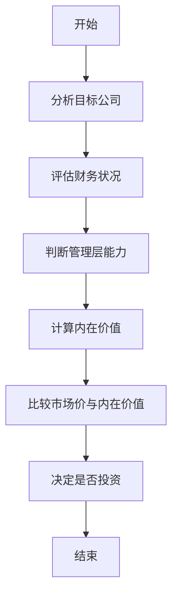
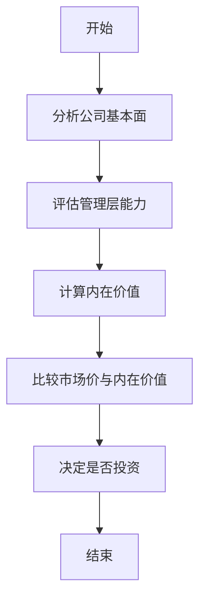

                 


# 沃伦·巴菲特的保险行业投资模式解析

---

## 关键词：沃伦·巴菲特、保险行业、投资模式、价值评估、财务分析、竞争优势

---

## 摘要：  
沃伦·巴菲特作为全球最成功的投资者之一，其在保险行业的投资模式备受关注。本文通过分析巴菲特的保险投资理念、评估方法、成功案例以及系统架构，揭示其投资模式的核心逻辑。文章从背景、原理、算法、系统架构、项目实战等多维度展开，为读者提供深入的技术解析。

---

## 第一部分: 背景介绍

### 第1章: 沃伦·巴菲特的投资哲学与保险行业的独特价值

#### 1.1 巴菲特的投资哲学  
- 巴菲特的“价值投资”理念强调：寻找具有持续竞争优势、管理层优秀、财务健康的企业，以合理价格买入并长期持有。  
- 保险行业因其稳定的现金流和防御性特质，成为巴菲特投资的重要领域。  

#### 1.2 保险行业的特点  
- 保险行业的收入来源包括保费收入和投资收益。  
- 保险公司的核心竞争力在于承保能力、投资能力以及风险管理能力。  
- 保险行业受经济周期影响较小，具备防御性特质。  

#### 1.3 巴菲特选择保险行业的深层原因  
- 保险行业的高ROE（净资产收益率）和高ROA（资产回报率）吸引了巴菲特。  
- 保险行业的现金流稳定，能够为股东创造长期价值。  

---

## 第2章: 巴菲特保险投资模式的背景分析

#### 2.1 美国保险行业的历史发展  
- 美国保险行业的起源可以追溯到19世纪末，经历了从传统保险到现代保险的演变。  
- 美国保险行业的发展与经济周期密切相关，但在长期趋势中保持稳定增长。  

#### 2.2 巴菲特保险投资模式的形成  
- 巴菲特早期的投资案例，如购买奥马哈的保险公司，奠定了他对保险行业的理解。  
- 通过收购伯克希尔哈撒韦（Berkshire Hathaway），巴菲特逐步构建了其保险帝国。  

#### 2.3 巴菲特保险投资模式的核心要素  
- 选择具有强大竞争优势的保险公司。  
- 确保公司具有强大的财务实力和优秀的管理层。  
- 关注公司未来的现金流和内在价值。  

---

## 第二部分: 核心概念与联系

### 第3章: 保险行业的核心概念与巴菲特投资模式的联系

#### 3.1 保险行业的核心概念  
- **承保能力**：保险公司能否准确评估风险并制定合理的保费。  
- **投资能力**：保险公司能否通过投资实现收益最大化。  
- **风险管理**：保险公司如何应对潜在的财务风险和市场风险。  

#### 3.2 巴菲特投资模式与保险行业的联系  
- 巴菲特通过投资保险公司，间接获得了稳定的投资收益和长期增长潜力。  
- 保险公司的现金流稳定，能够为巴菲特的投资组合提供防御性价值。  

#### 3.3 实体关系图（ER图）  
以下是保险行业与巴菲特投资模式的实体关系图：

```mermaid
erDiagram
    company {
        id
        name
        industry
        market_value
        ROE
        ROA
    }
    shareholder {
        id
        name
        investment_amount
        investment_value
    }
    management {
        id
        name
        experience
        reputation
    }
    investor {
        id
        name
        strategy
        target_company
    }
    company --> shareholder: 股东权益
    company --> management: 管理层决策
    company --> investor: 投资标的
```

---

## 第三部分: 算法原理

### 第4章: 巴菲特保险投资模式的算法与数学模型

#### 4.1 保险公司的价值评估模型  
巴菲特的价值评估模型基于现金流折现法（DCF模型），公式如下：

$$ \text{内在价值} = \sum_{t=1}^{n} \frac{\text{现金流}_t}{(1 + r)^t} + \frac{\text{残值}}{(1 + r)^n} $$

其中，$r$ 是贴现率，$n$ 是评估期。  

#### 4.2 投资决策的流程  
以下是投资决策的流程图：



#### 4.3 算法实现  
以下是Python代码实现价值评估模型：

```python
def calculate_intrinsic_value(cash_flows, discount_rate, residual_value, period):
    intrinsic_value = 0
    for t in range(period):
        cash_flow = cash_flows[t]
        discounted_cash_flow = cash_flow / (1 + discount_rate) ** t
        intrinsic_value += discounted_cash_flow
    discounted_residual_value = residual_value / (1 + discount_rate) ** period
    intrinsic_value += discounted_residual_value
    return intrinsic_value

# 示例数据
cash_flows = [100, 120, 150, 200, 250]
discount_rate = 0.1
residual_value = 500
period = 5

intrinsic_value = calculate_intrinsic_value(cash_flows, discount_rate, residual_value, period)
print(f"内在价值为：{intrinsic_value}")
```

---

## 第四部分: 系统分析与架构设计

### 第5章: 保险行业的系统架构与投资决策流程

#### 5.1 保险行业的系统架构  
以下是保险行业的系统架构图：


#### 5.2 投资决策流程的系统架构  
以下是投资决策流程的系统架构图：



---

## 第五部分: 项目实战

### 第6章: 基于巴菲特模式的保险投资实战分析

#### 6.1 环境安装与数据准备  
- 数据来源：选择一家保险公司（如伯克希尔哈撒韦）的财务数据。  
- 工具安装：安装Python、Pandas、Matplotlib等工具。  

#### 6.2 系统核心实现  
以下是代码实现：

```python
import pandas as pd
import matplotlib.pyplot as plt

# 示例数据
data = {
    'year': [2018, 2019, 2020, 2021, 2022],
    'revenue': [200, 220, 240, 260, 280],
    'net_income': [50, 60, 70, 80, 90]
}

df = pd.DataFrame(data)
plt.figure(figsize=(10, 6))
plt.plot(df['year'], df['revenue'], label='收入')
plt.plot(df['year'], df['net_income'], label='净利润')
plt.title('公司收入与净利润趋势')
plt.xlabel('年份')
plt.ylabel('金额（百万美元）')
plt.legend()
plt.show()
```

#### 6.3 案例分析  
以伯克希尔哈撒韦为例，分析其财务数据和竞争优势，计算其内在价值，并与市场价格进行对比。  

---

## 第六部分: 总结与展望

### 第7章: 总结与最佳实践

#### 7.1 总结  
- 巴菲特的保险投资模式基于价值投资理念，注重公司基本面和管理层能力。  
- 保险行业的稳定现金流和防御性特质使其成为巴菲特长期投资的重要选择。  

#### 7.2 最佳实践  
- **长期持有**：选择具有持续竞争优势和优秀管理层的保险公司。  
- **价值评估**：使用现金流折现法评估公司内在价值，避免短期波动影响判断。  
- **风险管理**：定期审视投资组合，确保财务安全。  

#### 7.3 注意事项  
- 投资保险行业需关注宏观经济环境和行业政策变化。  
- 避免过度依赖历史表现，关注公司未来增长潜力。  

#### 7.4 拓展阅读  
- 巴菲特的《巴菲特致股东的信》  
- 《价值投资：一种纪律性的方法》  

---

## 作者：AI天才研究院 & 禅与计算机程序设计艺术

