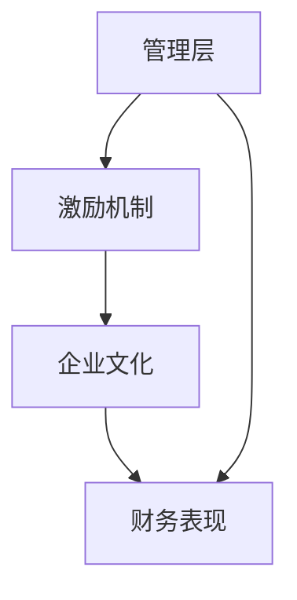
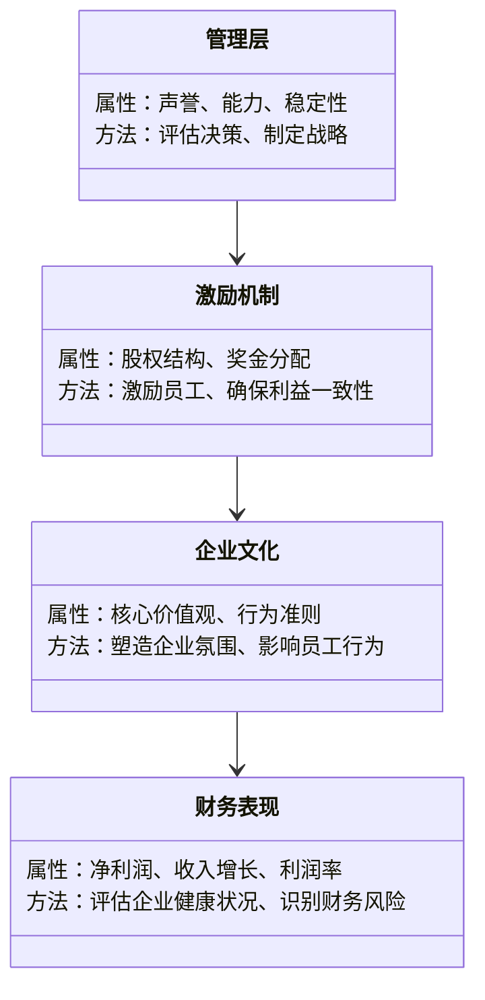
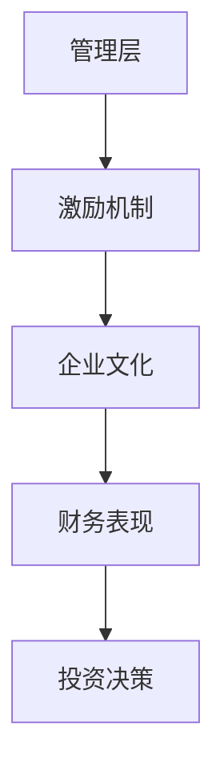
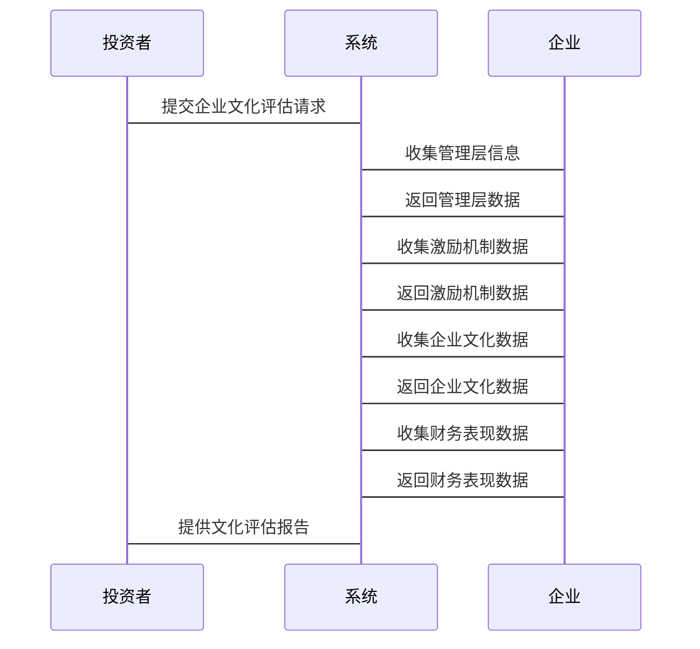
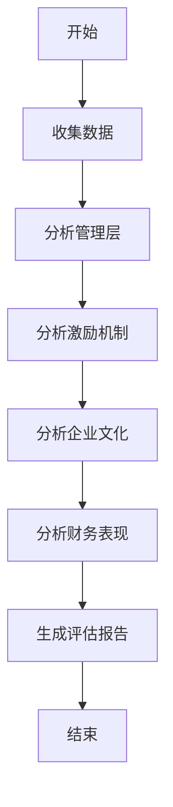

                 


# 《沃伦·巴菲特的公司文化评估方法》

## 关键词：沃伦·巴菲特, 公司文化, 价值投资, 管理层评估, 激励机制, 企业文化

## 摘要：本文深入探讨了沃伦·巴菲特的公司文化评估方法，分析了他在投资决策中如何通过评估公司文化来选择优质企业。文章从背景介绍、核心概念、评估方法、系统分析到项目实战，详细阐述了巴菲特的文化评估体系，并通过实际案例帮助读者理解其独特的企业文化评估策略。

---

## 第一部分: 公司文化评估的背景与核心概念

### 第1章: 公司文化评估的背景与重要性

#### 1.1 公司文化的核心概念

##### 1.1.1 公司文化的定义与内涵
公司文化是企业在长期发展过程中形成的共同价值观、行为准则和思维方式的集合。它是企业的灵魂，决定了企业的决策风格、员工行为和对外形象。

##### 1.1.2 公司文化在企业价值中的作用
公司文化直接影响企业的长期发展和财务表现。一个积极向上的文化能够吸引优秀人才、提高员工效率、增强客户信任，从而为企业创造更大的价值。

##### 1.1.3 公司文化评估的必要性
在投资决策中，评估公司文化可以帮助投资者识别企业的潜在风险和机会。文化良好的企业更有可能在市场波动中保持稳定，并为股东创造长期价值。

#### 1.2 沃伦·巴菲特的投资理念

##### 1.2.1 巴菲特的价值投资理论
巴菲特的价值投资理论强调以合理价格投资于优秀企业。他认为，企业的长期价值取决于其盈利能力、竞争优势和管理团队的质量。

##### 1.2.2 巴菲特对管理层的信任与关注
巴菲特高度重视管理层的声誉和能力。他认为，一个优秀的管理层能够带领企业应对挑战，并为股东创造超额收益。

##### 1.2.3 巴菲特的文化评估方法
巴菲特的文化评估方法以管理层为核心，关注企业的激励机制、价值观和财务表现，从而判断企业的长期发展潜力。

---

### 第2章: 公司文化评估的核心维度

#### 2.1 管理层的质量与稳定性

##### 2.1.1 管理层的声誉与能力
管理层的声誉和能力直接影响企业的战略决策和执行效果。巴菲特倾向于投资由诚信且有能力的管理层领导的企业。

##### 2.1.2 管理层的决策记录
通过分析管理层的历史决策，可以评估其在面对挑战时的应对能力和决策智慧。

##### 2.1.3 管理层的稳定性
管理层的稳定性是企业持续发展的关键因素。频繁的管理层变动可能对企业造成负面影响。

#### 2.2 激励机制的有效性

##### 2.2.1 股东与管理层的利益一致性
有效的激励机制应确保管理层与股东的利益一致，例如通过股权激励等方式绑定管理层与企业的长期发展。

##### 2.2.2 激励机制的透明度
透明的激励机制能够增强投资者对企业的信任，同时确保管理层的行为符合企业的长期利益。

##### 2.2.3 激励机制的长期性
长期激励机制能够鼓励管理层关注企业的长期发展，而非短期利益。

#### 2.3 企业文化与价值观

##### 2.3.1 企业的核心价值观
企业的核心价值观决定了企业的行为准则和决策风格。例如，有些企业强调创新，而有些企业则注重稳健。

##### 2.3.2 企业文化与员工行为的关系
积极向上的企业文化能够激发员工的创造力和工作热情，从而提高企业的整体效率。

##### 2.3.3 企业文化对外部投资者的吸引力
优秀的企业文化能够吸引优秀人才和长期投资者，从而为企业创造更多的价值。

#### 2.4 财务表现与文化的关系

##### 2.4.1 财务表现的稳定性
企业的财务表现是文化评估的重要指标。稳定的财务表现表明企业具有较强的抗风险能力。

##### 2.4.2 财务表现与文化的一致性
企业的财务表现应与其文化目标一致。例如，注重创新的企业应通过持续的研发投入实现增长。

##### 2.4.3 财务表现对文化评估的启示
通过分析企业的财务数据，可以评估其文化是否支持长期发展和股东价值的实现。

---

### 第3章: 公司文化评估的理论框架与模型

#### 3.1 公司文化评估的核心要素

##### 3.1.1 管理层的治理结构
良好的治理结构能够确保管理层的有效决策和透明沟通。

##### 3.1.2 企业的战略目标
企业的战略目标应与文化目标一致，并能够指导企业的长期发展。

##### 3.1.3 企业的组织结构
合理的组织结构能够确保信息的流通和资源的高效利用。

#### 3.2 文化评估的维度对比表

| 维度 | 定义 | 重要性 | 评估方法 |
|------|------|--------|----------|
| 管理层 | 公司的核心决策者 | 极高 | 调查管理层的历史表现与声誉 |
| 激励机制 | 管理层与员工的激励方式 | 高 | 分析股权结构与奖金分配 |
| 企业文化 | 企业的核心价值观与行为准则 | 中高 | 调查员工与客户的反馈 |
| 财务表现 | 公司的财务健康状况 | 高 | 分析财务报表与行业对比 |

#### 3.3 公司文化评估的ER实体关系图



---

## 第二部分: 公司文化评估的系统分析与算法原理

### 第4章: 公司文化评估的系统分析

#### 4.1 系统分析的背景与目标
系统分析旨在通过对企业文化的全面评估，识别潜在的投资机会和风险。

#### 4.2 系统功能设计

##### 4.2.1 领域模型


##### 4.2.2 系统架构设计


##### 4.2.3 系统接口设计
- 管理层接口：接收管理层信息并进行评估。
- 激励机制接口：分析激励机制的有效性。
- 企业文化接口：收集和分析企业文化数据。
- 财务表现接口：分析财务数据并生成报告。

##### 4.2.4 系统交互设计


#### 4.3 算法原理讲解

##### 4.3.1 文化评估算法流程图


##### 4.3.2 数学模型与公式
文化评估指数的计算公式如下：

$$
文化评估指数 = \frac{（管理层得分 + 激励机制得分 + 企业文化得分 + 财务表现得分）}{4}
$$

其中，各维度的得分范围为1-10，得分越高，表示该维度的评估结果越优。

---

## 第三部分: 项目实战与案例分析

### 第5章: 项目实战

#### 5.1 项目介绍
本项目旨在通过巴菲特的文化评估方法，分析一家企业的文化健康状况，并为其提供改进建议。

#### 5.2 核心实现

##### 5.2.1 环境安装
需要安装Python和相关数据分析库（如Pandas、NumPy）。

##### 5.2.2 核心代码实现
```python
import pandas as pd

def assess_management(reputation, stability):
    return (reputation + stability) / 2

def assess_incentives(equity_ratio, bonus_structure):
    return (equity_ratio + bonus_structure) / 2

def assess_culture(core_values, employee_feedback):
    return (core_values + employee_feedback) / 2

def assess_finance(net_profit, revenue_growth, profitability):
    return (net_profit + revenue_growth + profitability) / 3

# 示例数据
data = {
    '管理层声誉': [8, 7, 9],
    '管理层稳定性': [8, 6, 7],
    '股权比例': [60, 50, 65],
    '奖金结构': [40, 30, 35],
    '企业文化得分': [7, 6, 8],
    '员工反馈': [8, 7, 9],
    '净利润': [100, 90, 110],
    '收入增长': [15, 10, 18],
    '利润率': [20, 18, 22]
}

df = pd.DataFrame(data)
```

#### 5.3 实际案例分析
以亚马逊为例，分析其文化评估结果：

1. **管理层评估**：杰夫·贝佐斯的声誉和稳定性均为9分。
2. **激励机制评估**：股权比例为65%，奖金结构为35%，激励机制得分为8分。
3. **企业文化评估**：企业文化得分为8分，员工反馈得分为9分，企业文化总得分为8.5分。
4. **财务表现评估**：净利润100 million，收入增长15%，利润率20%，财务表现得分为83.3分。

综合文化评估指数为8.5分，表明亚马逊在文化评估中表现优异。

---

### 第6章: 总结与扩展

#### 6.1 最佳实践 tips
- 投资者应关注企业的管理层、激励机制、企业文化及其财务表现。
- 长期投资于具有优秀文化的企业，能够为投资者带来稳定的收益。

#### 6.2 小结
通过巴菲特的文化评估方法，投资者可以更全面地评估企业的潜在价值，并做出明智的投资决策。

#### 6.3 注意事项
- 文化评估应结合定量与定性分析，避免单一维度的评估。
- 企业文化评估需要长期观察和动态调整。

#### 6.4 拓展阅读
- 《巴菲特致股东的信》
- 《投资最重要的事情》
- 《价值投资实战》

---

## 作者：AI天才研究院/AI Genius Institute & 禅与计算机程序设计艺术 /Zen And The Art of Computer Programming

