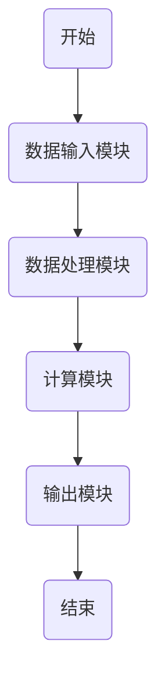

                 


# 沃伦·巴菲特的品牌价值评估方法

---

## 关键词：
- 品牌价值
- 巴菲特
- 价值投资
- 评估方法
- 投资策略

---

## 摘要：
沃伦·巴菲特作为全球最著名的价值投资者之一，其品牌价值评估方法在投资领域具有深远影响。本文将详细分析巴菲特的品牌价值评估方法，结合其核心理念和投资策略，探讨品牌价值的核心要素、评估指标及具体模型。通过实际案例分析和系统架构设计，本文为读者提供一套实用的品牌价值评估框架，帮助投资者更好地理解和应用巴菲特的投资智慧。

---

# 第1章: 沃伦·巴菲特的品牌价值评估方法概述

## 1.1 沃伦·巴菲特的价值投资理念

### 1.1.1 价值投资的定义与核心理念

- 价值投资的定义：寻找市场低估的优秀企业进行长期投资。
- 核心理念：关注企业的基本面，寻找具有持续竞争优势和良好治理的企业。

### 1.1.2 巴菲特投资成功的三大核心要素

- 企业质量：企业的盈利能力、竞争优势和管理团队。
- 价格合理性：买入价格低于内在价值。
- 长期持有：时间复利效应。

### 1.1.3 品牌价值在巴菲特投资策略中的重要性

- 品牌价值是企业长期竞争优势的体现。
- 强大的品牌价值意味着稳定的市场需求和客户忠诚度。

## 1.2 品牌价值评估的核心概念

### 1.2.1 品牌价值的定义与内涵

- 品牌价值是指品牌为企业带来的超额收益。
- 包括品牌知名度、品牌忠诚度、品牌影响力等多方面因素。

### 1.2.2 品牌价值的外延与边界

- 外延：品牌价值不仅体现在财务指标上，还包括市场影响力和客户认知度。
- 边界：品牌价值的评估需要结合行业特点和企业实际情况。

### 1.2.3 品牌价值与企业价值的关系

- 品牌价值是企业价值的重要组成部分。
- 企业价值 = 品牌价值 + 企业其他资产价值。

## 1.3 本书的核心方法与目标

### 1.3.1 本书的研究目标

- 探讨巴菲特品牌价值评估的核心方法。
- 提供一套可操作的品牌价值评估框架。

### 1.3.2 本书的核心方法论

- 结合财务指标和非财务指标，构建品牌价值评估模型。
- 通过实际案例验证模型的可行性和准确性。

### 1.3.3 本书的适用范围与读者群体

- 适用于投资者、企业管理者和品牌管理者。
- 适合对价值投资和品牌管理感兴趣的专业人士。

## 1.4 本章小结

- 本章介绍了巴菲特的价值投资理念，明确了品牌价值在投资中的重要性。
- 提出了本书的核心方法论和研究目标。

---

# 第2章: 品牌价值评估的关键要素与指标

## 2.1 品牌价值的核心要素

### 2.1.1 品牌认知度

- 品牌认知度的定义：目标市场中消费者对品牌的记忆和理解程度。
- 测量方法：市场调研、消费者认知测试。

### 2.1.2 品牌忠诚度

- 品牌忠诚度的定义：消费者在购买决策中对特定品牌的选择倾向。
- 测量方法：消费行为分析、客户满意度调查。

### 2.1.3 品牌知名度

- 品牌知名度的定义：品牌在市场中的广泛程度。
- 测量方法：媒体曝光度、市场占有率。

## 2.2 品牌价值的财务指标

### 2.2.1 净资产收益率（ROE）

- ROE的定义：净利润与股东权益的比率。
- 计算公式：ROE = 净利润 / 股东权益。
- 指标意义：反映企业资产使用效率和盈利能力。

### 2.2.2 净利润增长率

- 净利润增长率的定义：净利润较前一时期的增长比例。
- 计算公式：净利润增长率 = （本期净利润 - 上期净利润）/ 上期净利润。
- 指标意义：反映企业盈利能力的持续性。

### 2.2.3 每股收益（EPS）

- EPS的定义：普通股每股的净利润。
- 计算公式：EPS = 净利润 / 普通股股数。
- 指标意义：衡量企业盈利能力的重要指标。

## 2.3 品牌价值的非财务指标

### 2.3.1 品牌影响力指数

- 品牌影响力指数的定义：品牌在市场中的影响力和竞争力的综合指标。
- 测量方法：品牌排名、行业专家评估。

### 2.3.2 市场占有率

- 市场占有率的定义：企业在某一市场中的销售量占总市场的比例。
- 计算公式：市场占有率 = 企业销售额 / 市场总销售额。
- 指标意义：反映企业的市场地位。

### 2.3.3 客户满意度

- 客户满意度的定义：客户对企业产品或服务的满意程度。
- 测量方法：客户调查、满意度评分。

## 2.4 品牌价值评估的关键指标对比分析

### 2.4.1 财务指标与非财务指标的对比

- 财务指标：反映企业的盈利能力。
- 非财务指标：反映品牌的市场影响力和客户忠诚度。

### 2.4.2 不同行业品牌价值评估指标的差异

- 消费品行业：注重品牌知名度和市场占有率。
- 技术行业：注重研发能力和技术创新。

## 2.5 本章小结

- 本章分析了品牌价值的核心要素和关键指标。
- 强调了财务指标与非财务指标的结合使用。

---

# 第3章: 巴菲特品牌价值评估模型的构建与分析

## 3.1 巴菲特品牌价值评估模型的原理

### 3.1.1 模型的构建逻辑

- 结合企业财务数据和品牌影响力因素。
- 通过权重分配计算综合品牌价值。

### 3.1.2 模型的核心假设

- 假设企业的品牌价值与其财务指标和品牌影响力成正比。
- 假设不同行业品牌价值评估的权重有所不同。

### 3.1.3 模型的输入变量与输出结果

- 输入变量：净利润、ROE、品牌影响力指数、市场占有率。
- 输出结果：品牌价值。

## 3.2 模型的数学表达式与公式

### 3.2.1 品牌价值计算公式

$$ \text{品牌价值} = \frac{\text{净利润} \times \text{品牌影响力系数}}{\text{行业平均净利润率}} $$

### 3.2.2 品牌影响力系数的计算

$$ \text{品牌影响力系数} = \frac{\text{品牌知名度} + \text{品牌忠诚度}}{2} $$

## 3.3 模型的算法流程图

```mermaid
graph TD
    A[开始] --> B[输入企业财务数据]
    B --> C[计算品牌影响力系数]
    C --> D[计算行业平均净利润率]
    D --> E[计算品牌价值]
    E --> F[输出结果]
    F --> 

```

## 3.4 模型的系统架构设计

### 3.4.1 系统功能设计

- 数据输入模块：接收企业财务数据和品牌影响力数据。
- 数据处理模块：计算品牌影响力系数和行业平均净利润率。
- 计算模块：计算品牌价值。
- 输出模块：展示品牌价值结果。

### 3.4.2 系统架构图



## 3.5 本章小结

- 本章构建了巴菲特品牌价值评估模型，详细介绍了模型的原理和算法流程。
- 提供了系统的架构设计和实现方法。

---

# 第4章: 品牌价值评估的实战应用与案例分析

## 4.1 实战项目环境安装与数据准备

### 4.1.1 环境要求

- 需要安装Python、数据分析工具（如Pandas）和可视化工具（如Matplotlib）。

### 4.1.2 数据来源

- 数据来源：企业财务报表、行业报告、市场调研数据。

### 4.1.3 数据预处理

- 数据清洗：处理缺失值、异常值。
- 数据转换：将数据转换为模型所需格式。

## 4.2 品牌价值评估的核心实现代码

### 4.2.1 计算品牌影响力系数

```python
def calculate_brand_influence(brand_reputation, brand Loyalty):
    return (brand_reputation + brand_Loyalty) / 2
```

### 4.2.2 计算品牌价值

```python
def calculate_brand_value(net_profit, brand_influence, industry_net_profit_rate):
    return (net_profit * brand_influence) / industry_net_profit_rate
```

### 4.2.3 实际案例分析

#### 案例：评估某消费品牌的价值

```python
net_profit = 10000000  # 净利润（单位：元）
brand_reputation = 80  # 品牌声誉评分
brand_Loyalty = 70     # 品牌忠诚度评分
industry_net_profit_rate = 0.12  # 行业平均净利润率

brand_influence = calculate_brand_influence(brand_reputation, brand_Loyalty)
brand_value = calculate_brand_value(net_profit, brand_influence, industry_net_profit_rate)

print(f"品牌价值：{brand_value}元")
```

## 4.3 案例分析与结果解读

### 4.3.1 案例背景介绍

- 某消费品牌，净利润1000万元，品牌声誉80分，品牌忠诚度70分，行业平均净利润率12%。

### 4.3.2 模型计算过程

- 计算品牌影响力系数：(80 + 70) / 2 = 75。
- 计算品牌价值：(10000000 * 75) / 0.12 = 625000000元。

### 4.3.3 结果解读

- 该品牌的估算价值为62500万元。
- 说明该品牌具有较高的市场影响力和盈利能力。

## 4.4 本章小结

- 本章通过实际案例展示了模型的应用过程。
- 强调了数据准备和模型实现的关键步骤。

---

# 第5章: 品牌价值评估系统的优化与拓展

## 5.1 系统优化方向

### 5.1.1 数据来源的扩展

- 引入更多数据源，如社交媒体数据、消费者评价数据。

### 5.1.2 模型的改进

- 引入机器学习算法，提高品牌价值评估的准确性。

## 5.2 系统的拓展应用

### 5.2.1 应用于投资决策

- 帮助投资者发现被低估的品牌价值企业。

### 5.2.2 应用于企业品牌管理

- 帮助企业识别品牌优势和改进方向。

## 5.3 本章小结

- 本章探讨了系统的优化方向和拓展应用。
- 强调了品牌价值评估在投资和管理中的重要性。

---

# 第6章: 总结与展望

## 6.1 本书的核心内容回顾

- 介绍了巴菲特的品牌价值评估方法。
- 构建了品牌价值评估模型并进行了案例分析。

## 6.2 未来研究的方向

- 研究更复杂的品牌价值影响因素。
- 探讨人工智能在品牌价值评估中的应用。

## 6.3 作者寄语

- 投资者和企业管理者应注重品牌价值的长期积累。
- 希望本书能为读者的品牌价值评估提供有价值的参考。

---

# 作者：AI天才研究院/AI Genius Institute & 禅与计算机程序设计艺术 /Zen And The Art of Computer Programming

