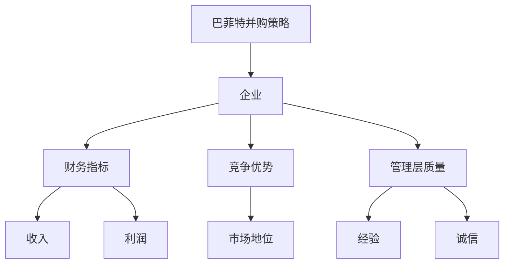
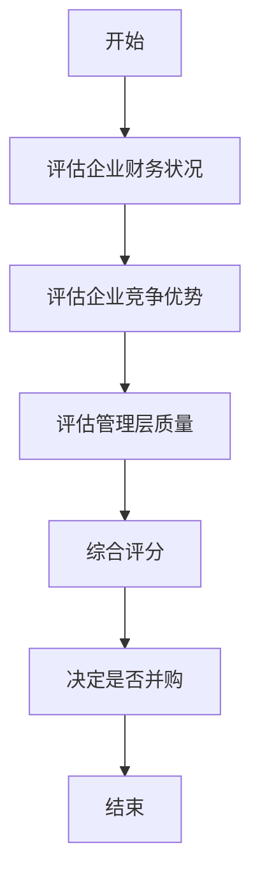
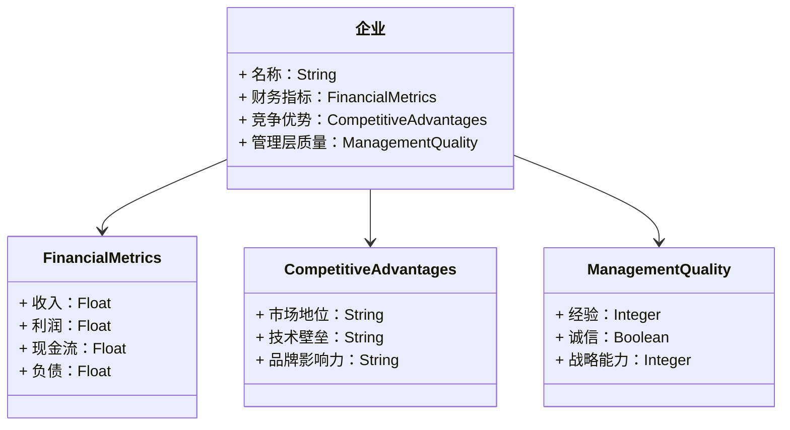
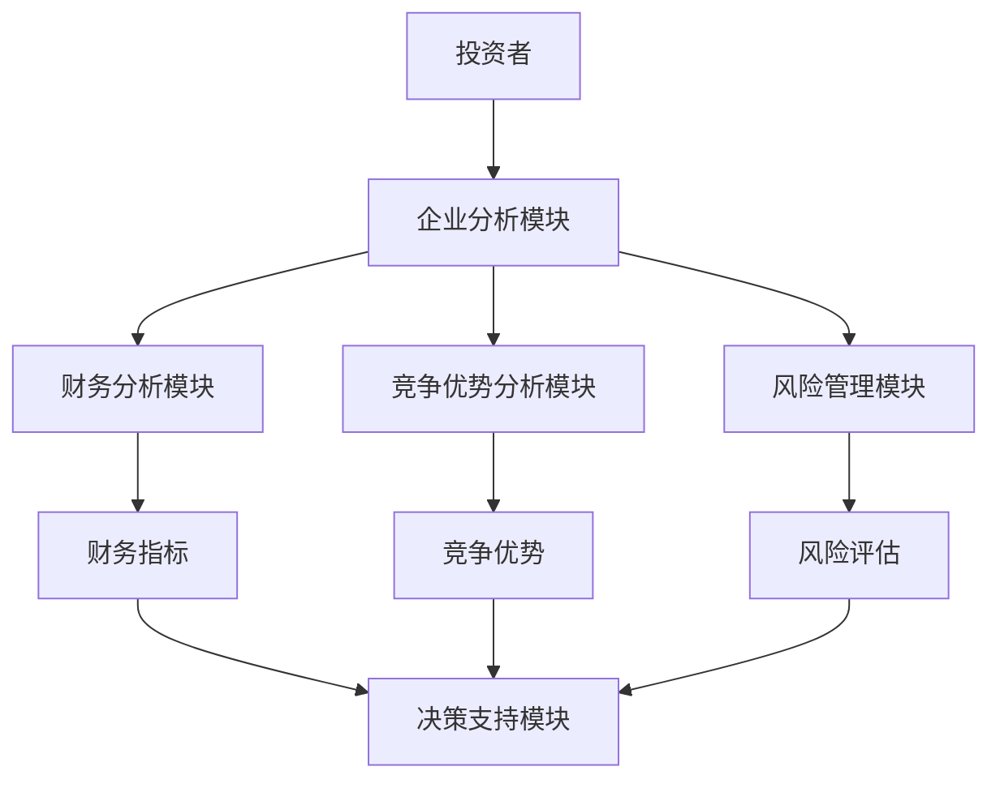
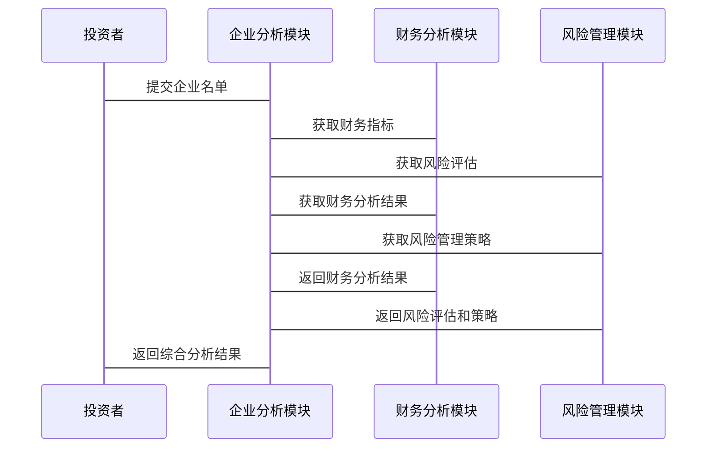

                 


# 沃伦·巴菲特的并购策略分析

## 关键词
- 沃伦·巴菲特
- 并购策略
- 投资哲学
- 财务分析
- 竞争优势

## 摘要
本文深入分析了沃伦·巴菲特的并购策略，从其核心理念、标准、数学模型到实际应用，系统性地探讨了巴菲特如何通过并购实现投资目标。文章结合技术语言，详细解释了巴菲特的决策逻辑，并通过案例分析和数学模型展示了其策略的成功与局限。

---

# 第一部分: 背景介绍

## 第1章: 背景介绍

### 1.1 问题背景

#### 1.1.1 投资并购的定义与重要性
投资并购是指通过购买或合并其他企业来实现投资目标的活动。在现代金融体系中，并购是企业扩张和价值创造的重要手段。对于投资者而言，并购不仅是一种获取收益的方式，更是一种控制资源和优化资产配置的策略。

#### 1.1.2 巴菲特投资哲学的核心理念
沃伦·巴菲特是全球最著名的投资者之一，其投资哲学以“价值投资”为核心。他强调寻找具有持续竞争优势、财务健康、管理层优秀的企业，并以合理的价格买入并长期持有。

#### 1.1.3 并购在巴菲特投资组合中的地位
并购是巴菲特实现投资目标的重要手段之一。通过并购，巴菲特能够快速获得优质资产，并通过长期持有实现价值增长。并购在巴菲特的投资组合中占据了重要地位，尤其是在企业估值较低、市场机会成熟时。

### 1.2 问题描述

#### 1.2.1 并购的类型与特点
并购可以分为横向并购、纵向并购和混合并购。巴菲特更倾向于横向并购，即收购与现有业务相同或相似的企业，以扩大市场份额或实现规模效应。

#### 1.2.2 巴菲特并购策略的独特性
巴菲特的并购策略具有独特性，主要体现在以下几个方面：
- **注重企业基本面**：巴菲特在并购时注重企业的财务健康状况，包括盈利能力、现金流和资产负债表的健康。
- **关注竞争优势**：他倾向于收购具有强大竞争优势的企业，例如独特的商业模式、技术壁垒或品牌影响力。
- **管理层质量**：巴菲特认为管理层的质量和诚信是企业成功的关键因素之一。

#### 1.2.3 并购中的主要风险与挑战
并购过程中存在诸多风险和挑战，包括：
- **估值错误**：企业估值过高或过低可能导致并购失败或亏损。
- **整合困难**：并购后的组织整合可能面临文化冲突、管理混乱等问题。
- **市场波动**：并购后的市场波动可能影响企业的价值和盈利能力。

### 1.3 问题解决

#### 1.3.1 巴菲特并购策略的核心目标
巴菲特的并购策略的核心目标是通过收购具有持续竞争优势和良好财务状况的企业，实现长期稳定的收益增长。

#### 1.3.2 如何通过并购实现投资目标
巴菲特通过以下步骤实现并购目标：
1. **识别潜在目标**：寻找具有竞争优势、财务健康且估值合理的企业。
2. **深入分析**：对目标企业的财务状况、管理层质量和竞争优势进行详细分析。
3. **评估风险**：识别并购中的潜在风险，并制定应对策略。
4. **决策与执行**：在综合评估后，做出并购决策并执行交易。

#### 1.3.3 巴菲特并购策略的成功案例分析
巴菲特并购策略的成功案例之一是可口可乐公司。1988年，巴菲特开始投资可口可乐，并通过长期持有实现巨大收益。可口可乐的持续竞争优势和稳定的现金流是巴菲特看中它的主要原因。

### 1.4 边界与外延

#### 1.4.1 巴菲特并购策略的适用范围
巴菲特的并购策略适用于那些具有持续竞争优势、财务健康且估值合理的企业。这种方法特别适合那些希望长期持有优质资产的投资者。

#### 1.4.2 并购与非并购投资的界限
并购投资与非并购投资的主要区别在于是否通过收购实现资产配置。并购投资更注重企业的内在价值和竞争优势，而非单纯的市场波动。

#### 1.4.3 巴菲特策略的局限性与改进空间
巴菲特的并购策略虽然成功，但也存在一些局限性：
- **市场周期性**：并购策略在市场周期波动中可能表现不佳。
- **竞争加剧**：随着更多投资者采用类似策略，优质企业的估值可能过高。

### 1.5 核心要素组成

#### 1.5.1 财务指标分析
巴菲特在并购时注重企业的财务指标，包括：
- **收入与利润**：收入稳定、利润率高。
- **现金流**：现金流充裕，能够支持企业的持续发展。
- **资产负债表**：低负债率，资产质量高。

#### 1.5.2 管理层质量评估
巴菲特认为管理层的质量是企业成功的关键因素之一。他注重管理层的诚信、经验和战略能力。

#### 1.5.3 企业竞争优势分析
竞争优势是巴菲特并购策略的核心要素。他寻找那些具有独特商业模式、技术壁垒或强大品牌影响力的企业。

---

# 第二部分: 核心概念与联系

## 第2章: 核心概念与联系

### 2.1 核心概念原理

#### 2.1.1 巴菲特并购策略的五项标准
巴菲特在并购时遵循以下五项标准：
1. **企业具有持续的竞争优势**：企业必须在行业中具有独特的竞争优势。
2. **管理层优秀且诚信**：管理层必须具备良好的道德品质和管理能力。
3. **财务健康状况良好**：企业财务状况健康，能够承受经济波动。
4. **估值合理**：企业估值必须低于其内在价值。
5. **简单易懂**：企业业务模式简单易懂，便于分析和决策。

#### 2.1.2 财务健康状况的评估方法
巴菲特通过以下方法评估企业的财务健康状况：
- **收入与利润分析**：分析企业的收入增长和利润率。
- **现金流分析**：评估企业的现金流状况。
- **资产负债表分析**：分析企业的资产和负债状况。

#### 2.1.3 企业竞争优势的来源与类型
企业的竞争优势可能来源于以下方面：
- **技术壁垒**：企业拥有独特的技术或专利。
- **品牌影响力**：强大的品牌可以帮助企业在竞争中占据优势。
- **成本优势**：企业具有更低的生产成本。
- **市场定位**：企业在目标市场中占据领先地位。

### 2.2 概念属性特征对比表格

| 概念       | 特征1 | 特征2 | 特征3 |
|------------|-------|-------|-------|
| 财务健康    | 收入稳定 | 利润率高 | 债务低   |
| 企业优势    | 竞争壁垒 | 技术领先 | 市场地位强 |
| 管理层质量  | 经验丰富 | 诚信可靠 | 战略清晰 |

### 2.3 ER实体关系图架构



---

# 第三部分: 算法原理讲解

## 第3章: 算法原理讲解

### 3.1 算法原理概述

#### 3.1.1 巴菲特并购策略的系统化分析方法
巴菲特的并购策略可以看作是一种系统化的分析方法，包括以下几个步骤：
1. **识别潜在目标**：通过市场研究和行业分析，识别具有潜在竞争优势的企业。
2. **深入分析**：对目标企业的财务状况、竞争优势和管理层质量进行详细分析。
3. **评估风险**：识别并购中的潜在风险，并制定应对策略。
4. **决策与执行**：在综合评估后，做出并购决策并执行交易。

#### 3.1.2 五项标准的权重分配与评分系统
巴菲特的五项标准可以看作是一种评分系统，每个标准都有其权重。例如：
- 企业竞争优势：权重40%
- 管理层质量：权重30%
- 财务健康状况：权重20%
- 估值合理：权重10%

#### 3.1.3 并购决策的多阶段流程模型
以下是并购决策的多阶段流程模型：



### 3.2 算法流程图


### 3.3 数学模型和公式

#### 3.3.1 企业价值评估模型
巴菲特常用的企业价值评估模型是现金流折现模型（DCF模型）。以下是DCF模型的公式：

$$
\text{企业价值} = \sum_{t=1}^{n} \frac{\text{现金流}_t}{(1 + r)^t} + \frac{残值}{(1 + r)^n}
$$

其中：
- $\text{现金流}_t$ 是第$t$年的现金流
- $r$ 是折现率
- $n$ 是预测期
- 残值是终值

#### 3.3.2 财务比率分析
以下是常见的财务比率分析公式：

1. **市盈率（P/E）**：
$$
\text{市盈率} = \frac{\text{股价}}{\text{每股收益}}
$$

2. **市净率（P/B）**：
$$
\text{市净率} = \frac{\text{股价}}{\text{每股净资产}}
$$

3. **股息率**：
$$
\text{股息率} = \frac{\text{每股股息}}{\text{股价}} \times 100\%
$$

### 3.4 实际案例分析与讲解

#### 3.4.1 实际案例：可口可乐的并购
巴菲特在1988年投资可口可乐，并通过长期持有实现巨大收益。以下是可口可乐并购的分析：

1. **企业竞争优势**：可口可乐拥有强大的品牌影响力和全球市场网络。
2. **财务健康状况**：可口可乐的财务状况健康，现金流充裕。
3. **管理层质量**：可口可乐的管理层具有丰富的经验和良好的诚信记录。

#### 3.4.2 并购后的整合与优化
并购后，巴菲特通常不会干预企业的日常运营，但会通过以下方式优化投资：
- **保持管理层稳定**：确保管理层的稳定性和积极性。
- **优化资本结构**：通过调整资本结构，降低财务风险。
- **持续监控**：定期监控企业的财务状况和竞争优势。

---

# 第四部分: 系统分析与架构设计

## 第4章: 系统分析与架构设计

### 4.1 问题场景介绍

#### 4.1.1 并购决策的系统化分析
并购决策需要系统化的方法，包括企业分析、财务分析、风险管理等。

#### 4.1.2 系统功能需求
- **企业分析模块**：分析目标企业的竞争优势、财务状况和管理层质量。
- **风险管理模块**：识别并购中的潜在风险，并制定应对策略。
- **决策支持模块**：提供决策支持，帮助投资者做出并购决策。

### 4.2 项目介绍

#### 4.2.1 项目目标
本项目旨在通过系统化的方法，帮助投资者制定并购策略，实现长期稳定的收益增长。

#### 4.2.2 项目范围
本项目主要针对那些具有持续竞争优势、财务健康且估值合理的企业。

### 4.3 系统功能设计

#### 4.3.1 领域模型mermaid类图
以下是领域模型的mermaid类图：



#### 4.3.2 系统架构设计mermaid架构图
以下是系统架构设计的mermaid架构图：



### 4.4 系统接口设计

#### 4.4.1 接口描述
- **企业分析模块接口**：提供企业分析功能，包括竞争优势、财务状况和管理层质量的评估。
- **财务分析模块接口**：提供财务指标分析功能，包括收入、利润和现金流的分析。
- **风险管理模块接口**：提供风险评估和应对策略功能。

#### 4.4.2 接口实现
以下是接口实现的伪代码：

```python
class EnterpriseAnalysis:
    def analyze_competitive_advantages(self):
        pass

    def analyze_financial_metrics(self):
        pass

    def analyze_management_quality(self):
        pass

class FinancialAnalysis:
    def analyze_income(self):
        pass

    def analyze_profit(self):
        pass

    def analyze_cash_flow(self):
        pass

class RiskManagement:
    def assess_risk(self):
        pass

    def develop_strategy(self):
        pass
```

### 4.5 系统交互设计

#### 4.5.1 交互流程
以下是系统交互流程的mermaid序列图：



---

# 第五部分: 项目实战

## 第5章: 项目实战

### 5.1 环境安装

#### 5.1.1 系统运行环境
- 操作系统：Windows 10或更高版本
- 开发工具：Python 3.8或更高版本，Jupyter Notebook
- 依赖库：pandas、numpy、scikit-learn

### 5.2 系统核心实现源代码

#### 5.2.1 企业分析模块

```python
import pandas as pd
import numpy as np

class EnterpriseAnalysis:
    def __init__(self, financial_data, competitive_advantages, management_quality):
        self.financial_data = financial_data
        self.competitive_advantages = competitive_advantages
        self.management_quality = management_quality

    def analyze_competitive_advantages(self):
        # 竞争优势分析
        return self.competitive_advantages

    def analyze_financial_metrics(self):
        # 财务指标分析
        return self.financial_data

    def analyze_management_quality(self):
        # 管理层质量分析
        return self.management_quality

# 示例数据
financial_data = {
    '收入': 100000000,
    '利润': 20000000,
    '现金流': 30000000
}

competitive_advantages = {
    '市场地位': '行业领先',
    '技术壁垒': '拥有专利',
    '品牌影响力': '知名品牌'
}

management_quality = {
    '经验': 20,
    '诚信': True,
    '战略能力': 15
}

enterprise = EnterpriseAnalysis(financial_data, competitive_advantages, management_quality)
```

#### 5.2.2 风险管理模块

```python
class RiskManagement:
    def __init__(self, risk_factors):
        self.risk_factors = risk_factors

    def assess_risk(self):
        # 风险评估
        return self.risk_factors

    def develop_strategy(self):
        # 风险管理策略
        return "制定风险管理策略"

# 示例数据
risk_factors = {
    '市场风险': '低',
    '财务风险': '低',
    '运营风险': '中'
}

risk_management = RiskManagement(risk_factors)
```

### 5.3 代码应用解读与分析

#### 5.3.1 企业分析模块应用
企业分析模块通过分析企业的财务指标、竞争优势和管理层质量，帮助投资者做出并购决策。例如，通过分析企业的财务指标，投资者可以评估企业的盈利能力和发展潜力。

#### 5.3.2 风险管理模块应用
风险管理模块通过评估并购中的潜在风险，并制定应对策略，帮助投资者降低并购风险。例如，通过评估市场风险和财务风险，投资者可以制定相应的风险管理策略。

### 5.4 实际案例分析和详细讲解剖析

#### 5.4.1 案例介绍
以下是巴菲特并购可口可乐的案例分析：

1. **企业分析**：
   - 可口可乐的财务状况健康，现金流充裕。
   - 可口可乐具有强大的品牌影响力和全球市场网络。
   - 可口可乐的管理层具有丰富的经验和良好的诚信记录。

2. **风险管理**：
   - 市场风险：可口可乐的市场地位稳固，品牌影响力强，市场风险较低。
   - 财务风险：可口可乐的财务状况健康，财务风险较低。
   - 运营风险：可口可乐的运营模式稳定，运营风险较低。

3. **决策支持**：
   - 通过系统化的分析，巴菲特认为可口可乐具有持续的竞争优势和良好的财务状况，因此决定并购。

#### 5.4.2 并购后的整合与优化
并购后，巴菲特通常不会干预企业的日常运营，但会通过以下方式优化投资：
- **保持管理层稳定**：确保管理层的稳定性和积极性。
- **优化资本结构**：通过调整资本结构，降低财务风险。
- **持续监控**：定期监控企业的财务状况和竞争优势。

### 5.5 项目小结

#### 5.5.1 项目总结
本项目通过系统化的分析方法，帮助投资者制定并购策略，并通过实际案例分析展示了如何应用这些策略。

#### 5.5.2 成果展示
通过本项目，投资者可以：
- 系统化地分析目标企业的财务状况、竞争优势和管理层质量。
- 识别并购中的潜在风险，并制定应对策略。
- 制定合理的并购决策，并通过长期持有实现价值增长。

---

# 第六部分: 结论

## 第6章: 结论

### 6.1 最佳实践

#### 6.1.1 投资者注意事项
投资者在进行并购投资时，应注重企业的财务状况、竞争优势和管理层质量，并通过系统化的分析方法做出决策。

#### 6.1.2 风险管理
投资者应注重风险管理，并制定应对策略，以降低并购中的潜在风险。

### 6.2 小结

#### 6.2.1 并购策略的核心要素
并购策略的核心要素包括：
- 企业竞争优势
- 财务健康状况
- 管理层质量

#### 6.2.2 巴菲特策略的成功与局限
巴菲特的并购策略通过系统化的分析方法，帮助投资者实现长期稳定的收益增长。然而，该策略也存在一定的局限性，例如市场周期性、竞争加剧等。

### 6.3 注意事项

#### 6.3.1 投资者应关注市场周期
投资者在进行并购投资时，应关注市场周期，并根据市场环境调整投资策略。

#### 6.3.2 保持长期视角
并购投资需要长期视角，投资者应耐心等待企业的价值实现。

### 6.4 拓展阅读

#### 6.4.1 推荐书籍
- 《巴菲特传：一个美国资本家的成功之路》
- 《投资之道：巴菲特投资策略解析》

#### 6.4.2 相关文献
- 巴菲特股东大会演讲
- 巴菲特致股东的信

---

# 作者

作者：AI天才研究院/AI Genius Institute & 禅与计算机程序设计艺术/Zen And The Art of Computer Programming

